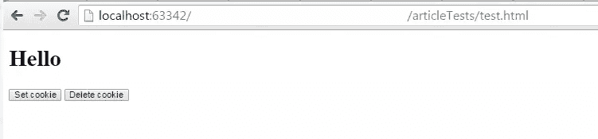
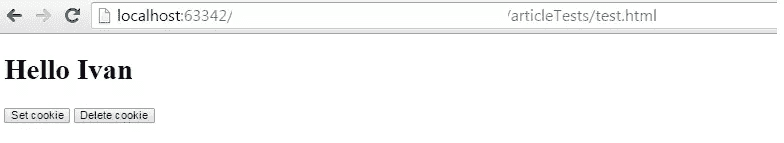
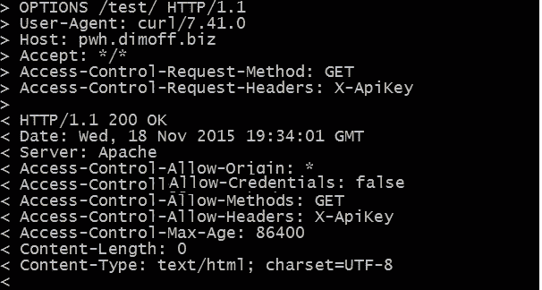

# 深入了解 CORS

> 原文：<https://www.sitepoint.com/an-in-depth-look-at-cors/>

*本文由[Panayiotis pvgr Velisarakos](https://github.com/pvgr)同行评审。感谢 SitePoint 的所有同行评审员使 SitePoint 的内容尽可能做到最好！*

CORS 是 HTML5 附带的一个相对较新的 API，它允许我们的网站请求外部和以前受限的资源。它放松了传统的[同源策略](https://developer.mozilla.org/en-US/docs/Web/Security/Same-origin_policy)，允许我们请求与父页面不同域的资源。
例如，在 CORS 跨域之前，Ajax 请求是不可能的(从页面`example.com/index.html`向`anotherExample.com/index.html`发出 Ajax 调用)。

在这篇文章中，我们将看到如何使用 CORS 进一步与其他系统和网站互动，以创造更好的网络体验。在深入了解 CORS 之前，我们先来看看哪些浏览器支持它。

## CORS 和浏览器支持

Internet Explorer 8 和 9 仅通过 XDomainRequest 类支持 CORS。主要的区别在于，你将不得不使用`var xdr = new XDomainRequest();`而不是用类似`var xhr = new XMLHttpRequest()`的东西进行正常的实例化。
IE 11、Edge 以及 Firefox、Safari、Chrome 和 Opera 的所有最新版本都完全支持 CORS。IE10 和 Android 4.3 以下的默认浏览器只在用于`<canvas>`元素中的图片时缺少对 CORS 的支持。

根据 CanIuse 的调查，[全球 92.61%的人拥有支持浏览器](http://caniuse.com/#search=cors)，这表明如果我们使用它，就不会出错。

## 发出一个简单的跨源 Ajax 请求

既然我们知道同源策略禁止不同域中的网站向其他域发出 Ajax 请求，那么让我们看看如何绕过它向另一个网站发出跨源 Ajax 请求。

如果您只是尝试向一个随机的网站发送一个 Ajax 请求，它很可能无法读取响应，除非另一个网站允许它这样做。

```
<script>
    var xhr = new XMLHttpRequest();
    var url = "//example.com";
    xhr.open("GET", url);
    xhr.onreadystatechange = function() {

        if (xhr.status === 200 && xhr.readyState === 4) {

            document.querySelector("body").innerHTML = xhr.responseText
        }
    }
    xhr.send();
</script>
```

如果你打开浏览器的控制台，你会得到一条类似于
*XMLHttpRequest 无法加载【http://example.com】T2 的消息。请求的资源上没有“Access-Control-Allow-Origin”标头。http://otherExampleSite.com 的原产地[因此不允许进入。](http://otherExampleSite.com)*

为了成功地读取响应，您必须设置一个名为**的头部，即 Access-Control-Allow-Origin** 。这个头必须在应用程序的后端逻辑中设置(在将响应传递给客户机之前手动设置头)，或者在服务器的配置中设置(例如编辑`apache.conf`并向其添加`Header set Access-Control-Allow-Origin "*"`，如果您使用的是 Apache)。

像这样在你的文档的`<head>`标签中添加带有 meta 标签的标题将**而不是**工作:`<meta http-equiv="Access-Control-Allow-Origin" content="*">`

下面是如何在 PHP 中为所有来源(请求资源的站点)启用跨来源请求:

 `当提出跨来源请求时，目标网站必须启用您的来源，并允许您阅读请求的响应。

如果你想允许一个特定的源，你可以在 PHP 中这样做:

```
header("Access-Control-Allow-Origin: http://example.com");
```

但是，`Access-Control-Allow-Origin`头本身不允许在头中插入多个主机，不管分隔符是什么。这意味着，如果您希望允许来自不同域的跨来源请求，您必须动态生成您的头。

例如，在 PHP 中，您可以检查请求您的资源的网站的来源，如果它与特定的白名单匹配，则添加一个允许该特定来源进行跨来源请求的标头。下面是一个硬编码白名单的小例子:

 `跨来源请求保持了一定的安全性，并且在请求-响应交换期间凭证(如 cookies)不会泄漏。此外，如果远程服务器没有明确允许其网站的用户凭证被包括在来自另一个网站的跨来源请求中，并且该网站没有明确声明它想要将用户凭证传递到远程服务器，则发出请求的站点将很可能得到非个性化的响应。发生这种情况是因为用户会话 cookies 不会转到请求，并且响应不会包含与特定登录用户相关的数据，从而减少了 *CSRF* 和其他利用。

简单来说，假设我们有两个网站。第一个设置了一个 cookie，每当用户输入时，它显示 cookie 的值，这个值应该是用户的名字。另一个网站发出跨源 Ajax 请求，并将响应添加到它的 DOM 中。




## 用 CORS 获取用户看到的页面

如果我们希望在远程请求中包含用户凭证，我们必须做两处更改，第一处是发出请求的网站的代码，第二处是接收请求的网站的代码。在发出请求的网站中，我们必须将 Ajax 请求的`withCredentials`属性设置为`true`:

```
var xhr = new XMLHttpRequest();
 xhr.withCredentials = true;
```

远程服务器本身，除了允许我们的源之外，还必须设置一个`Access-Control-Allow-Credentials`头，并将其值设置为`true`。使用数字 1 或 0 是行不通的。

如果我们简单地将`withCredentials`设置为`true`,但是服务器没有设置上面提到的头，我们将得不到响应，即使我们的源是允许的。我们将得到一个类似于:
*XMLHttpRequest 无法加载 http://example.com/index.php.凭据标志为‘true’，但‘Access-Control-Allow-Credentials’头为”。它必须为“true”才能允许凭据。origin '[http://localhost:63342](http://localhost:63342)'因此不允许访问。*

如果两个更改都进行了，我们将得到个性化的响应。在我们的例子中，我们存储在 cookie 中的用户名将出现在远程服务器返回给我们网站的响应中。



然而，允许将凭证传递给跨来源请求是非常危险的，因为它为各种攻击打开了可能性，例如 CSRF(跨站点请求伪造)、XSS(跨站点脚本)，并且攻击者可以利用用户的登录状态在用户不知情的情况下在远程服务器中采取行动(例如，如果远程服务器是银行网站，则取款)。

## 预检

当请求变得越来越复杂时，我们可能想知道特定的请求方法(如`get`、`put`、`post`、`patch`或`delete`)或特定的定制头是否被服务器允许和接受。在这种情况下，您可能希望在第一次用`options`方法发送请求时使用 preflights，并声明您的请求将具有什么方法和头。然后，如果服务器返回 CORS 头，并且我们看到我们的源、头和请求方法是允许的，我们可以发出实际的请求(源是一个头，它由我们的浏览器通过我们发出的每个跨源请求传递。不，在典型的浏览器中发出请求时，我们不能更改 Origin 的值)。



正如我们在上面的图片中看到的，服务器返回了几个头，我们可以用它们来决定是否发出实际的请求。它返回给我们所有的源都是允许的(`Access-Control-Allow-Origin: *`)，我们不能在传递用户凭证(`Access-Control-Allow-Credentials`)时发出请求，我们只能发出`get`请求(`Access-Control-Allow-Methods`)，并且我们可以使用 *X-ApiKey* 自定义头(`Access-Control-Allow-Headers`)。最后，`Access-Control-Max-Age`标题显示了以秒为单位的值，指出了在不依赖于另一次预检的情况下，我们可以请求多长时间(从请求时算起)。

另一方面，在我们的前端逻辑中，我们传递`Access-Control-Request-Method`和`Access-Control-Request-Headers`来指示我们打算将哪种请求方法和哪种头添加到我们的实际请求中。在普通 JavaScript 中，使用[xhr . setrequestheader(' header string '，' headerValueString ')进行 Ajax 调用时可以附加一个头；](https://developer.mozilla.org/en-US/docs/Web/API/XMLHttpRequest#setRequestHeader%28%29)。

## 画布图像的 CORS

如果我们想要加载外部图像并在 canvas 中编辑它们，或者只是将它们的 base64 编码值作为缓存机制保存在 localStorage 中，那么远程服务器必须启用 CORS。有各种方法可以做到这一点。一种方法是编辑您的 web 服务器的配置，为特定图像类型的每个请求添加`Access-Control-Allow-Origin`头，这样的例子显示在 [Mozilla docs](https://developer.mozilla.org/en-US/docs/Web/HTML/CORS_enabled_image) 中。如果我们有一个脚本，它通过改变`Content-Type`来动态地生成图像，并输出一个像 *<http:>这样的图像，我们可以简单地在输出图像的同时设置头部。在没有 CORS 的情况下，如果我们试图访问远程图像，将其加载到画布中，用`toDataURL`编辑并保存它，或者只是试图用`toDataURL`将修改后的图像添加到 DOM 中，我们将会得到以下安全异常(并且我们将无法保存或显示它):*来自源'[http://example.com](http://example.com)'的图像已被跨源资源共享策略阻止加载:请求的资源上不存在“Access-Control-Allow-Origin”头。因此，不允许 origin '[http://localhost:63342](http://localhost:63342)'访问*。
如果图像所在的服务器返回图像以及一个`Access-Control-Allow-Origin: *`头，那么我们可以做以下事情:</http:>*

```
var img = new Image,
    canvas = document.createElement("canvas"),
    ctx = canvas.getContext("2d"),
    src = "http://example.com/test/image/image.php?image=1";
    img.setAttribute('crossOrigin', 'anonymous');
    img.onload = function() {
        canvas.width = img.width;
        canvas.height = img.height;
        ctx.drawImage( img, 0, 0 );
        ctx.font = "30px Arial";
        ctx.fillStyle = "#000";
        ctx.fillText("#SitePoint",canvas.width / 3,canvas.height / 3);
        img.src = canvas.toDataURL();
        document.querySelector("body").appendChild(img);
        localStorage.setItem( "savedImageData", canvas.toDataURL("image/png") );
    }
    img.src = src;
```

这将加载一个外部图像，在其中添加一个 *#SitePoint* 文本，向用户显示并保存在 localStorage 中。注意，我们设置了外部图像的 crossOrigin 属性-`img.setAttribute('crossOrigin', 'anonymous');`。这个属性是强制的，如果我们不把它添加到外部映像，我们仍然会得到另一个安全异常。


## 交叉起源属性

当我们使用适当的 HTML(5)标签请求外部图像、音频、视频、样式表和脚本时，我们不是在进行 CORS 请求。这意味着没有`Origin`头被发送到服务外部资源的页面。没有 CORS，我们将无法在画布中编辑外部图像，查看我们网站加载的外部脚本中的异常和错误日志，或者在处理外部样式表时使用 [CSS 对象模型](https://www.w3.org/TR/cssom/)等等。在某些情况下，我们希望使用这些特性，这就是我们上面提到的`crossorigin`属性派上用场的地方。

可以将`crossorigin`属性设置为`<link>`、``和`<script>`等元素。当我们将属性添加到这样一个元素中时，我们要确保 CORS 请求是在正确设置了`Origin`头的情况下发出的。如果外部资源允许您通过`Access-Control-Allow-Origin`标题进行发送，那么对非 CORS 请求的限制将不再适用。

`crossorigin`属性有两个可能的值:

1.  `anonymous`–将`crossorigin`属性设置为该值将发出一个 CORS 请求，而不将用户凭证传递给外部资源(类似于发出一个 Ajax CORS 请求，但不添加`withCredentials`属性)。
2.  `use-credentials`–将`crossorigin`属性设置为该值将向外部资源以及该资源可能存在的任何用户凭证发出 CORS 请求。要做到这一点，服务器不仅必须设置一个允许您的`Origin`的`Access-Control-Allow-Origin`头，还必须将`Access-Control-Allow-Credentials`设置为`true`。

用户凭据包括 cookies、HTTP 基本身份验证凭据、证书和用户请求特定网站时发送的其他用户数据。

## 结论

CORS 使开发人员能够进一步与其他系统和网站互动，以创造更好的网络体验。它可以与流行的 HTML 标记发出的传统请求一起使用，也可以与 Ajax 等 Web 2.0 技术一起使用。

你在你的项目中使用过 CORS 吗？你对它有困难吗？我们想知道到目前为止你对它的印象如何。

### 参考资料和进一步阅读:

*   [Caniuse.com](http://caniuse.com/#search=cors)
*   [html 5 Rocks——面向开放 web HTML5 开发者的资源](http://www.html5rocks.com/en/tutorials/cors)
*   [Mozilla 开发者网络-CORS 支持的图片](https://developer.mozilla.org/en-US/docs/Web/HTML/CORS_enabled_image)
*   [Mozilla 开发者网络-CORS 设置属性](https://developer.mozilla.org/en-US/docs/Web/HTML/CORS_settings_attributes)
*   [Mozilla 开发者网络 HTTP 访问控制(CORS)](https://developer.mozilla.org/en-US/docs/Web/HTTP/Access_control_CORS)
*   Mozilla 开发者网络–XDomainRequest
*   [W3.org——跨产地资源共享](https://www.w3.org/TR/cors)
*   [Mozilla 开发者网络——HTML<链接>元素](https://developer.mozilla.org/en-US/docs/Web/HTML/Element/link)

## 分享这篇文章``