# 在设计中使用动画的 4 个技巧

> 原文：<https://www.sitepoint.com/4-tips-for-using-animation-in-design/>

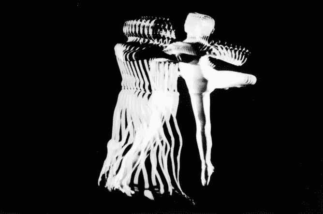

<small>不是两个，Norman McLaren 1968</small>

> 动画不是运动的绘画艺术，而是运动的艺术。诺曼·麦克拉伦

大家都知道什么是动画，但如何将动画与网页和移动设计融合，以获得更好的体验呢？虽然今天大多数网站都在某种程度上使用动画，但通常更多的是为了艺术繁荣，而不是真正支持用户体验。

和传统设计一样，有一些概念、原则和跳出框框思考的意愿会让动画为你所用。如果你从这四个方便的提示开始，你应该能够使用动画来改善你的网站。

## 关注运动，而不是代码

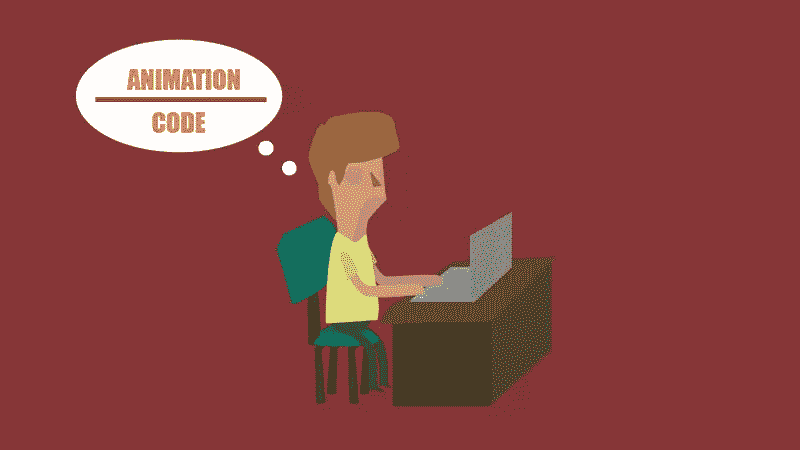

在考虑你的代码之前，先考虑运动。这将允许你把更多的注意力放在实际的动画概念化过程中。当然，并不是你设计的所有东西都能编码到完美，但这是你做出艺术妥协的时候。

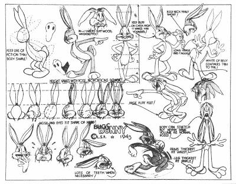

查克·琼斯早期的兔八哥草图展示了形状、重量和运动的思想。

由于担心可能的编码限制，以“关注代码”的心态开始更有可能破坏你的动画的个性。

这有点像根据你可用的铅笔的颜色来计划一个插图。这是错误的出发点。

这破坏了你最初添加动画的理由。试着把更多的注意力放在你希望你的动画如何移动和看起来。实现细节将在以后自行解决。

归根结底，编码只是“达到目的的一种手段”。你的设计过程和思维执行将使你的动画人性化。

## 专注于目标

如果你的动画没有目的，那么你应该质疑它存在的必要性。例如，作为加载指示器的动画旋转器有一个与生俱来的目的，但一些设计师可能不会想太多，除了“*其他人都在做*”和“*它看起来很酷*”。

加载动画旨在向用户提供加载时间反馈(或者，至少，一些进度感)。其他菜单动画可能有助于向用户指示菜单关闭时的位置。这两个例子都是给用户带来实际好处的动画。

另一方面，展开的导航和旋转的标志是装饰性更强、功能性更弱的动画的典型代表。请记住，你的动画是为了用户的利益而制作的，而不是为了创作者的利益。这不是你的皮克斯秀。

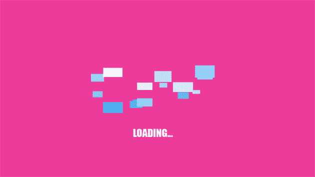

让我们来看看装饰性的、浮华的动画和更受目的功能影响的东西。

*   ### 闪光的

    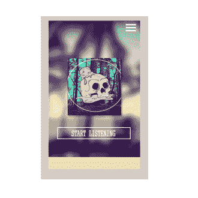

*   ### 微妙的

    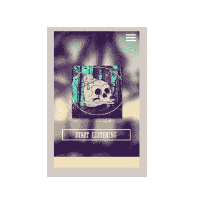

正如你在这里看到的，你可以实现几乎相同的结果，而不用全力以赴地制作华而不实的装饰性动画。它给人一种干净的感觉，不会让用户问“哇..刚刚发生了什么？”。此外，你越频繁地使用繁忙的动画*就会感觉*变慢。

## 学习运动

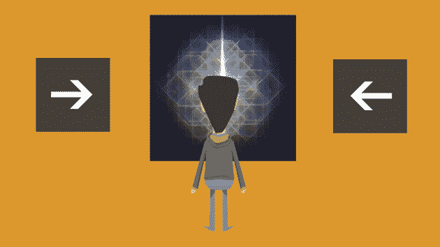

没有对运动的深刻理解，很难做好动画。有效的动作动画很少有泄露秘密的边缘、停止或接缝。优秀动画的关键不在于纯粹的艺术诠释，而在于模仿真实生活动作的技巧。

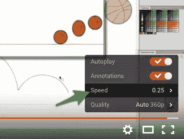

<small>Youtube 通过玩家设置面板提供可变的回报速度。</small>

如果你不确定一个动作，在网上搜索现实世界中的视频，以四分之一的速度研究这个动作。较低的回放速度通常会带来美妙的触感。许多人不知道 Youtube 通过播放器设置面板提供可变播放速度控制。

运动通常被理解为上、下、左和右，但是仅仅因为你的动画在这些方向上运动并不意味着你的运动会感觉自然。材料、速度、加速度、反弹和反射等因素都应该考虑在内。重要的是创造无缝运动来维持幻觉和幻想。换句话说，尽量让你的动画几乎“隐形”。

当你理解人们如何看待运动时，创造“隐形动画”就更容易了。研究你周围的世界是个好主意。

研究视频游戏界面——尤其是最近 3 年推出的游戏——并注意你作为用户是如何追踪它们的。如果你没有心情看游戏，那就看各种动画电影和节目。最重要的是，在开始将动画集成到复杂的项目中之前，创建真实的测试。

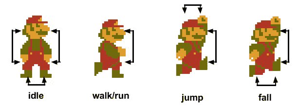

<small>鸣谢:[马丁·德拉博](http://martindrapeau.github.io/backbone-game-engine/)——中坚游戏引擎。</small>

尽量避免零星或闪光的动作。保持稳定。让观众享受并接受他们所看到的，尤其是当动画对消化信息至关重要的时候。与点相对的曲线运动是理想的，除非必要，否则柔软的运动要超过剧烈的曲折。

## 和谐地讲述你的故事

同步是动画的关键。为了生成尽可能多的动画，想要设计一个接一个的元素是很容易的，但是这不是办法。你的所有动画——无论大小——都应该是一个同质的单元。

最好的方法是坐下来，创造一些接近动画的东西。这些是由静止图像/图画组成的动画故事板，已经过编辑和调整，以尽可能接近最终产品。

相信我，无论是在网站上还是在电影中，这些都非常有帮助。下图是我为一个音乐视频制作的故事板。不用说，这不是最终的结构，但它让我走上正轨。

通过创建你想要的动画的草图，你可以看到所有东西看起来是什么样子，这将允许你在过程的早期发现不一致的地方。例如，你的加载动画是旋转运动和阻塞元素的混合，而你的导航菜单是使用圆圈的下拉淡出动画。看到这种脱节，你可以做出必要的改变或尝试完全不同的东西。

像这样做小而关键的模型和测试可以帮助你通过和谐的运动传递你的整体信息。有一些很棒的网站完美地做到了这一点。《危险牧师》和《T2 最后一滴》用动画片段讲述了他们的故事。

[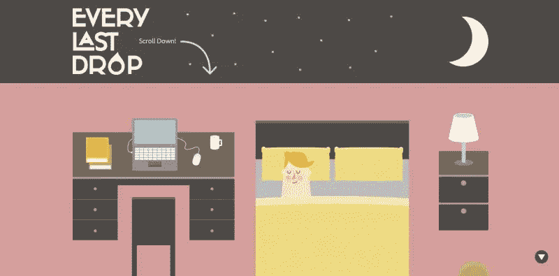](http://everylastdrop.co.uk/)

<small>http://everylastdrop.co.uk/</small>

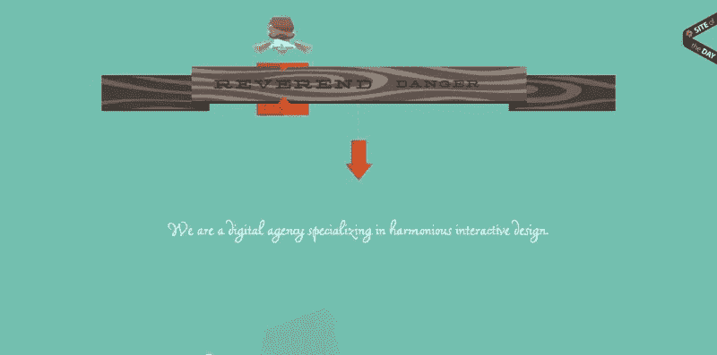

<small>http://www.reverenddanger.com/</small>

虽然这两个网站的动画制作方式非常不同，但它们网站的每个元素都经过精心制作，不仅讲述了它们的故事，还帮助它们向前发展。

## 概述

动画包含了各种各样的风格和方法，但这并不意味着没有关键的概念可以遵循。要充分利用您的动画:

*   让自己摆脱“代码大脑”的心态，
*   保持你的动画实用有用，
*   花时间去真正理解运动和故事是如何被讲述的。

最重要的是，在设计的同时享受乐趣。

*你对网页和移动设计中的动画有什么看法？有喜欢的吗？*

## 分享这篇文章