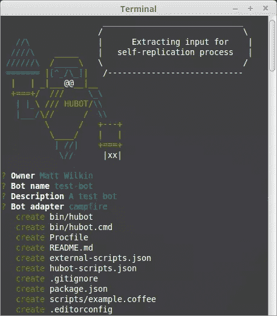
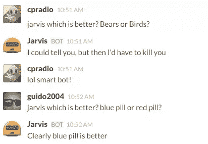
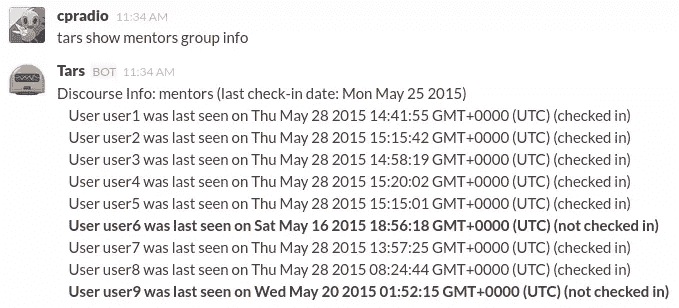

# 如何用 Hubot 给你的空闲频道增添趣味

> 原文：<https://www.sitepoint.com/spice-up-your-slack-channel-with-hubot/>

Hubot 是一个开源的 CoffeeScript 机器人，它可以通过各种聊天室应用程序监控和响应命令。正如 GitHub 自豪地宣称的那样，“它可以帮助大幅提高和降低员工效率”(取决于你如何使用它)。在本文中，我们将设置 Hubot，将其与 Slack 集成，并展示我们可以从劳动成果中享受到的提高和降低的效率。

## 宇舶表能做什么？

Hubot 的唯一限制是你自己的想象力。然而，重要的是要认识到，虽然你可以用 Hubot 做任何事情，但更大的问题是，你应该这样做吗？从张贴图像、翻译语言、发送即将到来的生日提醒，到构建团队最新活动的报告。Hubot 通过一个非常强大的消息系统和放置得当的钩子拥有过多的能力。

## 运行正常的

所以让我们让 Hubot 开始运作吧。为此，我们需要安装 Node.js，以及 npm(节点的包管理器)。如果你不确定如何做到这一点，那么看看我们的教程:[NPM 初学者指南](https://www.sitepoint.com/beginners-guide-node-package-manager/)。

接下来全局安装以下软件包:

*   [Hubot](https://www.npmjs.com/package/hubot)—Hubot 框架
*   coffee-script — Hubot 的脚本是用 CoffeeScript 编写的
*   yo —运行约曼发电机的 CLI 工具
*   一个使用 hubot 框架创建你自己的聊天机器人的约曼生成器

您可以使用以下命令来完成此操作:

```
npm install -g hubot coffee-script yo generator-hubot 
```

然后，我们需要创建一个目录来存放我们的新朋友，并运行前面提到的 Yeoman 生成器。

```
mkdir test-bot && cd test-bot
yo hubot 
```

如果一切顺利，Hubot 会弹出来问你一些问题。输入您的姓名、新机器人的名称和描述。您可以将[适配器](https://hubot.github.com/docs/adapters/)作为营火。在退出之前，它会创建一堆文件。



现在运行`bin/hubot`来启动你的新机器人。

## 试运行

要查看您的新机器人能做什么，请运行:

```
<bot_name> help
```

```
 test-bot> ship it - Display a motivation squirrel
test-bot adapter - Reply with the adapter
test-bot animate me <query>- The same thing as `image me`, except adds a few parameters to try to return an animated GIF instead.
test-bot echo <text>- Reply back with</text> <text>test-bot help - Displays all of the help commands that test-bot knows about.
test-bot help <query>- Displays all help commands that match</query> <query>.
test-bot image me </query><query> - The Original. Queries Google Images for </query><query> and returns a random top result.
test-bot map me </query><query> - Returns a map view of the area returned by `query`.
test-bot mustache me </query><query>- Searches Google Images for the specified query and mustaches it.
test-bot mustache me <url>- Adds a mustache to the specified URL.
test-bot ping - Reply with pong
test-bot pug bomb N - get N pugs
test-bot pug me - Receive a pug
test-bot the rules - Make sure test-bot still knows the rules.
test-bot time - Reply with current time
test-bot translate me <phrase> - Searches for a translation for the </phrase><phrase>and then prints that bad boy out.
test-bot translate me from <source> into <target><phrase> - Translates </phrase><phrase>from <source> into <target>. Both <source> and </target><target>are optional</target></phrase></target></phrase></url></query></text></query> 
```

哇！好吧，让我们试试其中的一个:

```
test-bot translate me from German into English Rindfleischetikettierungsüberwachungsaufgabenübertragungsgesetz
```

生产:

```
test-bot> The German "Rindfleischetikettierungsüberwachungsaufgabenübertragungsgesetz" translates as "Beef labeling monitoring delegation law" in English
```

厉害！

所以 Hubot 有效。在进入下一步之前，请随意再做一些尝试。

## 集成 Hubot 和 Slack

Slack 是一个团队协作工具，提供持久的聊天室，以及私人小组和直接消息。Slack 也是 SitePoint 的首选工具，用于促进遍布世界各地的贡献者之间的协作。让我们把我们的机器人和 Slack 整合起来。

我们需要做的第一件事是在我们的项目中安装松弛适配器:

```
npm install hubot-slack --save 
```

完成后，打开您的 Slack Team 页面，转到“配置集成”区域。找到 Hubot 集成，然后单击“添加”。Slack 会要求你为你的机器人指定一个用户名。我为我为 Sitepoint 论坛员工创建的两个机器人选择了[贾维斯](http://en.wikipedia.org/wiki/Edwin_Jarvis#J.A.R.V.I.S.)和[塔斯](http://en.wikipedia.org/wiki/Interstellar_%28film%29#Cast)。

一旦提供了用户名，Slack 将在您的团队中使用该用户名创建一个帐户，并为其分配一个 API 令牌。保持这个 API 令牌的秘密是非常重要的，所以不要将它签入您的 git 存储库。您还可以选择定制您的机器人的图标，名字和姓氏，它做什么，等等。

有了 API 令牌，我们现在可以使用以下命令在本地启动我们的 bot:

```
HUBOT_SLACK_TOKEN=YOUR_SLACK_API_TOKEN_HERE ./bin/hubot --adapter slack 
```

这将使你的机器人进入休眠状态，这样你就可以在那里和它说话了。通过运行上面的命令，访问`#general`通道(Hubot 默认使用这个通道)并发出如下命令来尝试一下:

```
<bot_name> pug me 
```

注意:一旦你在本地完成了实验，把你的机器人转移到更永久的地方是个好主意(比如 Heroku)。有很多[关于如何做这个](https://github.com/slackhq/hubot-slack#deploying-to-heroku)的好指南，我不会在这里覆盖它。

## 在哪里可以找到预构建的脚本

您可以在 [npm 网站上使用关键字“Hubot-scripts”](https://www.npmjs.com/browse/keyword/hubot-scripts)找到与您的 Hubot 配对的各种脚本。所有这些脚本都可以使用带有`--save`参数的`npm`命令添加到您的 bot 中。

让我们用一个获取随机猫图像的脚本来尝试一下。多么有趣运行:

```
npm install hubot-catme --save 
```

然后将`hubot-catme`添加到您的`external-scripts.json`文件中:

```
[
  "hubot-catme",
  "hubot-diagnostics",
  "hubot-help",
   ...
] 
```

本地启动 bot(如上)，然后访问`#general`并输入:

```
<bot_name> cat me with funny 
```

如果一切顺利，你的机器人应该会从网上随机下载一张有趣的猫图片。

## 构建降低员工效率的脚本

有很多方法可以降低 Hubot 的效率，从使用`pug bombs`到构建一个脚本，在收到命令时随机选择一个响应(有时很滑稽)。后者是我们将在本文中关注的，它是 [Jarvis 的](https://github.com/cpradio/sp-team-jarvis/)编程的一部分。

我将用下面的脚本来说明这一点，名为[哪样更好。coffee](https://github.com/cpradio/sp-team-jarvis/blob/master/scripts/which-is-better.coffee) 。将这个文件放在您的`scripts`目录中。

```
# Description:
#   Which is Better?
#
# Dependencies:
#   None
#
# Configuration:
#   None
# 
# Commands:
#   hubot which is better[?] <text> or <text>?
#   hubot who is better[?] <text> or <text>?
#   hubot which is worse[?] <text> or <text>?
#   hubot who is worse[?] <text> or <text>?
#
# Author:
#   cpradio

uhh_what = [
    "I could tell you, but then I'd have to kill you",
    "Answering that would be a matter of national security",
    "You can't possibly compare them!",
    "Both hold a special place in my heart"
  ]

module.exports = (robot) ->
  robot.respond /(which|who) is (better|worse)\?* (.*) or (.*?)\??$/i, (msg) ->
    choosen_response = msg.random [1..5]
    if choosen_response >= 3
      msg.send msg.random uhh_what
    else
      msg.send "Clearly #{msg.match[choosen_response + 2]} is #{msg.match[2]}" 
```

脚本的顶部是我们的基本注释模板。您可以在此指定脚本的用途、依赖关系以及配置方式。包含人们可以用来与脚本交互的命令也很重要。

再往下一点，我们发现一条带有`module.exports = (robots) ->`的线，这是 Hubot 指令所在的位置。

下一部分使用了[。response](https://hubot.github.com/docs/scripting/)方法监听针对您的机器人的特定命令。所有的监听和响应方法都将正则表达式作为它们的输入。当正则表达式找到合适的匹配时，与`.hear`和`.respond`命令相关的逻辑被调用。

在这种情况下，我选择`.respond`，因为我希望 Hubot 响应一个直接的命令。如果我想让它响应，即使命令不是针对他的，我会使用`.hear`

在这种情况下，正则表达式匹配短语“哪个更好”、“谁更好”、“哪个更差”和“谁更差”，后跟两个选项。

```
robot.respond /(which|who) is (better|worse)\?* (.*) or (.*?)\??$/i, (msg) -> 
```

下一条语句选择一个从 1 到 5 的随机数。如果选择的数字大于或等于 3，它将使用存储在`uhh_what`数组中的响应之一发送给用户，否则，它将选择用户作为其响应的一部分提供的适当的第一或第二选项。

```
choosen_response = msg.random [1..5]
if choosen_response >= 3
  msg.send msg.random uhh_what
else
  msg.send "Clearly #{msg.match[choosen_response + 2]} is #{msg.match[2]}" 
```

要对此进行测试，请使用以下命令启动 Hubot:

```
HUBOT_SLACK_TOKEN=YOUR_SLACK_API_TOKEN_HERE ./bin/hubot --adapter slack 
```

然后，您将能够使用以下代码在 Slack 中测试您的脚本:

```
<bot_name> who is better? Bill Gates or Steve Jobs? 
```

或者你可以更有创意一点，如下图所示。



## 构建脚本以提高员工效率

我实现 Hubot 的主要原因不一定是为了转移有价值的对话，事实上，这就是为什么 Jarvis，我们有趣的机器人被限制在我们的`#random`频道，而是，我想自动化一些我们工作人员经常使用的任务。带着这个目标，[塔斯](https://github.com/cpradio/sp-team-tars)诞生了，他住在团队领导私人小组，帮助我们查找论坛统计数据。

每个团队领导需要知道的一个统计数据是，谁最近在场，谁没有。Tars 的[discourse . group . info . coffee](https://github.com/cpradio/sp-team-tars/blob/master/scripts/discourse.group.info.coffee)脚本提供了这种洞察力。

```
# Description:
#   Query Discourse for Group Information
#
# Dependencies:
#   None
#
# Configuration:
#   HUBOT_DISCOURSE_URL
#
# Commands:
#   hubot show <group> group info [from discourse]
#
# Author:
#   cpradio

last_checkin_date = new Date();
last_checkin_date.setHours(0,0,0,0);
dif = (last_checkin_date.getDay() + 6) % 7;
last_checkin_date = new Date(last_checkin_date - dif * 24*60*60*1000);

module.exports = (robot) ->
  robot.respond /show (.+) group info( from discourse)?/i, (res) ->
    groupname = res.match[1]
    user_url = process.env.HUBOT_DISCOURSE_URL + "/groups/#{encodeURIComponent(groupname)}/members.json"
    res.http(user_url)
    .get() (err, _, body) ->
      return res.send "Sorry, the tubes are broken." if err
      try
        data = JSON.parse(body.toString("utf8"))
        checkin_date_str = last_checkin_date.toDateString()
        output = "Discourse Info: #{groupname} (last check-in date: #{checkin_date_str})\r\n"
        for own key, user of data.members
          username = user.username
          last_seen = new Date(user.last_seen_at)

          last_seen_as_date = new Date(last_seen)
          checked_in = last_seen_as_date > last_checkin_date
          checked_in_str = if checked_in then "(checked in)" else "(not checked in)"
          prefix_suffix = if checked_in then "" else "*"

          output += "     #{prefix_suffix}User #{username} was last seen on #{last_seen} #{checked_in_str}#{prefix_suffix}\r\n"
        res.send output
      catch e
        res.send "Discourse data for #{groupname} group is unavailable." 
```

与前面的例子类似，这个例子也填写了注释。该命令将由各种成员使用，知道如何运行该命令非常重要。其次，需要为该命令配置一个环境变量，因此也列出了该变量。

在这个例子中，我只需要 Tars 响应一个直接命令`tars show {group_name} group info`，其中`{group_name}`匹配在对话论坛中建立的一个组(注意:它必须有一个列出其组成员的公共页面才能工作)。

```
groupname = res.match[1]
user_url = process.env.HUBOT_DISCOURSE_URL + "/groups/#{encodeURIComponent(groupname)}/members.json"
res.http(user_url)
.get() (err, _, body) ->
  return res.send "Sorry, the tubes are broken." if err
  try
    data = JSON.parse(body.toString("utf8"))
    ... 
```

然后，该命令构建 URL 以从 Discourse 获取 json 提要，并遍历其数据集以产生类似下面的输出。



现在，任何团队领导都可以请求一个组的信息，查看谁有一段时间没有活动，并跟踪这些成员。就像前面的脚本一样，您将需要启动 Hubot，但是，我们需要向启动脚本添加一个新的环境变量，该变量包含我们计划对其运行脚本的话语 URL。出于本文的考虑，我们使用 Sitepoint 的 Discourse 实例。

```
HUBOT_DISCOURSE_URL=https://www.sitepoint.com/community HUBOT_SLACK_TOKEN=YOUR_SLACK_API_TOKEN_HERE ./bin/hubot --adapter slack 
```

现在，在 Slack 中，您可以执行以下命令:

```
<bot_name> show mentors group info
```

## 继续实验吧！

简而言之，这就是 Hubot。你已经有能力将它与众多的适配器、脚本集成在一起，你甚至可以使用它的 API 和一些 CoffeeScript 来创建自己的应用程序。那么你打算用它来创造什么呢？请在下面的评论中告诉我。

## 分享这篇文章