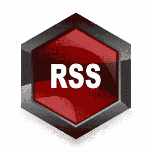
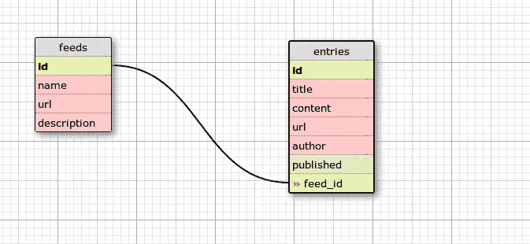
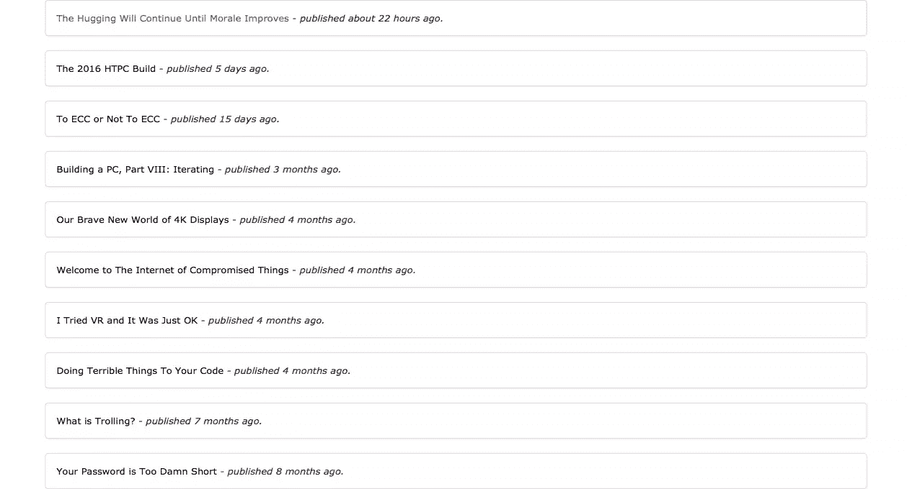
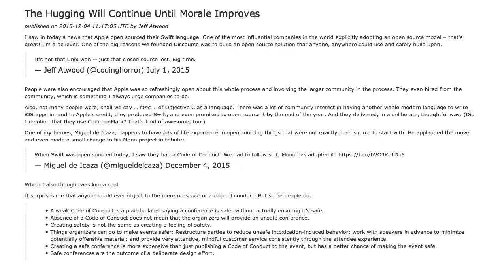

# 在 Rails 中构建 RSS 阅读器很容易

> 原文：<https://www.sitepoint.com/building-an-rss-reader-in-rails-is-easy/>



*这篇文章由[汤姆·帕金](https://www.sitepoint.com/author/tparkin)进行了同行评审。感谢 SitePoint 的所有同行评审员使 SitePoint 的内容尽可能做到最好！*

RSS 提要是网站(主要是博客)用来向用户提供内容的一种数据格式。大多数网站，包括 SitePoint，都发布一个 feed 作为内容分发的另一种方式。提要是一个流，其中更新的内容以一种标准化格式发布，可以由读者(如 RSS 客户端)使用。

使用 RSS 源可以让您关注许多您喜爱的网站，并在一个地方收集更新的信息。有社交媒体和电子邮件通讯服务于这一目的，但这种灵活性使 feeds 与众不同。有许多提要阅读器可以让你输入所有你想关注的提要 URL，并在一个地方阅读它们。今天，我们将构建一个这样的阅读器来满足你的阅读乐趣。我们还将缓存内容以供离线阅读。

让我们开始吧。

## 引导应用程序

我们将在 Rails 4 中构建应用程序。虽然它可能适用于旧版本，但建议保持最新版本，以避免任何依赖问题。让我们通过运行以下命令来创建我们的 Rails 应用程序:

```
rails new feedreader -d postgresql 
```

*注意:这假设您在本地主机上运行 PostgreSQL。如果没有，可以忽略`-d`标志，使用 SQLite。*

Rails 生成器完成后，`cd`进入目录并创建数据库:

```
rake db:create 
```

让我们也添加我们将在这个应用程序中使用的 gem 依赖项。由于这是一个相当小的应用程序，我们只需要两个宝石， [feedjira](http://feedjira.com) 用于 feed 处理， [twitter-bootstrap-rails](https://github.com/seyhunak/twitter-bootstrap-rails) 用于一点点造型。自举部分是完全可选的，如果您想使用自己的设计，可以忽略它。

将以下 gem 添加到 gem 文件中:

```
gem 'feedjira'
gem 'twitter-bootstrap-rails' 
```

并运行`bundle install`。

安装完成后，运行引导生成器:

```
rails generate bootstrap:install static 
```

这将添加必要的引导文件并添加所需的`require`。这样，我们的引导就完成了。如果您正在使用版本控制，这是推荐的，现在是提交更改的时候了。

## 创建模型

是时候为我们的应用程序创建模型了。结构很简单，因为我们只有两种型号:`Feed`和`Entry`。`Feed`包含添加的提要列表，`Entry`包含每个提要的内容。这将是我们应用程序的模式:


我们先来创建 Feed 模型。这很简单，只是脚手架。运行以下命令来搭建和迁移:

```
rails g scaffold feed name url description:text
rake db:migrate 
```

这将创建与提要相关的必要的模型、控制器和视图文件。我们不需要对任何文件做任何修改，只需要在 **config/routes.rb** 文件中添加`root`路径即可:

```
root 'feeds#index' 
```

就是这样。启动服务器并添加您喜欢的提要。此时将您的更改提交到 git 中可能是个好主意:

```
git add -A
git commit -m "Add Feed scaffold" 
```

接下来，让我们创建将保存所有内容的`Entry`模型。因为我们将通过 rake 任务存储条目，所以不需要完全成熟的组件。我们可以通过运行以下命令直接创建入口模型:

```
rails g model entry title published:datetime content:text url author feed_id:integer
rake db:migrate 
```

迁移完成后，将关系添加到两个模型中:

```
## models/feed.rb
class Feed < ActiveRecord::Base
    has_many :entries, dependent: :destroy
end

## models/entry.rb
class Entry < ActiveRecord::Base
    belongs_to :feed
end 
```

至此，我们已经完全建立了模型。现在是时候创建 rake 任务来填充已经添加的提要的入口模型了:

## 更新订阅源内容

正如我之前提到的，我们将有一个 rake 任务作为 Entries 表中所有数据的入口点。该任务可以被安排为定期运行，以将提要内容与我们的数据库同步。首先在 **lib/tasks** 中创建一个 rake 任务，名为 **sync.rake** 。创建文件后，向其中添加以下内容:

```
namespace :sync do
  task feeds: [:environment] do
    Feed.all.each do |feed|
      content = Feedjira::Feed.fetch_and_parse feed.url
      content.entries.each do |entry|
        local_entry = feed.entries.where(title: entry.title).first_or_initialize
        local_entry.update_attributes(content: entry.content, author: entry.author, url: entry.url, published: entry.published)
        p "Synced Entry - #{entry.title}"
      end
      p "Synced Feed - #{feed.name}"
    end
  end
end 
```

rake 任务遍历数据库中存储的所有提要，并获取每个提要的最新内容。然后，循环遍历新条目，在数据库中创建或更新它。我们每次都在更新，以跟上源内容的任何变化。

添加此任务后，尝试运行 rake 任务:

```
bundle exec rake sync:feeds 
```

您可以看到内容已经添加到条目表中。这很容易通过登录 Rails 控制台来验证:

```
$ rails console
> Entry.count 
```

好了，现在是最后一步。让我们为条目创建控制器。

## 显示订阅源

首先为我们的条目模型生成控制器。我们只需要两个动作:`index`和`show`，可以指定给生成器本身:

```
rails g controller entries index show 
```

执行上述命令后，将创建控制器和视图文件。转到 **routes.rb** 并更改以下行，将其添加到 feeds 资源下:

```
get 'entries/index'
get 'entries/show' 
```

到

```
resources :feeds do
  member do
   resources :entries, only: [:index, :show]
  end
end 
```

我们在这里的特定提要下有嵌套的条目。前往条目控制器，添加以下内容:

```
# app/controllers/entries_controller.rb
class EntriesController < ApplicationController
  before_action :set_feed, only: :index

  def index
    @entries = @feed.entries.order('published desc')
  end

  def show
    @entry = Entry.find(params[:id])
  end

  private
  def set_feed
    @feed = Feed.find(params[:id])
  end
end 
```

我们通过 ID 为 Entries `index`页面获取各自的提要，以显示该提要中的条目列表。让我们也对视图进行必要的更改:

```
# app/views/entries/index.html.erb
<div class="container">
  <% @entries.each do |entry| %>
    <div class="panel panel-default">
      <div class="panel-body">
        <%= link_to entry.title, entry %> - <i> published <%= time_ago_in_words(entry.published) %> ago.</i>
      </div>
    </div>
  <% end %>
</div>

# app/views/entries/show.html.erb
<div class="container">
  <h3><%= link_to @entry.title, @entry.url %></h3>
  <i>published on <%= @entry.published %> by <%= @entry.author %></i>
  <p>
    <%= @entry.content.html_safe %>
  </p>
</div> 
```

上面的代码很琐碎。我们正在展示根据我们的需求定制的条目。需要注意的一点是，我们在 Entries `show`视图中使用了`html_safe`,因为提要是 HTML 格式的。这允许我们在条目中呈现 HTML。经过这样的改变，我们已经完成了一个可以正常工作的小小阅读器。保存更改，并启动服务器。

添加 URL 并运行 rake 任务后，我们最终完成的应用程序看起来如下:





我知道这不是最好看的阅读器，但它可以让你建立一个。我们已经有了功能，现在发挥你的想象力进行设计。

## 结论

本教程中使用的所有示例代码都可以在 [Github](https://github.com/avinoth/feedreader-demo) 中找到，请随意使用。

感谢您花时间阅读本教程，我希望它能满足您的目的。下次见。

## 分享这篇文章