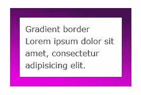
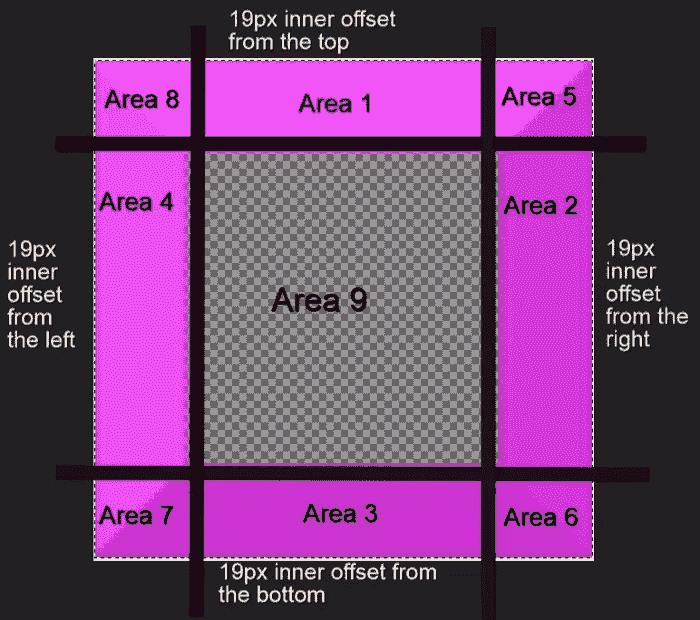
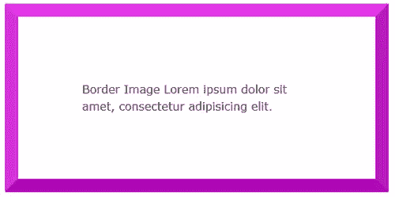
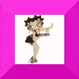
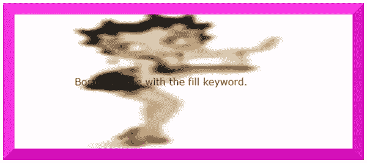
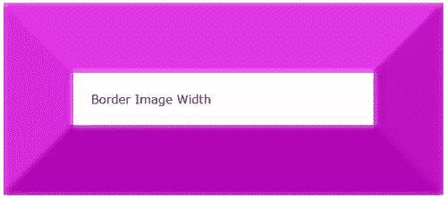
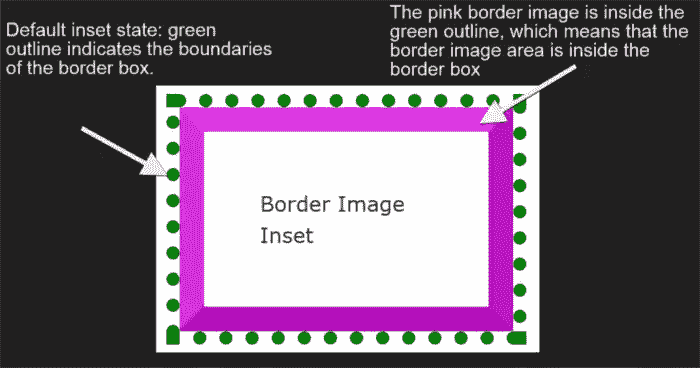
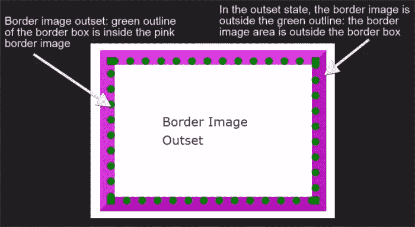

# 用 CSS 边框图像装饰网页

> 原文：<https://www.sitepoint.com/decorating-the-web-with-css-border-images/>

不久前，在网页上添加装饰元素，比如花哨的边框，需要对图像进行切片，耐心地调整 CSS，直到它看起来恰到好处。

CSS 改变了这一切。你只需要几行代码就可以用非常复杂的边框来装饰你的网站。本文将向您展示如何做到这一点。

## 边框图像属性

设置边框样式的常用方法是使用预设的边框样式规则。它们是:`dotted`、`dashed`、`solid`、`double`、`groove`、`ridge`、`inset`和`outset`。

这些风格已经给了你相当多的选择。但是你可以更进一步，用下面的 CSS 属性给你的边框添加吸引人的背景图片。

### `border-image-source`属性

使用此属性，您可以为元素的边框分配背景图像。该值通常是图像的 URL:

```
element {
  border-image-source: url('myimage.png');
}
```

你会发现 CSS 渐变效果也很好:

```
element {
  border-image-source: linear-gradient(10deg, #fe01f5 0%, #2e113d 100%);
}
```

在浏览器中，它看起来像这样:



如果将该属性设置为值`none`，或者图像无法显示，浏览器将使用为`border-style`属性设置的值。因此，使用`border-style`作为退路是个好主意。

您使用的图像不需要与边框的宽度和高度相匹配。CSS 边框图像的美妙之处在于，你只需要一个**小图像**就可以装饰任何宽度和高度的元素的边框，包括可以响应地适应不同屏幕尺寸的元素。

### `border-image-slice`属性

使用`border-image-source`属性选择图像后，使用`border-image-slice`属性将其应用于边框。

```
element {
  border-image-slice: 19;
}
```

让我们更深入地了解一下细节。该属性设计从**顶部**、**右侧**、**底部**和**左侧**的**内部偏移**。偏移最终将你的小图像分割成九个区域:**四个角**，**四个边**和一个**中间**。



您可以指定一到四个数字或百分比值。当您指定四个值时，它们适用于顶部、右侧、底部和左侧偏移。如果跳过左偏移，这将与右偏移相同。如果您错过了底部偏移，这将与顶部偏移相同。省略右偏移的值将使其与顶部相同。如果只使用一个值，它将用于所有四个偏移。

**百分比**值是指图像的**大小的百分比——水平偏移的图像宽度和垂直偏移的图像高度。**

**数字**代表图像中的**像素，或者在**矢量**图像的情况下代表**坐标**。还有一点，不要在数字后面加 *px* ，这样就不行了！**

以下是使用`border-image-slice`的方法:

```
<div class="box">
  Border Image
  Lorem ipsum dolor sit amet, consectetur adipisicing elit. 
</div>
```

```
.box {
  border: 19px dotted #c905c6;
  border-image-source: url(border-bg.png);
  border-image-slice: 19; 
}
```

使用一个*100 x 100 像素*的图像作为你的边框，如下所示:


我们最终会得到这样的结果:



中间区域渲染为完全透明，因此不可见。如果你想让它可见，添加`fill`关键字。

例如，使用一个中间区域完全不透明的图像，不添加`fill`关键字，将会像上面的例子一样显示。然而，像这样应用`fill`关键字:

```
.box {
  border: 19px dotted #c905c6;
  border-image-source: url(border-fill.png);
  border-image-slice: 19 fill;
}
```

中间区域包含细节的图像:



然后，我们会发现图像的中间区域在页面上完全可见，尽管有些模糊和挤压:



### `border-image-width`属性

这个属性被绘制在所谓的**边界图像区域**内。默认情况下，该区域的边界是边框的边界。就像`border-image-slice`属性一样，`border-image-width`设计了内部偏移，将图像分成九个区域。

该属性接受一至四个值(上、右、下、左)，使用数字或百分比。**百分比**相对于**边界图像区域**的大小，即水平偏移区域的宽度和垂直偏移区域的高度。如果您使用不带 *px* 单位的数字，这些数字将等于相应计算出的`border-width`的倍数。例如，下面的代码:

```
.box {
  border: 19px dotted #c905c6;
  border-image-source: url(border-bg.png);
  border-image-slice: 19;
  border-image-width: 3;
}
```

…将**处边框图像的宽度设置为`border-width`值的 3 倍**，即`19px`。这将导致如下结果:



我发现给`border-image-width`和`border-image-slice`属性相同的值可以确保你的边框图像以最佳状态显示，不会出现不希望的失真。

### `border-image-outset`属性

到目前为止，我使用的所有属性都默认为一个内嵌边框图像区域。但是，您可以选择将边框图像区域推到边框之外。您可以通过`border-image-outset`属性来实现。

该属性接受一到四个值(上、右、下、左)，用数字或长度单位表示，如 *px* 、 *em* 等。如果您使用一个数字，结果将是一个边界图像被推到边界框的外面，其倍数是计算出的`border-width`。

为了进一步澄清，我画了一个绿色虚线轮廓来表示边框。边框图像区域包含一个粉色边框图像。在其**默认嵌入状态**下，边框图像在绿色轮廓内。这意味着**边框图像区域**是边框内的**。**



将`border-image-outset: 19px;`添加到 CSS 规则集中，将粉色边框图像推到绿色虚线轮廓之外。这表示**边框图像区域**被绘制在边框外**:**



请注意，位于边框外的边框图像部分不会触发滚动，也不会捕获鼠标事件。

查看 CodePen 上迄今为止讨论的所有示例:

参见 [CodePen](http://codepen.io) 上 SitePoint ( [@SitePoint](http://codepen.io/SitePoint) )的 Pen [CSS 边框图片示例](http://codepen.io/SitePoint/pen/eJNZyP/)。