# 使用 ContinuousPHP 和 Zend Server 轻松实现连续交付

> 原文：<https://www.sitepoint.com/easy-continuous-delivery-with-continuousphp-and-zend-server/>

持续交付方法的目标是使用自动化的任务、测试、构建和部署，使将代码持续部署到产品的过程没有错误，或者至少不容易出错。最小化风险和停机时间，最大化质量和价值。这是座右铭。


然而，至少可以说，这个过程并不总是直截了当的。通常，为实现持续集成和部署而选择的持续交付工具很难理解和使用，并且通常是耗时和昂贵的。应用越大，挑战越大。

本文通过展示一个使用 [continuousphp](https://continuousphp.com/tutorial/create-and-set-up-your-project-on-continuousphp/) 和 Zend Server 的连续交付过程，介绍了一个有趣的新方法来应对这一挑战。

continuousphp 是一个 PaaS 解决方案，它允许您在几分钟内轻松设计一个连续的交付管道。continuousphp 将与你在 GitHub(或 Bitbucket and Stash)上的现有存储库同步，并处理连续交付周期中的所有不同阶段:供应、打包、测试和部署。对存储库的每一次新的提交都会将您的代码推到您创建的管道中(阅读更多关于 [continuousphp](https://continuousphp.com/tutorial/create-and-set-up-your-project-on-continuousphp/) )。

Zend Server 是 Zend 的专业 PHP 堆栈，捆绑了一套用于开发、调试、部署和监控 PHP web 和移动应用的高级工具(阅读更多关于 [Zend Server](http://www.zend.com/en/products/zend_server) )。

## 先决条件

*   本教程中概述的过程使用了 Zend Framework 2 框架应用程序。如果您想遵循下面描述的步骤，继续克隆[库](https://github.com/DanielBerman/zf2)。
*   您还需要一个正在运行的 Zend Server 实例来完成本教程的最后一步。要做到这一点，一个简单的方法是使用各种[云解决方案](http://www.zend.com/en/solutions/cloud-solutions)——Zend Server 可在 AWS、Azure、谷歌云平台上使用，随你挑选。所有网站都提供免费试用，所以这也是一种便宜的入门方式。

我们开始吧！

## 步骤 1:设置存储库

在您动手之前，您需要在 continuousphp 中建立您的存储库。

为此，请前往[https://continuousphp.com](https://continuousphp.com)并点击**免费注册**按钮。

对于公共项目，你可以免费使用 continuousphp。对于私人项目，你可以获得 30 个免费构建，之后你可以选择任何提供的[计划](https://continuousphp.com/plans/)。

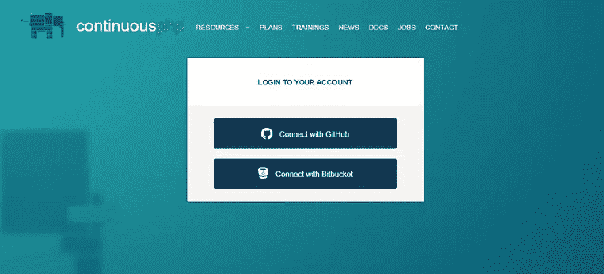

然后，您必须告诉 continuousphp 您想要集成哪个 Git 存储库托管服务。您可以选择使用 GitHub 或 BitBucket(对 Atlassian Stash 等私有提供者的支持是按需提供的)。

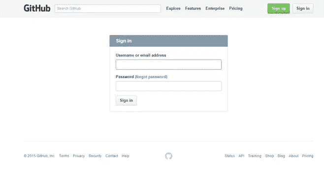

一旦您给出了凭证，集成就设置好了，continuousphp 检索并显示所有托管存储库的列表。


对于要为其设置新的连续交付管道的存储库，单击右侧的 **Setup** 按钮。
在这种情况下，我们将使用我的 [Zend Framework 2 skeleton 应用程序](https://github.com/DanielBerman/zf2)存储库。
将显示一个新的项目页面，该页面将显示我们定义的管道和任何已执行的构建。

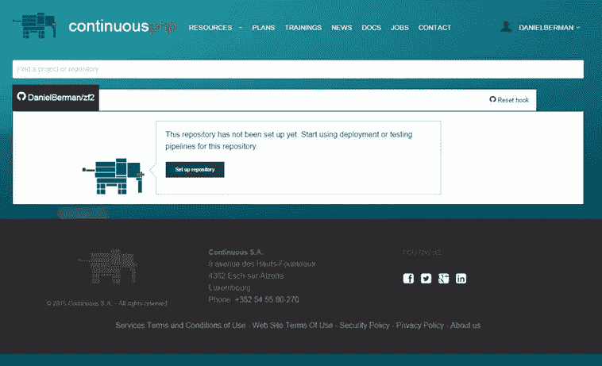

单击 **Set up repository** 按钮，continuousphp 将在后台向存储库添加一个新的 web 挂钩，用于为每个 push 和 pull 请求触发新的构建，并创建一个新的 SSH 密钥，以允许 continuousphp 在构建初始化时克隆存储库。您应该会收到一封来自 GitHub 的电子邮件，通知您这个新密钥。


## 步骤 2:创建新的部署管道

既然您的存储库已经设置好了，那么是时候定义一个新的连续交付部署管道了。continuousphp 中的部署管道将应用程序的部署过程分解成多个并行的过程。首先，你的回购是克隆的。然后，continuousphp 提供应用程序并并行生成两个独立的应用程序包——一个用于测试，一个用于部署。

要创建新的管道，只需点击 continuousphp 大象提示的 **+** 图标。

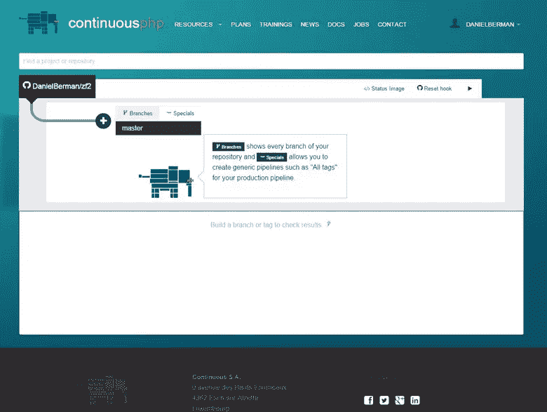

然后，选择管道的起点，如果是生产管道，可以选择特定分支或所有分支/标记。

在这种情况下，主分支会做得很好。

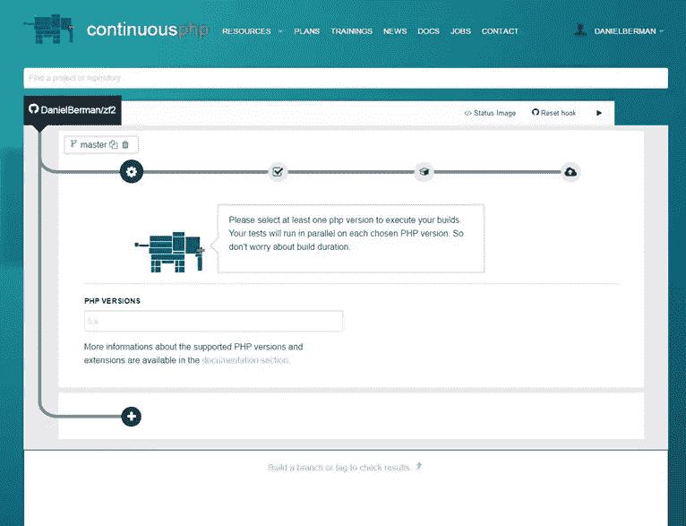

接下来，我们将指定我们希望 continuousphp 用于提供我们的应用程序和执行测试的 PHP 版本。这里很棒的一点是，您可以选择任意多的 php 版本，并且对于您选择的每个版本，PHP 都在一个单独的容器中运行测试。

## 步骤 3:配置生成和测试设置

一旦您选择了您的 php 版本，部署管道将被保存，PHP 将自动配置存储库中存在的任何工具(例如 Composer)，并显示构建配置设置。下一步是检查和微调这些设置，以及下一个管道页面上的测试设置，以满足您的偏好和要求。

### 构建配置

构建配置允许您在构建执行期间定义 Amazon AWS 集成凭证，在创建测试包之前运行 Phing 任务，以及 Composer 依赖项。
您还可以选择添加 HTTP 认证，以允许 Composer 访问私有存储库(例如在 BitBucket 上)或从私有 Satis 服务器获取依赖关系。

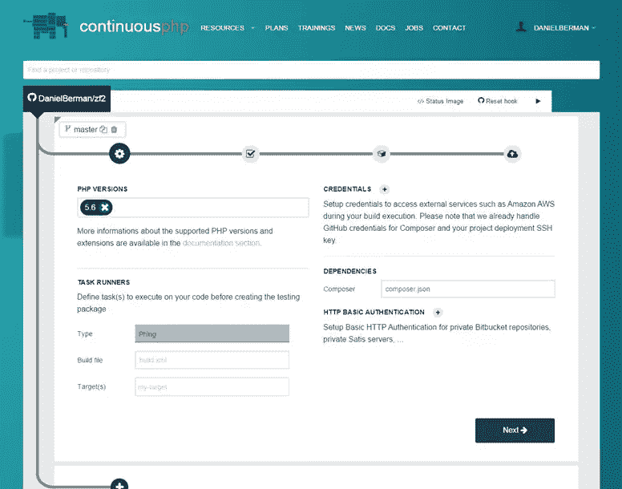

查看完构建设置后，点击页面底部的**下一步**按钮。

### 测试配置

任何现有的测试配置都会被自动识别并显示在 Test settings 页面上，当然你也可以添加一个新的测试框架。

为此，只需点击 **+** 图标，并选择您想要添加的测试框架。

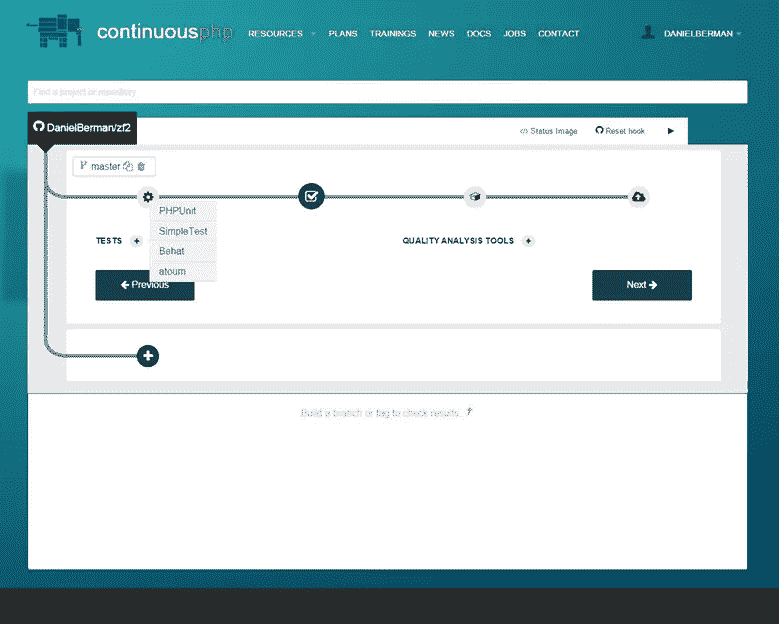

我将把 PHPUnit 添加到我的管道中。我所要做的就是输入测试配置的路径，在本例中定义在:`/module/Application/tests/phpunit.xml`。

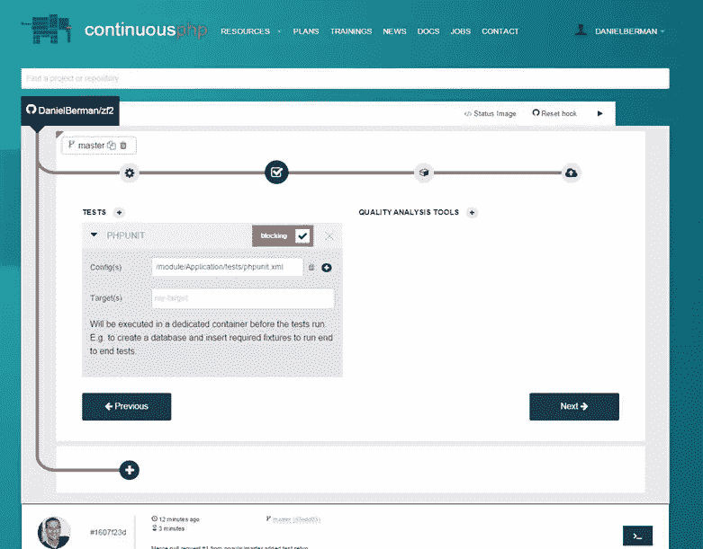

注意，我的测试配置在顶部有一个红色的 Blocking 标签。这个标签意味着阻塞特性被启用，任何失败的测试都将阻止这个包被部署——如果你不想部署错误代码，这非常有用。移除标记允许在警告状态下部署构建。

您还可以为您的测试框架定义 Phing 目标。如果您想在测试之前执行一个任务，或者在使用 Behat 这样的框架进行功能测试的情况下创建一个数据库并插入 fixtures，这些都是非常有用的。

完成测试设置配置后，点击**下一步**进入下一步。

## 步骤 4:打包和部署您的应用程序

为了完成连续交付周期，我们现在将配置我们希望如何打包和部署应用程序。continuousphp 提供了各种部署选项，包括使用 AWS CodeDeploy，但在这种情况下，我们将选择在运行 AWS 的 [Zend 服务器上部署我们的应用程序。](http://www.zend.com/en/products/server/amazon-web-services-free-trial)

[Zend Server](http://www.zend.com/en/products/zend_server) 让 PHP 开发人员和 DevOps 能够访问 Zend Server 的专业 PHP 堆栈和一套用于开发、调试和监控应用程序的高级工具，包括新的调试工具栏——Z-Ray。continuousphp 和 Zend Server 之间的集成基于 [Zend Server SDK](https://github.com/zend-patterns/ZendServerSDK) ，这是一个与 Zend Server web API 通信的 CLI 应用程序。

我们要做的第一件事是从可用选项中选择 Zend Server 打包类型。部署在 Zend Server 上的应用程序被打包成一个. zpk 文件(压缩文件),其中包含所有应用程序的文件、部署脚本和元数据。

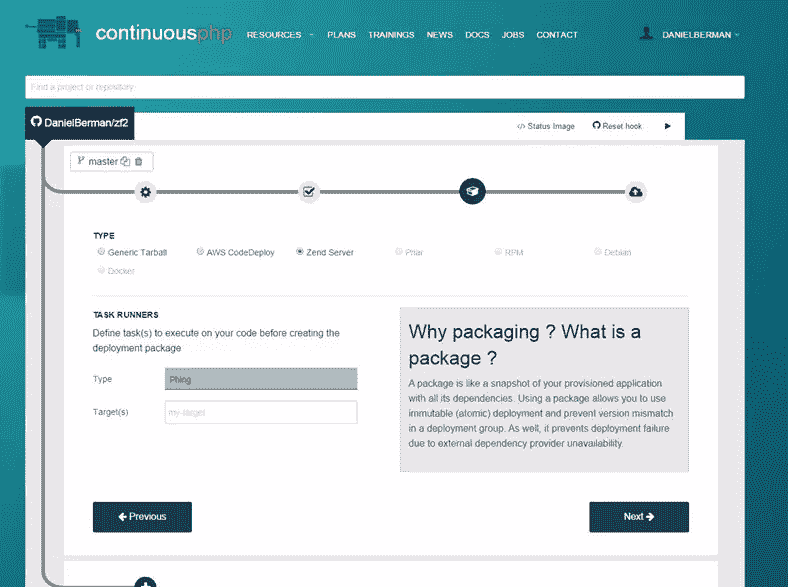

在游戏的这个阶段，不需要配置任何其他东西，任何提交都将开始一个持续的集成过程。也就是说，代码是从 repo 中克隆出来的，用于测试和部署的包的供应是初始化的。
让管道保持现在的配置，留给我们构建的包，我们可以使用 continuousphp [API](http://docs.continuousphp.apiary.io/#reference/builds/build/retrieve-a-build) 或 [SDK](https://github.com/continuousphp/sdk/blob/master/features/build.feature) 来检索，但是我们将通过定义部署目标来更进一步。

点击下一个的**，进入部署设置页面。**

### 添加新目的地

我们现在需要为构建添加和配置一个新的目标。在目的地部分，单击 **+** 图标。
输入您正在部署的 Zend 服务器的 URL 以及应用程序的 URL(确保服务器 URL 包括 Zend 服务器 UI 使用的端口号——10081，或者 HTTPS 的 10082)。

您还需要添加认证所需的 Zend Server web API 密钥的名称和散列。可以使用 Zend Server UI(**Administration | Web API Keys**)来创建和检索这个密钥。

最后但同样重要的是，选择“为成功的构建启用部署”复选框来启用部署。

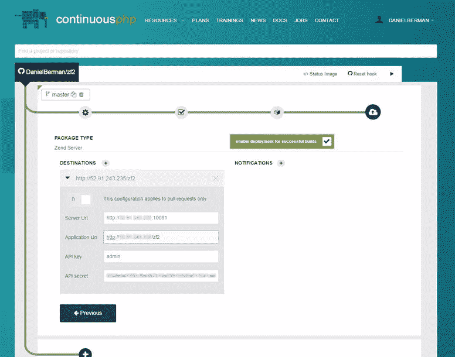

### 额外要求

将 Zend Server 定义为部署目标的最后一步是向存储库的根目录添加两个文件。这两个文件指示 Zend Server 如何部署以及部署什么，没有它们，部署就会失败。

#### deployment.xml

这个描述符文件描述并定义了使用 Zend Server 的部署机制部署应用程序所需的所有必要信息。它描述了应用程序，并指定了成功部署应用程序所需的任何先决条件和参数。下面是一个简单的“deployment.xml”文件的示例:

```
<?xml version="1.0" encoding="utf-8"?>
  <package version="1.0" >
  <type>application</type>
  <name>My demo app</name>
  <summary>A ZF2 demo app</summary>
  <description>A ZF2 demo app for the ContinuousPHP article</description>
  <version>
    <release>1.0</release>
  </version>
  <appdir>data</appdir>
  <docroot>data</docroot>
  <dependencies>
    <required>
      <php>
        <min>5.5.26</min>
      </php>
      <extension>
        <name>pdo_mysql</name>
      </extension>
      <directive>
        <name>safe_mode</name>
        <equals>off</equals>
      </directive>
      <directive>
        <name>error_reporting</name>
        <equals><![CDATA[E_ALL & ~E_NOTICE]]></equals>
      </directive>
    </required>
  </dependencies>
</package> 
```

注意，这个例子通知 Zend Server 应用程序需要哪个 PHP 版本，需要加载哪些扩展，以及`php.ini`指令的值。

#### 部署.属性

这个文件告诉 continuousphp 包中要包含哪些文件以及各种部署脚本的位置。如果你想在包中排除大的文件夹，这是一个好地方。下面是一个“deployment.properties”文件的示例:

```
appdir.includes = config,\
  data,\
  module,\
  public,\
  vendor,\
  composer.json,\
  composer.lock,\
  continuousphp.package,\
  init_autoloader.php,\
  LICENSE.txt,\
  README.md 
```

# #第 5 步:将代码推入管道
就是这样！您的持续交付渠道已经完成。从这一点开始，任何提交，包括合并的拉请求，都将启动一个新的构建。您的代码将经历所有不同的阶段，从从 repo 克隆到打包、测试，最后部署到您选择和定义的目标上。

您可以通过选择项目页面上的 build 来概述管道的各个阶段。然后，您可以看到各个阶段被处理和执行时的快照。

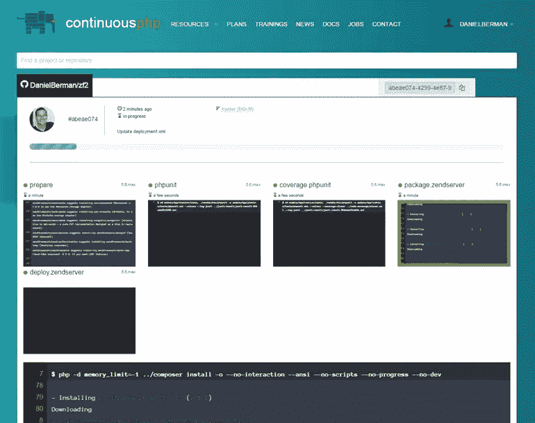

如果在过程的任何阶段失败，您将能够看到导致构建失败的确切错误，并通过电子邮件或您配置的其他通知渠道(例如 Slack)得到通知。

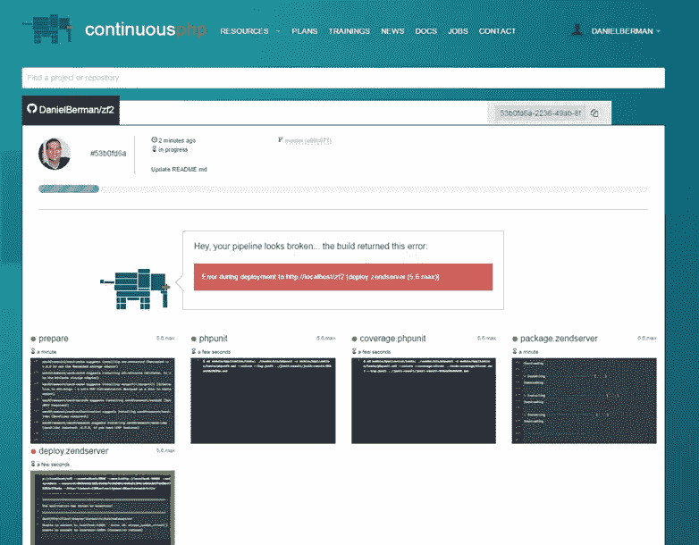

如果部署过程一切顺利，您会看到一路绿灯，最终您的新代码会部署到 Zend Server 上。方便的是，您不必在 Zend Server 上创建虚拟主机——continuous PHP 会自动完成这项工作。

使用用于定义部署目的地的相同 URL 打开 Zend Server UI，并访问管理应用程序页面(**应用程序|管理应用程序**)。

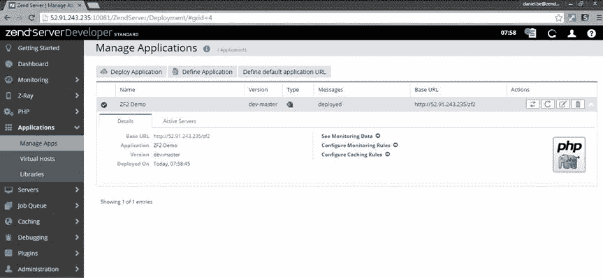

当然，一旦部署在 Zend Server 上，您就可以开始使用各种可用的特性来开发、调试和监控您的应用程序。

## 摘要

伴随着持续交付方法的速度和质量的双重承诺正在转化越来越多的开发团队。但是对于开发人员来说，完全理解持续集成意味着什么，它与持续部署过程有何不同，以及它们如何适应持续交付周期，这是一项艰巨的任务。

php 对于 PHP 开发者来说是一个很好的入门方式。虽然有许多连续交付平台，但没有多少是完全专注于 PHP 的。continuousphp 提供的解决方案支持 php 开发人员使用的方法和工具，并简化了它们与易于管理、完全透明和可靠的交付管道的集成。

## 更多好吃的

这里有一些额外的资源可以帮助你理解 continuousphp 提供的解决方案以及如何设置 Zend Server:

*   [持续 php 文档](https://continuousphp.com/documentation/)
*   [连续交货简介](https://continuousphp.com/tutorial/introduction-continuous-delivery/)
*   [如何在 AWS 上运行 Zend Server](http://blog.zend.com/2015/08/04/debugging-wordpress-with-zend-server-and-z-ray-on-aws/)
*   [Azure Zend Server 入门](http://devzone.zend.com/5133/getting-started-zend-server-azure/)
*   [Zend 服务器文档](http://files.zend.com/help/Zend-Server/content/home.htm)

希望你喜欢阅读！

## 分享这篇文章