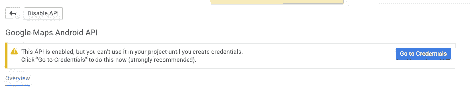
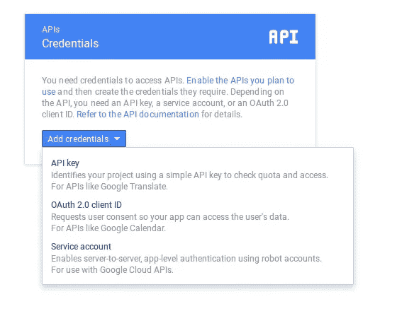
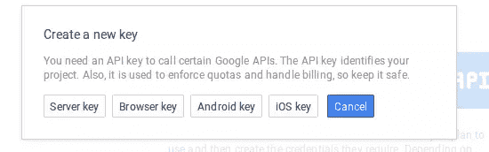
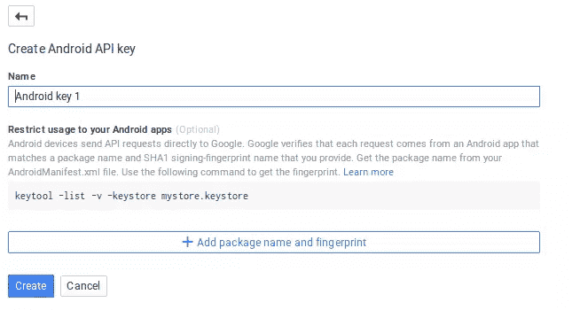
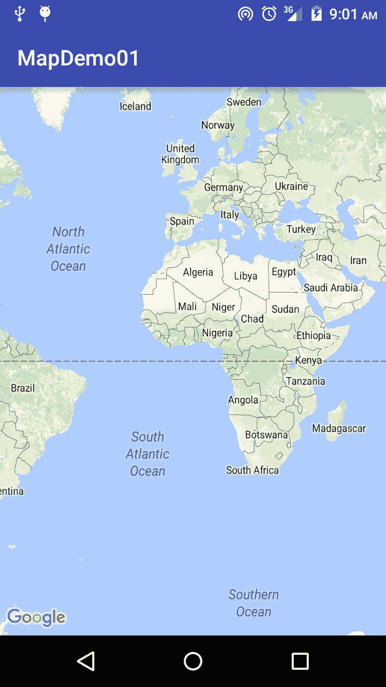
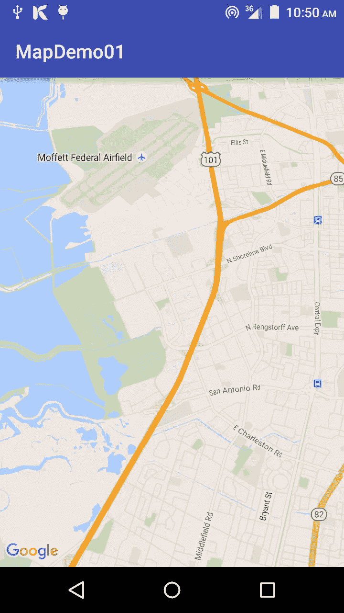
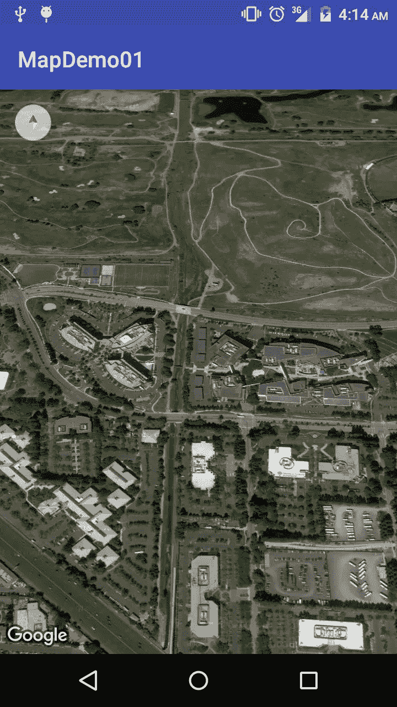
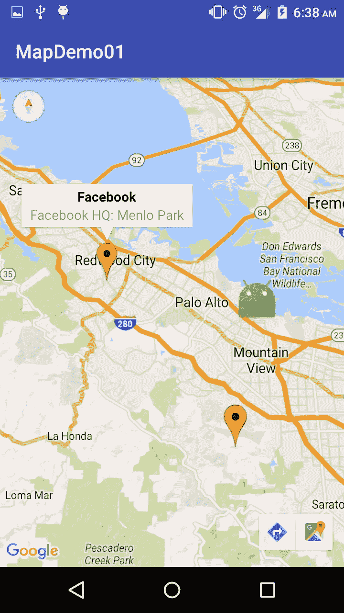

# 使用 Google Play 服务将地图添加到 Android 应用程序

> 原文：<https://www.sitepoint.com/adding-maps-to-an-android-app-with-google-play-services/>

在过去，到一个新的或不熟悉的地方旅行通常需要你随身携带一张当地地图和/或向当地人问路。迷路正在成为过去，因为我们可以方便地在口袋里携带一张地图，不仅是整个地球的地图，还会告诉你你在哪里，告诉你想去哪里，估计到达那里需要多少时间，让你标记兴趣点并保存起来供以后使用，使你能够搜索附近的地方等等。

在本文中，我们将了解 Google Maps Android API，它使您能够将基于 Google Maps 的地图添加到您的应用程序中。该 API 自动处理对谷歌地图服务器的访问、数据下载、地图显示和对地图手势的响应。您可以使用 API 调用向基本地图添加标记、多边形和叠加图，以及更改特定地图区域的用户视图。这些对象提供地图位置的附加信息，并允许用户与地图交互。

我们将创建一个应用程序，展示 API 中的一些可用特性。我们不会涵盖所有内容，因为这将需要几篇帖子，但我们将涵盖一些常见功能，如向视图添加地图、更改地图类型、向地图添加标记以标记位置，以及配置会影响用户查看地图方式的相机。

完成的项目可以在这里下载[。](https://github.com/sitepoint-editors/Google-Play-Services-Maps)

## 获取 API 密钥

要使用 Google Maps Android API，您必须在 Google Developers 控制台上注册您的应用程序项目，并获得一个 Google API 密钥来添加您的应用程序。

API 密钥基于应用程序数字证书的简短形式，称为其 SHA-1 指纹。当你开发和测试时，你应该使用调试证书(我们将很快介绍)，但是当发布应用时，你必须使用发布证书(你可以在这里找到生成发布证书的说明)。

Android SDK 工具在第一次创建调试版本时会自动生成一个调试证书，所以我们所要做的就是检索它。该文件被命名为 *debug.keystore* ，默认情况下，它存储在与您的 Android 虚拟设备(AVD)文件相同的目录中:

*   **OS X 和 Linux:** *~/。安卓/*
*   **Windows:**C:\ Users \ your username . Android \

要查看证书的详细信息，请运行以下命令:

### Linux 还是 OS X

```
keytool -list -v -keystore ~/.android/debug.keystore -alias androiddebugkey -storepass android -keypass android
```

### Windows 操作系统

```
keytool -list -v -keystore "%USERPROFILE%\.android\debug.keystore" -alias androiddebugkey -storepass android -keypass android
```

终端将显示 MD5 和 SHA1 证书指纹，我们希望 SHA1。保持终端窗口打开，前往[谷歌开发者控制台](https://console.developers.google.com/project)。点击*创建项目*按钮，创建一个新项目，并将其命名为`SP Map Demo`。

你将被带到该项目的仪表板，在屏幕中央点击“使用谷歌应用编程接口”。


选择*谷歌地图 Android API* ，点击出现在下一页的*启用 API* 按钮。

API 启用后，点击左侧面板中的*转到凭证*。



从*添加凭证菜单*中，选择 *API 键*。



选择*安卓键*。



在下一个对话框中，你可以更改键名，但我保留了默认的 <q>Android key 1</q>



使用*添加包名和指纹*按钮添加你的应用的包名(我用的是`com.echessa.mapdemo01`)和你的 SHA1 指纹。点击*创建*按钮后，你会看到一个 API 键，我们将在我们的应用程序中使用。

在 Android Studio 中，创建一个新项目，我命名为 mine *MapDemo01* 。确保它的包名与您在 Google 开发者控制台上生成密钥时使用的包名一致，否则您必须在开发者控制台中编辑包名以匹配您的应用程序。

选择 *API 15* 作为最低 SDK 版本。在下一个窗口中，选择*空活动*(如果您使用的是 Android Studio 或更早版本，则选择*空活动*)。将最后一个窗口保留为默认，并点击*完成*。

## 添加地图

将以下内容添加到 *build.gradle (Module: app)* 文件并同步 gradle。

```
compile 'com.google.android.gms:play-services:8.3.0'
```

在清单文件中，添加以下内容作为`application`标签的子标签。在`value`属性中替换您的 API 键。

```
<meta-data
    android:name="com.google.android.geo.API_KEY"
    android:value="YOUR_API_KEY"/>
```

在清单文件中添加以下内容作为`manifest`元素的子元素。

```
<uses-feature
    android:glEsVersion="0x00020000"
    android:required="true"/>
```

Google Maps Android API 使用 OpenGL ES 版本 2 来渲染地图。如果未安装 OpenGL ES 版本 2，您的地图将不会出现。建议将上述代码包含在清单文件中，该文件向外部服务通知需求。特别是，它可以防止谷歌 Play 商店在不支持 OpenGL ES 版本 2 的设备上显示您的应用程序。

**注意**:在以前版本的 Google Play 服务 API 中，您必须在清单文件中包含外部存储和互联网权限，现在不再是这样了。

如果你的目标是 8.3 或更高版本的 Google Play 服务 SDK，你不再需要`WRITE_EXTERNAL_STORAGE`权限来使用 Google Maps Android API。

如果您的目标是 Google Play 服务 SDK 的早期版本，您必须请求`android.permission.WRITE_EXTERNAL_STORAGE`权限。

```
<uses-permission android:name="android.permission.WRITE_EXTERNAL_STORAGE" />
```

如果您的应用程序面向 API 级别 23 (Android 6.0)，这需要使用运行时权限，您应该面向版本 8.3 或更高版本的 Google Play 服务 SDK。

以下权限在 Google Play 服务清单中定义，并在构建时自动合并到您的应用程序清单中。您不需要将它们显式添加到您的清单中:

*   `android.permission.INTERNET`:由 API 用来从 Google Maps 服务器下载地图切片。
*   `android.permission.ACCESS_NETWORK_STATE`:允许 API 检查连接状态，以确定是否可以下载数据。

您也不需要在清单文件中包含以下内容。

```
<meta-data
    android:name="com.google.android.gms.version"
    android:value="@integer/google_play_services_version"/>
```

地图在 API 中由 [GoogleMap](https://developer.android.com/reference/com/google/android/gms/maps/GoogleMap.html) 和 [MapFragment](https://developer.android.com/reference/com/google/android/gms/maps/MapFragment.html) 类表示。

要向您的应用程序添加地图，请向将处理地图的`Activity`添加一个`Fragment`对象。您可以在代码或 XML 布局文件中做到这一点。我们将使用后一种方法。

将 *activity_main.xml* 更改如下:

```
<?xml version="1.0" encoding="utf-8"?>
<RelativeLayout
    xmlns:android="http://schemas.android.com/apk/res/android"
    xmlns:tools="http://schemas.android.com/tools"
    android:layout_width="match_parent"
    android:layout_height="match_parent"
    tools:context=".MainActivity">

    <fragment
        android:name="com.google.android.gms.maps.MapFragment"
        android:id="@+id/map"
        android:layout_width="match_parent"
        android:layout_height="match_parent"/>

</RelativeLayout>
```

上面我们向活动添加了一个片段，并将其`android:name`属性设置为`com.google.android.gms.maps.MapFragment`。这给这个活动附加了一个`MapFragment`。如果您需要支持旧设备，请使用支持库中的`com.google.android.gms.maps.SupportMapFragment`。

运行该应用程序，您应该会看到一个嵌入在视图中的地图。



默认地图视图显示的是相机位于赤道中心并垂直于表面的地球视图。您可以配置地图的初始状态，更改设置，例如相机位置(包括:位置、缩放、方位和倾斜)、地图类型(包括屏幕上的缩放或指南针按钮)、用户可以用来操作相机的手势、是否启用 lite 模式(支持完整 API 提供的功能子集的地图位图图像)。

您可以通过 XML 或编程方式配置地图的初始状态。

更新 *activity_main.xml* 中的片段:

```
<fragment xmlns:map="http://schemas.android.com/apk/res-auto"
          android:name="com.google.android.gms.maps.MapFragment"
          android:id="@+id/map"
          android:layout_width="match_parent"
          android:layout_height="match_parent"
          map:cameraBearing="112.5"
          map:cameraTargetLat="37.4220041"
          map:cameraTargetLng="-122.0862515"
          map:cameraTilt="30"
          map:cameraZoom="13"
          map:mapType="normal"
          map:uiCompass="false"
          map:uiRotateGestures="true"
          map:uiScrollGestures="false"
          map:uiTiltGestures="true"
          map:uiZoomControls="false"
          map:uiZoomGestures="true"
          tools:ignore="MissingPrefix"/>
```

运行应用程序以查看地图初始状态的变化。



上面我们包括了相机位置的设置，如位置、缩放、方位和倾斜。`cameraBearing`设置地图上垂直线指向的方向，从北方顺时针测量，以度为单位。`cameraTargetLat`和`cameraTargetLng`设置地图中心的位置。`cameraTilt`将相机的位置设置在地图中心位置正上方和地球表面之间的弧线上。`cameraZoom`决定地图的比例，在较大的缩放比例下，屏幕上会显示更多的细节，而在较小的缩放比例下，屏幕上会显示更多的世界。

我们将`mapType`设置为`normal`，这是默认的地图类型。其他可用选项概述如下。

*   **正常:**典型路线图。显示了道路、一些人造特征和重要的自然特征，如河流。道路和要素标签也可见。
*   **混合:**添加道路地图的卫星照片数据。道路和要素标签可见。
*   **卫星:**卫星照片数据。道路和要素标签不可见。
*   **地形:**地形数据。该地图包括颜色、等高线和标签以及透视阴影。一些道路和标签也是可见的。
*   **无:**无磁贴。地图呈现为未加载切片的空网格。

最后一组设置确定指南针和缩放控制是否出现在屏幕上，以及启用/禁用某些手势。

最后一个属性`tools:ignore="MissingPrefix"`不是 MapView 设置的一部分，但是它消除了一个错误消息(*意外的名称空间前缀 <q>map</q> 为标签片段*找到)Android Studio 显示的以`map:`属性开头的属性。尽管 Android Studio 显示一个错误，该项目仍将构建并运行。根据[这个 Gmaps bug 报告页面](https://code.google.com/p/gmaps-api-issues/issues/detail?id=5002)，问题似乎是 Android Lint 工具的一个 bug。您可以禁用 lint 检查，但是因为它在查找 bug 方面很有用，所以更好的解决方案是忽略特定标签的 Lint 问题，就像我们对`fragment`标签所做的那样。`tools:ignore`属性可以在任何 XML 元素上设置，它是一个逗号分隔的 lint 问题 ID 列表，可以在这个元素或它的任何子元素上递归忽略。

## 以编程方式设置地图状态

我们已经看到了如何使用 XML 布局文件设置地图的初始状态，接下来我们将看看如何在代码中做同样的事情。

更改 *activity_main.xml* ，如下所示，只包含基本的`MapFragment`。我们将在代码中向地图添加更多配置。

```
<?xml version="1.0" encoding="utf-8"?>
<RelativeLayout
    xmlns:android="http://schemas.android.com/apk/res/android"
    xmlns:tools="http://schemas.android.com/tools"
    android:layout_width="match_parent"
    android:layout_height="match_parent"
    tools:context=".MainActivity">

    <fragment
          android:name="com.google.android.gms.maps.MapFragment"
          android:id="@+id/map"
          android:layout_width="match_parent"
          android:layout_height="match_parent"/>

</RelativeLayout>
```

在`MainActivity`中，我们将实现`OnMapReadyCallback`接口并使用`onMapReady`回调方法来获得`GoogleMap`对象的句柄。`GoogleMap`对象是地图本身的内部表示。要设置地图的视图选项，请更改其`GoogleMap`对象。

更改类定义:

```
public class MainActivity extends AppCompatActivity implements OnMapReadyCallback
```

添加`onMapReady`回调方法。

```
@Override
public void onMapReady(GoogleMap map) {
    map.setMapType(GoogleMap.MAP_TYPE_SATELLITE);

    CameraPosition googlePlex = CameraPosition.builder()
            .target(new LatLng(37.4219999,-122.0862462))
            .zoom(16)
            .bearing(0)
            .tilt(45)
            .build();

    map.moveCamera(CameraUpdateFactory.newCameraPosition(googlePlex));

}
```

上面的代码获取了`GoogleMap`对象并设置了地图类型和摄像机位置，然后它将摄像机移动到那个位置。

将以下内容添加到`onCreate()`的末尾。我们在片段上调用`getMapAsync()`来注册回调。

```
MapFragment mapFragment = (MapFragment) getFragmentManager().findFragmentById(R.id.map);
mapFragment.getMapAsync(this);
```

运行应用程序，您应该会看到带有配置集的地图。



你可以使用`animateCamera()`而不是`moveCamera()`来获得一个当地图加载时相机移动到位的好效果。

```
// map.moveCamera(CameraUpdateFactory.newCameraPosition(googlePlex));

map.animateCamera(CameraUpdateFactory.newCameraPosition(googlePlex), 10000, null);
```

## 在地图上添加标记

您可以向地图添加标记来显示单个位置。您可以通过更改默认颜色或用自定图像替换标记图标来自定义标记。您也可以添加信息窗口，为标记提供额外的上下文。

将以下内容添加到初始化`CameraPosition`对象的语句之后的`onMapReady()`。

```
map.addMarker(new MarkerOptions()
            .position(new LatLng(37.4219999, -122.0862462))
            .title("Google Plex")
            .icon(BitmapDescriptorFactory.fromResource(R.mipmap.ic_launcher)));

map.addMarker(new MarkerOptions()
        .position(new LatLng(37.4629101,-122.2449094))
        .title("Facebook")
        .snippet("Facebook HQ: Menlo Park"));

map.addMarker(new MarkerOptions()
        .position(new LatLng(37.3092293,-122.1136845))
        .title("Apple"));
```

在这里，我们创建了三个标记。第一个具有自定义图标，而其余的将具有默认图标。第二个标记使用`snippet()`在轻按标记时在信息窗口中显示更多数据。另外两个将仅显示标题文本。

运行应用程序查看更改。我注释掉了设置地图类型的语句，因此它默认为`normal`。



## 显示用户的当前位置

您的应用程序可能需要在地图上显示用户的位置。您可以通过使用 Google Play 服务位置 API 或使用“我的位置”图层和“我的位置”按钮在地图上显示用户的当前位置来完成此操作。

“我的位置”图层提供了一种在地图上显示设备位置的简单方法。若要使用此功能，您需要位置权限。

向清单文件添加以下权限。

```
<uses-permission android:name="android.permission.ACCESS_COARSE_LOCATION"/>
```

这里我们要求`coarse`位置数据，但是为了更精确，您可以要求`fine`数据。

对于 Android 棉花糖支持，需要使用[运行时位置权限](https://developers.google.com/maps/documentation/android-api/location#runtime-permission)。为了使这篇文章简短，我们不会深入到运行时权限，但是上面的链接显示了如何做到这一点。

将以下内容添加到创建标记的代码之后的`onMapReady()`。

```
map.setMyLocationEnabled(true);
```

运行应用程序，您应该会在地图视图的右上角看到*我的位置*按钮。如果已知设备的当前位置，点击按钮，相机会将地图居中显示在设备的当前位置。如果设备是静止的，则在地图上用一个小蓝点表示位置，如果设备是移动的，则用一个人字形表示位置。


*我的位置*图层不返回任何数据。如果您希望以编程方式访问位置数据，您应该使用 Google Play 服务位置 API。

Google Play 服务位置 API 是为您的 Android 应用程序添加位置感知的首选方法。它具有“我的位置”图层未提供的其他功能，可让您:

*   确定设备位置。
*   倾听位置变化。
*   如果设备正在移动，请确定运输方式。
*   创建并监控预定义的地理区域，称为地理围栏。

我们已经介绍过如何使用 Google Play 服务位置 API ，所以这里就不赘述了。

## 结论

我们刚刚谈到了谷歌地图 API 的功能，它还提供了更多的功能，包括显示热图，在地图上绘制形状，将 KML(XML 数据格式的扩展)对象转换为地理形状，并将其渲染为地图上的图层等等。关于 API 的更多信息，[查看文档](https://developers.google.com/maps/documentation/android-api/intro)。

## 分享这篇文章