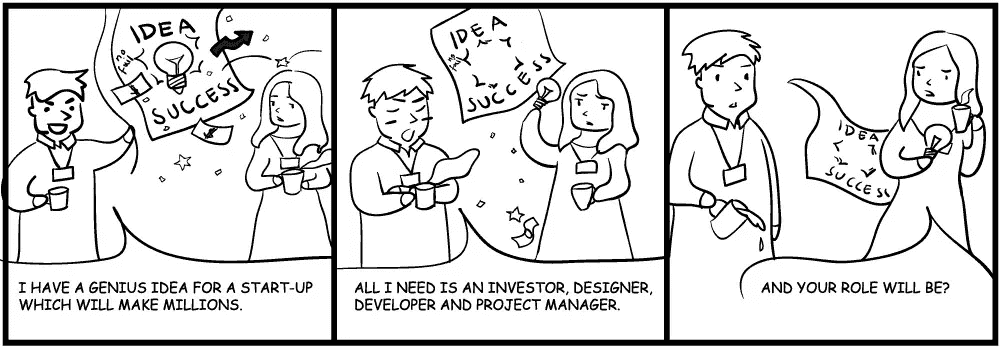

# 如何回应分红要约

> 原文：<https://www.sitepoint.com/respond-profit-share-offers/>

你已经听过很多很多次了。一个客户(或潜在客户)带着一个“惊人的”想法来找你，但是他们的资源有限。他们不能为你的专业知识付费，但很乐意提供利润分享安排。你会成为千万富翁！他们联系你的那一天你会赞的！你什么时候能开始？！

SitePoint 的作品/ [娜塔莉亚·巴尔斯卡](http://scncf-lab.com/)

## 就说“不”

如果客户的想法真的很棒，他们应该有很多投资机会。他们真正想说的是:

> 我们不知道这个项目是否可行。它可能是巨大的。或者它什么都不会产生。即使我们不愿意，你愿意承担所有的风险吗？

客户要求你投资他们的生意。不幸的是，你不太可能成为他们行业的专家。这个项目可能是开创性的，也可能是可怕的，但你无从知晓。如果他们要钱，你应该期待一份全面的商业计划，包括预测、营销细节、持续成本和潜在利润。这些很少出现。

分享利润的客户很少把你的时间等同于金钱，这是天生的光顾。古老的格言“时间就是金钱”是不正确的；时间比金钱更有价值。这并不总是容易的，可能需要一些运气，但你总是可以赚更多的钱。你不可能腾出更多的时间。平均工作时间仅为 75，000 小时。成为一名熟练的开发人员需要 10，000 个小时，保持最佳状态可能还需要 10，000 个小时。即使你用学校教育抵消了一部分，你还剩下 6 万个小时来谋生。

赌客户的想法会产生其他财务影响:

1.  当你为他们工作时很难挣钱。
2.  客户会比其他人要求更高，因为他们没有预算或时间限制。
3.  大多数新企业都失败了。那些没有计划的人情况更糟。
4.  在你熟悉的行业，你几乎肯定有更好的想法。你将会明白如何从小处着手，并根据用户需求开发出最小可行的产品— *你为什么不去做呢？*

在你投资之前，客户没有业务。然而，你的贡献没有可感知的价值，因为客户不会为你的工作支付任何费用。你的努力是免费的。

忽略绝大多数的方法——尤其是那些不认识你却愿意和陌生人分享生意的人。不要浪费任何时间回应他们把脸书和易贝合并的不可行的想法。如果他们继续争论，或者他们是一个有着愚蠢想法的现有客户，声明你只有在收到他们的五年商业计划后才能考虑投资。它永远不会到达。

## 但是如果…

偶尔，你会遇到一个你熟悉的人提出的有希望的想法。讨论一下没有坏处，但是不要未经仔细考虑就匆忙达成任何协议。特别是:

*   人们经常高估自己的想法，但要清楚想法是没有成本的。执行是另一回事。
*   除非客户有一个可靠的商业计划，否则不要进行。这必须包括想法的大纲、市场研究、销售预测和投资细节。如果他们紧张，就签一份保密协议。
*   不要被花哨的图表或华而不实的展示所左右——这个计划现实吗？进行自己的研究。问问同事朋友家人。寻找潜在买家和其他投资者。
*   识别风险和回报。制造产品并推向市场需要多长时间？持续的运营成本是多少？需要多少客户才能保本？你什么时候能得到第一笔还款？
*   估计您的个人时间投入，不要忘记包括规划、支持、培训和升级成本。将其转换为投资货币条款，但不要使用您的正常日利率——为您将面临的风险增加大量应急资金。
*   忘记利润分成协议:你应该成为合伙人/董事，根据你的投资持有公司一定比例的股份。这必须记为公司资本或贷款，以便在支付任何其他股息之前偿还。
*   考虑还价以最小化风险。例如，你将拥有公司 75%的股份。如果你的投资在两年内全部收回，你的持股会减少到 50%。
*   对方是谁并不重要:成立一家独立的公司，签署具有法律约束力的合同。在那之前不要开始工作。

换句话说:不要被不公平的协议所欺骗，这些协议利用你的技能和善良来换取微薄的报酬。

你对公司的投资可能会超过你的合伙人。如果生意失败了，你损失了大量的时间，这些时间本可以更好地用在其他地方。如果生意成功了，你最初的参与才刚刚开始，你的职业生涯将在一条不同的道路上前进。不管怎样，这都是不确定的，你应该得到相应的回报。

相信你的直觉。如果听起来好得不像真的，它就会是真的。

祝你好运。

## 分享这篇文章