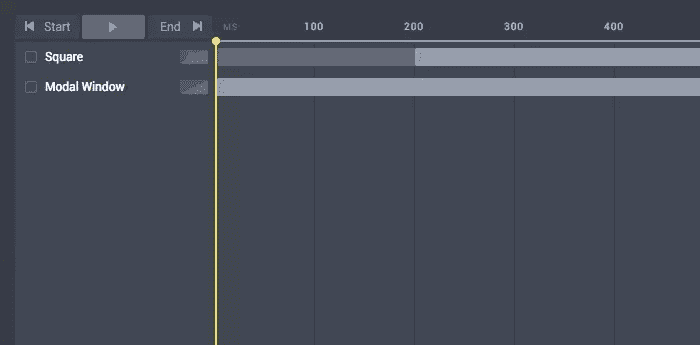
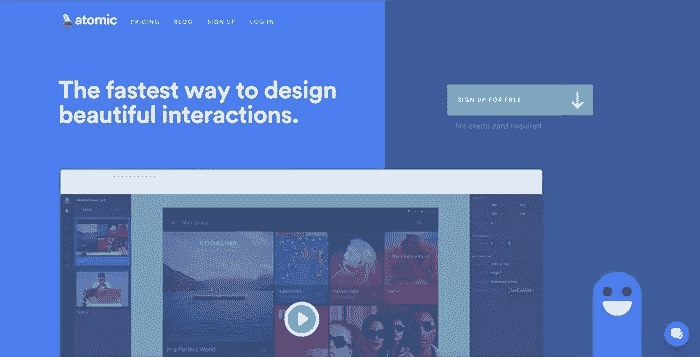
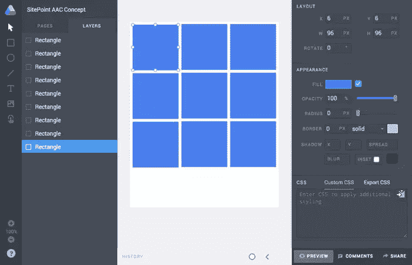
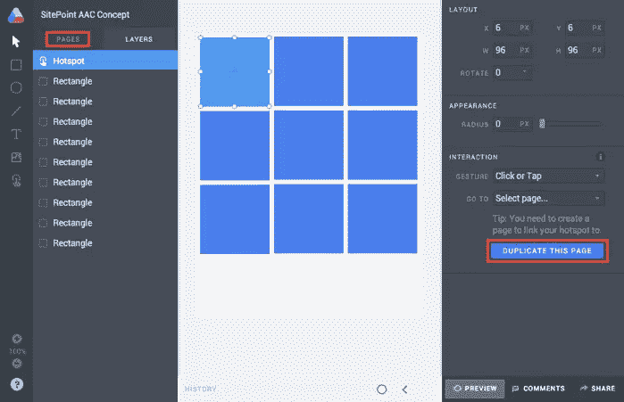
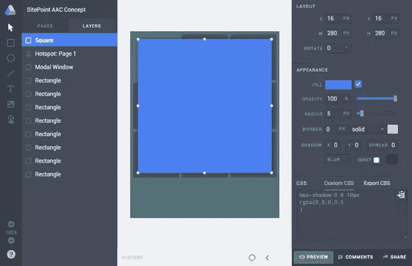
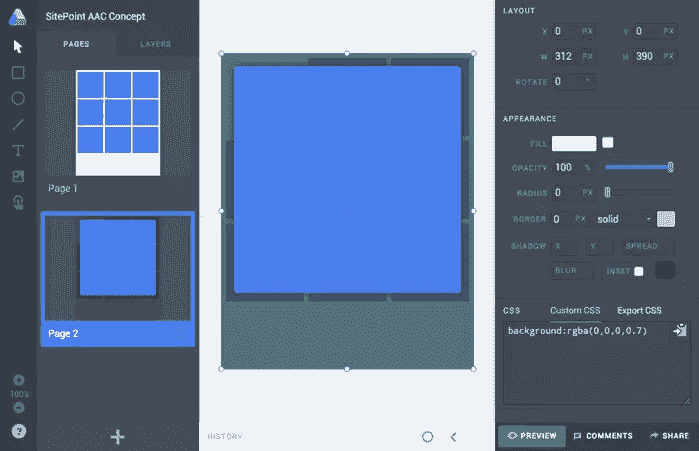
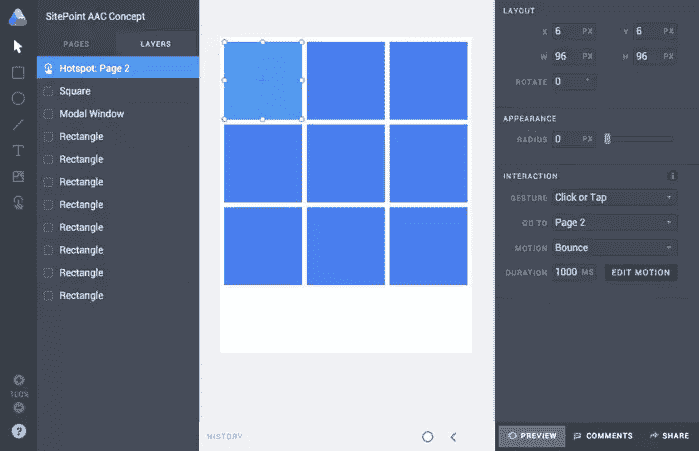
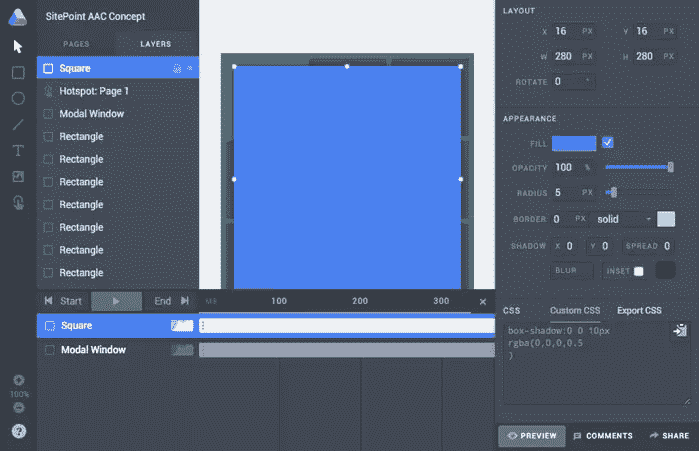
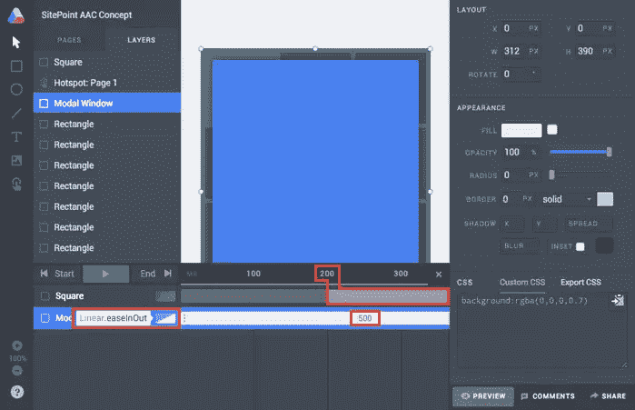

# 如何在 Atomic.io 中轻松处理复杂动画

> 原文：<https://www.sitepoint.com/handle-complex-animations-with-atomic-io/>

[不久前](https://www.sitepoint.com/create-easy-interactions-using-sketch-app-atomic-io/)我自作主张在 Sketch 应用程序中重新创建了 SitePoint 徽标，然后用它为一个假想的 iOS 应用程序创建了加载屏幕动画，使用的是 [Atomic.io](https://app.atomic.io) 。它涉及到让 SitePoint 徽标的两半从屏幕两侧以一种放松的动画形式飞入，然后将整个屏幕过渡到左侧，露出第一个应用程序屏幕。

但现在 Atomic.io 正式退出测试，我们可以获得新的功能，通过将延迟，计时和效果应用到各个层来创建更复杂的动画。

那是什么意思？可能性…很多。

## 高级动画控制

Atomic 将这个特性称为**高级运动控制**，在用户界面中简称为“运动”。之前(Atomic 处于测试阶段时)，每一层都必须有相同的延迟和缓解效果，所以我们想要实现的并不总是*可能的*。

“延迟”与开始动画之前屏幕等待的时间间隔有关，但当 Atomic 处于测试阶段(现在不是了)时，“延迟”应用于所有的层，就像动画的类型一样。高级动画控制(从现在开始我将简称为 AAC)让你为不同的层指定不同的延迟，持续时间和动画风格；这意味着更大的灵活性和更好、更精细的动画。

让我们创建一个例子——注册是免费的。

## 设置页面、画板和形状

对于这个概念，我们不需要一个巨大的画板，所以从选择 **Apple Watch 42mm 312 × 390 预设**开始。按“R ”,画出一个 96×96 像素的*矩形*。你可能会发现这样做的时候按住 **shift** 会更容易，因为这样会强制选择完全是方形的，或者你可以使用表单域来声明精确的值。如果你是 Bohemian Coding 的 Sketch App 的用户，这个会感觉很熟悉。

按下 **command+d** 到*复制*那个矩形，然后确认两者的装订线宽度都是 6px。重复这个步骤几次，直到你有一个 3×3 的网格，像这样:

## 创建一个互动热点

按“H”并画出一个*热点*，其尺寸与我们的一个矩形相同；概念完全相同，只是这个矩形是不可见的，标记了我们交互的区域。选取一个正方形，任何正方形，然后移动热点区域，使其出现在该正方形的正上方。

像任何设计工具一样，有一个层控制界面，你可以拖动层出现在其他层的下面或上面(在 Atomic 中这是在左手边)。不要忘记确保热点出现在图层树的顶部——很多次我愚蠢地想知道为什么我的点击不起作用！

不过，让我们暂时不去管动画。在“交互”选项卡中，有一个按钮，上面写着“复制此页”——点击该按钮，然后导航到*第 2 页*。

## 创造互动的下一个阶段

第 2 页–这是我们互动结束的状态。

按“R”创建另一个矩形，并将尺寸设置为覆盖画板的全部内容；另外，确保它出现在文件树的顶部。在“自定义 CSS”字段，输入“`background: rgba(0,0,0,0.7)`”，这将作为一个半不透明的背景模式，但要确保你取消勾选“填充”样式，否则它不会出现。

通常建议让模态对单击交互做出反应以消除模态，因此将已经存在的热点移动到文件树的顶部，并确保它也填充整个画板。在交互选项卡的*转到*选项中选择“第 1 页”。

最后，将您的交互式正方形移动到文件树的顶部，并使用这些值创建正方形的扩展视图:

*   X: 16px
*   Y: 16px
*   女:280 像素
*   高:280 像素
*   半径:5px

一旦你将“box-shadow: 0 0 10px rgba(0，0，0，0.5)”添加到 CSS 框中，你将得到一个典型的打开/关闭模式。

如果您点击“预览”按钮，您应该能够点击热点，在两种状态之间来回导航。

## 动画模式窗口

切换回**第 1 页**并选择热点。在交互选项卡中，为*动作*选择“弹跳”，为*持续时间*选择“1000 毫秒”。此时你会注意到，如果你*预览*交互(顺便说一下，command+enter)，模态窗口会发生一些奇怪的事情——这是因为模态窗口不会以原始状态出现，所以将该层从**第 2 页**复制到**第 1 页**。

但是有些事情还是不太对劲。

虽然有弹性的正方形看起来很时髦，但这种效果也应用到了模式窗口，这导致它在不同程度的不透明度上有所动摇。它看起来一点也不好看，但这正是高级动画控制(AAC)的用武之地。

## 控制动画的不同方面

在同一选项卡中，单击“编辑运动”。在这两种状态之间，两个层被改变，并且它们都出现在 AAC 界面中。你可能已经注意到了，我已经把这些图层重命名为“正方形”和“模态窗口”。此时，两个层的动画持续时间都是 1000 毫秒，并且两个层都被设置为立即开始动画，因为每个层都有一个持续时间条，从 0 毫秒开始，到 1000 毫秒结束。

将“正方形”条的开头拖到 200 毫秒。现在模态窗口将有一个 200 毫秒的开始，然后方块将开始动画-这就是动画*延迟*的工作方式。

但是我们仍然希望模态窗口有一个不同的*类型*的动画，或者更具体地说是“缓和”,所以选择工具栏旁边的图标，选择一些更微妙的东西，比如“线性”。

但是，我们不希望模态窗口动画需要那么长时间，所以跟踪该条到行尾，并将其缩短到大约 500 毫秒。按 **command+enter** 来“预览”动画。

好多了。对于解散交互，我使用了 250 毫秒持续时间的线性过渡-没有什么花哨的。

## 包扎..

在 AAC 之前，所有的层都以同样的方式，在相同的时间和相同的时间长度来制作动画，但是交互设计在用户体验中扮演着重要的角色，我们在我们的工艺中变得更加具体；更不用说现在 CSS 转场已经被广泛支持了。我总是回避动画，因为这是一个我从来没有感到特别舒服的领域，但 Atomic.io 让我用一个非常简单的工具集创建美丽的交互。

**[下面是](https://app.atomic.io/d/9ETh7xPhER0R)的最终交互设计。**

## 分享这篇文章