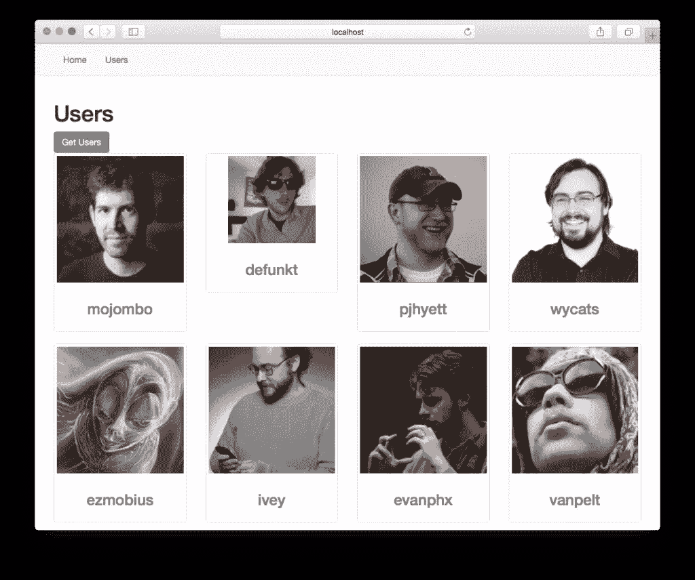

# Vue.js 1.0 的新增功能

> 原文：<https://www.sitepoint.com/whats-new-in-vue-js-1-0/>

这篇文章由[克里斯·佩里](https://www.sitepoint.com/author/cperry/)和[托马斯·格列柯](https://www.sitepoint.com/author/tgreco/)进行了同行评审。感谢 SitePoint 的所有同行评审员使 SitePoint 的内容尽可能做到最好！

Vue.js 1.0 于 10 月底发布，包含了一些令人敬畏的新功能。虽然这个库的大部分外观和感觉都和以前一样，但是有一些变化值得注意。在本文中，我们将探讨一些变化，以及如何在使用 Vue.js 创建应用程序时利用它们来提高效率和表现力。

如果你不确定 Vue.js 是什么，你可能想先看看这个:[vue . js 入门](https://www.sitepoint.com/getting-started-with-vue-js/)

## Vue.js 1.0 设计目标

如果你以前尝试过 Vue.js，你的体验可能是它与其他框架相似，但它是一个更轻量级的替代品，更容易使用。这在很多方面都是正确的，Vue 当然因为它能够单独作为应用程序的视图层而受到欢迎。使用它作为视图层，您可以用很少的开销实现单页面应用程序功能。然而，Vue.js 生态系统远远超出了视图层，使得轻松制作大规模水疗中心成为可能。

随着 1.0 版本的发布，Vue.js 旨在为开发人员提供编写大型应用程序的愉快体验，并确保其使用的模式提高可维护性。工具得到了改进，语法得到了完善，随着这一版本的进步，Vue.js 希望表明它可以与重量级的 JavaScript 框架抗衡，即使它没有大型企业的支持。

## 对开发者来说有什么不同？

### 指令语法和 v-for

如果您已经用 Vue.js 呈现了一个列表，那么您会看到用于迭代一个数组并在屏幕上显示其数据的`v-repeat`指令。到了 Vue.js 1.0，这个改成了`v-for`。虽然 API 基本相同，但我们不能再简单地将指令指向一个数组，然后根据属性名将数据模板化。相反，我们现在必须为数组的当前元素使用别名。

```
<!-- Before -->
<p v-repeat="people">{{firstname}}</p>

<!-- Afer -->
<p v-for="person in people">{{person.firstname}}</p> 
```

真正的区别在这里显示在引擎盖下。指令要快得多，在渲染大型集合时会有很大的不同。

对于 Vue.js 1.0，您会注意到语法上的一些差异。也就是说，引入了速记，这有助于使 HTML 模板更加简洁。我们现在可以用`@`速记来处理事件。

```
<!-- Before -->
<div v-on:mouseover="changeColor()"></div>

<!-- After -->
<div @mouseover="changeColor()"></div> 
```

此语法适用于所有事件。

我们也可以用`:`来代替`v-bind`。

```
<!-- Before -->
<select v-model="firstname">
 <option v-bind:value="{ name: Ryan }">Ryan</option>>
</select>

<!-- After -->
<select v-model="firstname">
 <option :value="{ name: Ryan }">Ryan</option>>
</select> 
```

同样，这不是一个巨大的变化，但任何有助于清理标记的东西都是一个胜利！

### 工具作业

Vue.js 1.0 整合了一些伟大的工具，提供了令人敬畏的开发体验。当使用像 Webpack 或 Browserify 这样的构建工具进行 Vue.js 应用时，由于一些升级，开发体验会更加流畅。其中两个值得一提的升级是[热模块更换](https://webpack.github.io/docs/hot-module-replacement.html)和**无争议 ES6** 。

用于 Webpack 的 [vue-loader](https://github.com/vuejs/vue-loader) 组件加载器和用于 Browserify 的 [vueify](https://github.com/vuejs/vueify) 转换让我们编写带有`.vue`扩展名的特殊组件。有了这些组件，我们可以将`<template>`、`<script>`和`<style>`都保存在同一个文件中，这对可维护性非常好。Vue.js 1.0 的改进使得使用它们更加容易。

#### 热模块更换

热模块替换意味着当我们对我们的`.vue`组件进行更改时，受影响的构建部分会被立即换出并替换为更改。这样做的好处是，我们不需要重新加载页面，当我们希望应用程序保持当前状态但仍然能够看到更改时，这很有帮助。它有效地替代了实弹射击。

#### 是六个

ES6 对`.vue`组件的支持过去需要额外的设置，但现在没有任何麻烦。那些不熟悉 ES6 的人可能不会认为这是一个重要的特性；然而，如果你正在编写 ES6，你会发现准备好它是一个很大的帮助。

## 示例—启动大规模 Vue 应用程序

用 Vue.js 启动基于组件的应用程序最简单的方法是建立一个`package.json`文件，并使用 npm 安装所有东西。让我们用 Webpack 构建一个示例应用程序，看看我们如何开始。该应用程序将让我们获取 GitHub 用户列表。



你可以在我们的 [GitHub repo](https://github.com/sitepoint-editors/vue-github-users) 上获得这个应用的完整代码。

### 初始设置

```
mkdir vue-github-users && cd vue-github-users
touch package.json 
```

在`package.json`文件中，添加我们需要的依赖项。该文件应该如下所示:

```
{
  "name": "vue-github-users",
  "version": "0.0.1",
  "scripts": {
    "dev": "webpack-dev-server --inline --hot"
  },
  "devDependencies": {
    "babel-core": "^6.1.2",
    "babel-loader": "^6.1.0",
    "babel-plugin-transform-runtime": "^6.1.2",
    "babel-preset-es2015": "^6.1.2",
    "babel-runtime": "^6.0.14",
    "css-loader": "^0.21.0",
    "style-loader": "^0.13.0",
    "vue-hot-reload-api": "^1.2.1",
    "vue-html-loader": "^1.0.0",
    "vue-loader": "^7.0.1",
    "webpack": "^1.12.3",
    "webpack-dev-server": "^1.12.1"
  },
  "dependencies": {
    "bootstrap": "^3.3.5",
    "vue-resource": "^0.1.17",
    "vue-router": "^0.7.5",
    "vue": "^1.0.7"
  }
} 
```

这里有相当多的依赖项，其中许多都与将 ES6 移植到 ES5 有关。请注意，我们引入了`vue-hot-reload-api`，这使我们能够利用热模块更换。

我们有一个名为`dev`的`script`设置，它运行 Webpack 开发服务器并指定我们需要热模块替换。当我们去启动应用程序时，我们只需要在控制台中键入`npm run dev`。

接下来，让我们安装一切。

```
npm install
```

我们需要设置我们的 Webpack 配置，以使`vue-loader`和捆绑工作。我们在项目的根目录下用一个`webpack.config.js`文件来做这件事。

```
// webpack.config.js

module.exports = {
  // the main entry of our app
  entry: './src/index.js',
  // output configuration
  output: {
    path: __dirname + '/build/',
    publicPath: 'build/',
    filename: 'build.js'
  },
  // how modules should be transformed
  module: {
    loaders: [
      // process *.vue files using vue-loader
      { test: /\.vue$/, loader: 'vue' },
      // process *.js files using babel-loader
      // the exclude pattern is important so that we don't
      // apply babel transform to all the dependencies!
      { test: /\.js$/, loader: 'babel', exclude: /node_modules/ }
    ]
  },
  // configure babel-loader.
  // this also applies to the JavaScript inside *.vue files
  babel: {
    presets: ['es2015'],
    plugins: ['transform-runtime']
  }
} 
```

这里我们已经说过，应用程序的入口点将是`src`目录中的一个`index.js`文件。我们还指定所有内容都应该打包并输出到一个名为`build.js`的文件中。在`module.loaders`数组中负责`vue-loader`设置，在这里我们有处理`.vue`文件和将 ES6 转换成 ES5 的规则。

### 应用程序文件

初始设置就绪后，让我们开始实际的应用程序。我们首先需要的是一个应用程序的`index.html`文件。

```
<!-- index.html -->

<!doctype html>
<html>
  <head>
    <meta charset="utf-8">
    <title>Vue GitHub Users</title>
    <link rel="stylesheet" type="text/css" href="node_modules/bootstrap/dist/css/bootstrap.min.css">
  </head>
  <body>
    <div id="app"></div>
    <script src="build/build.js"></script>
  </body>
</html> 
```

我们应用程序的所有内容都将显示在`app` div 中，稍后我们将看到这是如何工作的。在 div 标签下面，我们引入了`build.js`文件，它将捆绑我们所有的脚本。

接下来，我们来设置`src/index.js`入口点。

```
// src/index.js

import Vue from 'vue'
import App from './components/App.vue'
import Home from './components/Home.vue'
import Users from './components/Users.vue'
import VueRouter from 'vue-router'
import VueResource from 'vue-resource'
Vue.use(VueResource)
Vue.use(VueRouter)

var router = new VueRouter()

// Pointing routes to the components they should use
router.map({
  '/home': {
    component: Home
  },
  'users': {
    component: Users
  },
})

// Any invalid route will redirect to home
router.redirect({
  '*': '/home'
})

router.start(App, '#app') 
```

### 航行

我们通过导入我们需要的项目来充分利用 ES6。我们还没有创建`App`、`Home`或`Users`组件，但是接下来我们会创建。

设置路由很容易，`vue-router`给了我们直接将路由映射到它们应该使用的组件的选项，这就是我们在`router.map`中所做的。要开始一切，我们只需要调用`router.start`并将`App`组件指向位于`index.html`文件中 id 为`app`的 div。

那么为什么我们有一个`App`和一个`Home`组件呢？`App`组件将负责容纳导航栏，并为其他路线提供一个出口，而`Home`组件将只是一个简单的欢迎消息。

```
<!-- src/components/App.vue -->

<template>
  <div id="wrapper">
    <nav class="navbar navbar-default">
      <div class="container">
        <ul class="nav navbar-nav">
          <li><a v-link="'home'">Home</a></li>
          <li><a v-link="'users'">Users</a></li>
        </ul>
      </div>
    </nav>
    <div class="container">
      <router-view></router-view>
    </div>
  </div>
</template>

<!-- src/components/Home.vue -->

<template>
  <h1>Home</h1>
</template> 
```

在导航栏下面的容器中，我们有一个`<router-view>`，其他组件的内容将在这里显示。为了在其他视图之间导航，我们在导航条的锚标签上设置了带有`v-link`的链接。这些链接指向我们在`router.map`中定义的路线名称。

在这些组件中，我们只是定义了一个`<template>`，这是因为除了显示标记之外，它们不需要做太多事情。接下来让我们设置一下`Users`组件，看看如何使用 JavaScript。

### 用户路线

对于这个组件，我们需要对 GitHub API 进行 HTTP 调用来获取用户列表。向`https://api.github.com/users`发送一个`GET`请求将获得 30 个 GitHub 配置文件。

```
<!-- src/components/Users.vue -->

<template>
  <h1>Users</h1>
  <button class="btn btn-primary" @click="fetchUsers()">
    Get Users
  </button>

  <div class="row">
    <div class="col-xs-6 col-md-3" v-for="user in users">
      <div class="thumbnail">
        
        <div class="caption">
          <a :href="user.html_url">
            <h3 class="username">{{ user.login }}</h3>
          </a>
        </div>
      </div>
    </div>
  </div>
</template>

<script> export default {
  data() {
    return {
      users: []
    }
  },

  methods: {
    fetchUsers() {
      this.$http.get('https://api.github.com/users', (data) => {
        this.users = data
      })
      .error((err) => console.log(err))
    }
  }
} </script>

<style> .username {
  text-align: center;
} </style> 
```

这个组件比上一个组件要多一些。先说`<script>`区。Vue 组件需要导出一个普通对象，该对象随后被转换成组件构造函数。这个对象看起来有点像一个常规的 Vue 实例，只是有一些不同。

在`methods`对象上，我们有一个名为`fetchUsers`的函数。这个方法向 GitHub API 发出一个`GET`请求，并在`users`数组上设置返回的数据。如果有错误，它会被记录到控制台。

在`<template>`中，我们设置了一些结构来显示用户的头像和用户名，以及到他们个人资料的链接。正如你所看到的，我们使用了新的简写指令语法，在“获取用户”按钮上有`@click`，在`img`标签上有`:src`，在`a`标签上有`:href`。

尽管我们并不真的需要它，我们还是在`username`上设置了一个样式，看看我们如何利用样式。

### 热模块更换正在进行

如前所述，将 Webpack 与 vue-loader 一起使用的好处之一是我们可以免费获得热模块替换。我们可以通过并排放置我们的编辑器和 broswer 来看到这一点。对其中一个模板进行简单的编辑，我们就会看到更改立即生效。例如，如果我们更改了`Users.vue`组件中的`h1`并保存，新组件将被交换，更改将自动反映出来。

```
<!-- src/components/Users.vue -->

<template>
  <h1>GitHub Users</h1>
  ... 
```

只需保存，就可以立即在浏览器中看到更改。即使应用程序处于启动状态之外的状态也是如此，如果我们正在处理像表单流这样有几层深度的东西，这是很棒的。

## 包扎

Vue.js 1.0 带来了一些语法变化，使得模板化更加流畅。更值得注意的变化是对 Vue 生态系统其他部分的改进，如 **vue-loader** 和 **vueify** 。热模块替换和 ES6 带来了非常愉快的开发体验。

Vue.js 继续为单页面应用程序开发提供优雅而简单的方法。如果你还在决定下一个项目使用哪个框架，我强烈建议你试试 Vue。你不会失望的！

## 分享这篇文章