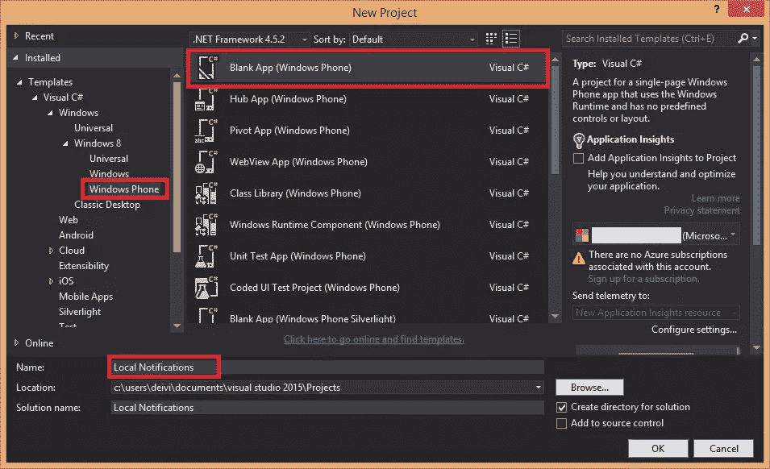
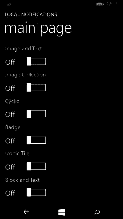
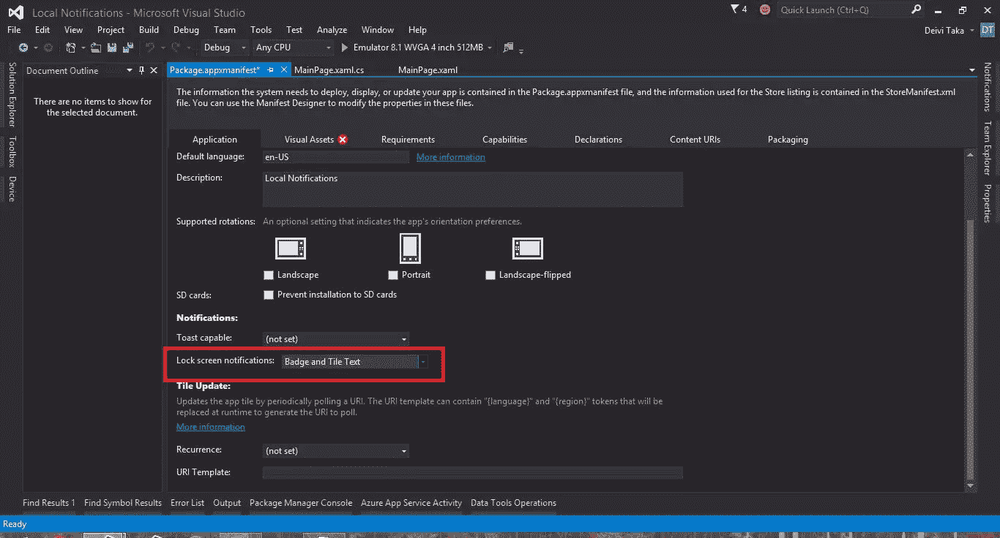
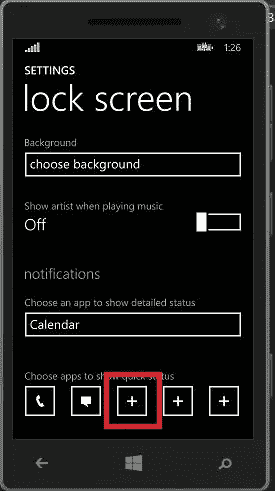
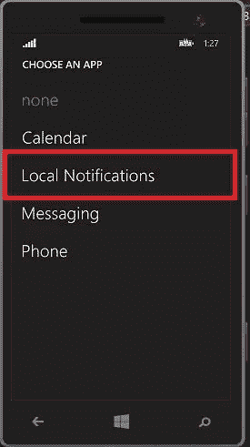
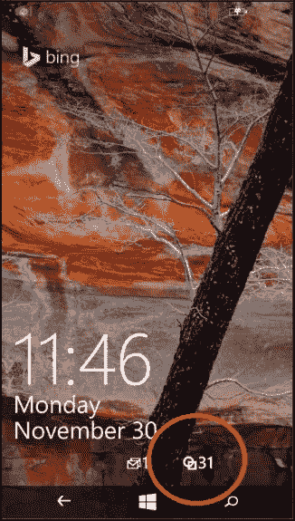
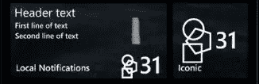

# 使用 Windows Phone 应用中的通知更新用户

> 原文：<https://www.sitepoint.com/updating-users-with-notifications-in-windows-phone-apps/>

应用程序可以通过不同的方式与用户互动。Windows Phone 有一种独特的方式通过磁贴和徽章提供最新信息，即使应用程序没有运行。这节省了电池，并且是用户友好的体验。无论是新的电子邮件、未接来电、日历中的特殊事件、联系人列表中的照片，还是您的个人照片，Windows Phone 的设计都可以让您轻松地知道有新的东西到来。在本文中，我将展示如何在您的应用程序中实现这些通知。

你可以从 [GitHub](https://github.com/sitepoint-editors/Local-Notifications) 下载完整的项目。

首先，在 Visual Studio 中创建一个新项目，从列表中选择 *Windows Phone* 并命名该项目。



打开 *MainPage.xaml* 并在网格标签中添加以下代码。

```
<ScrollViewer Margin="0,0,0,-1">
    <StackPanel>
        <StackPanel>
            <TextBlock FontSize="20" Text="Image and Text"/>
            <ToggleSwitch x:Name="ImageAndText" HorizontalAlignment="Left" Margin="0,0,0,10"/>
        </StackPanel>
        <StackPanel>
            <TextBlock FontSize="20" Text="Image Collection"/>
            <ToggleSwitch x:Name="ImageCollection" HorizontalAlignment="Left" Margin="0,0,0,10"/>
        </StackPanel>
        <StackPanel>
            <TextBlock FontSize="20" Text="Cyclic"/>
            <ToggleSwitch x:Name="Cyclic" HorizontalAlignment="Left" Margin="0,0,0,10"/>
        </StackPanel>
        <StackPanel>
            <TextBlock FontSize="20" Text="Badge"/>
            <ToggleSwitch x:Name="Badge" HorizontalAlignment="Left" Margin="0,0,0,10" FontFamily="Global User Interface"/>
        </StackPanel>
        <StackPanel>
            <TextBlock FontSize="20" Text="Iconic Tile"/>
            <ToggleSwitch x:Name="IconicTile" HorizontalAlignment="Left" Margin="0,0,0,10"/>
        </StackPanel>
        <StackPanel>
            <TextBlock FontSize="20" Text="Block and Text"/>
            <ToggleSwitch x:Name="BlockAndText" HorizontalAlignment="Left" Margin="0,0,0,10"/>
        </StackPanel>
    </StackPanel>
</ScrollViewer>
```

设计视图现在应该如下所示:



您将看到一个触发开关列表，它将激活我们的通知。现在来添加使事情发生的代码。

## 开始之前

为了简化接下来的步骤，我们将一些名称空间导入到 *MainPage.xaml.cs* 中。

```
using Windows.UI.StartScreen;
using Windows.Data.Xml.Dom;
using Windows.UI.StartScreen;
using Windows.UI.Xaml;
```

在`MainPage`类中声明这些全局变量，并不是所有的都会马上被使用。

```
private XmlDocument tileXml;
private XmlElement tileImage;
private XmlNodeList tileList;
private TileNotification notif;
SecondaryTile imageTile, blockTile, badgeTile, iconicTile, cyclicTile;
```

我们需要为应用程序的主图块启用通知队列。请在构造函数中执行此操作，以便在创建页面时执行代码。

```
TileUpdateManager.CreateTileUpdaterForApplication().EnableNotificationQueueForSquare150x150(true);
                    TileUpdateManager.CreateTileUpdaterForApplication().EnableNotificationQueueForWide310x150(true);
```

我已经将应用程序固定到开始菜单，并将其重新调整为宽尺寸(310×150)。然后，我以编程方式为每个模板添加了一个辅助方形图块。我建议您也这样做，因为我们将在宽的和正方形的磁贴上测试通知，这样可以节省测试期间重新调整它们的大小以查看差异的时间。

## 次要瓷砖

我将首先介绍辅助图块，因为我们将在后面的步骤中使用它们。它们与固定在“开始”菜单上的图块相同，只是它们是以编程方式创建的。我们可以创建多个图块，为它们分配不同的 id，然后分别更新它们。在 Windows Phone 8.1 中，我们只能添加 150×150 像素的方块。

为了创建第二个图块，使用了来自`StartScreen`名称空间的同名类。这些对象是通过下面的构造函数创建的。

```
SecondaryTile.SecondaryTile(string tileId, string displayName, string arguments, Uri logoReference, TileSize tileSize);
```

为了将磁贴固定到开始菜单上，我们调用异步方法`SecondaryTile.RequestCreateAsync();`，该方法返回一个布尔值来判断磁贴是否已经成功固定。移除一个固定的图块就像调用`SecondaryTile.RequestDeleteAsync();`一样简单

## 翻转瓷砖

这种牌类型在游戏中很常见。如果您将应用程序固定到“开始”菜单，磁贴将更新排行榜信息、成就或其他特定于游戏的信息。

在 *MainPage.xaml* 的设计视图中，双击`ImageAndText`切换开关会添加被切换的事件监听器，并会将你带到*。cs* 文件创建一个新方法，我们将在其中添加我们的代码。首先，我们需要检查触发事件的开关是开还是关，以执行正确的操作，一个简单的`if else`语句就足够了。注意添加了`async`关键字来支持异步调用。

```
private async void ImageAndText_Toggled(object sender, RoutedEventArgs e)
{
    if (ImageAndText.IsOn)
    {
    }
    else
    {
    }
}
```

如果开关打开，我就创建一个二级磁贴，如上所述，并将其固定在开始菜单上。我在项目中添加了五个彩色矩形，每个矩形有两种尺寸。在这种情况下，图块将使用蓝色矩形作为图像。

```
imageTile = new SecondaryTile(
"ImageAndText",
"Image and Text",
"Arguments",
new Uri("ms-appx:///Assets/blue.150x150.png", UriKind.Absolute),
TileSize.Square150x150);
await imageTile.RequestCreateAsync();
```

如果开关关闭，我们必须移除固定的图块，在`else`块中添加以下行。

```
await imageTile.RequestDeleteAsync();
```

如果你现在运行应用程序并打开图像和文本开关，你会看到两个并排的磁贴。第一个是宽的，名为*本地通知*，第二个是方的，名为*图像和文本*。我们尚未添加任何通知。

通知模板在`xml`中，但是可以通过代码生成。这是我们将使用的模板。

```
<tile>
    <visual version="2">
        <binding template="TileSquare150x150PeekImageAndText01" fallback="TileSquarePeekImageAndText01">
            <image id="1" src="" />
            <text id="1"></text>
            <text id="2"></text>
            <text id="3"></text>
            <text id="4"></text>
        </binding>
    </visual>
</tile>
```

接下来我们从`TileUpdateManager`得到这个模板。你可能会注意到有很多其他的`TileTemplateType`可用，既用于 Windows 也用于 Windows Phone。

```
tileXml = TileUpdateManager.GetTemplateContent( TileTemplateType.TileSquare150x150PeekImageAndText01 );
```

在 xml 代码中，有一个图像标记缺少源，四个文本标记缺少文本。我们可以从任何 xml 元素的标记名中获取它，然后设置我们需要的属性。`GetElementsByTagName(string)`函数返回一个包含文档中所有元素的`XmlNodeList`。让我们为图像和文本添加属性。

```
tileImage = tileXml.GetElementsByTagName("image")[0] as XmlElement;
tileImage.SetAttribute("src", "ms-appx:///Assets/blue.150x150.png");

tileList = tileXml.GetElementsByTagName("text");
(tileList[0] as XmlElement).InnerText = "Header text";
(tileList[1] as XmlElement).InnerText = "First line of text";
(tileList[2] as XmlElement).InnerText = "Second line of text";
(tileList[3] as XmlElement).InnerText = "Third line of text";
```

基于这个 xml 模板，我们创建一个`TileNotification`并将其添加到`TileUpdateManager`中，后者负责更改或更新瓦片。

```
notif = new TileNotification(tileXml);
TileUpdateManager.CreateTileUpdaterForSecondaryTile(imageTile.TileId).Update(notif);
```

辅助图块更新现已完成。我们也将更新小的变化宽瓷砖。首先，我们得到宽瓷砖的模板。

```
tileXml = TileUpdateManager.GetTemplateContent( TileTemplateType.TileWide310x150PeekImage02 );
```

图像的源被设置为宽的蓝色矩形。

```
tileImage.SetAttribute("src", "ms-appx:///Assets/blue.310x150.png");
```

宽瓷砖的模板有一个额外的文本行，我们也可以为其添加属性。

```
(tileList[4] as XmlElement).InnerText = "Fourth line of text";
```

最后，我们更新主图块。

```
TileUpdateManager.CreateTileUpdaterForApplication().Update(notif);
```

当开关关闭时，图块更新被清除:

```
TileUpdateManager.CreateTileUpdaterForApplication().Clear();
```

在 github 上的示例项目中，代码在每种情况下都重复，这样效率不高，但是可以更清楚地显示每个通知。

运行应用程序，打开第一个开关。您应该在开始菜单中看到这个。


## 像瓷砖一样循环

如果你看照片磁贴，你的个人照片会随着[本·伯恩斯效应](https://en.wikipedia.org/wiki/Ken_Burns_effect)慢慢循环切换。这被称为“周期瓷砖”。在 Windows Phone 8.1 中，这个磁贴不再可用，但我们可以做类似的事情。一种方法是将图片添加到一个队列中，该队列将随着翻转效果而切换，但移动将会丢失。

按照我们之前的方式创建一个新的辅助图块。

```
cyclicTile = new SecondaryTile(
"Cyclic",
"Cyclic",
"Arguments",
new Uri("ms-appx:///Assets/blue.150x150.png", UriKind.Absolute),
TileSize.Square150x150);
await cyclicTile.RequestCreateAsync();
```

我们需要为这个图块启用通知队列，就像我们对主图块所做的那样。

```
TileUpdateManager.CreateTileUpdaterForSecondaryTile(cyclicTile.TileId).EnableNotificationQueueForSquare150x150(true);
```

使用`TileSquare150x150Image`模板更新单幅图块，仅更改图像源。

```
tileImage = tileXml.GetElementsByTagName("image")[0] as XmlElement;

tileImage.SetAttribute("src", "ms-appx:///Assets/blue.150x150.png");
notif = new TileNotification(tileXml);
TileUpdateManager.CreateTileUpdaterForSecondaryTile(cyclicTile.TileId).Update(notif);

tileImage.SetAttribute("src", "ms-appx:///Assets/red.150x150.png");
notif = new TileNotification(tileXml);
TileUpdateManager.CreateTileUpdaterForSecondaryTile(cyclicTile.TileId).Update(notif);

// Repeat for orange, green, and yellow
```

同样，使用`TileWide310x150Image`作为模板类型更新宽图块。下面的 gif 显示了瓷砖的外观。


## 徽章

计数器或“徽章”通常用于显示通知的数量。它可以是一个字形，但在 Windows Phone 中仅限于一个*警告*和*注意*符号。我们将在次要图块中使用字形，在主要图块中使用带有数字的徽章。

在创建并固定一个新的图块之后，我们从`BadgeUpdateManager`类生成 xml。

```
tileXml = BadgeUpdateManager.GetTemplateContent(BadgeTemplateType.BadgeGlyph);
```

xml 只包含一个标签:`<badge value=""/>`。接下来设置字形的值。

```
tileImage = tileXml.SelectSingleNode("/badge") as XmlElement;
tileImage.SetAttribute("value", "alert");
```

从该模板创建一个新的`BadgeNotification`并更新图块。

```
BadgeNotification badgeNotification = new BadgeNotification(tileXml);        BadgeUpdateManager.CreateBadgeUpdaterForSecondaryTile(badgeTile.TileId).Update(badgeNotification);
```

宽平铺以类似的方式更新。

```
tileXml = BadgeUpdateManager.GetTemplateContent( BadgeTemplateType.BadgeNumber );
tileImage = tileXml.SelectSingleNode("/badge") as XmlElement;
tileImage.SetAttribute("value", "31");
badgeNotification = new BadgeNotification(tileXml);
BadgeUpdateManager.CreateBadgeUpdaterForApplication().Update(badgeNotification);
```

当用户打开应用程序时，我们可能希望通过将该函数添加到 toggle 事件处理程序来清除该通知。

```
BadgeUpdateManager.CreateBadgeUpdaterForApplication().Clear();
```

运行应用程序以查看结果。


黑色圆圈可能一开始看起来令人失望，但不要放弃他们，徽章有更多的意义。

## 锁屏通知

当手机被锁定，用户按下电源按钮，他们可以立即看到他们选择的应用程序的通知。我们也可以为我们的应用程序启用这个功能，以防用户没有在开始菜单上显示磁贴。

打开项目的 *package.appxmanifest* ，在*锁屏通知*中选择*徽章和磁贴文字*。



“视觉资产”选项卡中将出现一个红色标记，因为我们需要添加一个徽章徽标。点击选项卡，在左侧窗格中选择*徽章标志*。您最多可以上传三种不同的尺寸:58×58、33×33 和 24×24。标志最好是白色透明背景。选择徽标并保存更改。


我们可能已经在我们的应用程序中添加了通知功能，但用户可以选择是启用它们还是在开始屏幕中添加磁贴。要启用应用程序通知，打开*设置- >锁屏*。默认情况下，至少应该已经选择了电话和消息。按下 *+* 按钮，添加另一个应用程序。



这将显示提供锁屏通知的应用列表，选择我们的应用并继续。



如果您锁定屏幕，徽章通知仍然打开，您现在应该会看到我们应用程序的 31 个新通知。



## 标志性瓷砖

徽章的最后一种形式是“图标瓷砖”。一个例子是邮件标题，给出新收到的邮件的信息，发件人，时间，在右下角，一个小图标显示你有多少未读邮件。

首先，我们需要向项目资产添加一个图标。对于宽拼贴，应该是 70×110 像素，对于正方形拼贴，应该是 130×202 像素。

瓷砖后面的代码也有同样的逻辑。创建一个新的辅助区块，并向其添加一个徽章。我们需要一个数字显示在图标旁边，这将是我们在徽章上设置的数字。然后获取 xml 代码来生成一个`TileNotification`。

```
tileXml = TileUpdateManager.GetTemplateContent(TileTemplateType.TileSquare150x150IconWithBadge);
tileImage = tileXml.GetElementsByTagName("image")[0] as XmlElement;
tileImage.SetAttribute("src", "ms-appx:///Assets/icon.130x202.png");

notif = new TileNotification(tileXml);
TileUpdateManager.CreateTileUpdaterForSecondaryTile(iconicTile.TileId).Update(notif);
```

对 wide tile 进行同样的操作，但是 xml 模板有三个需要添加属性的文本标签。

```
tileList = tileXml.GetElementsByTagName("text");
(tileList[0] as XmlElement).InnerText = "Header text";
(tileList[1] as XmlElement).InnerText = "First line of text";
(tileList[2] as XmlElement).InnerText = "Second line of text";
```

应该是这样的。



## 块和文本模板

我想展示的最后一个例子是日历磁贴更新。对于特殊事件，它会更新事件名称及其持续时间。

有一个用于方形图块的特定模板和两个用于宽图块的模板。创建第二个图块后，获取 xml 模板。它有两个文本标签来添加属性，在本例中是月份和日期。

```
tileXml = TileUpdateManager.GetTemplateContent( TileTemplateType.TileSquare150x150Block );

tileList = tileXml.GetElementsByTagName("text");
(tileList[0] as XmlElement).InnerText = "28";
(tileList[1] as XmlElement).InnerText = "Nov";
```

对于宽图块，有一个或两个额外的文本标签，这取决于您可以添加事件信息的模板。

```
tileXml = TileUpdateManager.GetTemplateContent( TileTemplateType.TileWide310x150BlockAndText01 );

tileList = tileXml.GetElementsByTagName("text");
(tileList[0] as XmlElement).InnerText = "28";
(tileList[1] as XmlElement).InnerText = "Nov";
(tileList[2] as XmlElement).InnerText = "Indipendence Day of Albania";
```

当你将`TileNotifications`添加到每块瓷砖上时，你应该会得到相似的结果。


## 结论

磁贴是通知用户应用程序中有新活动的好方法。在这篇文章中，我展示了一些最常见的磁贴更新，基于 Windows 应用程序使用的现有类型。Windows Phone 8.1 和更高版本改变了这些磁贴的实现方式，所以我希望我的解释足够清楚。

感谢您抽出时间。愿代码与你同在！

## 分享这篇文章