# 我最喜欢的一些 Visual Studio 扩展

> 原文：<https://www.sitepoint.com/favorite-visual-studio-extensions/>

本文是微软网站开发系列的一部分。感谢您对使 SitePoint 成为可能的合作伙伴的支持。

我最近写了一篇关于我最喜欢的 Chrome 扩展的文章，部分原因是因为我想分享一些我觉得运行良好的东西，但也因为我想了解其他人也在使用什么。基于这些建议，我在日常使用中添加了相当多的扩展，现在我想对 Visual Studio 做同样的事情。

我的大部分编程时间都花在了[Visual Studio 2015 Community edition](https://www.visualstudio.com/en-us/products/visual-studio-community-vs.aspx/?WT.mc_id=16533-DEV-sitepoint-article69)上，微软基本上免费提供了 VS Professional，并将其重新命名为一种基于订阅的体验，提供了虚拟化和 Azure 云计算等额外的好处(我被告知即将推出，请回来查看): [Visual Studio 开发基础](https://www.visualstudio.com/en-us/products/visual-studio-dev-essentials-vs.aspx/?WT.mc_id=16533-DEV-sitepoint-article69)。其中一些扩展真的让我的生活变得更容易，所以我想强调一下它们。

<video class="wp-video-shortcode" id="video-120159-2" width="640" height="370" preload="metadata" controls=""><source type="video/mp4" src="https://sec.ch9.ms/ch9/7546/2721a9e4-b6b2-42fd-8518-8608f3767546/FavVSExtensions_mid.mp4?_=2">[https://sec.ch9.ms/ch9/7546/2721a9e4-b6b2-42fd-8518-8608f3767546/FavVSExtensions_mid.mp4](https://sec.ch9.ms/ch9/7546/2721a9e4-b6b2-42fd-8518-8608f3767546/FavVSExtensions_mid.mp4)</video>

加入 Reddit 上的对话。

## 代码对齐

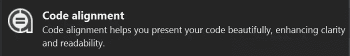

它确实做到了它所说的——为你调整你的代码。这听起来可能不多，但是当整天使用 JavaScript 之类的语言工作时，在这种情况下，一切都是松散类型的，您很容易出错。正因为如此，我对排列代码的方式非常小心，这样我就可以很容易地发现错误。一个以前的同事教了我这个，当我开始从事更大的项目，尤其是和其他人一起工作时，它被证明是非常宝贵的。

当然，这可能需要更多的时间来整理一切，但是您可以更快地调试和发现错误，从而从长远来看节省您的时间。这样，您可以通过一个预定义的选项进行对齐，或者通过您选择的字符随时对齐。

下面是它在 VS 工具栏中的样子:

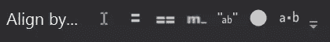

如果我点击 **Align by…** 文本，会出现一个对话框，我可以输入我想要对齐的字符。使用冒号分隔的键值对时非常有用。

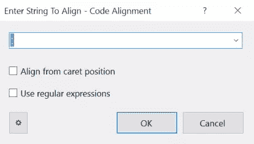

下面是我在自己的代码中使用的一个例子:

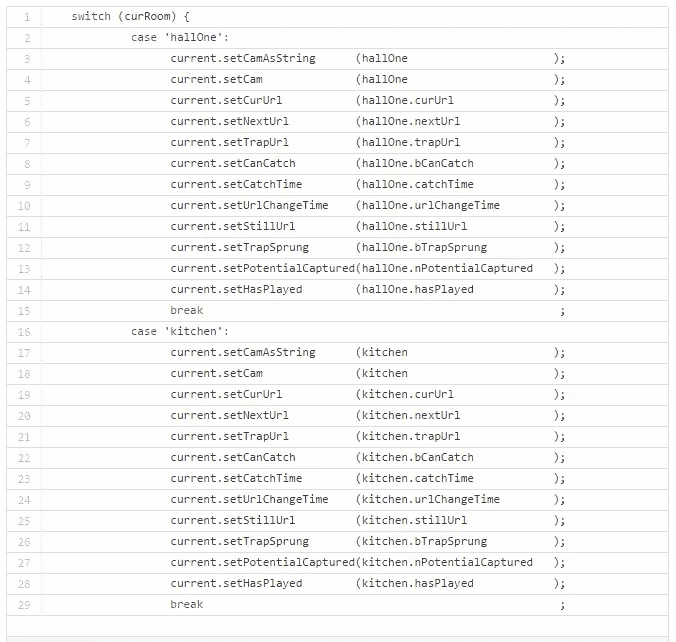

[switch.js](https://gist.github.com/anonymous/3afe229325e29363d29d#file-switch-js) 由 [GitHub](https://github.com/) | [view raw](https://gist.github.com/anonymous/3afe229325e29363d29d/raw/41f08b5370ff6a2c8aa9088af7f718634d3e927d/switch.js) 主持

这不是很容易读懂吗？这是另一个例子，我使用了 **Align by…** 对话:

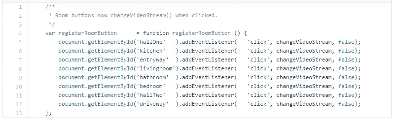

[变化。VideoStream.js](https://gist.github.com/anonymous/581fa1f7b50fe844b448#file-changevideostream-js) 主持 [GitHub](https://github.com/) | [view raw](https://gist.github.com/anonymous/581fa1f7b50fe844b448/raw/ae1729ab8b7888ea3fd085189745945252e76a82/changeVideoStream.js)

## 雷沙尔珀

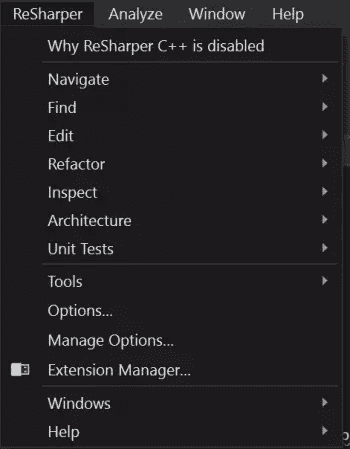

没有 ReSharper 我会在哪里？这些年来，这个东西帮了我很多，真的帮助我学习如何编码。这是单子上唯一一个不免费的，但我发现它物有所值。

ReSharper 不仅限于帮助你的 C#代码，因为它确实捕捉到了我在 JavaScript 中的一些问题，但它也有能力与 C++一起工作。我想到的一个好处是，它强调了这样一个事实:我在一个类中包含了几个使用语句,但实际上我并没有使用。为什么要用我不使用的东西来扰乱我的智能感知？

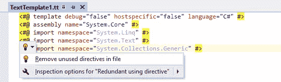

更有用的是，ReSharper 可以告诉我代码是否可以重构，或者是否有更简洁的方式来编写代码。我已经多次使用这种方法，它真的帮助我理解了如何编写更干净的代码。

在 JavaScript 方面，它可以指出我何时声明了变量，但从未使用过它们。

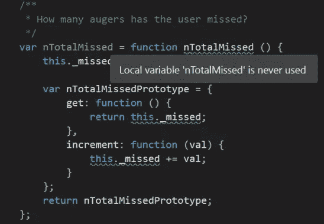

它还能在我声明一个对象之前告诉我什么时候使用它:

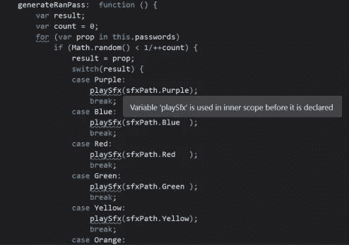

它甚至能发现重复的声明:

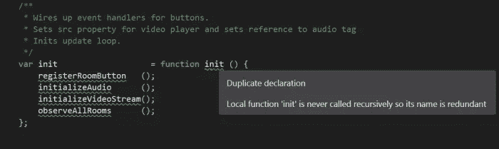

不过在这种情况下，我故意声明了两次。它是一个名为`init`的变量，覆盖了函数`init`的名字，但是指向同一个对象，所以它的引用是一样的。我这样做[是因为加入了 JavaScript](https://www.sitepoint.com/demystifying-javascript-variable-scope-hoisting/) ，也是为了让函数更容易调试。

## 打开命令行

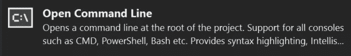

这个非常简单，但是因为我经常从项目中打开命令行来做一些事情，比如 git 操作，所以它允许我从 Visual Studio 解决方案窗口中进行操作。

简单的右击任何文件或文件夹，选项**打开命令行**出现。更好的是，我可以从这里访问 PowerShell！

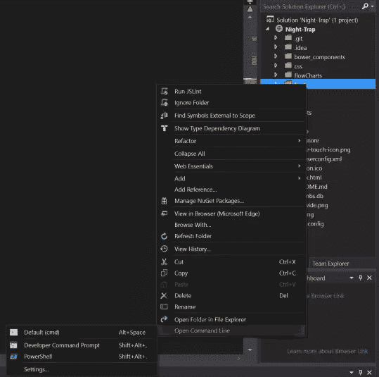

## JSLint.Net 视觉工作室

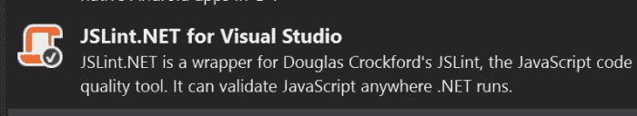

大家最喜欢的 linter 来 Visual Studio。对于那些不熟悉 JSLint 的人来说，它本质上是 JSHint，但是有非常严格的规则，甚至阻止您编译项目。JSHint 基本上是在暗示你说*“嘿，我不认为你想这样写你的 JavaScript 这不是一个最佳实践，并且可能导致潜在的错误。”*

比如用`==`代替`===`进行类型强制。

```
 if ( nMyNumber == 1 ) {
  DoSomething();
} 
```

这将阻止你编译，因为这将建议使用`===`来确定你正在寻找的实际上是一个双精度值，而不是一个可以被强制为数字的字符串。

在编写代码时，这是让你和你的团队在风格上保持一致的一个极好的方法。如果设置对您自己的口味来说过于严格，您也有很多选项可以调整。

## 网络基础 2015

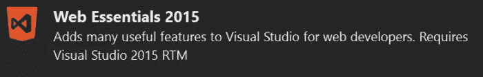

如果您在 Visual Studio 中编写任何类型的 web 代码，那么这是必备的。它提供了大量的功能，使您的生活更加轻松，包括**浏览器链接**，它允许浏览器和 Visual Studio 之间的实时通信，这样您就可以从 VS 中调试前端 web 代码。现在，您可以从浏览器的调试工具或 VS 中对 HTML 或 CSS 进行更改，这些更改可以在浏览器中立即看到，也可以保存。

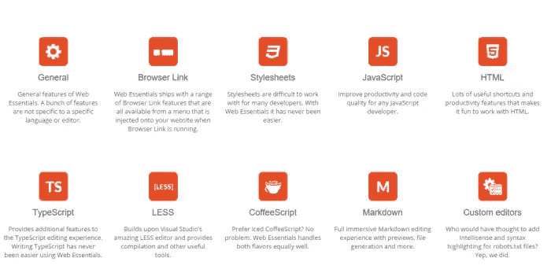

你不再需要在浏览器的调试器中调整你的 CSS 直到一切正常，记住你所做的更改，并在你的 IDE 中重新编写它们。现在，你写一次就可以了，到处都有保存。

这篇博客文章对这种扩展所带来的好处进行了更深入的探讨。

## 您使用的是哪种扩展？

在不久的将来，我会继续写第二篇文章，但是现在我认为这是使用 Visual Studio 的人们的一个很好的起点。我很想知道你正在使用哪些扩展，所以让我知道下面，我会给他们一个尝试！

## 更多的 Web 开发实践

这篇文章是微软布道者和工程师关于实用 JavaScript 学习、开源项目和互操作性最佳实践的 web 开发系列的一部分，包括[微软 Edge](http://blogs.windows.com/msedgedev/2015/05/06/a-break-from-the-past-part-2-saying-goodbye-to-activex-vbscript-attachevent/?WT.mc_id=16533-DEV-sitepoint-article69) 浏览器和新的 [EdgeHTML 渲染引擎](http://blogs.windows.com/msedgedev/2015/02/26/a-break-from-the-past-the-birth-of-microsofts-new-web-rendering-engine/?WT.mc_id=16533-DEV-sitepoint-article69)。

我们鼓励您在 dev.microsoftedge.com 使用免费工具进行跨浏览器和设备测试，包括 Windows 10 的默认浏览器 Microsoft Edge:

*   [扫描你的网站，寻找过时的库、布局问题和可访问性](http://dev.modern.ie/tools/staticscan/?utm_source=SitePoint&utm_medium=article69&utm_campaign=SitePoint)
*   [下载适用于 Mac、Linux 和 Windows 的免费虚拟机](http://dev.modern.ie/tools/vms/windows/?utm_source=SitePoint&utm_medium=article69&utm_campaign=SitePoint)
*   [跨浏览器检查网络平台状态，包括微软 Edge 路线图](https://dev.modern.ie/platform/status/?utm_source=SitePoint&utm_medium=article69&utm_campaign=SitePoint)
*   [在您自己的设备上远程测试 Microsoft Edge](https://remote.modern.ie/?utm_source=SitePoint&utm_medium=article69&utm_campaign=SitePoint)

**向我们的工程师和传道者进行更深入的学习:**

*   **互操作性最佳实践** ( [系列](https://channel9.msdn.com/Blogs/BeLux-Developer/Riding-the-Modern-Web-5-things-to-consider-as-a-web-developer/?WT.mc_id=16533-DEV-sitepoint-article69)):
    *   [如何避免浏览器检测](https://channel9.msdn.com/Blogs/BeLux-Developer/Riding-the-Modern-Web-Avoiding-Browser-Detection/?WT.mc_id=16533-DEV-sitepoint-article69)
    *   [使用 CSS 前缀的最佳实践](https://channel9.msdn.com/Blogs/BeLux-Developer/Riding-the-Modern-Web-CSS-Vendor-Prefixes/?WT.mc_id=16533-DEV-sitepoint-article69)
    *   [保持你的 JS 框架&库更新](https://channel9.msdn.com/Blogs/BeLux-Developer/Riding-the-Modern-Web-Dealing-with-JavaScript-Libraries/?WT.mc_id=16533-DEV-sitepoint-article69)
    *   [构建插件免费网络体验](https://channel9.msdn.com/Blogs/BeLux-Developer/Riding-the-Modern-Web-Dealing-with-Plugins/?WT.mc_id=16533-DEV-sitepoint-article69)
*   [GitHub 编码实验室:跨浏览器测试和最佳实践](https://github.com/deltakosh/interoperable-web-development/?WT.mc_id=16533-DEV-sitepoint-article69)
*   哇，我可以在 Mac 电脑上测试 Edge & IE 浏览器& Linux！(来自雷伊·班戈)
*   [在不破坏网络的情况下推进 JavaScript】(来自 Christian Heilmann)](http://channel9.msdn.com/Events/WebPlatformSummit/2015/Advancing-JavaScript-without-breaking-the-web/?WT.mc_id=16533-DEV-sitepoint-article69)
*   [用 WebGL 释放 3D 渲染](https://channel9.msdn.com/Events/WebPlatformSummit/2015/Unleash-3D-rendering-with-WebGL-and-Microsoft-Edge/?WT.mc_id=16533-DEV-sitepoint-article69)(来自 David Catuhe)
*   托管网络应用和网络平台创新

**我们的社区开源项目:**

*   伏龙。JS (跨设备远程 JavaScript 测试)
*   [manifoldJS](http://manifoldjs.com/?WT.mc_id=16533-DEV-sitepoint-article69) (部署跨平台托管的 web 应用)
*   [babylonJS](http://babylonjs.com/?WT.mc_id=16533-DEV-sitepoint-article69) (轻松制作 3D 图形)

**更多免费工具和后端 web 开发工具:**

*   [Visual Studio 代码](https://code.visualstudio.com/?WT.mc_id=16533-DEV-sitepoint-article69)(用于 Mac、Linux 或 Windows 的轻量级代码编辑器)
*   [Visual Studio 开发基础知识](https://www.visualstudio.com/en-us/products/visual-studio-dev-essentials-vs.aspx/?WT.mc_id=16533-DEV-sitepoint-article69)(基于订阅的免费培训和云优势)
*   [用节点编码。JS](https://www.microsoftvirtualacademy.com/en-US/training-courses/building-apps-with-node-js-jump-start-8422/?WT.mc_id=16533-DEV-sitepoint-article69) 与[在蔚蓝云上试用](https://azure.microsoft.com/en-us/pricing/free-trial/?WT.mc_id=16533-DEV-sitepoint-article69)

## 分享这篇文章