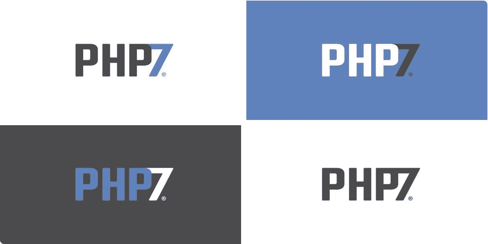

# 学习 PHP 7，了解新特性，等等

> 原文：<https://www.sitepoint.com/learn-php-7-find-out-whats-new-and-more/>

世界上最流行的编程语言的下一个版本 PHP 7 已经发布。我们喜欢放烟火，沉醉于我们新发现的力量(说真的，语言现在是真正的大联盟，功能性和性能方面的[】,但我们确信互联网的其他部分会为我们做这些。相反，我们将专注于编制一个(永远最新的)资源列表，以开始使用版本 7——描述新功能的帖子、帮助您开始工作的书籍等等。我们开始吧！](https://www.youtube.com/watch?v=bzkRVzciAZg)



## PHP 6 怎么了？

当被告知下一个主要版本是 7，而我们到目前为止一直在 5+上开发时，许多人想知道版本 6 发生了什么。这是一个很长的故事，所以为了避免提起这个话题时看起来很困惑，这里有一些有趣的讨论和帖子是必读的:

*   [https://Phil sturgeon . uk/PHP/2014/07/23/neverning-muppet-debate-of-PHP-6-v-PHP-7/](https://philsturgeon.uk/php/2014/07/23/neverending-muppet-debate-of-php-6-v-php-7/)
*   [https://wiki.php.net/rfc/php6](https://wiki.php.net/rfc/php6)
*   [https://news.ycombinator.com/item?id=8786919](https://news.ycombinator.com/item?id=8786919)

简而言之，本应在版本 6 中解决的 unicode 问题最终失败了，增加了太多的复杂性，这对每个人都是一种破坏。人们认为第 6 版的声誉受损太严重，无法维持下去，于是转向了 PHP 7。

## 新功能

在之前，我们已经简要地介绍了新特性[，但是这里有一个更全面的关于它们的信息的链接列表——现在是开始并做好准备的时候了。](https://www.sitepoint.com/php7-resource-recap/)

[了解](https://www.sitepoint.com/how-to-learn-quickly/)即将发生的事情及其可能对你产生的影响:

*   [新功能官方列表](http://php.net/manual/en/migration70.new-features.php)
*   [Github 上的超级综合榜单](https://github.com/tpunt/PHP7-Reference)
*   [期待什么系列](https://blog.engineyard.com/2015/what-to-expect-php-7)
*   [PHP7 一览](http://devzone.zend.com/4693/php-7-glance/)
*   [数字海洋的新功能](https://www.digitalocean.com/company/blog/getting-ready-for-php-7/)
*   科林·奥戴尔的 5 个鲜为人知的特性，只是他的中几个非常有用的 [PHP 7 帖子中的一个](http://www.colinodell.com/tags/php-7)

如果你喜欢视频课程，并且不介意付费，有两个网站基本上介绍了相同的内容:

*   code course at[https://www . code course . com/library/lessons/PHP-7-new-features](https://www.codecourse.com/library/lessons/php-7-new-features)
*   https://laracasts.com/series/php7-up-and-running 的拉腊卡斯特

了解类型系统，可以说是最大的变化，以及它与 hack 的比较:

*   [http://www . dmiller . io/blog/2015/4/26/comparisng-the-PHP 7-and-hack-type-systems](http://www.dmiller.io/blog/2015/4/26/comparing-the-php7-and-hack-type-systems)
*   [https://medium . com/the-white-hat-elephant/PHP 7-more-strict-but-only-if-you-want-it-be-78d 6690 f 2090](https://medium.com/the-white-hat-elephpant/php7-more-strict-but-only-if-you-want-it-to-be-78d6690f2090)

## PHP 7 入门

*   如果你不是 VM 类的，要在最新版本的 OS X 上安装 PHP 7，请参见[http://php-osx.liip.ch/](http://php-osx.liip.ch/)
*   然而，如果你是，有[Jump Start PHP Environment](http://www.amazon.com/Jump-Start-Environment-Bruno-Skvorc/dp/0994182643)——一本由德高望重的[罗斯·塔克](http://rosstuck.com)编辑和评论的真正属于你的书。这是一本关于在代码之前开始*的简短书籍——学习关于请求、响应、虚拟机以及所有其他重要的服务器和本地开发机器设置。这本书帮助你准备编写平台无关的代码，并使其他人有可能在突发奇想时加入你的团队。*
*   Zend 的付费入门课程——适合那些熟悉 PHP 5 并且不介意花点钱的人
*   [来自 5.x 的官方迁移指南](http://php.net/manual/en/migration70.php)
*   [Erika 在 DigitalOcean 上的精彩帖子](https://www.digitalocean.com/company/blog/getting-ready-for-php-7/)

有各种兼容性检查器和转换器可用:

*   PHP 7 mar(Migration Assistant Report)将报告您当前代码库和 PHP 7 之间的任何不一致，因此您可以计划和预算您的升级路径
*   php7ize 是一个代码修复程序，它试图将 PHP 7 的特性自动添加到 PHP 5 的代码库中
*   php7cc (兼容性检查器)将尝试做与上面的 MAR 相同的事情——比较它们的输出以获得最可靠的结果。

应该注意的是，上面的工具都不能代替一个好的测试套件——100%确定没有留下任何错误的唯一方法是用测试覆盖你的代码，这样在移植过程中可以很容易地检查和验证它。

最后但同样重要的是，PHPToday 整理了一份绝对精彩的演讲清单，你可以在这里看一看。

## 工具、测试和托管

围绕这个新版本已经涌现出许多有用的工具:

*   PhpStorm ，一如既往的领先，已经提供了完整的 PHP 7 模式。

*   Phan 是一个静态分析器，你最好在这里了解一下[的特性。出于好奇，我们即将推出完整的教程。](https://github.com/etsy/phan#features)

*   [Exakat](http://www.exakat.io/) 是另一个分析器

*   Tuli 是另一个——但是发展有些停滞。如果有人想写一篇针对这三者的对比文章，请告诉我们！

*   Andrea Faulds 抛出了一些有趣的 PHP 7 独占包，值得一看！

*   拉斯马斯·勒德尔夫的一个[流浪者](https://www.sitepoint.com/re-introducing-vagrant-right-way-start-php/)盒子是*在多个版本的 PHP 上测试时使用的*盒子，可以从[这里](https://github.com/rlerdorf/php7dev)下载。关于使用它的教程[这里](http://akrabat.com/building-and-testing-php7/)。

*   Travis CI 支持 PHP 7 已经有一段时间了。将一个项目设置为 7-tested 很容易，只需使您的`.travis.yml`文件看起来像这样:

    ```
    language: php

    php:
      - 5.6
      - 7.0
      - hhvm

    # This triggers builds to run on the new TravisCI infrastructure.
    # See: http://docs.travis-ci.com/user/workers/container-based-infrastructure/
    sudo: false

    matrix:
      allow_failures:
        - php: 7.0

    before_script:
      - travis_retry composer self-update
      - travis_retry composer install --no-interaction --prefer-source

    script:
      - phpunit --coverage-text --coverage-clover=coverage.clover

    after_script:
      - if [[ $TRAVIS_PHP_VERSION != 'hhvm' && $TRAVIS_PHP_VERSION != '7.0' ]]; then php vendor/bin/ocular code-coverage:upload --format=php-clover coverage.clover; fi 
    ```

    以上内容的灵感来自于[phple ague skeleton](https://github.com/thephpleague/skeleton)——一个 PHP 7 现成的 skeleton 包，所以如果你是[开始一个新的](https://www.sitepoint.com/starting-new-php-package-right-way/)，那是寻找基线的地方。

*   现在，PHP 7 的托管空间相当少，但是请关注一下[http://phpversions.info/php-7/](http://phpversions.info/php-7/)——随着新信息的到来，列表将会更新。

## 多方面的

对于开发 PHP 7 扩展的资源(扩展 API 有些不同)，[http://gophp7.org/gophp7-ext/](http://gophp7.org/gophp7-ext/)仍然是首选网站。

要加入社区，讨论事情或寻求帮助，以下一些可能会有所帮助，按受欢迎程度排序:

*   在 IRC 上，freenode 上的##php 组将会很有用
*   对于那些喜欢更静态的媒介的人来说， [PHP 子编辑器](http://reddit.com/r/php)可能是一个知识的地方，但也是一个雷区。小心行事。
*   如果你不是 IRC 或 Reddit 的用户，但仍然喜欢现场讨论，有 [PHP Slack 频道](http://murmuring-forest-7062.herokuapp.com/)和 [StackOverflow PHP 聊天室](https://chat.stackoverflow.com/rooms/11/php)
*   要加入一个用户群进行一些离线闲逛，请查看[http://php.ug/](http://php.ug/)

## 结论

有更多资源可以分享吗？让我们知道！付费与否，我们会看看你扔给我们的一切，并可能包括它。

随着 PHP 7 的发布，你打算在近期内转换你的应用程序/包吗？如果没有，为什么？让我们知道你的想法和感受吧！别忘了，没有所有核心贡献者的辛勤工作，新版本是不可能实现的。他们可能并不总是意见一致，但当他们集中资源，朝着共同的目标努力时，前途无量。冠军们，这是给你们的，[感谢](http://devzone.zend.com/6956/php-7-core-contributors-thankyou/)保持网络史诗！

## 分享这篇文章