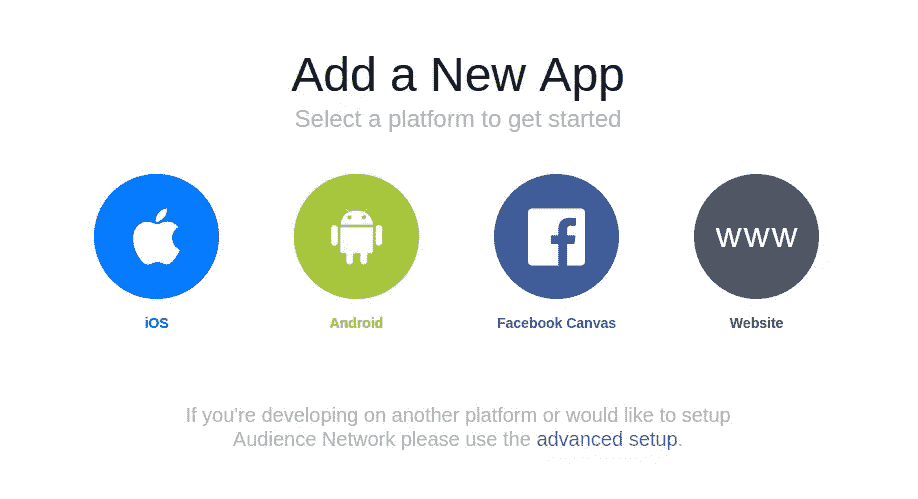
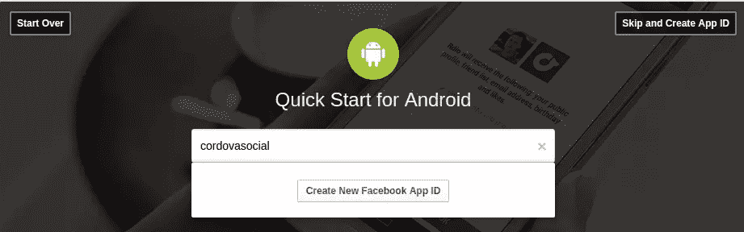
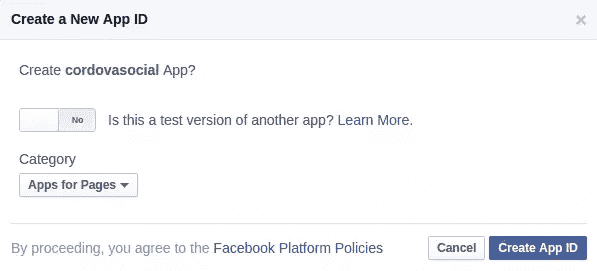
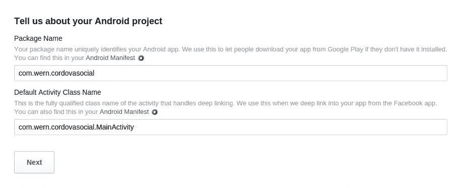
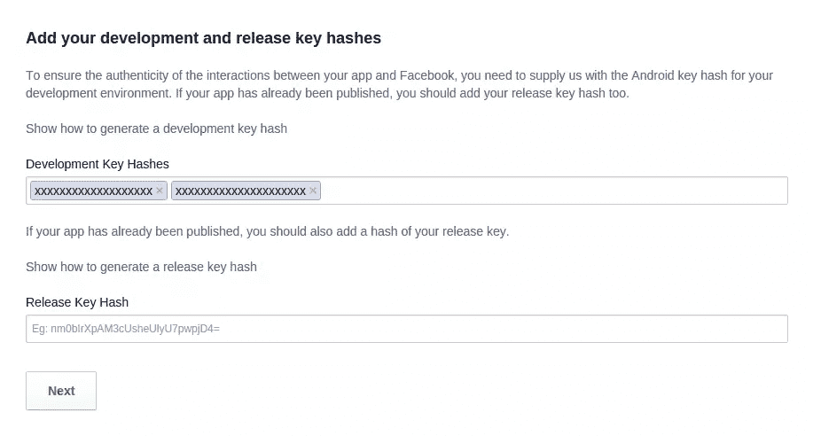
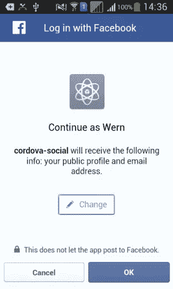
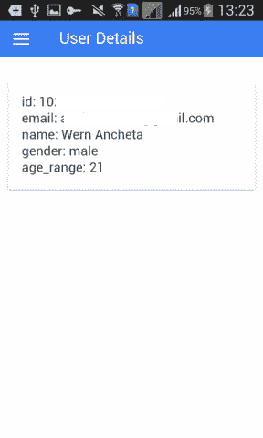
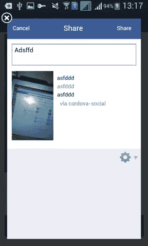
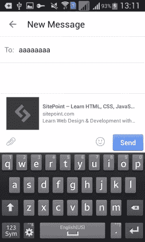

# 在 Cordova 应用程序中使用脸书 API

> 原文：<https://www.sitepoint.com/working-with-the-facebook-api-in-a-cordova-app/>

在本教程中，我们将使用 Cordova 的官方脸书插件创建一个连接到脸书 API 的 Cordova 应用程序。我们将介绍如何登录和注销脸书，使用对话框，以及调用图形 API。请注意，本教程不是为初学者编写的，我将假设您已经将您的机器设置为使用 Cordova 并部署到 Android 设备上。

## 创建脸书应用程序

首先在[脸书开发者网站](https://developers.facebook.com/)上创建一个应用。将鼠标悬停在*我的应用*菜单上，选择*添加新应用*。这将打开一个模式窗口，允许您选择应用程序的平台。在这种情况下，我们将部署到 Android 设备，因此从模式窗口中选择 *Android* 。



输入应用程序的名称，并点击*创建新的脸书应用程序 ID* 按钮。



这将询问您该应用程序是否是现有应用程序的测试版本，将其保留为默认的*否*。另一个选项是类别，为页面选择*应用*，然后点击*创建应用 ID* 按钮。



接下来，您将被要求将脸书 SDK 添加到您的项目中。我们的应用不需要这样做，所以继续向下滚动，直到你找到*告诉我们你的 Android 项目*部分。输入 *com.yourname.appname* 作为包名，然后输入*com . your name . appname . main Activity*作为默认的 activity 类名，替换为适合您的项目的值。



一旦完成，我们需要添加开发和发布密钥哈希。这些验证你的应用程序的真实性，以便脸书确定你是应用程序的作者，对他们的 API 的请求来自你。



在生成散列之前，首先需要一个密钥库。您可以通过在终端窗口中执行以下命令来生成一个。

```
keytool -genkey -v -keystore cordova-social.keystore -alias cordovaSocial -keyalg RSA -keysize 2048 -validity 10000
```

从密钥库中获取哈希:

```
keytool -exportcert -alias androiddebugkey -keystore cordova-social.keystore | openssl sha1 -binary | openssl base64
```

这应该会要求您输入密码。只需使用创建密钥库时使用的相同密码。一旦输入，它应该返回该密钥库的散列。复制并粘贴到开发哈希字段。

点击*下一个*，刷新页面。当你点击*我的应用*菜单时，你的应用现在应该已经列出来了。请注意应用程序 ID，因为我们稍后安装脸书插件时会用到它。

## 构建应用程序

现在我们已经准备好构建应用程序了。使用以下命令安装 Ionic(我们将使用它来创建我们的应用程序):

```
npm install -g ionic
```

创建新的空白应用程序:

```
ionic start your_app_name blank
cd your_app_name
```

添加 android 平台:

```
ionic platform add android
```

### 安装依赖项

接下来，我们需要安装以下插件:

#### 科尔多瓦插件白名单

允许我们控制应用程序可以向哪些域发出请求。

#### Cordova 外挂程式相机

允许我们使用设备摄像头捕捉照片。

#### 文件传输

允许我们将相机插件捕获的照片上传到远程服务器。

**注意**:我们正在使用这个插件的旧版本，因为在撰写本文时，最新版本与当前的 Cordova 版本(5.0.0)不兼容。如果你在将来读到这篇文章，你可能想尝试使用下面的命令:`cordova plugin add cordova-plugin-file-transfer`看看它是否对你有用。否则使用下面的命令。

#### phonegap-Facebook-插件

官方的脸书插件，用于执行脸书 API 的不同操作。

使用以下命令安装插件:

```
cordova plugin add cordova-plugin-whitelist

cordova plugin add cordova-plugin-camera

cordova plugin add org.apache.cordova.file-transfer

cordova plugin add https://github.com/Wizcorp/phonegap-facebook-plugin --variable APP_ID=YOUR_FACEBOOK_APP_ID --variable APP_NAME=YOUR_APP_NAME
```

一旦完成，我们需要安装一个名为[角度本地存储](https://github.com/grevory/angular-local-storage)的前端依赖项。这使我们能够使用本地存储在我们的应用程序中缓存数据。您可以使用以下命令通过 Bower 安装 Angular 本地存储:

```
bower install angular-local-storage --save
```

Ionic 将 Bower 组件安装在 *www/lib* 目录中。打开*可以查看保存位置。项目根目录下的 bowerrc* 文件。

```
{
  "directory": "www/lib"
}
```

### 链接文件

此时，我们将主要在 *www* 目录中工作。打开那个目录下的 index.html 文件*。*

链接到 *ionic.bundle.js* 文件下的 Angular 本地存储脚本。

```
<script src="lib/ionic/js/ionic.bundle.js"></script>

<script src="lib/angular-local-storage/dist/angular-local-storage.min.js"></script>
```

在 *app.js* 文件下面链接以下脚本:

```
<script src="js/app.js"></script>

<!--services-->
<script src="js/services/RequestsService.js"></script>
<script src="js/services/CameraService.js"></script>

<!--controllers-->
<script src="js/controllers/LoginController.js"></script>
<script src="js/controllers/DialogController.js"></script>
<script src="js/controllers/UserDetailsController.js"></script>
```

稍后我将解释这些脚本的作用。服务脚本用于发出 HTTP 请求，并作为摄像机插件的包装器。控制器脚本用于应用程序中的不同页面。

修改`<body>`标签(及其内容),使其具有以下标记。`<ion-nav-view>`是稍后加载不同页面的地方。

```
<body ng-app="starter">
    <ion-nav-view></ion-nav-view>
</body>
```

### 添加页面

打开 *www/js/app.js* 文件，添加`LocalStorageModule`。这允许我们使用`localStorageService`在本地存储器中存储和检索数据。

```
angular.module('starter', ['ionic', 'LocalStorageModule'])
```

在`.run`方法下面，通过调用`config`方法添加 app 配置。这个方法接受一个回调函数，我们传入`$stateProvider`和`$urlRouterProvider`，这样我们就可以为应用程序中的不同页面指定路径。

```
.run(function($ionicPlatform) {
  ...
})

.config(function($stateProvider, $urlRouterProvider) {
  $stateProvider

    .state('app', {
    url: '/app',
    abstract: true,
    templateUrl: 'templates/menu.html',
  })

  .state('app.login', {
    url: '/login',
    views: {
      'menuContent': {
        templateUrl: 'templates/login.html'
      }
    }
  })

  .state('app.post-status', {
    url: '/post-status',
    views: {
      'menuContent': {
        templateUrl: 'templates/post-status.html'
      }
    }
  })

  .state('app.post-photo', {
    url: '/post-photo',
    views: {
      'menuContent': {
        templateUrl: 'templates/post-photo.html'
      }
    }
  })

  .state('app.send-message', {
    url: '/send-message',
    views: {
      'menuContent': {
        templateUrl: 'templates/send-message.html'
      }
    }
  })

  .state('app.user-details', {
    url: '/user-details',
    views: {
      'menuContent': {
        templateUrl: 'templates/user-details.html'
      }
    }
  });
  $urlRouterProvider.otherwise('/app/login');
});
```

破解密码。首先我们有一个抽象状态叫做`app`。这类似于父状态，下面定义的所有其他状态都继承自它。在这种情况下，我们将`templateUrl`设置为`templates/menu.html`，这是主模板的路径，所有的视图都将从主模板继承。

```
.state('app', {
    url: '/app',
    abstract: true,
    templateUrl: 'templates/menu.html',
})
```

在 *www/templates* 目录下创建主模板，命名为【menu.html】T2，添加如下内容。

```
<ion-side-menus>

  <ion-side-menu-content>
    <ion-nav-bar class="bar-positive nav-title-slide-ios7">
      <ion-nav-back-button class="button-clear"><i class="icon ion-ios7-arrow-back"></i> Back</ion-nav-back-button>
    </ion-nav-bar>
    <ion-nav-view name="menuContent" animation="slide-left-right"></ion-nav-view>
  </ion-side-menu-content>

  <ion-side-menu side="left">
    <header class="bar bar-header bar-positive"></header>
    <ion-content class="has-header">
      <ion-list>

        <ion-item nav-clear menu-close href="#/app/login">
         login & logout
        </ion-item>

        <ion-item nav-clear menu-close href="#/app/post-status">
         post status
        </ion-item>

        <ion-item nav-clear menu-close href="#/app/post-photo">
         post photo
        </ion-item>

        <ion-item nav-clear menu-close href="#/app/send-message">
          send message
        </ion-item>

        <ion-item nav-clear menu-close href="#/app/user-details">
         user details
        </ion-item>

      </ion-list>
    </ion-content>
  </ion-side-menu>
</ion-side-menus>
```

这个模板使用`<ion-side-menus>`，它在应用程序的左侧显示一个侧边菜单。默认情况下，它是折叠的，显示一个汉堡菜单。

`<ion-nav-view>`显示当前视图。必须指定`name`属性，因为这是视图绑定的地方。

```
<ion-nav-view name="menuContent" animation="slide-left-right"></ion-nav-view>
```

该模板的主要内容是链接到应用程序中不同页面的菜单项列表。

```
<ion-content class="has-header">
  <ion-list>

    <ion-item nav-clear menu-close href="#/app/login">
     login & logout
    </ion-item>

    <ion-item nav-clear menu-close href="#/app/post-status">
     post status
    </ion-item>

    <ion-item nav-clear menu-close href="#/app/post-photo">
     post photo
    </ion-item>

    <ion-item nav-clear menu-close href="#/app/send-message">
      send message
    </ion-item>

    <ion-item nav-clear menu-close href="#/app/user-details">
     user details
    </ion-item>

  </ion-list>
</ion-content>
```

回到 *www/js/app.js* 文件，然后我们定义不同页面的状态。这些状态都使用前面声明的抽象状态。这通过在每条路线前加上`app.`来表示。`url`是显示视图的 URL。对于登录路径，我们只指定了`/login`。但是由于我们使用的是抽象状态，实际的 URL 将是`/app/login`，因为之前分配给抽象状态的`url`的值是`/app`。然后我们有了`views`对象，在其中我们指定了显示模板的视图的名称。这需要包含模板路径的`templateUrl`属性。所有其他路线都使用相同的模式。

```
 .state('app.login', {
    url: '/login',
    views: {
      'menuContent': {
        templateUrl: 'templates/login.html'
      }
    }
  })

  .state('app.post-status', {
    url: '/post-status',
    views: {
      'menuContent': {
        templateUrl: 'templates/post-status.html'
      }
    }
  })

  .state('app.post-photo', {
    url: '/post-photo',
    views: {
      'menuContent': {
        templateUrl: 'templates/post-photo.html'
      }
    }
  })

  .state('app.send-message', {
    url: '/send-message',
    views: {
      'menuContent': {
        templateUrl: 'templates/send-message.html'
      }
    }
  })

  .state('app.user-details', {
    url: '/user-details',
    views: {
      'menuContent': {
        templateUrl: 'templates/user-details.html'
      }
    }
  });
```

最后，我们指定默认页面:

```
$urlRouterProvider.otherwise('/app/login');
```

### 服务

我们将服务作为在整个应用程序中需要多次执行的任务的容器。这样我们可以避免重复相同的代码。

#### 照相服务

第一个服务是`CameraService`，它是一个 API 调用的容器，我们可以用相机插件进行调用。在 *js/controllers* 目录下创建一个 *CameraService.js* 文件，并添加如下内容。

```
(function(){

  angular.module('starter')
  .service('CameraService', ['$q', CameraService]);

  function CameraService($q){

    var me = this;

    me.options = {
      quality: 80,
      targetWidth: 300,
      targetHeight: 300,
      correctOrientation: true
    };

    function getPicture(){

        var q = $q.defer();

        navigator.camera.getPicture(
          function(result){
            q.resolve(result);
          },
          function(err){
            q.reject(err);
          },
          me.options
        );

        return q.promise;
      }

    return {
      getPicture: getPicture
    }
  }

})();
```

将代码分解，我们首先将所有内容包装在一个“立即执行的函数表达式”中。这防止了与其他脚本的冲突。

```
(function(){
    ...
})();
```

接下来，我们指定该服务所属的模块，以及该服务依赖于 Angular 的`$q`服务。这允许我们异步运行函数。

```
 angular.module('starter')
  .service('CameraService', ['$q', CameraService]);
```

然后将它作为参数传递给`CameraService`函数。

```
function CameraService($q){

}
```

在函数内部，我们将变量`me`设置为当前上下文的别名，并使用它来设置相机插件的选项。

```
var me = this;

me.options = {
  quality: 80,
  targetWidth: 300,
  targetHeight: 300,
  correctOrientation: true
};
```

接下来我们有`getPicture`函数。这是我们每次需要拍照时调用的函数。这返回了一个承诺，这意味着我们可以使用`then`方法来传递一个函数，一旦用户选择了照片，我们就要执行这个函数。

```
function getPicture(){

    var q = $q.defer();

    navigator.camera.getPicture(
      function(result){
        q.resolve(result);
      },
      function(err){
        q.reject(err);
      },
      me.options
    );

    return q.promise;
  }

return {
  getPicture: getPicture
}
```

#### 请求服务

请求服务向应用服务器发出 HTTP 请求。我们正在构建的应用程序有一个服务器组件，允许我们检查脸书 API 返回的响应，并将照片上传到服务器。在 *js/services* 目录中创建一个 *RequestService.js* 文件，并添加以下内容:

```
(function(){

    angular.module('starter')
    .service('RequestsService', ['$http', '$q', '$ionicLoading', '$timeout', '$ionicPopup', RequestsService]);

    function RequestsService($http, $q, $ionicLoading, $timeout, $ionicPopup){

        var base_url = 'http://YOUR-SERVER-URL';

        var me = this;

        me.timeout = {
            value: 20000,
            message: 'Please check your internet connection and re-launch the app'
        };

        function requestTimeout(deferred){

            var timer = $timeout(function(){

                $ionicLoading.hide();

                $ionicPopup.alert({
                    'title': me.timeout.message
                });

                deferred.reject();

            }, me.timeout.value);

            return timer;

        };

        function sendData(data){

            var deferred = $q.defer();

            var timer = requestTimeout(deferred);

            $ionicLoading.show();

            $http.post(base_url + '/data', {'data' : data})
                .success(function(response){

                    $timeout.cancel(timer);
                    $ionicLoading.hide();

                    $ionicPopup.alert({
                        'title': response.message
                    });

                    deferred.resolve(response);

                })
                .error(function(data){
                    deferred.reject();
                });

            return deferred.promise;

        };

        function uploadPhoto(photo_url, params){

            var deferred = $q.defer();

            var options = new FileUploadOptions();
            options.fileKey = 'file';
            options.fileName = photo_url.substr(photo_url.lastIndexOf('/') + 1).split('?')[0];
            options.mimeType = 'image/jpeg';
            options.params = params;

            var ft = new FileTransfer();
            ft.upload(
                photo_url, base_url + '/upload',
                function(result){
                  deferred.resolve(result);
                },
                function(err){
                  deferred.reject(err);
                },
                options
            );

            return deferred.promise;
        }

        return {
            sendData: sendData,
            uploadPhoto: uploadPhoto
        };
    }
})();
```

分解代码，我们首先导入 Angular 和 Ionic 内置的几个服务。

```
angular.module('starter')
    .service('RequestsService', ['$http', '$q', '$ionicLoading', '$timeout', '$ionicPopup', RequestsService]);
```

*   `$http`:允许我们发出 HTTP 请求。
*   `$ionicLoading`:每次我们发出 HTTP 请求时显示一个 gif 加载器。
*   `$timeout` : Angular 的实现方式`setTimeout`。
*   `$ionicPopup` : Ionic 版的警告框。

为发出请求和超时设置基本 URL 的设置:

```
var base_url = 'http://YOUR-SERVER-URL';

var me = this;

me.timeout = {
    value: 20000,
    message: 'Please check your internet connection and re-launch the app'
};
```

`requestTimeout`函数允许我们在请求达到指定的超时值时提醒用户。这是通过一旦我们从请求中得到响应就停止超时来实现的。

```
function requestTimeout(deferred){

    var timer = $timeout(function(){

        $ionicLoading.hide();

        $ionicPopup.alert({
            'title': me.timeout.message
        });

        deferred.reject();

    }, me.timeout.value);

    return timer;

};
```

`sendData`函数允许我们向服务器发送数据。对于这个应用程序，我们使用它将用户数据发送到服务器，然后保存到数据库。这个函数接受作为其参数发送的数据，然后使用 Angular 的`$http`服务向服务器发出一个`POST`请求。一旦我们得到一个成功的响应，我们就取消超时，这样对`$ionicPopup.alert`的调用就不会被执行。与其他函数一样，我们使用`$q`服务将其转换为异步函数调用。稍后，当我们开始从控制器调用这些函数时，您将会看到每当我们调用`deferred.resolve(response)`时就会触发大量的`then()`方法调用。然后，我们可以向`then()`方法传递一个函数，在这个函数中，我们可以访问从请求中返回的`response`。

```
function sendData(data){

    var deferred = $q.defer();

    var timer = requestTimeout(deferred);

    $ionicLoading.show();

    $http.post(base_url + '/data', {'data' : data})
        .success(function(response){

            $timeout.cancel(timer);
            $ionicLoading.hide();

            $ionicPopup.alert({
                'title': response.message
            });

            deferred.resolve(response);

        })
        .error(function(data){
            deferred.reject();
        });

    return deferred.promise;

};
```

`uploadPhoto`功能允许我们将照片上传到服务器。这接受了`photo_url`，它基本上是拍照后相机插件返回的`FILE_URI`。`params`包含我们想要传入的关于文件的任何定制数据。

```
function uploadPhoto(photo_url, params){

    var deferred = $q.defer();

    var options = new FileUploadOptions();
    options.fileKey = 'file';
    options.fileName = photo_url.substr(photo_url.lastIndexOf('/') + 1).split('?')[0];
    options.mimeType = 'image/jpeg';
    options.params = params;

    var ft = new FileTransfer();
    ft.upload(
        photo_url, me.upload_url + '/upload',
        function(result){
          deferred.resolve(result);
        },
        function(err){
          deferred.reject(err);
        },
        options
    );

    return deferred.promise;
};
```

### 控制器

控制器主要用于监听事件和响应事件。一个例子是当用户点击一个按钮。控制器负责处理该特定事件。

#### 注册

登录控制器处理应用程序登录页面上发生的所有事件。在 *js/controllers* 目录下创建一个 *LoginController.js* 文件，添加如下内容:

```
(function(){
    angular.module('starter')
    .controller('LoginController', ['$scope', 'localStorageService', 'RequestsService', LoginController]);

    function LoginController($scope, localStorageService, RequestsService){

        var me = this;

        me.updateLoginStatus = function(){

            facebookConnectPlugin.getLoginStatus(
                function(response){
                    if(response.status === 'connected'){
                        me.logged_in = true;
                    }else{
                        me.logged_in = false;
                    }
                },
                function(err){
                    me.logged_in = false;
                    alert('Error while trying to check login status');
                    RequestsService.sendData(err);
                }
            );
        };

        $scope.fbLogin = function(){

            facebookConnectPlugin.login(['email'], function(response){

                me.logged_in = true;
                alert('logged in successfully');
                alert(JSON.stringify(response.authResponse));
                RequestsService.sendData(response.authResponse);

                localStorageService.set('user.id', response.authResponse.userID);
                localStorageService.set('user.access_token', response.authResponse.accessToken);
            }, function(err){
                RequestsService.sendData(err);
                alert('an error occured while trying to login. please try again.');
            });

        };

        $scope.fbLogout = function(){

            facebookConnectPlugin.logout(
                function(response){
                    alert(JSON.stringify(response));
                    RequestsService.sendData(response);
                },
                function(err){
                    alert(JSON.stringify(err));
                    RequestsService.sendData(err);
                }
            );

        };

    }

})();
```

就像服务一样，我们可以在控制器内部导入服务。这次我们使用两个新服务:`$scope`和`localStorageService`。

```
angular.module('starter')
    .controller('LoginController', ['$scope', 'localStorageService', 'RequestsService', LoginController]);
```

以下是对他们工作的简要描述:

*   `$scope`:用于将数据或事件附加到当前页面。
*   `localStorageService`:用于从本地存储器保存和读取数据。

在控制器内部，我们附加了`updateLoginStatus`函数。这个函数通过脸书插件中全局可用的`facebookConnectPlugin`对象来检查当前的脸书会话是否仍然处于活动状态。然后我们根据结果更新`logged_in`属性的值。这将切换视图中是显示登录还是注销按钮。

```
me.updateLoginStatus = function(){

    facebookConnectPlugin.getLoginStatus(
        function(response){
            if(response.status === 'connected'){
                me.logged_in = true;
            }else{
                me.logged_in = false;
            }
        },
        function(err){
            me.logged_in = false;
            alert('Error while trying to check login status');
            RequestsService.sendData(err);
        }
    );
};
```

将`fbLogin`功能附加到当前范围。当用户点击*登录*按钮时，这将被执行。

```
$scope.fbLogin = function(){
    ...
}
```

在`fbLogin`函数中，我们从`facebookConnectPlugin`对象调用`login`方法，打开脸书登录框。如果安装了脸书应用程序，并且用户当前已登录，则用户只需同意应用程序权限即可对应用程序进行身份验证。在这种情况下，通过的权限是`email`。这意味着应用程序可以访问用户的电子邮件地址。一旦用户同意权限，就调用成功回调函数，否则调用错误回调函数。当用户同意时，响应包含用户数据。我们使用`localStorageService`将它们保存在本地存储器中，然后使用`RequestsService`将其发送到服务器。

```
facebookConnectPlugin.login(['email'], function(response){

    me.logged_in = true;
    alert('logged in successfully');
    alert(JSON.stringify(response.authResponse));

    localStorageService.set('user.id', response.authResponse.userID);
    localStorageService.set('user.access_token', response.authResponse.accessToken);

    RequestsService.sendData(response.authResponse);

}, function(err){
    RequestsService.sendData(err);
    alert('an error occured while trying to login. please try again.');
});
```

下面是登录的样子:



`fbLogout`功能用于退出脸书。这会破坏当前的用户会话。

```
$scope.fbLogout = function(){

    facebookConnectPlugin.logout(
        function(response){
            me.logged_in = false;
            alert(JSON.stringify(response));
            RequestsService.sendData(response);
        },
        function(err){
            alert(JSON.stringify(err));
            RequestsService.sendData(err);
        }
    );

};
```

接下来，我们现在可以添加登录视图。视图保存在*模板*目录下。在该目录下创建一个 login.html 的 T2 文件，并添加如下内容。

```
<ion-view title="Login & Logout" ng-controller="LoginController as login_ctrl" ng-init="login_ctrl.updateLoginStatus()">
  <ion-nav-buttons side="left">
    <button menu-toggle="left" class="button button-icon icon ion-navicon"></button>
  </ion-nav-buttons>
  <ion-content class="has-header padding">

    <button class="button button-positive button-block" ng-hide="login_ctrl.logged_in" ng-click="fbLogin()">
    Login with Facebook
    </button>

    <button class="button button-assertive button-block" ng-show="login_ctrl.logged_in" ng-click="fbLogout()">
    Logout
    </button>
  </ion-content>
</ion-view>
```

所有视图都以`<ion-view>`标签开始。在上面的代码中，我们传入了标题(显示在页面标题中)和这个视图使用的控制器。一旦这个视图被初始化，`ng-init`指令就执行`updateLoginStatus`。这意味着当用户导航到登录页面时，它会立即被执行。

`<ion-content>`指定页面内容。在这种情况下，我们需要的只是用脸书登录的按钮。我们为这个按钮添加了一个`ng-click`属性，并将之前在`loginController`中定义的`fbLogin`函数指定为值。`ng-click`是 Angular 内置的指令，主要用于监听特定元素中的点击事件。这意味着当点击按钮时，它执行`fbLogin`功能，用于退出脸书的按钮也是如此。`ng-hide`和`ng-show`指令根据用户是否登录来隐藏和显示这两个按钮。

#### 用户详细信息

`UserDetailsController`显示登录用户的信息。在 *www/js* 目录下创建一个 *UserDetailsController.js* 文件，并添加以下内容。

```
(function(){
    angular.module('starter')
    .controller('UserDetailsController', ['$scope', 'localStorageService', 'RequestsService', UserDetailsController]);

    function UserDetailsController($scope, localStorageService, RequestsService){

        var me = this;

        $scope.user = null;

        me.getUserInfo = function(){

            var user_id = localStorageService.get('user.id');

            facebookConnectPlugin.api(
                user_id + "/?fields=id,email,first_name,last_name,gender,age_range",
                ['public_profile', 'email'],
                function (response) {
                    alert(JSON.stringify(response));
                    RequestsService.sendData(response);
                    $scope.user = response;
                },
                function (error) {
                    alert("Failed: " + error);
                }
            );

        };

    }

})();
```

在控制器内部，我们将`user`设置为`null`，这样用户信息只在按钮被点击时显示，调用`getUserInfo`函数。

```
me.getUserInfo = function(){
    ...
}
```

在这个函数中，我们从本地存储中获取脸书用户 ID。

```
var user_id = localStorageService.get('user.id');
```

并使用它从图形 API 获取用户信息。我们只是试图通过 API 获得没有应用程序注册的基本信息。

要向 Graph API 发出请求，调用`api`方法并传递四个参数。首先是发出请求的路径。因为我们正在处理用户数据，所以我们使用用户的脸书 ID 作为基础，并通过提供`fields`作为查询参数来指定我们想要获得的信息。

然后，我们传递一个逗号分隔的列表，其中包含我们想要获取的所有字段。如果你想要可用字段的完整列表，请查看[脸书图形 API 用户参考](https://developers.facebook.com/docs/graph-api/reference/v2.5/user)。

第二个参数是一个数组，包含用户需要批准的不同权限。这里我们要求用户`public_profile`和`email`。在[权限参考页面](https://developers.facebook.com/docs/facebook-login/permissions/v2.5)可以看到完整的权限列表。请注意，如果一个特定的权限说，它需要脸书的审查，那么你不能使用它，即使你是应用程序的开发者。

第三和第四个参数是成功和错误回调。如果我们成功了，我们就发出一个警报，这样我们就可以看到响应，将它发送到服务器，并将响应分配给`user`变量。在用户详细信息视图中，检查该`user`变量是否存在，如果存在，则显示用户数据。

```
facebookConnectPlugin.api(
    user_id + "/?fields=id,email,first_name,last_name,gender,age_range",
    ['public_profile', 'email'],
    function (response) {
        alert(JSON.stringify(response));
        RequestsService.sendData(response);
        $scope.user = response;
    },
    function (error) {
        alert("Failed: " + error);
    }
);
```

下面是用户详细信息视图(*www/templates/user-details . html*)。您可以看到，我们已经使用了`ng-if`指令来检查是否设置了`user`变量。如果是，则显示用户详细信息。

```
<ion-view title="User Details" ng-controller="UserDetailsController as details_ctrl">
  <ion-nav-buttons side="left">
    <button menu-toggle="left" class="button button-icon icon ion-navicon"></button>
  </ion-nav-buttons>
  <ion-content class="has-header padding">

    <button class="button button-positive" ng-hide="user" ng-click="details_ctrl.getUserInfo()">
      Show User Details
    </button>

    <div class="card">
      <div class="item item-text-wrap" ng-if="user">
        <ul>
            <li>id: {{ user.id }}</li>
            <li>email: {{ user.email }}</li>
            <li>name: {{ user.first_name }} {{ user.last_name }}</li>
            <li>gender: {{ user.gender }}</li>
            <li>age_range: {{ user.age_range.min }}</li>
        </ul>
      </div>
    </div>

  </ion-content>
</ion-view>
```

以下是用户详细信息页面的外观:



#### 对话

`DialogController`处理使用[脸书共享对话框](https://developers.facebook.com/docs/sharing/web)的页面中的事件，例如 feed、send 和 share 对话框。在 *js/controllers* 目录下创建一个 *DialogController.js* ，并添加如下内容。

```
(function(){
    angular.module('starter')
    .controller('DialogController', ['$scope', 'RequestsService', 'CameraService', DialogController]);

    function DialogController($scope, RequestsService, CameraService){

        var me = this;
        me.base_uploads_url = 'YOUR-SERVER-URL/uploads';

        $scope.postStatus = function(){

            var dialog_options = {
                method: 'feed',
                link: me.url,
                caption: me.caption
            };

            facebookConnectPlugin.showDialog(dialog_options, function(response){
                alert('posted!');
                RequestsService.sendData(response);
            }, function(err){
                RequestsService.sendData(err);
                alert('something went wrong while trying to post');
            });

        };

        $scope.capturePhoto = function(){

            CameraService.getPicture().then(function(imageURI) {

                alert(imageURI);
                me.photo = imageURI;

            }, function(err) {
              alert(err);
            });

        };

        $scope.postPhoto = function(){

            var dialog_options = {
                method: "feed",
                name: me.caption,
                message: me.caption,
                caption: me.caption,
                description: me.caption
            };

            var photo_data = {
                'caption': me.caption
            };

            RequestsService.uploadPhoto(me.photo, photo_data).then(function(response){

                var res = JSON.parse(response.response);

                dialog_options.picture = me.base_uploads_url + res.image_url;

                facebookConnectPlugin.showDialog(dialog_options,
                    function (response) {
                        RequestsService.sendData(response);
                        alert(JSON.stringify(response))
                    },
                    function (response) {
                        RequestsService.sendData(response);
                        alert(JSON.stringify(response))
                    }
                );

            }, function(response){
                alert(JSON.stringify(response));
            });

        };

        $scope.sendMessage = function(){

            facebookConnectPlugin.showDialog(
                {
                    method: "send",
                    link: me.url
                },
                function (response) {
                    RequestsService.sendData(response);
                    alert(JSON.stringify(response))
                },
                function (response) {
                    RequestsService.sendData(response);
                    alert(JSON.stringify(response))
                }
            );

        };

    }

})();
```

分解代码，控制器内部是接受照片上传的 URL。这是`RequestsService`提交捕获的照片的地方。

```
me.base_uploads_url = 'YOUR-SERVER-URL/uploads/';
```

接下来，当用户点击发布脸书状态的按钮时，我们调用`postStatus`函数。

```
$scope.postStatus = function(){
    ...
}
```

我们使用脸书的 feed 对话框，而不是直接使用 graph API 发布。这需要一个包含对话类型的对象，包含在文章中的 URL 和显示为标题的文本。

```
var dialog_options = {
    method: 'feed', //type of dialog
    link: me.url, //URL to include in the post
    caption: me.caption //the text which will show as the title of the link
};
```

调用`showDialog`方法并将`dialog_options`作为第一个参数传递。第二个和第三个参数是成功和错误回调。如果用户实际发布了帖子，就会执行成功回调。如果用户取消，将执行错误回调。

```
facebookConnectPlugin.showDialog(dialog_options, function(response){
    alert('posted!');
    RequestsService.sendData(response);
}, function(err){
    RequestsService.sendData(err);
    alert('something went wrong while trying to post');
});
```

下面是发布状态在应用程序中的样子:


将打开设备中默认相机应用程序的功能附加到`$scope`。这使用`CameraService`来触发相机应用程序打开。一旦用户完成拍照，它会将照片的本地路径分配给控制器的`photo`属性。这将显示实际图像。稍后，该值将由发布照片的功能使用。

```
$scope.capturePhoto = function(){

    CameraService.getPicture().then(function(imageURI) {

        alert(imageURI);
        me.photo = imageURI;

    }, function(err) {
      alert(err);
    });

};
```

接下来是张贴照片的方法。

```
$scope.postPhoto = function(){
    ...
}
```

在里面我们添加了脸书对话框的选项。我们再次使用提要对话框，但这次添加了其他选项，如`name`(链接附件的名称)、`caption`(出现在链接名称下方的文本)和`description`(出现在标题文本下方)。

```
var dialog_options = {
    method: "feed",
    name: me.caption,
    caption: me.caption,
    description: me.caption
};
```

创建一个对象来存储与照片一起提交的数据。在这种情况下，我们只需要用户输入的标题。

```
var photo_data = {
    'caption': me.caption
};
```

发出 HTTP 请求，将照片上传到服务器。请注意，这是应用程序用于上传照片和检查回复的服务器，而不是脸书的服务器。这是因为我们使用的脸书 feed 对话框不能直接接受上传。它所能做的就是接受一个图片的 URL，并把它作为一个链接添加到一篇文章中。这意味着我们简单地链接到一个图像。服务器返回上传照片的文件名，我们用它作为对话框的`picture`属性的值。

```
RequestsService.uploadPhoto(me.photo, photo_data).then(function(response){
    var res = JSON.parse(response.response);

    dialog_options.picture = me.base_uploads_url + res.image_url;
    ...

 }, function(response){
    alert(JSON.stringify(response));
});
```

一旦我们有了，我们调用`showDialog`打开另一个脸书对话框，链接到上传的照片。

```
facebookConnectPlugin.showDialog(dialog_options,
    function (response) {
        RequestsService.sendData(response);
        alert(JSON.stringify(response))
    },
    function (response) {
        RequestsService.sendData(response);
        alert(JSON.stringify(response))
    }
);
```

以下是发布照片的样子:



最后对于`DialogController`,我们有`sendMessage`方法打开脸书的发送对话框，我们传递用户输入的 URL。然后，发送对话框会为该 URL 创建一个预览，并允许用户选择将其发送给谁以及一条可选的文本消息。

```
$scope.sendMessage = function(){

    facebookConnectPlugin.showDialog(
        {
            method: "send",
            link: me.url
        },
        function (response) {
            RequestsService.sendData(response);
            alert(JSON.stringify(response))
        },
        function (response) {
            RequestsService.sendData(response);
            alert(JSON.stringify(response))
        }
    );

};
```

以下是发送信息的方式:



`DialogController`用于这三个视图:
-发布状态视图
-发布照片视图
-发送消息视图

发布状态视图(*www/templates/post-status . html*)接受要发布的状态的 URL 和标题的值。点击*发布状态*按钮打开脸书的 feed 对话框。

```
<ion-view title="Post Status" ng-controller="DialogController as dialog_ctrl">
  <ion-nav-buttons side="left">
    <button menu-toggle="left" class="button button-icon icon ion-navicon"></button>
  </ion-nav-buttons>
  <ion-content class="has-header padding">

    <div class="list">
      <label class="item item-input">
        <input type="url" ng-model="dialog_ctrl.url" placeholder="URL">
      </label>
      <label class="item item-input">
        <input type="text" ng-model="dialog_ctrl.caption" placeholder="Caption">
      </label>
    </div>

    <button class="button button-positive button-block" ng-click="postStatus()">
    Post Status
    </button>

  </ion-content>
</ion-view>
```

发送消息的视图(*www/templates/send-message . html*)接受用户想要共享的 URL。点击*发送消息*按钮打开脸书的发送对话框。

```
<ion-view title="Send Message" ng-controller="DialogController as dialog_ctrl">
  <ion-nav-buttons side="left">
    <button menu-toggle="left" class="button button-icon icon ion-navicon"></button>
  </ion-nav-buttons>
  <ion-content class="has-header padding">

    <div class="list">
      <label class="item item-input">
        <input type="url" ng-model="dialog_ctrl.url" placeholder="URL">
      </label>
    </div>

    <button class="button button-balanced button-block" ng-click="sendMessage()">
      Send Message
    </button>

  </ion-content>
</ion-view>
```

发布照片的视图(*www/templates/post-photo . html*)包含了拍摄照片的按钮。正如我们在`DialogController`中看到的，这将打开设备上的默认相机应用程序。一旦拍摄了照片，它就会显示在`#photo-container` div 中，同时还有一个文本字段要求用户输入标题。点击*帖子照片*打开显示帖子预览的 feed 对话框。

```
<ion-view title="Post Photo" ng-controller="DialogController as dialog_ctrl">
  <ion-nav-buttons side="left">
    <button menu-toggle="left" class="button button-icon icon ion-navicon"></button>
  </ion-nav-buttons>
  <ion-content class="has-header padding">

    <button class="button button-balanced button-block" ng-click="capturePhoto()">
      Capture Photo
    </button>

    <div id="photo-container" ng-if="dialog_ctrl.photo">

        <div class="card">
            
        </div>

        <div class="list">
            <label class="item item-input">
                <input type="text" ng-model="dialog_ctrl.caption" placeholder="Caption">
            </label>
        </div>

        <button class="button button-balanced button-block" ng-click="postPhoto()">
          Post Photo
        </button>
    </div>

  </ion-content>
</ion-view>
```

## 添加服务器组件

在整个应用程序中，我们一直在向服务器发出请求，但我们还没有构建它。在本节中，我将创建应用程序的服务器组件，以便我们可以完成它。

在继续编写代码之前，我们需要安装以下依赖项:

*   **express**:node . js 的 web 框架。
*   **body-parser** :用于解析请求体，在我们向服务器发送数据时使用。我们发送的数据由这个库解析，以便我们可以使用它。
*   **multer** :用于处理文件上传。

要安装依赖项，在应用程序的根目录中创建一个名为 *server* 的文件夹。在这里，我们将保存服务器使用的文件。在文件夹中创建一个 *package.json* 文件，并添加以下内容:

```
{
  "name": "cordova-social",
  "version": "0.0.1",
  "dependencies": {
    "body-parser": "^1.14.1",
    "express": "^4.13.3",
    "multer": "^1.1.0"
  }
}
```

保存文件并执行`npm install`来安装依赖项。

创建一个 *app-server.js* 文件，并添加以下内容:

```
var express = require('express');
var app = express();

var multer  = require('multer');
var upload = multer({ dest: 'public/uploads/' });

var bodyParser = require('body-parser');
app.use(bodyParser.json());
app.use(bodyParser.urlencoded());

app.use(express.static('public'));

var server = app.listen(3000, function () {
  var host = server.address().address;
  var port = server.address().port;

  console.log('Example app listening at http://%s:%s', host, port);
});

app.get('/', function (req, res) {
  res.send('Hello World!');
});

app.post('/data', function(req, res){
    console.log('received request');
    console.log(req.body);
    res.send('ok');
});

app.post('/upload', upload.single('file'), function(req, res){
    console.log('received upload request');
    console.log(req.body);
    console.log(req.file);
    res.send({'image_url': req.file.filename});
});
```

在这里，我们首先导入所有依赖项并设置它们的默认选项。对于`multer`，我们将上传文件夹设置为*公共/上传*。创建该文件夹并设置必要的权限，例如:

```
sudo chmod -R 777 public
```

```
var express = require('express');
var app = express();

var multer  = require('multer');
var upload = multer({ dest: 'public/uploads/' });
```

将应用程序设置为使用`body-parser`库。

```
var bodyParser = require('body-parser');
app.use(bodyParser.json());
app.use(bodyParser.urlencoded());
```

将 *public* 文件夹设置为 express 的静态目录。如果将一个名为【myphoto.png】的文件上传到 *public/uploads* 目录，可以通过以下网址访问:*[http://your-server.com/uploads/myphoto.png](http://your-server.com/uploads/myphoto.png)*

```
app.use(express.static('public'));
```

将应用程序连接到端口`3000`。这允许在 *[访问 http://localhost:3000](http://localhost:3000)* 。

```
var server = app.listen(3000, function () {
  var host = server.address().address;
  var port = server.address().port;

  console.log('Example app listening at http://%s:%s', host, port);
});
```

定义主页的路径。我们只是将其用于测试，以便您可以检查服务器是否正在运行。

```
app.get('/', function (req, res) {
  res.send('Hello World!');
});
```

定义接受从应用程序提交的数据的途径。路由记录收到的请求和请求正文的内容。然后，它返回一个“ok”作为响应。

```
app.post('/data', function(req, res){
    console.log('received request');
    console.log(req.body);
    res.send('ok');
});
```

最后，我们有了接受上传文件的路径。这使用由`multer`库提供的`upload`对象来上传单个文件。一旦文件上传，文件数据在`req.file`对象中可用，我们将文件名发送回应用程序。

```
app.post('/upload', upload.single('file'), function(req, res){
    console.log('received upload request');
    console.log(req.body);
    console.log(req.file);
    res.send({'image_url': req.file.filename});
});
```

## 部署和运行应用程序

现在我们准备好编译应用程序并部署到 Android 设备上。在此之前，我们需要运行节点服务器，并通过互联网访问它。

```
node app-server.js
```

使用 [ngrok](https://www.sitepoint.com/use-ngrok-test-local-site/) 将其公开到互联网:

```
ngrok http 3000
```

这将返回您可以在应用程序中使用的 URL。打开*js/services/requests service . js*，更新`base_url`。在*js/controllers/dialog controller . js*更新`base_uploads_url`。

编译并运行 Android 应用程序:

```
cordova build android
```

## 结论

就是这样！在本教程中，你已经学习了如何在 Cordova 应用程序中使用脸书 API。具体来说，您已经学习了如何登录和退出脸书，使用 Graph API 获取用户数据，使用脸书对话框发布状态和发送消息。你可以在 [this Github repo](https://github.com/sitepoint-editors/cordova-social) 中访问本教程中使用的源代码，我很乐意听到你的任何意见或问题。

## 分享这篇文章