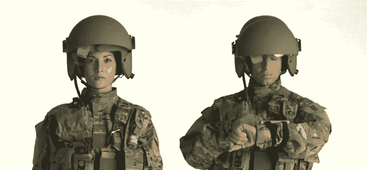

# 工作场所的可穿戴设备只是监控的工具吗？

> 原文：<https://www.sitepoint.com/are-wearables-in-the-workplace-just-a-tool-for-surveillance/>

戴夫·艾格斯的书《圆圈》(The Circle)描述了一家公司，有点像当今脸书、谷歌和苹果的组合。工人受到持续的监视，起初看起来是有益的，但随着故事的发展，变得越来越强大和过分。

这是一个反乌托邦的幻想，对未来的预测还是一个乌托邦的理想？

在这篇文章中，我将通过可穿戴设备来打破工作场所监控的一些事实和虚构。

## 监控员工绩效

工作场所监控并不是什么新鲜事。几个世纪以来，工作场所一直将监控员工作为确保最大效率和效力的一种手段。我的祖母年轻时在一家钢丝绒工厂工作，那里每个员工上厕所的时间是三分钟。最近，我母亲在一家律师事务所工作，在那里工作是定时的，每隔 7 分钟记录一次，给客户开账单。这两个工作场所监控的例子都是在没有使用智能眼镜、腕带、手表或徽章的情况下实现的。

大多数工作场所都有某种监控，从电子表格到打卡，从计算机监控到 CRM 工具。使用可穿戴设备进行监控也不是什么新鲜事。

英国连锁超市[乐购自 2004 年以来一直在他们的仓库中使用可穿戴设备](https://hbr.org/2013/09/wearables-in-the-workplace),工人们戴着臂章来跟踪他们正在收集的商品，从而腾出时间来标记剪贴板。该带分配任务，预测完成时间，并量化设施的 9.6 英里的货架和 111 个装载区之间的精确移动。一个 2.8 英寸的显示屏提供分析反馈，验证订单的正确履行，或提醒订单短缺的工人。

亚马逊，对[员工](https://medium.com/@jcheiffetz/i-had-a-baby-and-cancer-when-i-worked-at-amazon-this-is-my-story-9eba5eef2976#.xmlt6ndm8) [争议](https://medium.com/the-wtf-economy/the-life-and-death-of-an-amazon-warehouse-temp-8168c4702049#.1bwzs0ffh)并不陌生，在他们的仓库里利用追踪器达到类似的效果。

工作场所中可穿戴设备的问题不是它们的存在是为了监控表现，而是它们可以设定不切实际的目标，从而增加而不是减少工作场所的压力。这种情况因工作场所偏爱没有工会代表的临时工或合同工而加剧。

为了回应[对 UPS 卡车内置过度监控](http://www.thenation.com/article/these-workers-have-new-demand-stop-watching-us/)的投诉，导致司机被要求证明可以减少他们“路上每小时停车次数”的洗手间休息时间，UPS 工人工会卡车司机坚持一项协议，规定该公司不能根据 GPS 设备的信息解雇工人。这意味着:

> [公司必须通过直接观察或其他确证来确认任何其他导致解雇的违规行为](https://teamster.org/sites/teamster.org/files/2013-2018_ups_master_agreement-final.pdf)。

工作场所的可穿戴设备可以收集以前无法获得的信息，这些信息可能会导致对员工的纪律处分。这更有可能影响那些不坐在办公室里、没有多少时间可以支配的人(比如在路上工作的人)。任何坐在包括高级管理团队在内的开放式办公室里的人，或者在一个小团队中工作的人，多年来都被有效地监视着。

除了卫生间，工作场所的监视并不是非法的，因此没有什么可以阻止雇主监视员工的行为。许多工作场所长期保留闭路电视录像。其他人可以监控员工的互联网和电话内容，以确定他们花了多少时间在实际工作上，而不是看起来很忙。

工作场所总是在寻找省钱、降低成本和让员工发挥更大作用的方法。任何接受过时间和动作研究或者不得不写自己的 KPI 的人都会证明这一点，不管是什么行业。

可以肯定的是，通过工作场所监控，尤其是通过可穿戴设备收集的信息，需要有明确的指导方针，说明如何解读、由谁解读以及后果。这就是工作场所法律和员工团体需要跟上技术发展的地方。他们能做到这一点吗？我不太确定。

## 健康追踪呢？

工作场所已经参与到健康监测和健康项目中，从就业前的强制性健康检查，到使用符合人体工程学的椅子，再到免费注射流感疫苗。我了解到，在芬兰，免费健康午餐和健身俱乐部课程的代金券很常见，并与许多将员工的健康和福祉视为公司重要职责的经理进行了交谈。

公司参加“趣味跑步”或减肥课程并不少见。初创企业以向员工提供新鲜水果和早餐麦片为荣。

英国石油公司向员工及其配偶分发 Fitbit 健身追踪器引起了很多关注，这些活动积分为员工赢得了健康保险费折扣。据预测，到 2016 年，大多数大型西方公司(超过 500 名员工)将在其健康计划中提供健身追踪器。我认为这只不过是工作场所多年来存在的东西的延伸。

让事情变得更复杂的不是健康监测可穿戴设备的使用是否是强制性的，而是这些数据是否会导致负面结果。很容易想象这样一种情景:选择不做这 10，000 步的员工会像过去那些不参加工作场所社交活动的员工一样被避开。不穿你的可穿戴会不会不被认为是团队成员？如果你有隐形残疾或者只是有其他优先考虑的事情呢？在许多工作场所，晋升是在周五晚上的例行饮酒会上决定的，而流言蜚语只与那些上午吸烟的人分享。看起来与工作场所文化格格不入并因此遭到反对的显性或隐性行为并不新鲜。

## 并非所有的工作场所都是平等的

我从小就饱受失眠和睡眠障碍的困扰。如果一个工作场所要监控我的睡眠，它会证实这一点。因为我携带的最危险的物品是笔记本电脑，所以除了我自己和我的语法能力之外，我的失眠不会给任何人带来危险。如果我是一名飞行员，操作重型机械或进行显微外科手术，这将是一个不同的故事。

在[重型运输](http://www.riotinto.com/media/media-releases-237_8713.aspx=)、[采矿](http://www.mining.com/web/wearable-technology-to-enter-the-mining-industry/)、[军事战斗](http://www.cnet.com/news/pilot-of-the-future-u-s-army-gets-wearable-tech-for-the-battlefield/)和[建筑](http://blog.capterra.com/constuction-wearable-tech/)等行业，有太多可穿戴设备被用来让员工更安全的例子。正是在这些行业中，可穿戴设备的影响力和用途最大。仅仅因为你可以监视办公室里坐在办公桌前的员工，并不意味着你应该或者需要这样做。

## 数据等于结果吗？

值得注意的是，即使在热情采用可穿戴设备的工作场所，也无法分析或从它们产生的数据中得出有用的结论。我手里拿着一些最新的可穿戴设备，它们可以监测我的唤醒水平，但无法确定这些是由真正的热情、恐惧、压力还是过多的咖啡因引起的。工作场所会给失眠患者买一张新床，或者从卧室外面的交通中提供双层玻璃吗？可惜我觉得可能性不大。

写完这篇文章后，我不禁感到圆圈所代表的世界已经在这里，或者就在眼前。是我多疑了还是我把字里行间看得太重了？你怎么想呢?(我不会告诉你的老板)

## 分享这篇文章