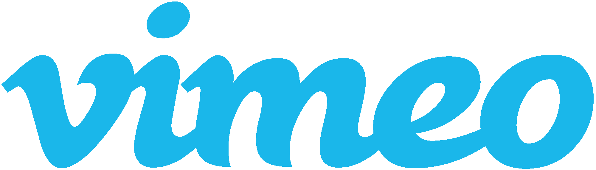
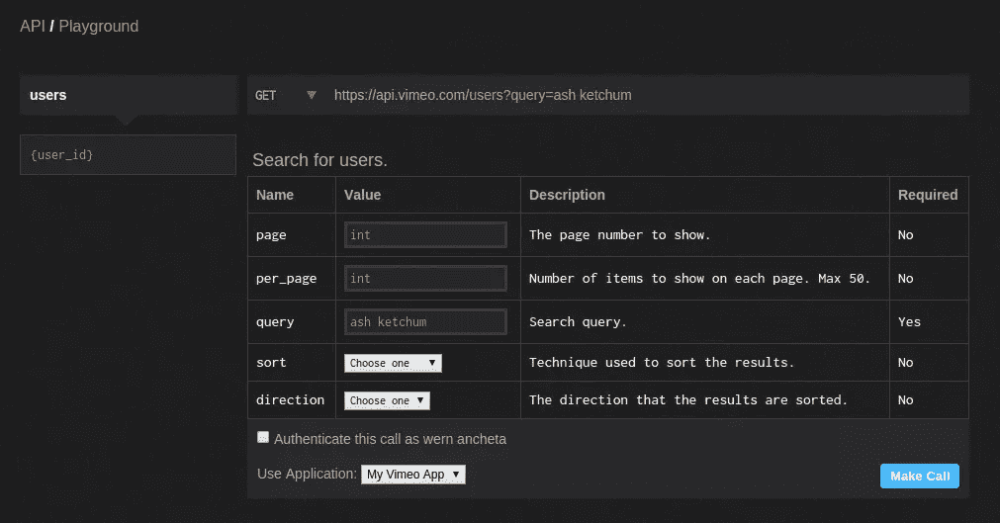
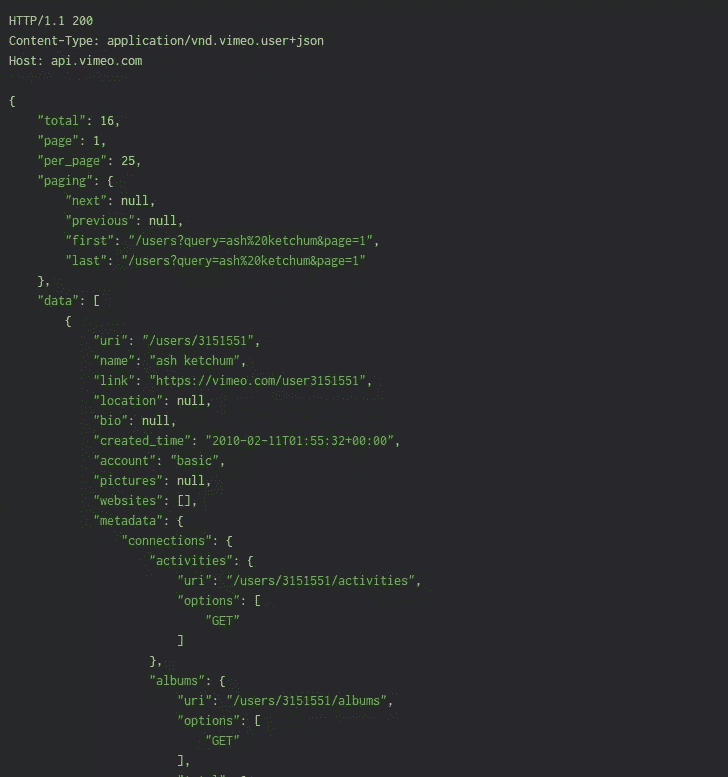
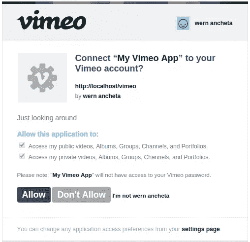

# 用 Vimeo 的 API 和 Slim 构建一个基本的视频搜索应用

> 原文：<https://www.sitepoint.com/building-a-basic-video-search-app-with-vimeos-api-and-slim/>

在本教程中，您将了解 Vimeo API 的基础知识。有了它，你可以获取特定用户的信息，或者获取该用户上传的视频信息。如果视频是私人的，只有在用户授予你的应用程序权限的情况下，你才能从 API 获取它。



## 创建新应用程序

你首先需要的是一个 Vimeo 账户。一旦你有了，去[developer.vimeo.com](https://developer.vimeo.com/)然后点击[我的应用](https://developer.vimeo.com/apps)。这将列出您创建的所有应用程序。既然是第一次，应该是空的。点击*创建新应用*按钮，开始创建新应用。输入应用程序的名称、描述、URL 和回拨 URL。对于 URL 和回调 URL，您可以在您的开发机器上输入一个 URL(如`http://homestead.app`)。


添加完详细信息后，点击*创建应用*按钮。您将被重定向到应用程序页面，在该页面中，您可以单击“身份验证”选项卡，显示可用于与 API 交互的令牌。我们以后会需要的。

## API 游乐场

在你开始编写一个演示应用程序之前，看一下 [API 运动场](https://developer.vimeo.com/api/playground/)。这是 Vimeo 提供的一个工具，因此开发人员无需编写任何代码就可以使用这个 API。它允许您调用特定的 API 端点，为可以通过这些端点传递的参数设置自定义值，并查看 JSON 字符串的实际结果。

选中*“将此调用验证为{您的用户名}”*复选框，以便代表您的 Vimeo 帐户执行所有 API 调用。如果不选中此框，API 调用将作为未经身份验证的请求执行。这意味着它不会使用您的应用程序凭据，也不会使用特定用户来执行对 API 的请求。实际上，它仅限于访问公开信息。

回到 API Playground，选择您之前创建的应用程序。您可以点击*拨打*按钮执行请求。playground 中使用的默认 URL 是`https://api.vimeo.com/`，它列出了 API 中所有可用的端点。要改变这一点，您可以点击屏幕左侧的*(空…)* 链接。从这里，您可以选择要向其发送请求的端点。您可以先尝试一下*用户*端点。一旦选中，它允许您输入特定用户的 ID，并通过指定一组参数来搜索用户。



在上面的例子中，您正在搜索一个名为“ash ketchum”的用户。您可以通过为`query`参数指定一个值来做到这一点。您还可以看到哪些参数是必需的，哪些是可选的。您可以指定的参数是不言自明的。继续使用不同的值来熟悉可以进行的 API 调用。

如果您检查结果，默认情况下每页返回 25 行。它还显示查询返回的总行数。在这种情况下，它是 16。这在分页数据上也很明显:`next`有一个值`null`，所以这意味着没有下一页。



根据上面的响应，所有用户数据都在`data`数组中。每个用户都是一个具有相同属性集的对象。如果您想获得关于特定用户的更详细的信息，您可以从`uri`的值中提取它的 ID。在这种情况下，它是`/users/3151551`，所以 ID 是`3151551`。您可以复制它，并将其用作 users 端点下的`{user_id}`的值，以查询该特定用户。

```
"data":  [  {  "uri":  "/users/3151551",  "name":  "ash ketchum",  "link":  "https://vimeo.com/user3151551",  ...
```

请注意，一些端点需要经过身份验证的用户来执行请求。这意味着您必须勾选*将此呼叫认证为{您的用户名}* 复选框来执行请求。这种端点的一个例子是`me`端点。这个特定的端点允许您的应用程序查询关于当前已验证用户的数据。

## 创建演示

### 先决条件

从现在开始，我们将假设你使用我们的[家园改进版](https://www.sitepoint.com/quick-tip-get-homestead-vagrant-vm-running/)流浪者盒子跟随。这是一个为普通 PHP 应用程序调整的虚拟开发环境，所以每个读者都有相同的起点。

对于这个演示，你将会使用到 [Slim 框架](http://www.slimframework.com/)、 [Twig 模板引擎](http://twig.sensiolabs.org/)和 [Vimeo PHP 库](https://github.com/vimeo/vimeo.php)。让我们安装它们:

```
composer require slim/slim twig/twig slim/views vimeo/vimeo-api
```

### 拔靴带

在您的工作目录中，创建一个`index.php`文件，启动会话，并包含 Composer 的自动加载程序:

```
<?php
session_start(); require_once 'vendor/autoload.php';
```

为应用程序使用的客户端 ID、客户端密码和重定向 URI 定义一个常量。确保您在应用程序详细信息中添加的重定向 URI 与您在此处使用的 URL 相匹配。

```
define('CLIENT_ID',  'your vimeo client id'); define('CLIENT_SECRET',  'your vimeo client secret'); define('REDIRECT_URI',  'your vimeo redirect or callback url');
```

创建 Slim 应用程序的新实例，并为`view`选项传入 Twig。这允许您使用 Twig 来处理视图。此外，设置视图的解析器选项。

```
$app =  new \Slim\Slim(array(  'view'  =>  new \Slim\Views\Twig()  //use twig for handling views  )); $view = $app->view(); $view->parserOptions = array(  'debug'  =>  true,  //enable error reporting in the view  'cache'  => dirname(__FILE__)  .  '/cache'  //set directory for caching views  );
```

添加以下内容以使用 Vimeo 库。

```
$vimeo =  new \Vimeo\Vimeo(CLIENT_ID, CLIENT_SECRET);
```

### 获取未经身份验证的令牌

您可以执行对 Vimeo API 的请求，而无需用户登录并向您的应用程序授予权限。您可以通过使用 Vimeo 库中的`clientCredentials`方法获取未经认证的令牌来实现这一点。这将返回一个可用于查询公共数据的访问令牌。可以与未经认证的令牌一起使用的 API 端点的数量相当有限，所以在本教程中不会用到它。

```
$app->get('/token',  function()  use  ($app, $vimeo)  { $token = $vimeo->clientCredentials(); echo $token['body']['access_token'];  });
```

### 登录

下面是登录路线。这允许用户向您的应用程序授予权限，以便应用程序可以访问用户的私人数据并代表用户执行请求。

```
$app->get('/login',  function  ()  use  ($app, $vimeo)  {  if($app->request->get('code')  && $app->request->get('state')  == $_SESSION['state']){ $code = $app->request->get('code'); $token = $vimeo->accessToken($code, REDIRECT_URI); $access_token = $token['body']['access_token']; $vimeo->setToken($access_token); $_SESSION['user.access_token']  = $access_token; $page_data = array(  'user'  => $token['body']['user']  );  }else{ $scopes = array('public',  'private'); $state = substr(str_shuffle(md5(time())),  0,  10); $_SESSION['state']  = $state; $url = $vimeo->buildAuthorizationEndpoint(REDIRECT_URI, $scopes, $state); $page_data = array(  'url'  => $url );  } $app->render('login.php', $page_data);  });
```

分解一下，首先检查代码和状态是否作为查询参数传递。为了增加安全性，还需要检查状态是否与先前保存在会话中的状态相同。

```
if($app->request->get('code')  && $app->request->get('state')  == $_SESSION['state']){  ...  }
```

如果上述条件对两者都返回`true`，则继续交换代码和访问令牌的重定向 URI。您可以通过调用 Vimeo 库中的`accessToken`方法来实现。接下来，从返回的结果中提取访问令牌，然后调用`setToken`方法将其设置为访问令牌。还要将访问令牌存储在会话中，以便以后可以访问它。最后，创建一个数组来存储稍后将传递给视图的数据。在这种情况下，它是用户详细信息。

```
$code = $app->request->get('code'); $token = $vimeo->accessToken($code, REDIRECT_URI); $access_token = $token['body']['access_token']; $vimeo->setToken($access_token); $_SESSION['user.access_token']  = $access_token; $page_data = array(  'user'  => $token['body']['user']  );
```

如果条件返回`false`，构建一个 URL，将用户引导到 Vimeo 页面，在那里他们可以允许应用程序执行特定的任务。在这种情况下，您只为作用域指定了`public`和`private`。这意味着该应用程序只能访问公共和私人用户数据。还有其他的，比如`upload`允许应用上传视频到 Vimeo，或者`interact`允许应用代表用户与视频互动。这种交互的例子包括喜欢、评论或者将视频添加到观看列表。

回到代码，创建状态，其主要目的是在重定向上添加一个安全层。正如您在前面看到的，这用于检查在从 Vimeo 到您指定的重定向 URL 的重定向中传递的查询参数上是否存在相同的状态。只需将这个 URL 作为页面的数据进行传递。

```
$scopes = array('public',  'private'); $state = substr(str_shuffle(md5(time())),  0,  10); $_SESSION['state']  = $state; $url = $vimeo->buildAuthorizationEndpoint(REDIRECT_URI, $scopes, $state); $page_data = array(  'url'  => $url );
```

最后，呈现登录视图。

```
$app->render('login.php', $page_data);
```

下面是登录视图(`templates/login.php`):

```
  <a href="{{ url }}">login to vimeo</a>    <h1>Hello  {{ user.name }}!</h1>  <h2>websites</h2>  <ul>    <li>  <a href="{{ website.link }}">{{ website.name }}</a>  </li>    </ul>  
```

从上面的代码中，您可以看到我们只是检查 URL 是否存在。如果是，则输出授权链接。如果没有，那么问候用户并列出他们的网站。当用户点击授权链接时，他们将被重定向到一个 Vimeo 页面，在那里他们可以检查他们希望允许的特定范围。单击“允许”后，用户将被重定向到您指定的重定向 URL。惟一代码和状态将作为重定向 URL 中的查询参数传递，然后您可以用它来交换访问令牌。



### 获取用户订阅源

您可以通过向`/me/feed`端点发出请求来获取用户提要。您还可以传入一个名为`per_page`的可选参数。这允许您控制响应中返回的行数。如果未指定此参数，它将使用默认参数 25。之后，提取响应的`body`，并将其设置为要传递给视图的数据。

```
$app->get('/me/feed',  function  ()  use  ($app, $vimeo)  { $vimeo->setToken($_SESSION['user.access_token']); $response = $vimeo->request('/me/feed', array('per_page'  =>  10)); $page_data = $response['body']; $app->render('feed.php', $page_data);  });
```

这里是`feed.php`的代码。它所做的是遍历所有的提要条目，然后显示一个代表视频的缩略图，Vimeo 上实际视频的链接，视频的描述和标签。

```
<h1>User Feed</h1>  <li>    <div>  <a  href="{{ feed.clip.link }}">{{ feed.clip.name }}</a>  </div>  <p> {{ feed.clip.description }} </p>  <div>  <span>{{ tag.name }}</span>  </div>  </li> 
```

### 搜索视频

Vimeo API 还允许您使用查询来搜索视频。在下面的代码中，将页面数据初始化为一个空数组。如果一个`query`作为查询参数出现在请求 URL 中，使用它作为对`/videos`端点的查询。然后将这个查询和 API 结果作为数据传递给`videos.php`视图。

```
$app->get('/videos',  function  ()  use  ($app, $vimeo)  { $page_data = array();  if($app->request->get('query')){ $vimeo->setToken($_SESSION['user.access_token']); $query = $app->request->get('query'); $response = $vimeo->request('/videos', array('query'  => $query)); $page_data = array(  'query'  => $query,  'results'  => $response['body']  );  } $app->render('videos.php', $page_data);  });
```

对于`videos.php`，创建一个表单，其中包含用户可以用来输入查询的文本字段，以及一个用于提交查询的按钮。

```
<form>  <input  type="text"  name="query"  value="{{ query }}">  <button  type="submit">Search</button>  </form>
```

之后，输出搜索结果。如果之前传入的页面数据的结果项中有一个值，则循环遍历该值并显示视频的缩略图。这通常是 API 返回的图片数组中的第一个图像。所以访问索引为 0 的图像并提取它的链接可以获得第一项。接下来，输出视频的链接，使用视频的名称作为文本。最后输出一个链接到上传视频的用户，并显示视频描述。如果`results`变量不可用，那么简单地输出没有结果。

```
<h1>Search Results</h1>  <div>  <ul>  <li>    <div>  <a  href="{{ row.link }}">{{ row.name }}</a>  </div>  <div> by: <a  href="{{ row.user.link }}">{{ row.user.name }}</a>  </div>  <p> {{ row.description }} </p>  </li>  </ul> 
    No search results.
 </div>
```

## 结论

在这一部分中，我们使用 Vimeo API 用 Silex 和 Twig 构建了一个基本的视频应用程序。我们添加了登录和用户反馈功能，并用视频搜索功能将它们打包。你可以在这个 [Github repo](https://github.com/sitepoint-editors/vimeoapi-part1) 中查看本文使用的代码。

如果你的兴趣被激起，考虑加入我们的后续帖子，该帖子将扩展这里介绍的基础知识，并添加喜欢、观察列表和视频上传。敬请期待！

## 分享这篇文章