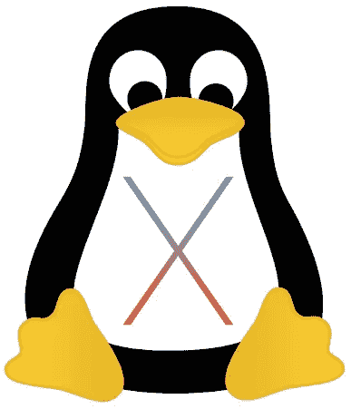
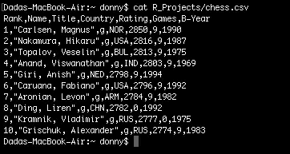
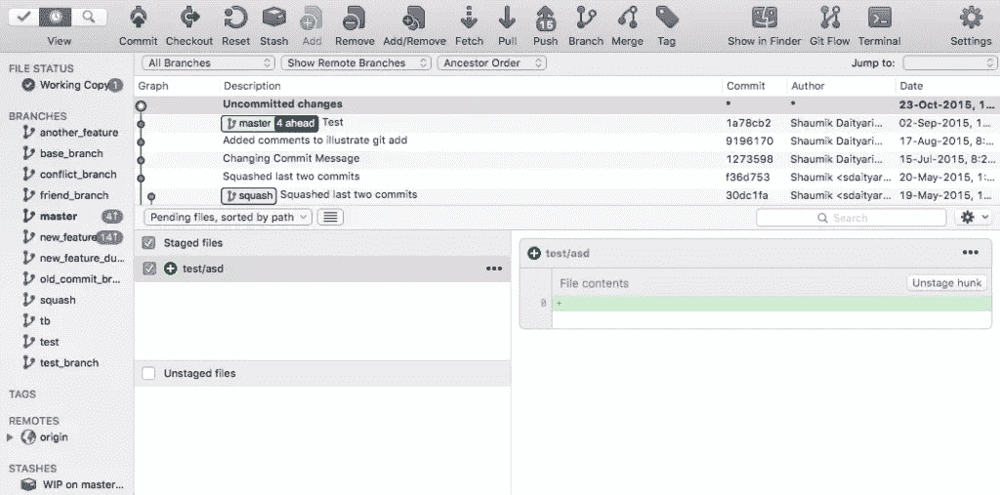
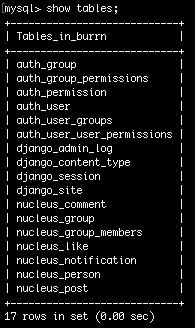
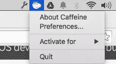

# 将你的开发环境从 Ubuntu 转移到 OS X

> 原文：<https://www.sitepoint.com/shifting-your-development-environment-from-ubuntu-to-os-x/>

*最近我们一直在发表关于 [Linux](https://www.sitepoint.com/set-up-development-machine/) 、 [Windows](https://www.sitepoint.com/how-set-up-my-development-machine-windows/) 、 [Mac](https://www.sitepoint.com/set-mac-development-machine/) 和[云](https://www.sitepoint.com/developing-in-the-cloud-an-introduction/)的开发环境的文章。在这篇文章中，Shaumik 着眼于从一个移动到另一个。*



去年，我给自己买了一台 Macbook Air，原因有二:强大的终端和流行的图形软件。我以为过渡会很顺利；但是只有当我开始这个过程时，我才意识到这个任务的复杂性。

SitePoint 最近发表了关于[在 Ubuntu 上设置开发机器](https://www.sitepoint.com/set-up-development-machine/)和[在 Mac 上设置开发机器](https://www.sitepoint.com/set-mac-development-machine/)的文章。在这篇文章中，我将探讨当你将开发环境从 Ubuntu 转移到 OS X 时，或者相反，你可能会面临的微妙差异。

## 安装软件的一般步骤

让我们先来谈谈如果你习惯了 Ubuntu，你可以在 OS X 上看到什么。

由于市场份额高，OS X 拥有庞大的开发者群体。因此，几乎所有的软件都有 OS X 安装程序。你如何安装它们很有趣。安装程序通常会引导您完成安装(很像 Windows 上的安装向导)。有些包可能是以`.dmg`文件的形式提供的，这些文件就是压缩文件。您需要将提取的应用程序移动到`Applications`目录。移除这样的软件包只需要从`Applications`目录中移除即可。这里有一个关于在苹果电脑上安装下载软件的指南。

另外，应用程序的安装也可以通过 App Store 完成。然而，并不是所有的应用程序都可用。那些没有安装的浏览器，比如 Chrome 和 Firefox 等浏览器，以及 Sublime Text 等文本编辑器，可以很容易地从各自的网站上下载，并按照上面的描述进行安装。

## 终点站



Mac 上的终端

在终端中，大多数命令都是相似的(除了那些专门与包相关的命令)。例如，运行`grep`命令来搜索短语是完全一样的。

然而，如果你对开发跨平台运行的脚本(包括旧的 Mac 版本)感兴趣，你可能会对苹果开发者的指南感兴趣。

此外，要查看命令的细微差异列表，请访问 Rosetta Stone 的 Sysadmin 的 Unixersal Translator ，并从左上角的操作系统列表中选择 OS X 和 Linux。从列表中，您可以看到大多数常用命令的用法是相同的。

## 家酿:Mac 的软件包管理器

Ubuntu 有`apt-get`作为包管理器，而 Fedora 有`yum`。

不幸的是，没有默认的 Mac 包管理器可以神奇地安装你想要的每一个新软件。虽然有许多像 MacPorts 和 Fink 这样的替代产品，但 Mac 的最佳包管理器可能是 [Homebrew](http://brew.sh/) 。如果你感兴趣，这里有三个选项的比较。

安装家酿很容易:你只需要运行一个命令，正如他们的网站上提到的:

```
ruby -e "$(curl -fsSL https://raw.githubusercontent.com/Homebrew/install/master/install)"
```

安装脚本是用 Ruby 编写的。Ruby 是预装在 Mac 上的。在新机器上安装期间，系统会提示您安装 XCode 命令行工具的组件，您需要批准这些组件。要验证已经安装了 Homebrew，您可以运行`brew info`。

通过家酿安装软件包与其他软件包管理器类似。Homebrew 为本地用户安装软件包，因此不需要任何 root 权限。在这篇文章的后面，我们将会看到在自制软件上安装软件包的过程。同时，确保通过运行以下命令来更新 Homebrew:

```
brew update
brew doctor
brew upgrade
```

## 版本控制



在 Mac 上使用 SourceTree

今天几乎所有的开发人员——尤其是那些在团队中工作的开发人员——都需要使用版本控制来进行协作。最流行的版本控制工具是 [Git](http://git-scm.com) ，尽管许多人更喜欢 [Mercurial](https://www.mercurial-scm.org/) 或 [Subversion](https://subversion.apache.org/) 。

Matthew 在他的文章中解释了他对版本控制的选择，比如 GUI 工具，比如 T2 的 source tree T3 或者 T4 的 GitX T5。这些 GUI 工具自带 Git 版本。SourceTree 同时支持 Git 和 Mercurial。

如果您喜欢通过命令行使用版本控制，您需要单独安装您的版本控制系统。Git 有一个用于 Mac 的包，但是如果你需要最新的开发版本，你将不得不从源代码开始编译。

*注意:如果在安装 SourceTree 时，您的系统中有一个单独的 Git/Mercurial 版本，系统会询问您是想使用您系统中的版本还是 SourceTree 附带的版本。*

## 让我们开始编码吧

如果你是那些迫不及待开始的人之一，这是开始编码的部分。值得庆幸的是，大多数重要的东西都预装在最新版本的 Mac OS X 上——*El Capitan*。除了 Python，Ruby 和 PHP， *El Capitan* 还预装了 Apache 2.4！在 OS X，`apachectl`命令运行 Apache，而在 ubuntu 上运行`apache`。

对于运行 OS X 的人来说， [Python](https://www.python.org/downloads/mac-osx/) 、 [Node.js](https://nodejs.org/en/download/) 和 [Ruby](https://www.ruby-lang.org/en/documentation/installation/) 都有安装程序，或者你可以通过获得你想要的版本来编译它们。PHP 没有 OS X 的安装程序，但是可以从源代码中编译[。它们都可以通过自制软件安装。例如，您可以运行以下命令来安装 PHP 5.6:](http://php.net/manual/en/install.macosx.compile.php)

```
brew install php56
```

类似地，运行以下命令来安装 Python 3:

```
brew install python3
```

可以使用 [MAMP 栈](https://www.mamp.info/en/) ( **M** ac、 **A** pache、 **M** ySQL、 **P** HP)来获得捆绑(类似于 Linux 的[灯](https://www.digitalocean.com/community/tutorials/how-to-install-linux-apache-mysql-php-lamp-stack-on-ubuntu)和 Windows 的 [WAMP](http://www.wampserver.com/en/) )。这让您可以快速开始开发，而不用担心单独的安装。MAMP 有一个特定的安装程序，您可以在每次想要启动开发环境时运行它。与 MAMP 一起工作类似于使用 WAMP 或灯。

## 数据库



MySQL 数据库中的表列表

虽然使用 MAMP 可以消除安装数据库的需要，但是外部应用程序不能使用该数据库。现在让我们看看如何在 Mac OS X 上安装 MySQL。最简单的方法是使用自制软件(再一次！):

```
brew install mysql
```

MySQL 附带了一个用于 Mac 的安装程序。正如[在 MySQL 网站](https://dev.mysql.com/doc/refman/5.6/en/osx-installation-pkg.html)上解释的那样，安装它是一个简单的过程。

类似地， [PostgreSQL 可以通过安装程序或者自制程序安装在 Mac OS X](http://www.postgresql.org/download/macosx/) 上。

如果你喜欢像 MongoDB 这样的 NoSQL 数据库，Homebrew 也有一个解决办法:

```
brew install mongodb
```

MongoDB 没有 Mac 版的安装程序。在没有包管理器的情况下，如果不使用包管理器，您需要从源代码编译 MongoDB。

## 有用的应用



在过去的一年里，我意识到 Mac 可以提高你的工作效率——如果使用方法正确的话。有很多苹果电脑上的生产力应用程序是你必须使用的。

咖啡因是一个有用的应用程序，当它被激活时，可以防止屏幕保护程序、屏幕变暗或系统进入睡眠状态。它非常适合运行可能需要很长时间才能执行的脚本。

Google Drive 和 [Dropbox](https://www.dropbox.com/downloading?os=mac) 也是必不可少的，可以让你的本地文件与云端保持同步。Drive 和 Dropbox 在它们的特殊文件夹中同步文件，但是 [MacDropAny](http://www.zibity.com/macdropany.html) 可以让你<q>放下</q>任何普通文件夹并转换到 Drive 或 Dropbox 文件夹中。

[SuperDuper](http://www.shirt-pocket.com/SuperDuper/SuperDuperDescription.html) 是一款防数据丢失的 app，一定要试试。最后， [Jumpcut](http://jumpcut.en.softonic.com/mac) 就像一个扩展的剪贴板，可以记住你复制的所有内容。

## 最后的想法

在这篇文章中，我研究了将开发环境从 Ubuntu 转移到 Mac OS X 的过程。虽然我描述了手动过程，但有一些服务，如[vagger](https://www.sitepoint.com/re-introducing-vagrant-right-way-start-php/)和 [Docker](https://www.sitepoint.com/docker-and-dockerfiles-made-easy/) 可以帮助您创建可移植的开发环境，使其在新系统上的设置更快。

你认同我的开发环境吗？我遗漏了什么重要的事情吗？请在下面的评论中畅所欲言。

## 分享这篇文章