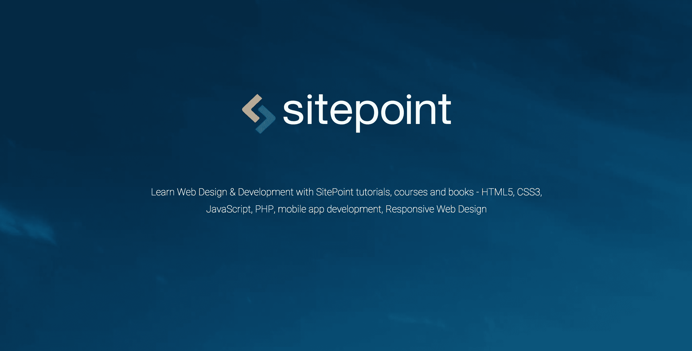
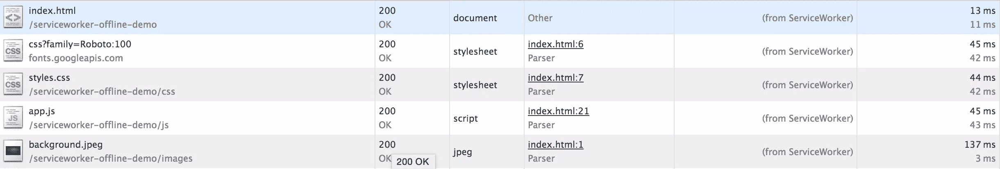
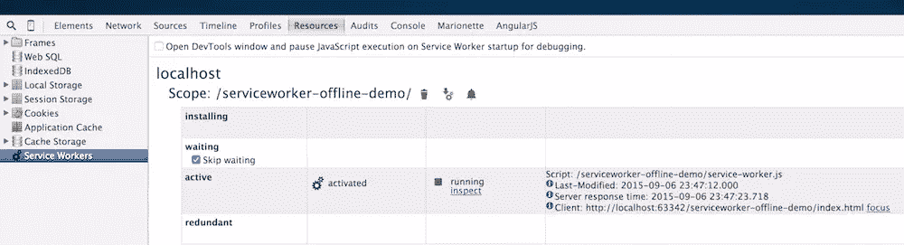

# 服务人员入门

> 原文：<https://www.sitepoint.com/getting-started-with-service-workers/>

曾经有一段时间，人们只把推送通知的使用与移动应用联系起来。幸运的是，那个时代已经过去了。现在有服务人员可以帮助我们在桌面应用程序中实现推送通知，甚至在您离线时也可以打开网站。

服务人员是一个在后台运行的脚本。它不需要网页或用户交互就能工作。这意味着即使你的网站没有打开，它也会运行，即使它不能直接访问 DOM(DOM 可以使用 [`postMessage`](https://developer.mozilla.org/en-US/docs/Web/API/Client/postMessage) API 与服务人员通信)。目前，它们包括推送通知和地理围栏等功能。它还可以拦截和处理网络请求，这是我们将在本教程中使用的功能。对于那些对浏览器支持感兴趣的人，我建议在这里看一看。正如您将看到的，它的实现仍处于早期阶段。
为了演示服务人员的网络拦截功能是如何工作的，我们将制作一个静态网站，即使用户离线，它也能运行。你可以在这里找到网站的完整演示。

服务工作者让您控制网页，您可以通过编程选择想要缓存的组件。请记住，它只会在第二次或后续访问时离线运行。这种行为背后的原因将在本教程的后面解释。



服务人员的一个常见问题是，他们只在“安全来源”(基本上是 HTTPS 站点)工作，这符合政策[，该政策倾向于使用安全来源来获得强大的新功能](https://www.chromium.org/Home/chromium-security/prefer-secure-origins-for-powerful-new-features)。然而，即使是 localhost 也被认为是一个安全的来源，所以在它上面开发是避免这个错误的一个简单方法。如果你愿意，你也可以使用 GitHub 页面(像我一样),因为它们是通过 HTTPs 提供的。

## 入门指南

我们需要做的第一件事是登记服务人员。这只有在浏览器支持的情况下才有效。这意味着您将在本教程中找到的以下所有代码片段只有在`navigator.serviceWorker`存在时才有效。

```
//make sure that Service Workers are supported.
if (navigator.serviceWorker) {
    navigator.serviceWorker.register('./service-worker.js', {scope: './about'})
        .then(function (registration) {
            console.log(registration);
        })
        .catch(function (e) {
            console.error(e);
        })
} else {
    console.log('Service Worker is not supported in this browser.');
}
```

上面代码中的`./service-worker.js`是服务工作者的路径。范围是服务工作者将采取行动的路径。在这个例子中，服务人员将控制具有路径`/about/`的页面。`scope`是可选的，默认有`./`。`register`方法返回一个[承诺](http://www.html5rocks.com/en/tutorials/es6/promises/)。我们可以任意多次调用`register`方法。当这一步完成后，浏览器会自动判断它是否已经注册，并且只有在它之前没有注册过的情况下才会注册它。

您可以前往`chrome://serviceworker-internals`查看所有已注册的服务人员。

## 装置

在服务工作器中，我们可以为浏览器触发的各种事件注册事件监听器。当浏览器第一次看到服务人员时，会触发 install 事件。当你打开 Chrome 的开发者工具时，你将看不到日志，因为服务人员在一个完全不同的线程中运行。我们将在教程的后面部分讨论更多关于调试的内容。

```
self.addEventListener('install', function(event){
	console.log(event);
});

self.addEventListener('activate', function(event){
    console.log(event);
});
```

此时，我们将拦截对服务器的请求。为此，我们使用`self.addEventListener`方法监听`'fetch'`事件，该方法在回调中返回`event`对象。我们获得请求 URL 作为`event.request.url`的值。

```
self.addEventListener('fetch', function(event){
  console.log(event.request.url);
  // return something for each interception
});
```

如果您想在 Service Worker 中导入任何外部脚本，您可以使用`importScripts()`来完成。在这个例子中，我们将使用[缓存填充](https://github.com/coonsta/cache-polyfill)，因为对`cache`的支持是有限的。

```
importScripts('js/cache-polyfill.js');

var CACHE_VERSION = 'app-v1';
var CACHE_FILES = [
    '/',
    'images/background.jpeg',
    'js/app.js',
    'css/styles.css',
    'https://fonts.googleapis.com/css?family=Roboto:100'
];

self.addEventListener('install', function (event) {
    event.waitUntil(
        caches.open(CACHE_VERSION)
            .then(function (cache) {
                console.log('Opened cache');
                return cache.addAll(CACHE_FILES);
            })
    );
});
```

在我们的`install`事件监听器中，我们使用来自所提供的`event`对象的`waitUntil()`方法来告知浏览器我们的服务工作器中的安装过程何时完成。提供的承诺是打开名为“app-v1”的缓存的`caches.open()`方法的返回值。

一旦缓存正确打开，我们就将资产添加到其中。`install`方法仅在保存资产后结束。如果在保存任何一项资产时出现错误，则服务人员将无法成功注册。这意味着我们应该确保只缓存重要的文件，因为更多的文件会增加失败的可能性。您应该只缓存那些可以改善网页加载时间的组件。

安装步骤完成后，服务人员将激活。这是服务人员控制页面的地方。

现在请求正在被拦截，但是我们需要弄清楚一旦发生这种情况，我们要做什么。可能会出现服务人员无法从缓存中读取数据或者请求与保存在缓存中的资产请求 URL 不匹配的情况。一旦我们拦截到请求，我们要做的是:

1.  首先，我们打开缓存，将请求与缓存中的请求进行匹配。如果它们匹配，我们就从缓存中返回数据。如果请求不匹配，我们将请求重定向到服务器。
2.  当从服务器成功接收到数据时，我们返回该数据。
3.  然后，我们打开缓存，使用`cache.put()`将数据保存在这里，以便在接下来的尝试中可以直接从缓存中访问它。

```
self.addEventListener('fetch', function (event) {
    event.respondWith(
        caches.match(event.request).then(function(res){
            if(res){
                return res;
            }
            requestBackend(event);
        })
    )
});

function requestBackend(event){
    var url = event.request.clone();
    return fetch(url).then(function(res){
        //if not a valid response send the error
        if(!res || res.status !== 200 || res.type !== 'basic'){
            return res;
        }

        var response = res.clone();

        caches.open(CACHE_VERSION).then(function(cache){
            cache.put(event.request, response);
        });

        return res;
    })
}
```

现在，让我们分析一个场景，在这个场景中，我们需要更新缓存，这是很常见的，因为每次文件改变时都需要更新。一旦您的文件被更改，您需要在缓存中进行更新。我们必须这么做:

1.  更新`CACHE_VERSION`因为如果浏览器检测到服务工作者的任何变化，它将重新下载它。新服务工作者中的`install`事件将被触发，但新服务工作者将进入“等待”阶段，因为页面仍将由旧服务工作者控制。
2.  当您的网站的所有实例都关闭时，新的服务人员将接管控制权(而不是旧的)。
3.  此时，`install`事件将被触发，我们需要做一些缓存管理。

我们会找到所有与当前版本不同的密钥，然后使用下面的函数清理它们。

```
self.addEventListener('activate', function (event) {
    event.waitUntil(
        caches.keys().then(function(keys){
            return Promise.all(keys.map(function(key, i){
                if(key !== CACHE_VERSION){
                    return caches.delete(keys[i]);
                }
            }))
        })
    )
});
```

ServiceWorkers 将在您首次访问网站时安装。不要指望他们在第一次访问时就能控制页面。他们只是注册和安装。请求将发送到服务器，资产将从那里获取。此外，与此同时，它们将被保存在缓存中。在以后的访问中，服务工作者将拦截请求并从缓存中返回资产。

为了更好地理解这一切，请打开开发者工具中的网络选项卡。如果您稍后重新打开该页面，您将会看到所有缓存的资产都是从服务工作者那里获取的。



需要记住的一点是，浏览器控制着服务人员的生命周期。安装后运行的时间是不固定的。

## 排除故障

服务人员的调试对于初学者来说有点棘手。你必须启用它，因为它仍然是一个实验。为此，请遵循以下步骤:

1.  转到`chrome://flags`并启用“启用 DevTools 实验”选项。
2.  打开 DevTools，然后进入设置>实验，按下 Shift 键 6 次。
3.  检查“资源面板中的服务人员”并重新启动 DevTools

现在您已经启用了这个实验，您可以在 DevTools 的 Resources 选项卡中找到这个选项。



如果您想手动取消注册服务人员，请转到`chrome://serviceworker-internals/`并点击相应的“取消注册”按钮。[更多关于调试过程的见解可以在这里找到](https://www.youtube.com/watch?v=cSAaP-T5cd4)。

## 结论

在本文中，我们创建了一个网站，演示了如何使用服务人员来创建离线 web 应用程序。我们还讨论了一些关于服务人员以及如何调试他们的概念。我真的希望你喜欢这个教程。
[如果你想玩玩源代码，可以在这里找到](https://github.com/sitepoint-editors/serviceworker-offline-demo)。

## 分享这篇文章