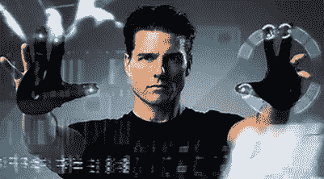
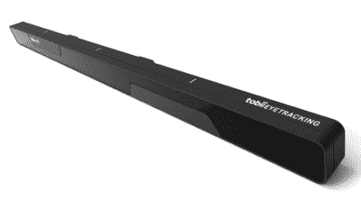
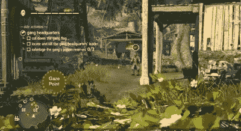
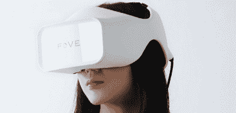
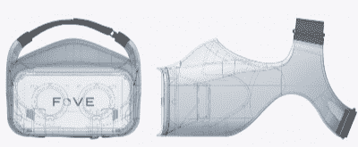

# 汤姆·克鲁斯，科幻小说和眼球追踪未来

> 原文：<https://www.sitepoint.com/tom-cruise-scifi-future-eye-tracking/>

《少数派报告》(2002 年)是一部不同寻常的电影。尽管它在当时还算成功——不管怎么说，以斯皮尔伯格的标准来看——但它似乎对技术人员和 UI 人员产生了巨大的影响。

如果你还没看过这部电影，影片中的主角用他戴着“电子手套”的手来操控他面前屏幕上的用户界面。试着想象一下汤姆·克鲁斯在《黑客帝国》中的“呕吐”，你大概就能感觉到了。

项目迅速涌现，将 Kinects 和其他硬件组装在一起，试图重现这种未来的手势用户界面体验。

有趣的是，如果他们和克鲁斯谈过，他们可能就不会这么热心了。显然，这些全身的 UI 手势对身体的要求非常高，可怜的老克鲁斯先生在拍摄期间需要经常休息。可能不是你想为工作整天做的事。

事实是，通常我们希望能够用最少的努力来传达我们的意图。直接的脑机接口开始成为现实。Siri 和谷歌语音已经变得如此之好，以至于我们几乎不会想到它们。

但是另一个几乎毫不费力的 UI 方法几乎被忽略了——直到现在。

### 眼球追踪用户界面的诞生

眼球追踪是一项你可能很熟悉的技术，但我们倾向于认为它是一种测试方法——的确如此。但是现在它作为一种用户输入方式受到了极大的关注。

软件现在可以实时地对用户的眼球运动做出反应，并相应地更新界面，而不是简单地记录用户眼睛的路径，然后将其与他们的行为联系起来。这开启了一些非常酷的可能性。

我想我们会触及两个硬件项目来实现这个想法。

### Tobii EyeX 控制器

这个看起来相当优雅的设备是来自瑞典公司 [Tobii](http://www.tobii.com/) 的 [EyeX 控制器](http://www.tobii.com/xperience/products/)。该装置插入你的电脑(目前不支持 OSX ),并通过设备中间的红外摄像头跟踪你的眼睛。

Tobii 为开发者提供了一个 SDK，并已经将 EyeX 控制器支持集成到一系列 Steam 游戏中——包括[刺客信条流氓](http://www.tobii.com/xperience/apps/assassins-creed-rogue/)。

在游戏中，相机会自动重新聚焦在你的“凝视点”上，让你的双手自由控制运动和动作。听起来很神奇。

Tobii 已经提供了一系列名为 [Tobii Dynavox](http://www.tobiidynavox.com/) 的眼球追踪辅助技术(AT)设备，旨在帮助有运动技能和沟通困难的用户。

你会认为增加一个成功的消费级产品只会有助于他们的 at 产品。

EyeX 的零售价看起来非常合理，为 119 欧元(约 127 美元)。

### Fove

当我们想到 VR 时，我们大多数人可能会想到 [Oculus Rift](https://www.oculus.com/en-us/) ，但 [Fove](http://www.getfove.com/) 通过将眼球追踪技术嵌入他们的耳机，将 VR 带到了另一个层面。

这个概念始于 5 月份的 Kickstarter 项目，几乎是他们 25 万美元筹资目标的两倍——所以他们肯定有一些兴趣。

可以预见，他们会谈论游戏控制器和辅助技术，但他们对游戏角色对你的目光接触的反应有一些非常有趣的想法*——微笑，皱眉。*

这是游戏的一个全新方面。

Fove 还可以根据你的焦点改变景深，所以当你在游戏中看你的手时，地平线变得模糊——反之亦然。

Fove SDK 现已上市，该系统已经支持 Windows、OSX、Linux 和一系列游戏引擎。从纯工业设计的角度来看，Fove 看起来非常精致。虽然我怀疑人们戴上虚拟现实护目镜时看起来总是很傻，但这可能是我们看起来最时尚的一次了。

当然，这只是正在开发的众多眼球追踪系统中的两个。汽车行业在这个想法上投入了很多，因为它提供了一个有吸引力的安全特性。

对于所有关于纯粹的“虚拟现实是未来”的宣传，我实际上认为眼球追踪可能是我们没有看到的大趋势。如果到 2018 年，大多数新的高端手机和笔记本电脑都配备了眼球追踪功能，我不会感到惊讶。

虽然直接用眼睛与电脑互动对我们来说似乎完全不可思议(确实如此)，但对你的电脑来说，这只是另一个屏幕坐标流，与鼠标或触控板没有什么区别。这意味着技术可以很好地与你当前的软件一起工作，同时也可以实现一套全新的软件理念。

尽管虚拟现实很酷，但它需要每个用户学习新的硬件、新的软件和一个全新的范式。这需要时间。

很快就看不到我爸戴 VR 头戴了，只是跟着眼睛走的光标？也许没有这么大的跳跃。

这里的希望，我们正朝着一个不会让可怜的老汤姆克鲁斯折腰的 UI 未来而努力。

*原载于 [SitePoint 设计简讯](https://www.sitepoint.com/newsletter/)* 。

## 分享这篇文章