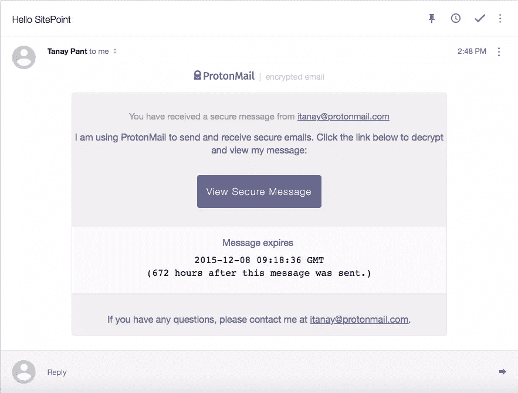
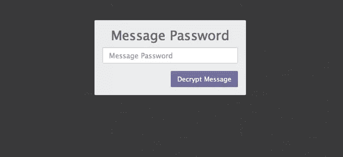
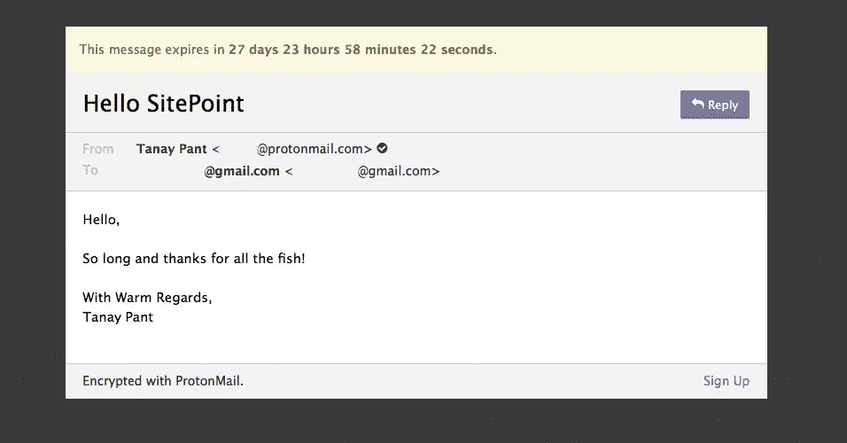
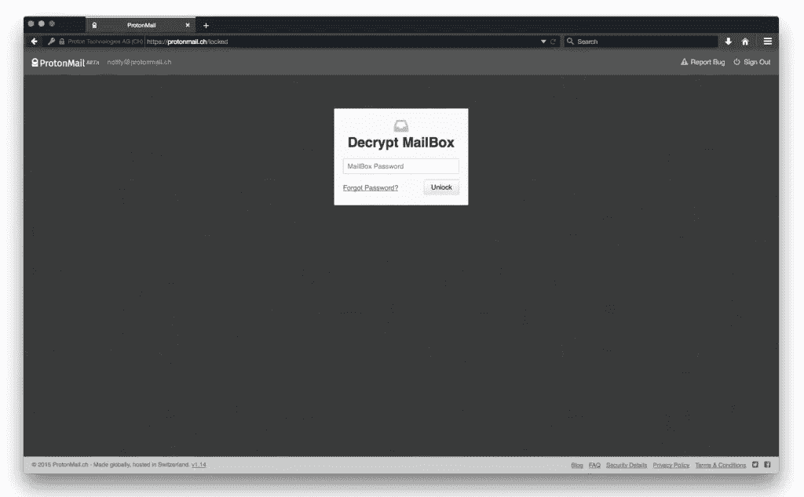
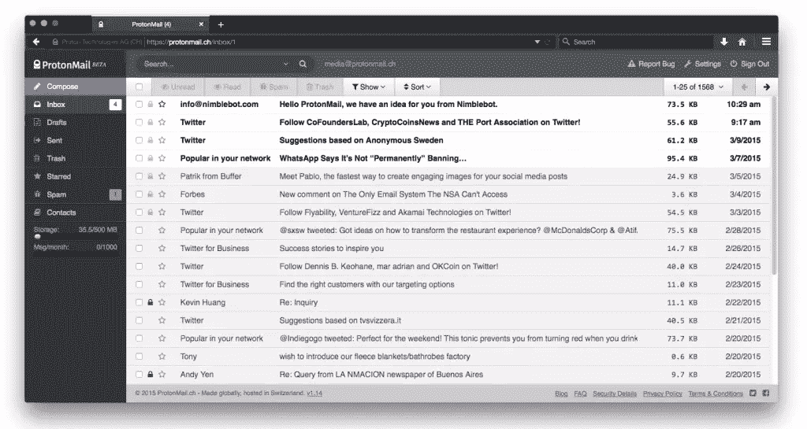
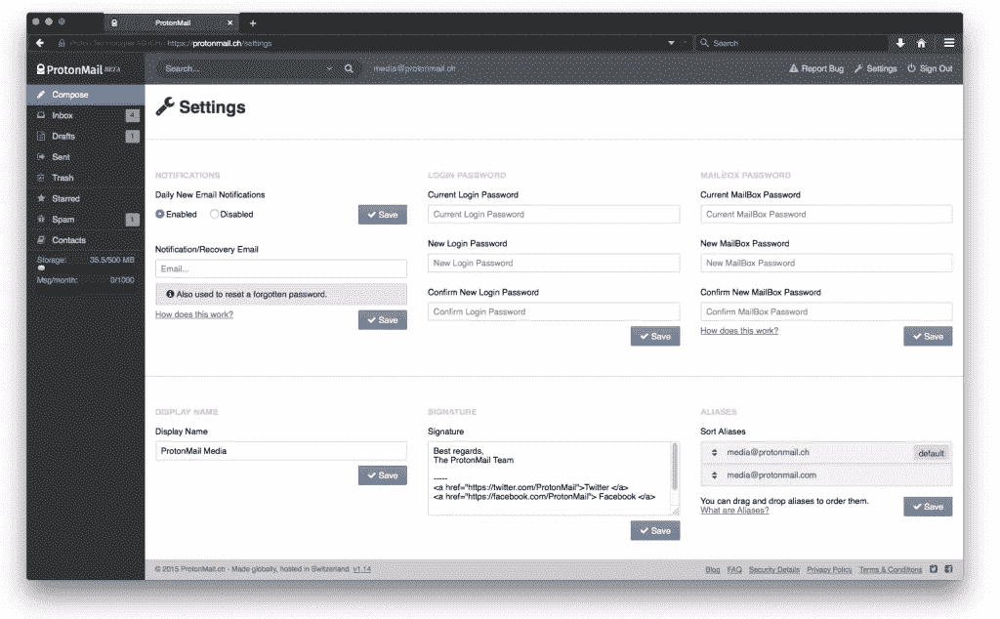

# 使用 ProtonMail 发送安全、加密的电子邮件

> 原文：<https://www.sitepoint.com/sending-secure-encrypted-email-with-protonmail/>

尽管电子邮件对于个人和公司通信来说都很方便，但它通常不太安全。您的私人数据可能会被服务提供商用于各种目的，例如[定向广告](http://www.theguardian.com/technology/2014/apr/15/gmail-scans-all-emails-new-google-terms-clarify)，并且有被政府机构要求公开的风险。

无论您是在传输重要文档，如机密备忘录、专利设计，甚至是个人信息，都值得考虑更好地保护您的隐私的方法。一个非常有趣的选项是 [ProtonMail](https://protonmail.com) 。

ProtonMail 是一种基于网络的加密电子邮件服务，于 2013 年在 CERN 研究机构成立。这是一项免费的开源服务，其代码可以在 GitHub 上找到。

ProtonMail 使用客户端加密来建立一个<q>零知识</q>系统，以便对其用户实施严格的数据隐私和保护。

## 质子邮件的安全机制

### 安全电子邮件服务器

ProtonMail 电子邮件服务器位于瑞士，您的数据受到瑞士联邦数据保护法和瑞士联邦数据保护条例的保护。这些法律是世界上最强的隐私保护法之一。

质子邮件[状态](https://protonmail.com/security-details):

> 由于 ProtonMail 不在美国和欧盟的管辖范围内，只有日内瓦州法院或瑞士联邦最高法院的法院命令才能迫使我们发布我们所拥有的极其有限的用户信息。

除此之外，ProtonMail 还确保你的数据保存在它的服务器上，这样它就不会暴露在云中。ProtonMail [声称](https://protonmail.com/security-details)它的主数据中心(它本身由系统级的多个密码保护)位于 1000 米的花岗岩下，在一个戒备森严的掩体中，可以经受住核攻击。除了您的数据可能会在核灾难中幸存这一事实之外，这还确保了额外的一层硬件安全。

### 端到端加密

ProtonMail 使用 SSL 在其服务器和您的电脑之间进行通信。虽然消息数据在发送前已经加密，但 SSL 增加了额外的安全层，防止了 <q>[中间人](https://www.sitepoint.com/firefox-nsa-man-middle/)</q> 攻击。ProtonMail 需要两个密码——一个用于登录，一个用于解密你的邮箱。后者忘记了就无法挽回。

### 匿名

注册时，ProtonMail 不需要任何可用于识别帐户持有人个人身份的信息。此外，它不会跟踪或记录用户的 IP 地址等信息。因为你的电子邮件是加密的，即使是工作人员也没有办法阅读你的电子邮件。

### 与其他电子邮件提供商的安全通信

默认情况下，ProtonMail 用户之间的通信是加密的，这由蓝色的锁图标表示。除此之外，ProtonMail 还支持通过[对称加密](https://www.sitepoint.com/encrypt-large-messages-asymmetric-keys-phpseclib/#encryption-algorithms-and-keys)向 Gmail、雅虎、AOL 等其他邮件提供商发送加密邮件。这是以超链接的形式发送的，收件人会在电子邮件中收到该超链接。下面是我从 ProtonMail 账户发送到谷歌收件箱的加密邮件的截图:

要求收件人输入密码(通过安全通道共享)，用于解密加密的邮件:

正确输入密码后，消息被解密并显示，如下面的屏幕截图所示:

### 自毁邮件

这种安全电子邮件服务还有一个区别于竞争对手的特性。加密电子邮件可以设置为在一定时间后在收件人的邮箱中自动自毁。该功能仅适用于发送给非 ProtonMail 用户的*加密*邮件(发送给非 ProtonMail 用户的普通邮件不能标记为自毁)。

## 产品演示

### 使用 ProtonMail 设置帐户

目前，在 ProtonMail 上建立一个新账户需要申请邀请函。注册页面上写着:

> 由于需求量大，我们已经达到了生产能力的极限。我们正在不断增加服务器，并将尽快向您发送邀请。

我在一周内收到了邀请请求的回复。它让我设置两个密码。一个密码是用来登录账户的。如果您忘记了密码，可以向您的备用电子邮件发送一个密码重置链接。然后它问我加密邮箱的密码。此密码一旦丢失就无法恢复，所以请小心。

一旦你解密你的邮箱并登录，你就有了一系列的工具来帮助你开始日常工作。您可以将您的通讯录以`.vcf`或`.csv`格式导入到 ProtonMail。我是 Gmail 用户，所以我可以通过 Google Contacts 导出我的联系人列表，然后导入到 ProtonMail。

在“设置”部分，您可以通过“帐户设置”选项卡设置您的签名和显示名称。“安全”选项卡允许您保留邮箱的验证日志记录，因此这有助于您监控谁访问了您的帐户以及从哪个 IP 地址访问的。“外观”选项卡帮助您调整各种选项，包括设置定制 CSS 主题的字段。

## 新的发展

2015 年 11 月 3 日，ProtonMail 遭到了一次非常强大的 DDOS 攻击，导致服务离线几天。

ProtonMail 最近发起了一项 [GoFundMe](https://www.gofundme.com/protonmaildefense) 众筹活动，筹集 5 万美元来帮助支付系统费用，以抵御未来的大规模攻击。

根据其[透明度报告](https://protonmail.com/blog/transparency-report/)(2015 年 9 月)，五分之五的访问用户数据的请求被 ProtonMail 拒绝。它甚至出现在非常受欢迎的电视节目《机器人先生》(第一季第八集)中。ProtonMail 将于 2015 年底推出其 Android 和 iOS 应用程序，手机应用程序测试版的邀请函售价为 29 美元。

## 结论

ProtonMail 因其致力于建立一个安全、私有和开源的消息传递平台而受到大众媒体的广泛赞赏。我相信，像 ProtonMail 这样具有开源基础设施的端到端加密消息服务将构成未来专业通信系统的基础。

话虽如此，我觉得个人用户很难离开一个熟悉的电子邮件生态系统去寻找一个更安全的系统，企业用户也很难为了工作而离开谷歌。让我们看看哪一方会赢:安全性/隐私还是功能完整性/熟悉度。

到目前为止，您使用过 ProtonMail 吗？如果是，你会继续使用你的旧邮箱吗？如果不是，您不改用 ProtonMail 的原因是什么？

## 分享这篇文章