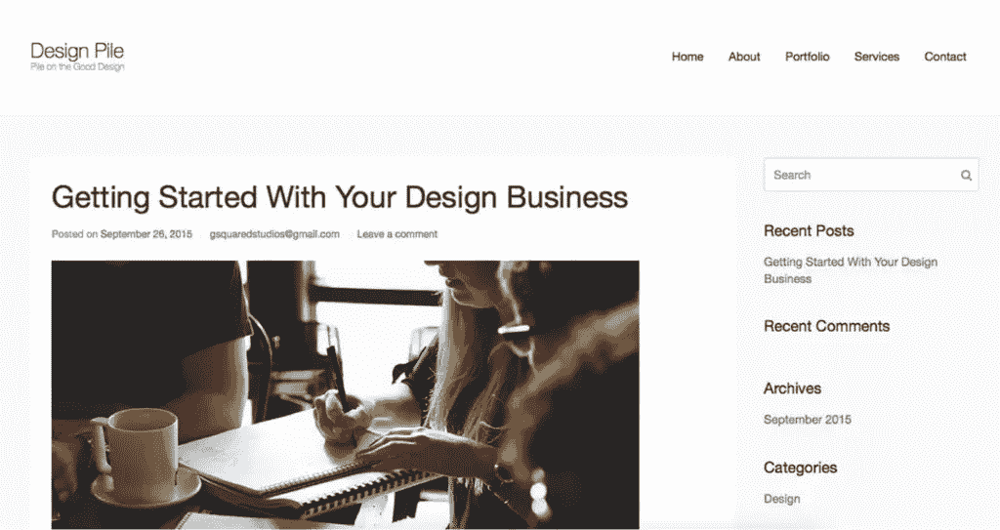
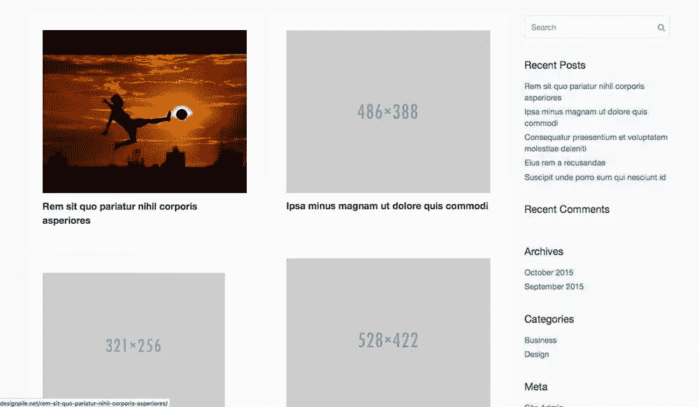
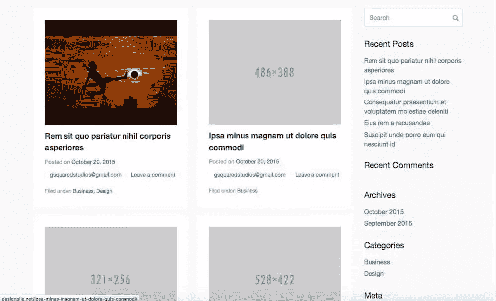
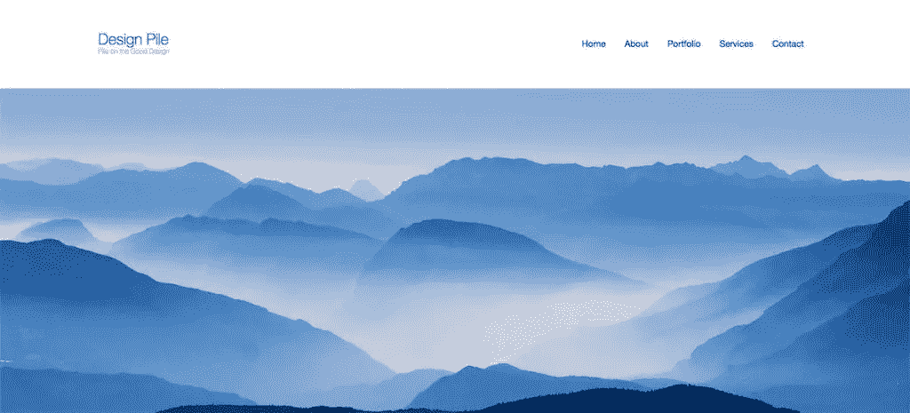
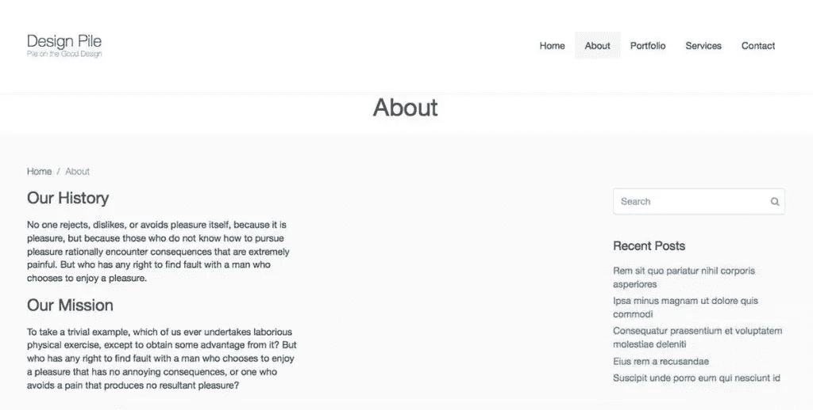

# 介绍 Beans:一个简化的 WordPress 框架

> 原文：<https://www.sitepoint.com/introducing-beans-streamlined-wordpress-framework/>

*本文由[豆](http://www.getbeans.io/)赞助。感谢您对使 SitePoint 成为可能的赞助商的支持。*

如果你使用 WordPress 开发网站和主题，那么你就会明白需要做多少工作。从头开始工作会让你觉得你在试图重新发明轮子，所以许多开发人员使用框架来加速这个过程。找到正确的框架意味着更容易的开发过程。

这篇文章将概述一个开发 WordPress 站点的新框架，称为 Beans，并展示它对于创建 WordPress 站点是如何的有用。

## 介绍豆子

Beans 是一个入门主题/框架，它允许你挑选建立你的网站所需要的特性，并删减掉你不需要的部分。它重量轻，速度快，同时给你很大的灵活性。

Beans 使内容响应和图像自适应，自动创建多个版本的图像，并为正在观看的设备提供正确的图像。内容也会对设备做出响应，重新构建和组织以最适合设备的显示。

在将它与其最接近的竞争对手 Genesis(我已经在 SitePoint 上介绍过 Genesis)进行比较之前，让我们仔细看看这个框架的几个方面。

### 搜索引擎优化

Beans 是为 SEO 友好而构建的。其他的主题和框架都不是语义性的，它们的构建也没有考虑到 SEO。Beans 是为描述性和语义性而构建的，这使得它为搜索引擎进行了优化。您不必担心您的内容是否满足搜索引擎索引的要求，它已经内置到框架中了。Beans 是轻量级的，并针对移动设备进行了优化——这两个特性对于 SEO 的成功至关重要。

### 儿童主题

Beans 使用并推荐使用子主题来构建定制站点。这意味着当 Beans 更新时，您的站点不会中断。Beans 团队还提供了一个基本的子主题来帮助您开始。

### 网站设计

使用 Beans，您可以全局或单独控制每个页面的结构。你可以在 WordPress admin 的自定义部分设置网站的布局。您还可以控制每页的布局。你可以选择一个左右侧边栏，两个左右侧边栏，两边各有一个侧边栏，或者根本没有侧边栏。

### 组织

Beans 使您的代码看起来整洁有序。如果您发现自己为某个特定的页面编写了太多的代码，您可以将其全部放入该页面的页面模板中。这让你不必在你的`functions.php`文件中整理混乱的代码。您可以将特定代码放在高度定制的页面上。

甚至 CSS 也很容易更新和维护。可以少用，也可以用 CSS。所有内容都保存在子主题中的 style.css 文件中。这使您不必在主 CSS 文件中寻找您要找的行。您只需添加 CSS 来覆盖某些内容的外观或结构。

### 经得起未来考验的

Beans 强调创建子主题的原因之一是，当 Beans 更新其核心主题时，您的站点不会崩溃。你可能不得不更新你的孩子主题中的一行代码，但这总比以一个坏掉的站点结束要好。

现在让我们来看看如何将 Beans 与其最接近的竞争对手 Genesis 进行比较。

## 豆子大战创世纪

考虑 Beans 时，第一个明显的问题是，它的方法与 Genesis 相比如何？我安装了 Beans 并建立了一个站点来比较它与基于 Genesis 的站点的运行情况。

### 出现

创世纪的主题看起来都很相似。这在很大程度上取决于开发者，但许多创世纪网站在外观和结构上看起来都很相似。Beans 提供了创建您所能想象的任何东西的灵活性。通过 UIkit 集成，您可以访问各种组件，为自己或客户创建一个现代化的定制网站。UIkit 本身可以定制成你想要的样子，这使得它很容易使用，也很容易创建一个定制的外观。

### 页面重量

Beans 也比 Genesis 构建了更多的轻量级站点，因为你只需要调用你的站点。不使用不需要的脚本和组件，也不为这些项目加载脚本。

### 灵活性

在 Beans 中，您可以在每页的基础上移除和显示元素，这使得定制变得快速和容易。这就像你的`functions.php`文件中的一行代码一样简单。

您还可以更加灵活地控制网站的 HTML。您只加载您需要的标记。您可以使用 UIkit HTML 属性来设计页面的样式和布局。构建 Beans WordPress 站点的最大区别是在每一个 HTML 标记的前后都有钩子。您可以轻松地添加内容，使您能够根据需要移动元素。

### 速度

总体来说，Beans 更快。有几个原因。第一个原因是所有的资产都合并到一个文件中。此外，在每页的基础上，你只加载你需要的。这意味着你不会在页面上加载不必要的标记。这一切都是用豆子控制的。

Beans 更快的另一个原因是，您可以构建相当复杂的站点，而不必依赖于实现大量消耗资源的插件来添加功能。当结合 Beans 只加载页面需要的内容而不加载任何额外内容这一事实时，对于任何 WordPress 开发者来说，它都是一个精简而快速的解决方案。

### UIkit 集成

UIkit 是一个内置于 Beans 中的开源前端框架，旨在帮助您构建华丽的网站而不会臃肿。您只加载每页所需的内容，这意味着您不会加载不使用的脚本和组件。这使得你的网站很有吸引力，而且速度快如闪电。

我把它作为自己的一部分，因为它对我来说很重要。UIkit 的集成使您能够创建任何类型的布局。您所需要的只是应用于一个元素(如 div)的正确的 CSS 类，它将控制页面的结构。它使构建变得容易，因为它类似于许多开发人员已经知道的框架，比如 Bootstrap。您可以动态加载组件，但只能在需要时加载。

UIkit 集成允许您为对齐之类的事情添加类，而不必每次都为它编写特殊的 CSS。例如，在“关于”页面上，我希望标题居中。我可以添加一个实用程序类来完成这项工作，而不是为一个特殊的标题类编写一组 CSS。我使用了:

```
<h1 class="uk-text-center">About</h1>
```

像这样的类可以添加到其他 Beans 类之上，这样就很容易得到您想要的布局，而不必编写一个又一个代码块。

### 字段 API

Beans 实现的另一个突出特性是 Fields API。目前，WordPress 没有 fields API。如果你曾经尝试过在后台构建、组织或更改内容，那么完成这一任务会是一件非常麻烦的事情。Fields API 提供了一系列可以在 WordPress 后端使用的字段。如果你正在构建一个完全定制的 WordPress 网站，你可能会想要为网站特定信息添加后端选项和字段。

您可以创建选项字段、发布元字段和定制字段。这些都是 WordPress 用户在使用高质量主题时寻找的流行特性。您可以实现的不同字段类型有:

文本–在此输入一个单词。文本区–你可以在这里放置一段文字。
选择–选择一个可用选项。
复选框——启用某项功能的复选框。
单选–基于文本或图像的单选列表。
图像–启用单幅图像或一组图像。
滑块–滑块帽允许您在一个范围内选择一个特定值。
组–一组字段。

要实现字段，您将对所有 4 种字段类型使用`admin_init`。您可以设置字段 id 和标签。您可以使用`beans_get_post_meta`或其他密切相关的钩子在前端显示这些值。这使你能够在你的主题中显示任何你想要的信息。

### 定制者

越来越多的 WordPress 用户希望看到定制器在选择选项时发挥作用。当您在后端操作值时，定制器显示站点的实时前端视图。定制器实际上只是一组堆叠的主题选项，在您查看现场时显示。这使您不必保存后端并回来修改您的选择。Fields API 允许您从前端完全控制定制器。

### 免费和开源

Beans 是 100%免费和开源的。还有其他缺乏特性的框架，但是你最终还是要为它们付费。在文档之上，它们提供了有用的代码片段和代码参考，在整个过程中为您提供帮助。

### 证明文件

Beans 也有很好的文档，每个组件都有示例，向您展示如何实现每个特性。你从一个好的起点开始，从那里开始，天空就是你所能建造的极限。

现在我们已经看了 Beans 与 Genesis 的比较，让我们更仔细地看看如何使用这个框架。

## 入门指南

开始使用 Beans 再简单不过了。首先，[访问 Beans 网站](http://www.getbeans.io/)，下载安装 Beans 框架。然后，你会想去他们网站的“[儿童主题](http://www.getbeans.io/documentation/starter-child-theme/)”部分下载儿童主题。在确保安装了基础框架之后，返回到 WordPress 仪表板并安装子主题。在安装子主题之前，您必须下载并安装基本主题。

### 在你开始建造之前

您需要深入研究文档，以熟悉框架的工作方式。在工作中，您可能需要回顾和参考一些东西。

ui kit API–这是集成在主题本身中的一组组件。您有大量的定制选项，这提供了很大的灵活性。

**了解子主题和文件结构如何工作**–你需要对主题和子主题如何工作有一个基本的工作知识，包括每个文件是什么和它的用途。这将有助于你理解如何修改你的主题。[这个 SitePoint 截屏展示了创建子主题](https://www.sitepoint.com/watch-create-your-first-wordpress-child-theme-quick-fast/)的基本过程。

**Beans HTML API**——这允许您轻松地修改页面布局。您可以根据需要修改标记，为您的主题创建真正自定义的结构。

### 现在到*真的*开始了

导航到`Admin > Appearance > Settings`来设置 Beans 框架的选项。当你建立你的站点时，如果你使用较少，你会想要启用开发模式。这里还有其他选项，比如刷新图像和缓存脚本的能力，但是我们暂时不讨论这些。

您可以使用 Less 来覆盖 UIKit 变量，或者直接编辑 CSS。无论您选择哪种方法，您都需要在您的子主题的`functions.php`文件中启用或禁用替代方法。所有新功能都将添加到这里。

在我的例子中，我将使用 CSS，所以我将从`functions.php`文件中删除以下代码块:

```
/*
* Remove this action and callback function if you do not wish to use Less to style your site or overwrite UIkit variables.
* If you are using Less, make sure to enable development mode via the Admin->Appearance->Settings option. Less will then be processed on the fly.
*/
add_action( 'beans_uikit_enqueue_scripts', 'beans_child_enqueue_uikit_assets' );
function beans_child_enqueue_uikit_assets() {
   beans_compiler_add_fragment( 'uikit', get_stylesheet_directory_uri() . '/style.less', 'less' );
}
```

### 如何设计你的网站

Beans 让页面定制变得简单。你不必给页面添加脚本，也不必让你的站点臃肿。您可以混合使用函数和 UIkit 结构系统来构建布局，从而将组件添加到页面中。



在上图中，你可以看到典型的网站设计。这是默认的外观，你会期待任何首发主题。然而，定制是通过`functions.php`文件应用的，这允许您做一些非常有趣的事情。如果我添加下面的代码，布局会改变，站点会进入网格模式。

```
// Enqueue the UIkit dynamic grid component.
add_action( 'beans_uikit_enqueue_scripts', 'beans_child_enqueue_grid_uikit_assets' );

function beans_child_enqueue_grid_uikit_assets() {

	// Stop here if we are on a singular view.
	if ( is_singular() )
		return;

    beans_uikit_enqueue_components( array( 'grid' ), 'add-ons' );

}

// Display posts in a responsive dynamic grid.
add_action( 'wp', 'beans_child_posts_grid' );

function beans_child_posts_grid() {

	// Stop here if we are on a singular view.
	if ( is_singular() )
		return;

	// Add grid.
	beans_wrap_inner_markup( 'beans_content', 'beans_child_posts_grid', 'div', array(
		'data-uk-grid' => '{gutter: 20}'
	) );
	beans_wrap_markup( 'beans_post', 'beans_child_post_grid_column', 'div', array(
		'class' => 'uk-width-large-1-3 uk-width-medium-1-2'
	) );

	// Move the posts pagination after the new grid markup.
	beans_modify_action_hook( 'beans_posts_pagination', 'beans_child_posts_grid_after_markup' );

}
```

你可以在下面的截图中看到它的样子:



你可以从截图中看到，它现在看起来并不漂亮，但是你可以从`functions.php`文件中改变布局的结构。您还可以删除元素并对其重新排序。我不喜欢帖子里面内容的顺序。目前，标题是第一个，其次是元，然后是图像。我希望图像是第一位的，因为读者通常对视觉刺激的反应更大。为了改变这一点，我所要做的就是将下面的代码添加到我的`functions.php`文件中。

```
// Move the post image above the post title.
beans_modify_action_hook( 'beans_post_image', 'beans_post_title_before_markup' );
```



从截图中可以看到，这一小段代码立即将帖子图片移动到了所有内容的上方。我还觉得网格布局没有空间容纳所有的扩展信息，所以我将删除元信息和类别。您可以通过在`functions.php`中放置以下代码来实现:

```
// Remove the post meta categories.
beans_remove_action( 'beans_post_meta_categories' );
// Remove the post meta.
beans_remove_action( 'beans_post_meta' );
```

### 定制设计

向你的站点添加设计元素很简单。如果你想让某些东西只显示在特定的页面上，你可以创建自己的函数。我在 child 主题的主页上添加了一个封面图片。我创建了以下函数:

```
add_action( 'beans_header_after_markup', 'beans_child_home_add_cover' );
function beans_child_home_add_cover() {
	// Only apply to home page.
	if ( !is_home() )
	   return;
	?>
	<div class="uk-cover-background uk-position-relative">
		
	</div>
	<?php
}
```

上面的代码看起来令人生畏，直到你把它分解。首先，您将添加一个动作，就像您对任何其他`functions.php`文件所做的那样。然后，您指定在标题标记之后，您想要创建一个向主页添加封面图像的函数。

接下来，您将告诉 Beans 这个函数是什么。您将指定它仅适用于主页。这基本上是检查当前页面是否是主页，如果是，您希望添加一个响应的封面图像。

应用了“uk”类的*div*是特定于 UIkit 集成的，您可以在文档部分或 UIkit 网站上找到。

刷新页面后，您可以从下面的屏幕截图中看到，封面图像已经放在主页上，就在页眉标记之后。这会将它放在文章内容和侧边栏之前。您将为您创建的任何自定义页面的每个部分创建一个类似上面的函数。



### 过度定制

你要做的一件事是注意每页创建大量的定制。如果您意识到您正在添加许多定制，例如定制布局、添加的功能等。，您最好创建一个页面模板。您可以像平常一样创建一个页面模板，使用一个命名的模板标记，但是您还需要添加特定于 Beans 的代码。下面的示例代码显示了如何在“关于”页面上添加两列文本。

```
 <?php
/* Template Name: About */ ?>
<?php
add_action( 'beans_header_after_markup', 'beans_child_view_add_title' );
function beans_child_view_add_title() {
   ?>
   <div class="uk-container uk-container-center">
        <h1 class="uk-text-center">About</h1>
   </div>
   <?php
}
add_action( 'beans_content_prepend_markup', 'beans_child_view_add_layout' );
function beans_child_view_add_layout() {
    ?><div class="uk-container uk-block">
	<div class="uk-width-medium-1-2">
       <h2>Our History</h2><p>No one rejects, dislikes, or avoids pleasure itself, because it is pleasure, but because those who do not know how to pursue pleasure rationally encounter consequences that are extremely painful. But who has any right to find fault with a man who chooses to enjoy a pleasure.</p>
    </div>
	<div class="uk-width-medium-1-2">
       <h2>Our Mission</h2><p>To take a trivial example, which of us ever undertakes laborious physical exercise, except to obtain some advantage from it? But who has any right to find fault with a man who chooses to enjoy a pleasure that has no annoying consequences, or one who avoids a pain that produces no resultant pleasure?</p>
    </div>
</div><?php
}

// When using page template, it is very important to load the document after the customizations.
beans_load_document(); 
```



请注意 UIkit 标记的集成。这就是你如何建立你的网站结构。我上面展示的方法在有限的基础上是可以的，但是如果您正在获取大量的内容，比如一组帖子，您将需要使用 Beans 在其文档中提供的钩子。

Beans 的钩子允许你在任何你指定的地方绑定到 WordPress 结构。例如，示例代码:

```
do_action ( 'beans_after_posts_loop' )
```

在显示帖子列表后启动命令。你可以在这里放置分页。如果您想添加面包屑，您可以使用:

```
do_action ( 'beans_before_posts_loop' )
```

## 结论

您可能需要很短的时间来熟悉 Beans 框架，但是一旦您熟悉了，您将能够在平时的一小部分时间内创建一个高度定制的网站。您可以为每个页面开发自定义布局，同时保持整个网站的轻量级。

与 Genesis 框架相比，您可以使用 Beans 做任何您可以使用 Genesis 做的事情，但是您在结构、设计和定制方面有更多的选择，而不必筛选现有代码或需要其他插件。

感兴趣吗？[点此](http://www.getbeans.io/)今天就开始吃豆子。

## 分享这篇文章