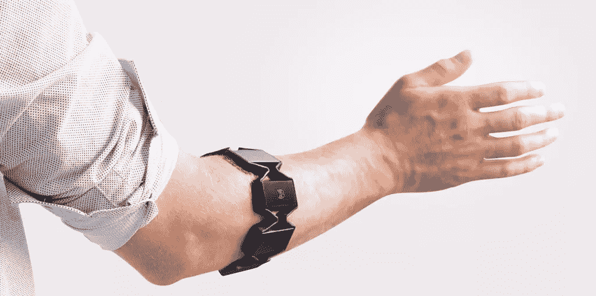

# 通过 Node.js 中的 Myo 臂环进行手势控制

> 原文：<https://www.sitepoint.com/gesture-control-via-the-myo-armband-in-node-js/>

在这个世界上，我们都希望通过让我们感觉像巫师一样的动作来控制我们的小工具，Myo 臂章是一种祝福。它以令人印象深刻的简单方式为应用程序带来了一些非常简洁的手势控制。虽然您可以在 iOS 和 Android 中实现 Myo API，但我本质上是一名 JavaScript 开发人员，并且喜欢将这类东西连接到节点服务器——所以在本文中，我们将这样做！我们将考虑使用 Myo npm 包将这一功能引入节点服务器。



图片来源:Thalmic 实验室

## 你需要什么

*   我的臂章
*   [Myo Connect](https://developer.thalmic.com/downloads)–这需要在您的电脑上安装并运行。
*   Windows 或 Mac OSX–Myo 目前似乎没有适用于 Linux 的 Myo Connect。
*   对使用 Node 的基本理解——从 npm 开始，SitePoint 的 Peter Dierx 写了一个关于[的非常全面的指南。](https://www.sitepoint.com/beginners-guide-node-package-manager/)

## 入门指南

在进一步操作之前，请确保:

*   你戴着你的 Myo 臂章，它已经充满电，随时可以出发！
*   你已经将你的 Myo 臂章的蓝牙适配器插入了最靠近佩戴你的 Myo 臂章的手臂的 USB 端口(这是对 Myo 软件的较新版本的新要求)。
*   您的电脑上运行了 Myo Connect
*   你记得如何解锁你的 Myo 臂章，以便它检测你的手势(点击你的拇指和中指)。

如果你有所有的排序，我们可以开始了！

## 开始您的项目

通过通常的`npm init`(或者通过制作你自己的`package.json`文件)在你的计算机上创建一个新的启用 npm 的项目。通过`npm install myo --save`安装 npm 模块，并为您的代码创建一个名为`index.js`的文件(或者您更喜欢的节点主文件)。当你想运行服务器时，运行通常的`node index.js`命令。

您也可以通过 Browserify 在前端使用相同的概念——但是我们不会在本文中讨论 Browserify。

使用 require 语句启动您的`index.js`文件，以引入 Myo npm 模块

```
var Myo = require("myo");
```

然后，使用您想出的名称空间运行`Myo.connect()`(例如`com.yourCompany.yourProject`):

```
Myo.connect("com.sitepoint.myoarmbandcontroller");
```

## 检测 Myo 连接

为了检测 Myo 臂环何时连接，我们可以使用`"connected"`事件。成功后提供一个`data`变量和一个`timestamp`变量:

```
Myo.on("connected", function(data, timestamp) {
  console.log("Myo successfully connected. Data: " + JSON.stringify(data) + ". Timestamp: " + timestamp + ".");
});
```

数据变量提供了一个如下所示的 JSON 对象:

```
{
  "mac_address" : "2b-or-n0-2b-QQ-QQ",
  "myo" : 0,
  "name" : "Stark",
  "timestamp" : "35259097032",
  "type" : "connected",
  "version" : [1,5,1970,2]
}
```

它提供了 Myo 的 MAC 地址、Myo 的索引(如果你有不止一个的话)、你给那个 Myo 的名字、它连接时的时间戳(与上面回调中的`timestamp`变量完全相同)、触发这个数据的事件类型以及你正在使用的 Myo Connect 的版本。

有一种更好的方法从事件调用中检索关于您的 Myo 臂章的数据，就像我们将在本文后面看到的这种方法(*版本号似乎以上面的数组形式出现，在另一个版本的调用中以点分隔的版本号出现*)。

## 检测姿态

每个开发人员最想使用 Myo 臂环的事情是检测用户何时做出某些姿势。“姿势”是 Myo 所说的 Myo 理解的特定手势。其中包括`fist`、`fingers_spread`、`wave_in`、`wave_out`和`double_tap`。

为了检测姿态，我们使用`on()`功能来观察它们。下面是一个检测手指张开的示例:

```
Myo.on("fingers_spread", function() {
  console.log("Fingers spread!");
});
```

检测所有其他姿势的工作方式完全相同，只需切换出前面列出的其他事件之一的`fingers_spread`(`fist`、`fingers_spread`、`wave_in`、`wave_out`、`double_tap`)。

另一种检测姿势的方法是观察一般的`pose`事件，然后读取发出的数据。Myo 识别的每个姿势都会触发`pose`事件:

```
Myo.on("pose", function(pose_name) {
  console.log("Myo pose detected! Pose was: " + pose_name + ".");
});
```

如果您想以相同的方式响应多种类型的姿势，这种方法很有用:

```
Myo.on("pose", function(pose_name) {
  switch (pose_name) {
    case "wave_in":
    case "wave_out":
      console.log("You are waving!");
      break;
  }
});
```

## 检索事件中的 Myo 数据

当你开始使用事件时，你会注意到一件事，如果你继续通过`connected`事件的结构，检索关于臂章的`data`不起作用。例如，这是行不通的:

```
Myo.on("pose", function(data, timestamp) {
  // Note for those copying this code - it is an example of what not to do! Don't copy paste this into your code!
});
```

这个`data`变量现在返回姿势名称，您可能还记得前面的例子。那么，如果我们想找出导致事件发生的 Myo 臂章，我们该怎么做呢？有一种更好的方法来检索 Myo 臂章数据——关键字`this`。例如:

```
Myo.on("fingers_spread", function() {
  console.log("Fingers spread!");
  console.log(this);
});
```

这将记录关于刚刚通过`fingers_spread`事件发送的 Myo 臂章的一大堆细节。这些数据看起来是这样的:

```
{
  "macAddress": "2b-or-n0-2b-QQ-QQ",
  "name": "Stark",
  "connectIndex": 0,
  "locked": false,
  "connected": true,
  "synced": true,
  "batteryLevel": 0,
  "lastIMU": {
    "orientation": {
      "w": -0.54913330078125,
      "x": -0.4156494140625,
      "y": -0.362060546875,
      "z": -0.6282958984375
    },
    "accelerometer": {
      "x": 0.1279296875,
      "y": 0.8095703125,
      "z": 0.40673828125
    },
    "gyroscope": {
      "x": -3.8125,
      "y": -12.625,
      "z": 10.9375
    }
  },
  "arm": "left",
  "direction": "toward_elbow",
  "warmupState": "warm",
  "orientationOffset": {
    "x": 0,
    "y": 0,
    "z": 0,
    "w": 1
  },
  "events": [],
  "connectVersion": "1.5.1970.2",
  "lastQuant": {
    "w": -0.54913330078125,
    "x": -0.4156494140625,
    "y": -0.362060546875,
    "z": -0.6282958984375
  },
  "lastPose": null
}
```

虽然我不会详细介绍这里将要介绍的所有内容，但是有很多内容需要修改！我们有臂章的 MAC 地址和名称，它是否锁定，电池电量(尽管它看起来不正确)，最后一个 IMU *(惯性测量单元)*数据(9 轴 IMU 跟踪臂章的陀螺仪、加速度计和方向的移动——这可以提供无限可能的数据)等等。

## 其他可能性

通过使用 Myo 提供的 EMG 和 IMU 数据来检测完全自定义的手势，您可以使用 Myo 探索大量更高级的跟踪选项，这是我们将在未来的文章中探索的内容！

## 结论

正如你所看到的，在一个节点服务器中设置 Myo 手势功能实际上很好，也很简单——但是它带来了很多非常有趣的可能性。在每个手势的这些回调函数中，你可以运行任何与 Node 和 npm 一起工作的东西——连接你的物联网设备，[发送一些 IFTTT 触发器](https://www.sitepoint.com/connecting-the-iot-and-node-js-to-ifttt)，[控制基于 Arduino 的 NodeBot](https://www.sitepoint.com/an-introduction-to-nodebots) 或其他任何东西！

如果你确实使用 Myo 臂环和上面的这些代码示例神奇地控制了一个节点或基于 JavaScript 的应用程序，请在评论中分享或在 Twitter 上与我联系( [@thatpatrickguy](http://www.twitter.com/thatpatrickguy) )。我喜欢看到社区中的开发人员在做什么！

## 分享这篇文章