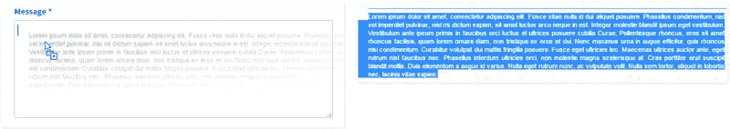
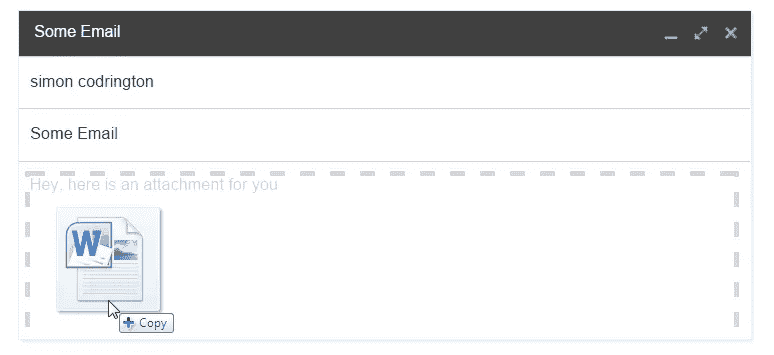
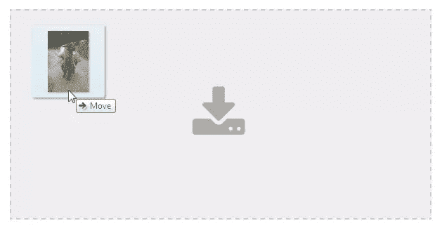

# 使用 HTML5 的本地拖放 API

> 原文：<https://www.sitepoint.com/html5-native-drag-and-drop-api/>

每个人都喜欢易于使用和交互式的用户界面，自从智能手机推出以来，用户的期望一直在飙升；期望是你的网站将是直观的，将使用普遍理解的行动，并在总体上证明了一个简单的方法来参与你的网站。

给予用户拖放和排序的能力会使你的站点更加直观，因为人们知道如何将元素 X 移动到位置 Y，并且将对象 A 移动到对象 B 的前面会使对象 A 排在前面。

处理拖放和排序一直是 JavaScript 的任务，开发人员以前可以选择构建自己的交互或者使用预构建的解决方案。随着 **HTML5 拖放 API** 的出现，开发者将能够挂钩本地事件和属性来处理这些交互。

## 简介

让我们浏览一下 API，这样我们就可以了解它是如何工作的。

原生 API 允许我们通过在所需元素上使用`draggable="true"`属性来定义可拖动的元素。默认情况下，有些元素即使没有任何修改也是可拖动的(比如图像或文本)。


默认情况下，当可拖动的元素被拖动时，只有`form`元素，如`input`能够接受它们作为拖放。你以前应该见过这个。如果您选择一些文本并将其拖动到`textarea`中，该文本将被复制到`textarea`元素中。



本机 API 还处理从操作系统的外部区域到拖放区的拖动。几乎所有好的内容管理系统都提供内容的拖放上传。由于这些元素是外部的，所以您需要配置的只是拖放区(并且还要有一个兼容的浏览器)。



### 关于移动设备的快速说明

目前，本机 API 不支持移动设备。虽然这在将来可能会改变，但是最好从桌面浏览器查看这些示例，这样您就可以看到它是如何工作的

## 拖放 API 事件

本地 API 提供了以下**事件**，您可以监听这些事件。这些事件将应用于**可拖动项目**或**拖放区**，并将在设定的时间触发。

当这些事件被触发时，我们可以访问一个本地对象(我们称之为`event`)。这个对象保存了关于事件本身的更多信息，并且将允许您访问`dataTransfer`对象，在这里您将设置您的大多数方法和属性。

我们需要将一个回调函数挂接到每个事件上，这样我们就可以与 API 进行交互:

```
// add a handler to trigger on dragstart
document.addEventListener('dragstart', function(event) {
  // add your dragstart code here
}, false);
```

### 拖动相关事件

这些事件仅在可拖动的项目上触发。

**[dragstart](https://developer.mozilla.org/en-US/docs/Web/Events/dragstart)**
一开始拖动就触发。在这里，我们需要告诉 API 我们将拖动什么，并设置其他值。使用`setData()`方法设置想要保存的数据，为 draggable 元素设置`effectAllowed`属性，用`setDragImage()`定义 draggable helper。

**[拖动](https://developer.mozilla.org/en-US/docs/Web/Reference/Events/drag)**
该事件在拖动过程中不断触发。它出现的次数取决于浏览器。这对于确定可拖动项目的确切位置非常有用。

**您可以使用此事件重置拖动时应用的样式或执行其他清理动作。`dragend`事件可以访问 draggable，这样你就可以在拖动结束后进行计算(例如，通过寻找新添加的元素，然后移除原来的 draggable 来查看`drop`事件是否成功)。**

### 丢弃相关事件

这些事件仅在您指定为放置目标的元素上触发(或者已经是自然放置目标，如表单元素):

当一个可拖动的物体进入可投放区域时，触发一次。当超过 50%的可拖动部分位于拖放区内时，将触发此操作。

该事件设置拖放区的`dropEffect`。默认情况下，非表单元素上的拖放不会做任何事情。你将需要手动调用`event.preventDefault()`和`event.stopPropagation()`来告诉 API 这个下降应该发生。

您可以检查`dataTransfer`对象的`effectAllowed`值，该值已经由 draggable 设置，然后将其与拖放区的`dropEffect`值进行比较。如果这些值不能一起工作(例如，一个是`copy`，另一个是`link`)，那么浏览器将不能成功删除该项(即使您阻止了默认设置并停止了传播)。

您可以使用`types`属性来获取在`dragstart`事件中设置的所有数据类型的列表。您看不到数据，但可以看到它的类型。在这里，您可以使用另一种叫做`contains`的方法来查看是否已经建立了某种类型的数据。这是通过`event.dataTransfer.types.contains(type)`方法完成的。例如，你可以用它来确保某些东西已经被设置为`text/html`类型。

现在你可以设置类或者触发动作，因为你知道你的可拖动对象已经进入了拖放区(一个常见的主题是改变拖放区的样式以显示它正在被激活)。

**[dragover](https://developer.mozilla.org/en-US/docs/Web/Events/dragover)**这个事件本质上与`dragenter`相同，但当可拖动的项目在拖放区内时，它会被连续调用。如果您想确定可拖动对象的确切位置，这个事件是最理想的(因为它会不断更新)。

这个事件设置了拖放区的`dropEffect`，和`dragenter`一样，您需要防止默认和传播。

**[拖拽离开](https://developer.mozilla.org/en-US/docs/Web/Events/dragleave)**
一旦被拖拽者离开拖拽区域就会被触发。它通常用于移除在`dragenter`或`dragover`事件中添加的样式，并在可拖动对象与拖放区不重叠时触发。

**[拖放](https://developer.mozilla.org/en-US/docs/Web/Events/drop)**
一旦可拖动的对象被释放，拖放区同意接受拖放，就会触发此事件。只有当可拖动元素和放置区域具有正确的`dropEffect`和`effectAllowed`值时，才会触发。在 drop 上你需要使用`getData()`方法收集信息。

## 拖放 API 方法

在处理本地拖放 API 时， [dataTransfer](http://help.dottoro.com/ljmpcqdb.php) 对象是我们将与之交互的主要项目。它作为事件回调函数的一部分向我们公开，并提供了几个函数供我们使用。

**[setData](http://help.dottoro.com/ljvspfdo.php)**
该方法通过调用[event . data transfer . setData(type，data)](https://developer.mozilla.org/en-US/docs/Web/API/DataTransfer) 方法设置将从 draggable 中收集的数据。您需要传入保存的数据类型和数据本身。这必须在`dragstart`事件中设置，否则将会失败。它的值只能在稍后的`drop`事件中收集。

`type`参数应该是[适用的数据类型](http://www.iana.org/assignments/media-types/media-types.xhtml)。如果你使用 Chrome、Safari 或 Firefox，你可以使用许多不同的类型，比如`text/html`或`text/uri-list`。如果您使用的是 Internet Explorer，您必须将其设置为`Text`或`URL`(完全按照这种方式，否则会导致错误)。

`data`参数是您想要保存的数据。您可以保存一个 URL、一段 HTML 或任何其他数据。每个`type`只能设置一条数据。例如，如果您将`text/html`设置为某个 HTML，那么您就不能用新信息再次调用`setData()`方法，因为它将替换旧内容。

**[getData](http://help.dottoro.com/ljolwfvj.php)**
这是`setData()`方法的对应物，用于在`startdrag`事件期间收集被拖动元素设置的数据。您通过调用`event.dataTransfer.getData(type)`来收集数据，指定要收集的数据类型。

您很可能必须使用`event.dataTransfer.types`来检查设置了什么类型，以查看传递了什么格式。如果您试图访问尚未设置的数据类型，Internet Explorer 将引发错误。

这个方法只能在`drop`事件中使用，因为只有在这个时候 API 才会公开这些值，这样您就可以收集它们(这是为了在传输过程中保护数据)。

**[clearData](http://help.dottoro.com/ljdbqmud.php)**
这正如它的名字所暗示的那样，它使用`setData`清除任何数据集，并以格式:`event.dataTransfer.clearData(type)`编写。您需要指定正在清除的数据类型(如`text/html`或`URL`)。这个方法只能在`dragstart`事件里面使用。

**[setDragImage](http://help.dottoro.com/ljdpgfkx.php)**
该方法使用格式:[event . data transfer . setDragImage()](https://developer.mozilla.org/en-US/docs/Web/Guide/HTML/Drag_operations#dragfeedback)设置拖动开始时要显示的拖动图像。默认情况下，当拖动时，用户将看到他们拖动的半透明图像。使用这种方法，您可以定义自己的图像或元素在拖动过程中出现。这可以在除了 Internet Explorer 和[之外的所有浏览器中运行，目前也没有计划将其包含在](https://wpdev.uservoice.com/forums/257854-microsoft-edge-developer/suggestions/6542268-setdragimage-on-datatransfer-of-dragevent)中。

## 拖放 API 属性

[我们可以为`dataTransfer`对象](http://help.dottoro.com/ljmpcqdb.php)设置几个属性。我们使用从事件回调传递给我们的**事件**变量来设置这些属性。

**[effect allowed](http://help.dottoro.com/ljevcwjm.php)**
这是在可拖动项目上指定的。这将告诉 API 关于拖动事件以及光标将使用什么图标(这取决于操作系统和浏览器)。它是通过给`dragstart`事件中的[event . data transfer . effect allowed](https://developer.mozilla.org/en-US/docs/Web/API/DataTransfer#effectAllowed.28.29)赋值来调用的，取值可能为`copy`、`move`、`link`、`copyLink`、`copyMove`、`linkMove`、`all`、`none`或`uninitialized`。

如果这个值与`dropEffect`不匹配，它将阻止`drop`事件被调用(确保只发生适当的丢弃)。

**[drop effect](http://help.dottoro.com/ljffjemc.php)**
该属性是在拖放区上指定的，它决定了允许哪些拖动项拖放到该区上。在`dragenter`或`dragover`事件期间，应通过`event.dataTransfer.dropEffect`为其赋值。`dropEffect`取`copy`、`link`、`move`或`none`的可能值。

就像`effectAllowed`一样，如果这个值与`effectAllowed`不匹配，它将阻止`drop`事件被调用(确保只发生适当的丢弃)。

**[文件](http://help.dottoro.com/ljslrhdh.php)**
该属性包含所有已设置的本地文件列表。叫做利用`event.dataTransfer.files`。只有被调用的文件被从操作系统拖到网站上(例如，图像从您的桌面拖到您网站的上传容器)。如果拖动了常规的现场项目，该属性将始终为空(例如，如果拖动图像，将没有为`files`设置的数据)。

你可以在这里查看我们是否有文件。如果我们有它们，我们可以使用 [fileReader 对象](https://developer.mozilla.org/en/docs/Web/API/FileReader)读入并处理文件的内容。

**[类型](http://help.dottoro.com/ljchqudq.php)**
该属性提供了当前拖动中已经设置的所有数据类型的列表。使用`event.dataTransfer.types`方法调用。这在`dragenter`和`dragover`事件期间很有用，这样您就可以看到设置了什么数据类型。

### `effectAllowed`和`dropEffect`在动作

如果你很想知道如何在实践中使用这些属性，请看下面的 CodePen 演示:

在 [CodePen](http://codepen.io) 上通过 SitePoint ( [@SitePoint](http://codepen.io/SitePoint) )查看 Pen [原生拖放 effectAllowed 和 DropEffect 属性](http://codepen.io/SitePoint/pen/epQPNP/)。

在这里，我们定义了不同的可拖动项目，并设置它们可以被放在哪里。我们还创建了几个可拖放的区域，并设置它们将接受哪些可拖动的类型。正确设置这些属性将确保您的浏览器知道哪些可拖动的项目是允许被丢弃的。

尽管 Internet Explorer 支持`effectAllowed`和`dropEffect`属性，但它并没有实现任何本地功能，只允许将适用的拖放到拖放区。Chrome、Safari 和 Firefox 会限制你的拖拽项，防止不正确的拖拽，拒绝触发`drop`事件。在 IE 上，您需要通过比较值来手动拒绝这些下降，因为`drop`事件仍然会触发。

## 用原生 API 构建一些东西

对于 API 来说，有相当多的信息需要处理，所以让我们把所有的东西放在一个实际的例子中。

本地 API 主要关注的是**可拖动**和**可放下**元素之间的交互以及它们的数据传输。原生 API 并不关心你移动两个元素来改变它们的位置，API 更关心它的数据，正是这种关注使它变得独特。

关于原生 API 最好的事情之一是，它可以处理不同类型的数据(T1)和来自多个位置的数据(T3)。

数据类型包括:

*   纯文本字符串
*   文本/ HTML 内容
*   URL 列表
*   单个或多个文件
*   多个其他类型/自定义类型

数据位置包括:

*   拖放来自内部元素的数据
*   来自不同选项卡、窗口或不同浏览器的可拖动元素的数据
*   来自本地源(如您的桌面)的数据

## 拖放时处理元素之间的数据

本机 API 提供了支持拖放元素的基础。与 jQuery UI 不同的是，API 为您提供了事件来了解何时发生了成功的拖动，您需要手动移动/复制元素来调整 API。

这是因为当您开始拖动一个元素时，您触发了它的`dragStart`事件，在此期间，您设置了您想要传输的数据(以及您希望您的可拖动对象具有的适当效果，如复制、移动、链接等)。当你最终放下你拖动的元素，如果它在正确的位置，它将触发放置区域的`drop`事件。它处理您想要移动的数据，而不是 UI 元素(您需要用 JavaScript 手动调整)。

让我们看一个实际的例子，这样你就能明白这是如何工作的。

## 例子:一个拖放益智游戏

看看下面的例子，看看我们如何使用 API 在同一个页面上的元素之间传输数据。

在 [CodePen](http://codepen.io) 上通过 SitePoint ( [@SitePoint](http://codepen.io/SitePoint) )查看笔[原生拖拽&Drop——单页](http://codepen.io/SitePoint/pen/yYQRvG/)数据传输。

在本例中，我们定义了一系列区域。左侧将保存我们的主要拼图块，而右侧有一系列的空落区。“游戏”是将棋子从左边拖到右边，完成拼图。

### 在`dragStart`上设置数据

在我们拼图块的`dragStart`事件中，我们首先设置`effectAllowed`来告诉这个项目它接受一个基于`copy`的拖拽。

然后，我们收集`src`(图像源)和`outerHTML` (HTML 节点)，并将它们放入我们的数据传输对象中作为`text/uri-list`和`text/html`。如果我们在 Internet Explorer 上，我们只需保存被拖动元素的`src`，并将其保存为`text`格式。

```
var dragItem;
// triggered draggable as we start dragging
function dragStart(event) {
  drag = event.target;
  dragItem = event.target;

  // set the effectAllowed for the drag item
  event.dataTransfer.effectAllowed = 'copy';

  var imageSrc = $(dragItem).prop('src');
  var imageHTML = $(dragItem).prop('outerHTML');

  // check for IE (it supports only 'text' or 'URL')
  try {
    event.dataTransfer.setData('text/uri-list', imageSrc);
    event.dataTransfer.setData('text/html', imageHTML);
  } catch (e) {
    event.dataTransfer.setData('text', imageSrc);
  }

  $(drag).addClass('drag-active');
}
```

### 纠正`effectAllowed` / `dropEffect`

在我们放下拼图之前，`dragEnter`和`dragOver`事件都将被触发。请记住，为了能够删除，我们需要返回 false / prevent default 来告诉浏览器可以删除。这两个函数都将把拖放区的`dropEffect`设置为`copy`，这意味着它将接受所有以`copy`为`effectAllowed`的拖动项目(我们的项目恰好有这样的功能，所以一切都很好)。我之所以在这里提到这一点，是因为如果它们不匹配，drop 事件将不会触发，拖动将被取消。

### 收集我们空投的数据

当我们将区域放到右边时，我们使用`getData`方法提取我们的`text/uri-list`和`text/html`数据集。如果我们没有这些数据(如果我们在 Internet Explorer 上访问这些数据)，我们只需提取`text`数据。

这就是我们基于现有数据的不同之处。如果我们可以访问`dataHTML`，这意味着我们在一个完全受支持的浏览器上，我们可以访问整个被拖动的节点。如果我们这样做，我们将整个项目添加到拖放区，拖放就完成了。

如果我们没有支持，我们需要克隆我们在`dragStart`事件中设置的`dragItem`来获得节点。然后，我们将它添加到拖放区，完成所有工作。

```
// called when draggable is dropped on droppable 
function drop(event) {

  drop = this;
  $(drop).removeClass('drop-active');

  var dataList, dataHTML, dataText;

  // collect our data (based on what browser support we have)
  try {
    dataList = event.dataTransfer.getData('text/uri-list');
    dataHTML = event.dataTransfer.getData('text/html');
  } catch (e) {
    dataText = event.dataTransfer.getData('text');
  }

  // we have access to the HTML
  if (dataHTML) {
    $(drop).empty();
    $(drop).prepend(dataHTML);

    // check if this element is in the right spot
    checkCorrectDrop(drop, dragItem);

    // see if the final image is complete
    checkCorrectFinalImage();
  }

  // only have access to text (old browsers + IE)

  else {
    $(drop).empty();
    $(drop).prepend($(dragItem).clone());

    // check if this element is in the right spot
    checkCorrectDrop(drop, dragItem);

    // see if the final image is complete
    checkCorrectFinalImage();
  }

  event.preventDefault();
  event.stopPropagation();
}
```

### 完成游戏

两个 drop 事件都调用了`checkCorrectDrop(drop, dragItem)`和`checkCorrectFinalImage()`函数。这些是我们游戏用的。

`checkCorrectDrop()`函数检查名为`data-value`的自定义属性对于拖放区和拖动项是否相同。如果这两个是相同的，那么这一块属于这里，并用绿色边框突出显示(和`active`类)。

`checkCorrectFinalImage()`功能检查是否所有的拼图块都被放到了正确的位置。如果我们有和要拖动的项目一样多的正确项目，这意味着我们已经完成了拼图——万岁！

## 从其他选项卡和本地桌面移动数据

使用本机 API，您可以定义接受拖动元素的拖放区。虽然这听起来像是 jQuery UI 也能做的事情，但是 jQuery UI 不能允许我们将内容从任何外部选项卡、窗口或外部浏览器直接拖动到拖放区。

你已经在很多地方看到过了。有几个网站，你可以把一张图片从一个标签直接拖到一个拖放区，接收网站会负责交互。

为了最大限度地利用拖放功能，必须配置拖放区，使其知道如何处理接收到的数据(因为基本上任何可拖动的元素，如图像、文本、链接和内容，都会被拖放到拖放区中)。

将内容从您的**桌面或本地设备拖到网页**上，并自动完成上传过程，这是一项革命性的功能，让您想知道没有它我们是如何完成任何事情的。

大多数 CMS(例如 WordPress)都有通过拖放界面上传内容的本地支持。Gmail 等其他网络应用程序也提供这一功能，让您可以将内容直接放入某个区域，并自动附加或存储以供使用。

## 示例:从外部源拖动图像

下一个示例将处理来自其他选项卡/窗口的交互式拖放，让拖放区收集图像进行显示。

此外，该示例还将处理本地丢弃的图像。您可以将照片从桌面直接拖放到 dropzone 上，本地 API 将处理图像并显示它们。



如果你很想知道这一切是如何工作的，这里有另一个 CodePen 演示:

见笔[原生拖拽——通过](http://codepen.io/SitePoint/pen/zvMMvr/) [CodePen](http://codepen.io) 上的 SitePoint ( [@SitePoint](http://codepen.io/SitePoint) )将文件直接拖拽到网站上。

这个例子关注的是处理丢弃的项目。与我们必须在拖动中设置数据的其他示例不同，对于这个示例，我们只需要收集数据并确定我们将如何处理它。

在我们的主`drop`函数中，我们首先使用`getData(format)`方法从我们的`dataTransfer`对象收集信息。

```
// get the URL of elements being dragged here
try {
  dataValue = event.dataTransfer.getData('text/uri-list');
  dataType = 'text/uri-list';
} catch (e) {
  dataValue = event.dataTransfer.getData('URL');
  dataType = 'URL';
}
```

我们将它包装在一个主要用于 Internet Explorer 的 try-catch 块中，如果我们试图访问它不理解的`getData()`中的格式，它将抛出一个错误并停止执行。

如果我们能够获得`text/uri-list`格式的数据，我们就收集它；如果不能，我们就退回到使用基本的`URL`属性。

大多数拖动的项目，如图像、链接或数据，都会遇到几种数据类型。因为我们只对这些项目的 URL 感兴趣，所以这样做很好。

如果我们设置了`dataValue`,这意味着用户在我们的区域里放了东西。我们现在需要弄清楚它是什么。我们只想处理图像，但是由于 API 不能区分图像 URL 和标准链接，我们需要做一些检查以确保我们正在删除图像。

```
// determine if our URL is an image
imageDropped = false;
var imageExtensions = ['.jpg','.jpeg','.png','.bmp','.gif'];
for (i = 0; i< imageExtensions.length; i++) { 
  if (dataValue.indexOf(imageExtensions[i]) !== -1) {
    // create our image to add
    var image = '';
    drop.append(image);
    imageDropped = true;
    break;
  }
}
```

我们用已知的图像类型创建一个图像扩展名列表，例如`.jpg`和`.png`，并检查其中一个是否出现在我们的 URL 中。如果是的话，那么我们可以假设我们有一个图像。我们创建一个新的形象，并使用我们收集的价值作为它的来源。

### 处理本地丢弃的项目

局部删除的元素略有不同。我们不用`getData(format)`方法来得到这些，我们用`files()`方法。这将为我们提供一个所有被删除元素的列表，这样我们就可以遍历它们。

```
var dataFiles = event.dataTransfer.files;
var dataOutput = []; 
if (dataFiles) {
  for (i =0; i < dataFiles.length; i++) {
    // do processing here
  } 
}
```

在我们的例子中，我们想检查所有被删除的文件，看看是否有图像。当我们遍历每个文件时，我们可以访问一系列属性，包括`type`属性，它列出了项目的 mime 类型。

```
// check if this is an image
if (dataType.match('image.*')) {
  // it's an image, process further
}
```

如果我们匹配一个图像类型，我们创建一个新的 [fileReader](https://developer.mozilla.org/en/docs/Web/API/FileReader) 对象，我们将使用它将文件读入内存。我们使用 [`readAsDataURL(item)`](https://developer.mozilla.org/en-US/docs/Web/API/FileReader/readAsDataURL) 方法读取我们的文件，当它准备好了，它将触发它的`onload`事件，我们将在那里进一步处理。

```
// read into memory
var reader = new FileReader();

// load element
reader.readAsDataURL(dataItem);
```

我们现在所做的就是收集文件阅读器的结果，并将其添加到 DOM 中。我们已经成功地将一张图片从我们的桌面拖到了我们的网站上！

```
// when our image is loaded
reader.onload = (function(theFile) {
  return function(e) {
    var url = e.target.result;

    drop.append('');
    messageContainer.append('
      <p><strong>Successfully dropped an image from your desktop</strong></p>
    ');
  };
})(dataItem);
```

## 浏览器支持概述

顾名思义，这个 API 为开发人员提供了一组事件和方法，他们可以使用这些事件和方法来提供 UI 交互，而不需要第三方 JavaScript 库。

总的来说，浏览器有很强的桌面支持，几乎没有移动支持，所以它在大多数遵循规范的现代桌面浏览器中都能很好地工作。不过，Internet Explorer 也有自己独特的问题。

桌面支持出奇的好，Chrome、Firefox、Safari 和 Opera 都有全面的支持。另一方面，Internet Explorer 以不同的方式处理 API，根据您使用的版本支持不同的方面。例如:

*   **在 IE7、IE8 和 IE9 中不支持`dataTransfer.files`或`.types`对象。**这意味着在 IE9 之前，你将无法使用本地拖放功能让用户将文件从桌面拖到网页上。
*   **有限的支持格式`dataTransfer.setData/getData`** 实际上，当我们拖动项目时，我们需要将数据存储在我们的 drag 中，这些数据可以在我们的 drop 中访问。在其他浏览器中，你可以用各种类型(例如`text/html`或`text/uri-list`)来存储它，以及你自己的自定义类型。IE 将只支持`Text`或`URL`类型，这意味着你将被限制如何处理你的数据。
*   **任何版本的 IE 或 Edge 都不支持 dataTransfer.setDragImage()方法。**基本上没有设置自定义拖动图像或元素的能力。您将始终获得浏览器默认值(大多数情况下是半透明元素的副本)。

对于移动来说，API 基本没有实际支持(截至 2015 年 10 月)。这可能与移动浏览器本身如何处理交互有关，因为通常你需要拖动和滚动来移动。IE11 是唯一支持它的手机浏览器。

## 额外资源

有很多很好的资源可以获得关于拖放 API 的更多细节。其中一些讨论了可用的方法和可以挂接的事件，而其他一些则详细描述了浏览器的不一致性或概述了很好的示例。

从这些链接开始，当我第一次研究本地拖放时，它们帮助了我:

*   [原生 HTML5 拖放](http://www.html5rocks.com/en/tutorials/dnd/basics/)在 HTML5 岩石上
*   [Dottoro Web 参考上的数据传输对象](http://help.dottoro.com/ljmpcqdb.php)
*   【Mozilla 的拖放功能简介

## 包扎

至此，您应该对本地拖放 API 以及如何利用它来提供交互式界面有了很好的基本理解。你可能需要做大量的实验，才能真正开始理解我在这里讨论的大部分内容。

即使缺乏移动支持，浏览器支持也相当强大，因此有充分的理由考虑在新项目中使用原生 API。

## 分享这篇文章