# 面向前端开发人员的 20 多份文档和指南(第 6 期)

> 原文：<https://www.sitepoint.com/20-docs-guides-front-end-developers-6/>

又到了选择你想温习的工具或技术的时候了。如果你觉得你一直在努力建设，但可能没有学到你想要的那么多，我会支持你。

请欣赏我们的**文档和指南**系列的第六部分，不要忘记让我们知道我们还没有包括在这篇文章或以前的文章中的任何其他内容。

## [1。DevTools 挑战者](http://devtoolschallenger.com/)

一个交互式网站，演示了如何使用 Firefox Developer Edition 中与动画相关的新特性。

## [2。HTML & CSS 做工手册](http://workmanship.io/)

一个很好的 HTML/CSS 样式指南，帮助开发人员编写“持久、可靠”的代码，灵感大致来自 NASA 的工作标准计划。

## [3。ECMAScript 6 备忘单](http://help.wtf/es6)

我觉得 ES6 学习资源不能太多，这里再来一个。ES6 是 JavaScript 历史上的一大进步，该参考资料将为您提供“关于 ECMAScript 标准最新版本的一切”。

[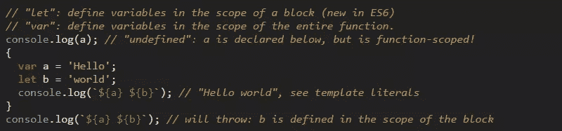](http://help.wtf/es6)

## [4。React 备忘单](http://reactcheatsheet.com/)

React 是官方的“当前大事”,所以这个快速参考应该是一个很大的帮助。该页面可使用顶部的搜索表单进行过滤，每个功能都包括一个到官方文档的链接。

[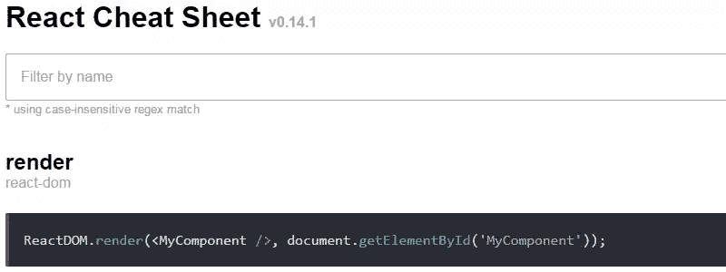](http://reactcheatsheet.com/)

## [5。六速](http://kpdecker.github.io/six-speed/)

一个图表，显示不同 ES6 功能相对于 ES5 基准操作的性能报告信息，由各种 trans piler(Babel、Traceur 等)呈现。

[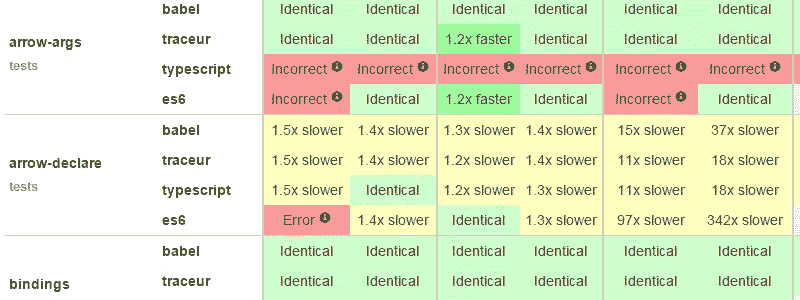](http://kpdecker.github.io/six-speed/)

## [6。美国网页设计标准](https://playbook.cio.gov/designstandards/)

“开源用户界面组件和视觉风格指南，为美国联邦政府网站创造一致和优美的用户体验。”

## [7。ECMAScript 6 —新特性:概述&对比](http://es6-features.org/)

另一个不错的 ES6 学习资源。这本书最棒的地方在于，它的每个特性都有两个代码示例，包括同样的事情在 ES5 中是如何完成的。

[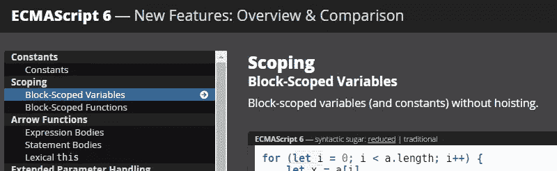](http://es6-features.org/)

## [8。互动 WCAG 2.0](http://code.viget.com/interactive-wcag/)

各种 UI 元素的 Web 内容可访问性指南列表，可按 WCAG 级别、责任(前端、设计、UX 等)过滤。).它还包括来自 W3C 和 WebAIM 的建议。

[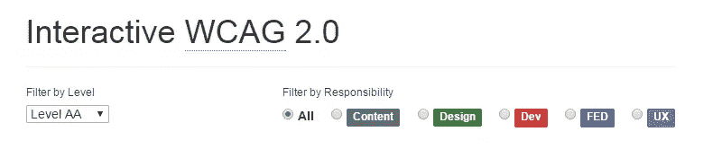](http://code.viget.com/interactive-wcag/)

## [9。Mac OS X 开发设置参考](https://github.com/donnemartin/dev-setup)

“设置新的开发人员机器可能是一个临时的、手动的、耗时的过程。[该参考资料]旨在通过易于理解的说明和点文件/脚本来简化流程，以自动设置“许多不同的任务”。

[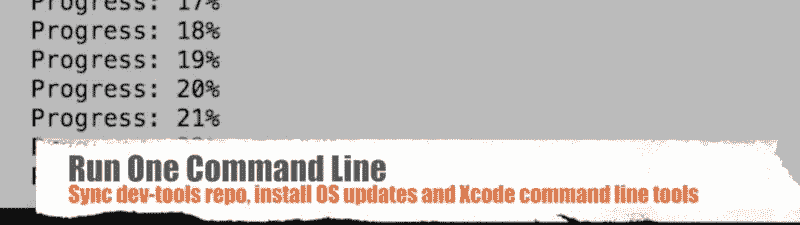](https://github.com/donnemartin/dev-setup)

## 10。动能邮件 CSS 支持

下表列出了交互和动态 CSS 技术常用的主要 HTML & CSS 特性，以及它们在主要电子邮件客户端中的支持。

[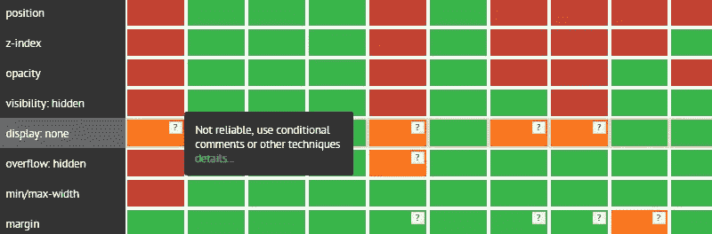](http://freshinbox.com/resources/css.php)

## [11。html book〔t1〕](http://oreillymedia.github.io/HTMLBook/)

由 O'Reilly Media 发起的非官方规范，用于概述基于 XHTML5 的数字和印刷书籍创作和制作标准。Lea Verou 的书 <cite>CSS 秘密</cite>就是用这个标准写的。

[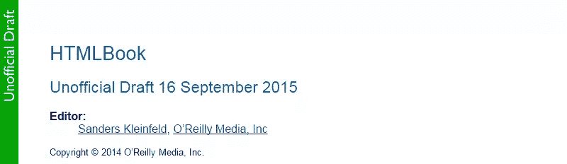](http://oreillymedia.github.io/HTMLBook/)

## [12。ECMAScript 2016 语言规范](http://tc39.github.io/ecma262/)

官方 ECMAScript 规范，现在在 GitHub 上编辑，以单页，易于使用的 HTML 格式，带有过滤器选项。

## 13。DNS 如何工作

“这是对 DNS 工作原理的有趣而丰富多彩的解释……我们制作了这幅漫画来解释当你在浏览器中键入网站地址时会发生什么。”

## [14。静电](http://www.staticgen.com/)

可过滤的“顶级开源静态站点生成器排行榜”允许您按语言、GitHub 星级、分叉和未决问题进行过滤。

## [15\. doiuse…?](http://doiuse.com/)

粘贴一些 CSS 或者一个网站 URL，这个网站会告诉你 CSS 兼容/不兼容什么浏览器。您可以使用 Autoprefixer 允许的列表关键字进行常规搜索或过滤。

[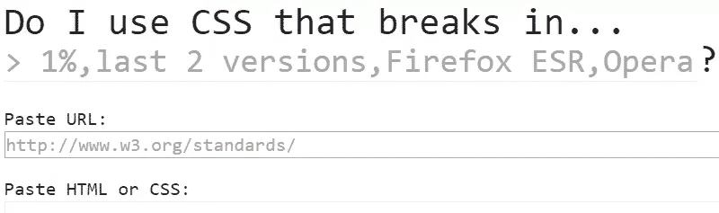](http://doiuse.com/)

## 16。字体家族团聚

几乎任何操作系统上默认本地字体的可过滤兼容性图表。该表会通知您该字体是否受支持、是否有别名，或者是否将恢复为操作系统的默认字体。

[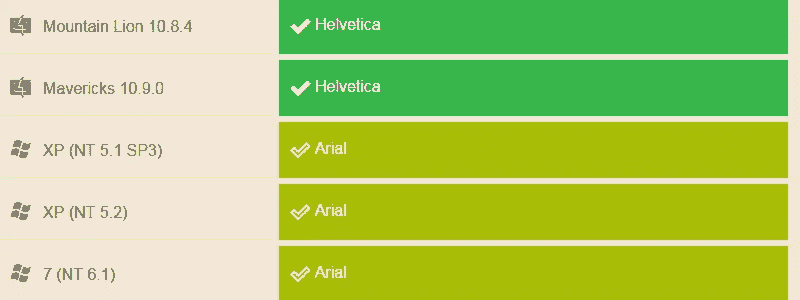](http://fontfamily.io/)

## [17。性能。岩石](http://perf.rocks/)

这是一个单一的资源，可以找到关于 web 性能的文章、工具、视频、演讲、幻灯片和书籍。维护的很好，可以贡献自己的东西。

[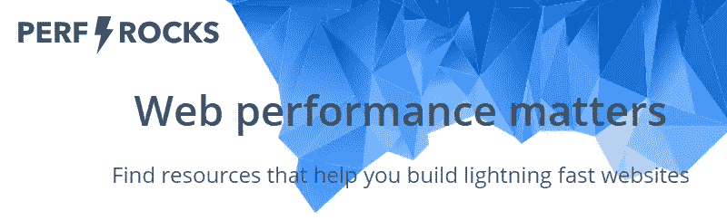](http://perf.rocks/)

## 18。网站风格指南资源

几年来，风格指南一直是一件非常重要的事情。这是一个单一的资源，汇集了工具、文章、书籍、播客以及更多关于风格指南的主题。

[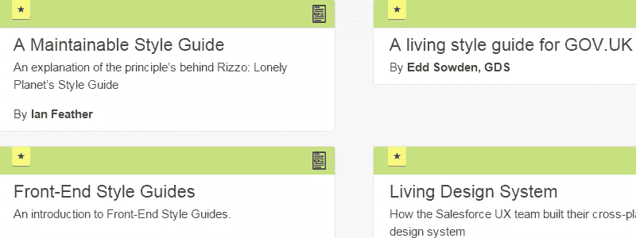](http://styleguides.io/)

## [19。package.json](http://browsenpm.org/package.json)

这是一个交互式指南，用于探索 node.js 应用程序的 package.json 打包格式的各种重要属性。您可以通过将鼠标悬停在属性上或单击属性名称来访问有关属性的信息。

[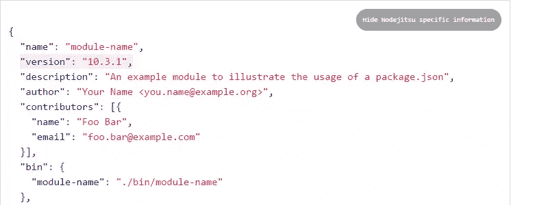](http://browsenpm.org/package.json)

## 20。承诺食谱

JavaScript 中使用承诺的简要介绍。

[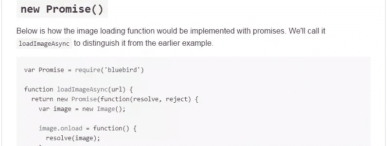](https://github.com/mattdesl/promise-cookbook)

## 荣誉奖……

*   [备选决策树](https://www.w3.org/WAI/tutoriaimg/decision-tree/)
*   [谷歌排名因素](https://northcutt.com/wr/google-ranking-factors/)
*   [w3viewer](http://www.simevidas.com/specs/)
*   [清单 SEO 技巧集](https://github.com/marcobiedermann/search-engine-optimization)
*   实用标准:JavaScript 编码标准和最佳实践

## 建议你的

以下是本系列之前的帖子:

*   [20 份前端开发者文档和指南(第一期)](https://www.sitepoint.com/20-docs-guides-front-end-developers/)
*   [20 份前端开发者文档和指南(第二期)](https://www.sitepoint.com/20-more-docs-guides-front-end-developers/)
*   [20 份前端开发者文档和指南(第三期)](https://www.sitepoint.com/another-20-docs-guides-front-end-developers/)
*   [20 份前端开发者文档和指南(第 4 期)](https://www.sitepoint.com/20-docs-guides-front-end-developers-4/)
*   [20 份前端开发者文档和指南(第 5 期)](https://www.sitepoint.com/20-docs-guides-front-end-developers-5/)

如果你已经为前端开发人员建立或知道另一个学习资源，请在评论中提出来，我会在以后的帖子中考虑它。

## 分享这篇文章