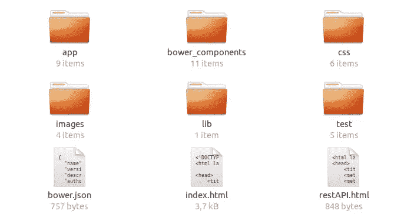

# 使用 Breeze.js 编写更好的查询

> 原文：<https://www.sitepoint.com/better-queries-with-breeze-js/>

*本文由 [Agbonghama Collins](https://www.sitepoint.com/author/acollins/) 同行评审。感谢 SitePoint 的所有同行评审员使 SitePoint 的内容尽可能做到最好！*

数据量正在快速增长，维护起来也变得越来越复杂。许多开发人员希望避免在工作中由数据问题引起的问题和麻烦。

让我们的工作变得更容易的一个库是 [Breeze.js](http://www.getbreezenow.com/) 。在本文中，我们将讨论如何使用 Breeze.js 编写更好的查询。但首先，我们应该知道什么是 Breeze.js 以及为什么创建它。

## 什么是 Breeze.js？

Breeze.js 是一个 JavaScript 库，帮助我们管理富客户端应用程序中的数据。Breeze 可在所有浏览器中运行，支持客户端查询、缓存和动态对象图。

Breeze.js 最大的优点是它不镜像服务器端模型，而是动态创建它。有了 Breeze，快取的资料就在用户端。它不需要查询服务器，因为它可以查询缓存。它在本地和脱机状态下保存缓存。重新连接后，它会同步更改。

Breeze.js 的两大优点是丰富的查询和变更追踪。四种强大的查询方式是[过滤器](http://breeze.github.io/doc-js/query-examples.html#Where)、[排序](http://breeze.github.io/doc-js/query-examples.html#OrderBy)、[分页](http://breeze.github.io/doc-js/query-examples.html#Paging)和[投影](http://breeze.github.io/doc-js/query-examples.html#Projection)。查询需要帮助才能执行，这就是 Breeze EntityManager 的用武之地。每个实体跟踪其自身的变化状态。我们稍后将讨论这一点。

Breeze.js 可以很好地与许多框架配合使用，包括 AngularJS、Backbone.js、Knockout、Node.js 和许多其他框架。

现在让我们看看如何设置环境并开始编码。

## 如何安装

Breeze 可以从 GitHub 上的储存库下载。Breeze 最常见的版本有:

*   [breeze.debug.js](https://github.com/Breeze/breeze.js/blob/ae1f9528479ec9c652a23396c2764a1345681060/build/breeze.debug.js) —这是我建议使用的标准客户端库。它支持第三方库，包括主干库和淘汰库。
*   [breeze . min . js](https://github.com/Breeze/breeze.js/blob/ae1f9528479ec9c652a23396c2764a1345681060/build/breeze.min.js)—breeze . min . js 是缩小的 breeze.debug.js，其大小为 175 KB，而 breeze.debug.js 的大小为 602 KB。

还有另外两种方式获得微风:通过[鲍尔](http://bower.io/)和 [npm](https://www.npmjs.com/) 我更喜欢用 Bower，因为我更熟悉它。打开终端，然后转到客户端目录并运行以下两个命令来获取 Breeze:

```
bower install breeze-client
bower install breeze-client-labs 
```

为了将 Breeze 包含到项目中，您应该在页面的`<body>`中包含以下脚本标签:

```
<script src="bower_components/breeze-client/build/breeze.debug.js"></script> 
```

不支持 ECMAScript 5 的旧浏览器会给 Breeze 带来问题。在这些浏览器上启用 ES5 语法需要一个垫片库。对于 Internet Explorer 用户，建议在`<head>`标记中输入此代码，以避免兼容性模式问题。

```
<meta http-equiv="X-UA-Compatible" content="IE=edge, chrome=1"/> 
```

Breeze 还需要[一些扩展才能正常工作](http://breeze.github.io/doc-js/prerequisites.html):

*   数据服务
*   执行 AJAX 请求的 JavaScript 组件
*   数据绑定的模型库(如挖空)
*   有前途的图书馆

为了演示 Breeze 的运行，在下一节中，我将向您展示如何启动并运行一个 [Breeze 的示例应用程序](https://github.com/Breeze/breeze.js.samples)。这将包括所有开箱即用的东西。

### 示例应用程序的先决条件

为了运行示例应用程序，您需要在您的机器上安装 Node.js 和 MongoDB。

Node.js 免费使用，可以从[项目的主页](https://nodejs.org/en/)下载。如果您的计算机上安装了 Bower 或 npm，那么您也安装了 Node。如果你在安装 Node 时遇到了问题，那么看看我们的 npm 教程(其中有一节是关于这个的):[NPM 初学者指南](https://www.sitepoint.com/beginners-guide-node-package-manager/)

MongoDB 可以从他们的[下载页面](https://www.mongodb.org/downloads)下载。他们有关于如何为所有主要操作系统安装的[指南。](https://docs.mongodb.org/manual/installation/)

## 设置示例应用程序

首先要做的是获取一份 [Breeze JavaScript 客户端示例应用程序](https://github.com/Breeze/breeze.js.samples)的副本。最简单的方法是使用 Git:

```
git clone https://github.com/Breeze/breeze.js.samples.git 
```

在项目中，导航到`node/zza-node-mongo`文件夹:

```
cd breeze.js.samples/node/zza-node-mongo 
```

这里你看到三个文件夹:`client`、`database`、`server`。在`database`文件夹中解压`zza-mongo-database.zip`。

```
cd database
unzip zza-mongo-database.zip 
```

现在我们需要找出目录[的名称，MongoDB 使用这个目录来读写它的数据](https://docs.mongodb.org/manual/reference/program/mongod/#storage-options)。默认情况下，在 Linux 和 OS X 上是`/data/db`，在 Windows 上是`\data\db`。但是，如果您使用包管理器安装了 MongoDB，请检查您的包提供的`/etc/mongod.conf`文件以查看指定的目录。对我来说(在 Linux 上)是`/var/lib/mongodb`。

现在将文件移动到该目录:

```
sudo mv zza.0 zza.1 zza.ns /var/lib/mongodb/ 
```

并将文件的所有权更改为`mongodb:nogroup`:

```
sudo chown mongodb:nogroup /var/lib/mongodb/zza.* 
```

如果 mongodb 服务器没有运行，启动它，同时指向这个数据库目录:

```
sudo service mongod start 
```

回到客户端文件夹`/node/zza-node-mongo/client`安装 Bower 包:

```
bower install 
```

安装 Bower 组件后，您需要导航到服务器文件夹`/node/zza-node-mongo/server`并安装节点模块:

```
npm install 
```

然后，从同一个文件夹中启动应用服务器:

```
node server.js 
```

最后一步是打开浏览器，导航到 [http://localhost:3000](http://localhost:3000) 。如果您看到下图，您已经遵循了所有正确的步骤。如果没有，返回上面的步骤以确保你已经正确地做了每件事，并且咨询[本页](https://github.com/Breeze/breeze.js.samples/blob/master/node/zza-node-mongo/readme.md)以获得更多信息。


## 编写更好的查询

在我们研究 CRUD 应用程序架构之前，最好了解一些 Breeze 组件，它们有助于我们编写更好的查询。首先要了解的是 [Breeze EntityManager](http://breeze.github.io/doc-js/entitymanager-and-caching.html) 。EntityManager 是持久性服务的网关，它拥有应用程序正在处理的实体的缓存。这些实体包括已被查询、添加、更新和标记为删除的实体。

```
var serviceName = 'breeze/todos';
var manager = new breeze.EntityManager(serviceName); 
```

`serviceName`用于找到服务端点和到 Web API 控制器的路由。

### 过滤

使用 Breeze 编写查询非常简单明了。例如，看看这个查询，它显示了 2010 年 2 月 1 日之后下的订单。

```
var query = EntityQuery.from('Orders')
    .where('OrderDate', '>', new Date(2010, 1, 1)) 
```

用 Breeze 编写查询的另一个好方法是通过带有谓词的复合条件。谓词是一个为真或为假的条件。让我们用`.and()`(`AND`操作符)组合两个谓词来创建一个对两个条件都成立的表达式。

在下面的示例中，第一个谓词选择所有价格超过 60 美元的比萨饼。第二个选择 2015 年 1 月 15 日之后下的所有订单。当它们与`.and()`结合时，它们创建一个查询，选择所有价格超过 60 美元并且在 2015 年 1 月 15 日之后订购的比萨饼。

```
var q1 = new Predicate('Pizza', '>;', 60);
var q2 = new Predicate('OrderDate', '>', new Date(2015, 0, 15));
var query = baseQuery.where(q1.and(q2)); 
```

### 整理

另一种类型的查询是排序。用于按降序排列产品的 Breeze 代码如下所示。它的代码可读性很强。

```
var query = EntityQuery.from('Products')
    .orderBy('ProductName desc'); 
```

Breeze 有[三种排序](http://breeze.github.io/doc-js/query-examples.html#SinglePropertyOrdering)。它们是单属性排序、多属性排序和相关属性排序。

### 分页

分页是以较小的数据子集(换句话说，页面)返回查询结果的过程。在 Breeze 中分页有两种方式，分别是`skip()`和`take()`。

为了获得以字母“E”开头的前五个产品，我们可以执行以下操作:

```
var query = EntityQuery.from('Products')
    .where('ProductName', 'startsWith', 'E')
    .take(5) 
```

当您不想获取指定数量的对象，而是返回剩余的对象时，可以使用 Skip。下面的代码跳过前五个产品，返回其余的产品。有必要将`.orderBy()`与`.skip()`一起使用，因为这是许多服务器端数据服务所需要的。

```
var query = EntityQuery.from('Products')
    .orderBy('ProductName')
    .skip(5); 
```

### 预测

投影查询允许您准确地查询您实际需要的实体属性。让我们来看一个示例，它显示了 Breeze 中的一个简单投影，该投影返回以字母“C”开头的客户姓名。

```
var query = EntityQuery.from('Customers')
     .where('CompanyName', 'startsWith', 'C')
     .select('CompanyName'); 
```

属性投影有[四种类型:单数据、单导航、多属性和相关属性投影。](http://breeze.github.io/doc-js/query-projections.html)

如果你想知道更多关于 Breeze 查询的信息，你可以参考他们丰富的[文档](http://breeze.github.io/doc-js/query-examples.html)。

## 简单的应用架构

现在让我们回到上一节中我们已经启动并运行的应用程序(如果一切顺利，它应该仍然可以在 [http://localhost:3000](http://localhost:3000) 上获得)。

Zza！是一个用于订购披萨、沙拉和饮料的 CRUD 应用程序。它使用[b MEAN 栈](http://dailyjs.com/2014/04/10/bmean/)(代表 Breeze + MEAN)。

正如我们之前看到的，我们感兴趣的应用程序部分(`breeze.js.samples/node/zza-node-mongo`)包含代表客户端、服务器和数据库的文件夹。`database`文件夹包含数据库(顾名思义)。`server`文件夹包含相关的节点和 Express 文件。现在让我们关注客户端，看看`client folder`中有什么。



这些是最重要的组件:

*   `index.html` —该文件的大部分被 CSS 和 JavaScript 文件加载占用。
*   `app` —该文件夹包含 AngularJS 应用模块、其指令、服务和视图。
*   `bower` —在这个文件夹中，您可以找到我们通过命令行安装在客户端的所有组件。
*   所有应用程序的样式表都在这里。
*   `images` —应用程序的图像和图标可在该文件夹中找到。

在`index.html`内部，也就是应用程序的入口，加载了许多 CSS 和 JavaScript 文件。在`index.html`的主体中有一点布局，但主要是`<script>`标签，这些标签指向角度组件、应用程序脚本、控制器和服务。

```
<body class="ng-cloak" data-ng-app="app">

  <!--  Shell of the Sample App  -->
  <div data-ui-view="header"></div>

  <div id="shell-content" data-ui-view="content"></div>

  <div data-ui-view="footer"></div>

  <!--  Vendor Scripts  -->
  ...

  <!--  Application scripts  -->
  <script src="app/app.js"></script>  <!-- must load first -->
  <script src="app/appStart.js"></script>

  <!-- Feature Areas: controllers -->
  ...

  <!-- Directives & Routing -->
  ...

  <!-- Services -->
  <script src="app/services/config.js"></script>
  ...
</body> 
```

AngularJS 是应用程序的肌肉。它动态加载模板化视图，以及页眉和页脚。您可能会注意到三个`div`标签，每个标签都有一个`data-ui-view`属性。模板化视图就是在这里加载的。大多数应用程序活动发生在 id 为`shell-content`的`div`标签内。这显示了订单页面、产品页面和我们看到的大部分内容。

Breeze 控制所有应用程式的资料动作和移动。Breeze `EntityManager`专注于查询、缓存、变更跟踪、验证和保存实体数据。在这个应用中，控制器通过`dataservice`发出数据请求，可以在`client/app/services/dataservice`找到。

## 结论

在本文中，我们讨论了 Breeze.js、其功能和一些示例查询，以展示 Breeze 如何简化我们作为开发人员的工作。希望您现在已经知道如何设置 Breeze，并了解示例应用程序的架构。

Breeze 是一个很好的工具，因为它减少了我们需要编写的代码量，从而节省了我们的时间，提高了我们的工作效率。如果你们正在处理项目中的大量数据，我强烈建议学习 Breeze。我很想在下面的评论中听到你对 Breeze.js 的看法。

## 分享这篇文章