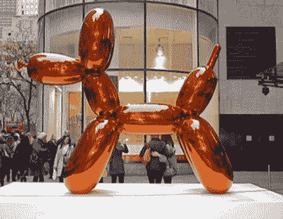
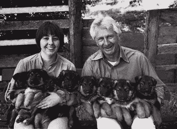
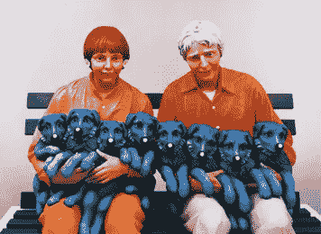
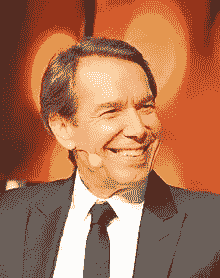

# 小狗(或因侵犯版权而被起诉的有趣方式)

> 原文：<https://www.sitepoint.com/puppies-fun-ways-get-sued-copyright/>

这是纽约“挪用艺术家”[杰弗·昆斯](http://www.jeffkoons.com/)的雕塑“气球狗(橙色)”。它由彩色镜面不锈钢制成。

2013 年，这件作品[卖出了超过**5800 万美元**](http://www.christies.com/lotfinder/sculptures-statues-figures/jeff-koons-balloon-dog-5739099-details.aspx)——这是目前在世艺术家卖出艺术品的世界纪录。昆斯先生以“平庸的现代生活”为主题，事业辉煌。

我觉得对于一个有足够的钱买下 T2 迪斯尼乐园的人来说，杰夫总是想着“平庸”！

无论如何…

杰弗·昆斯也有因剽窃被起诉的习惯——迄今为止，他已经有三起重大的诉讼案件。虽然他可能有一系列百万富翁挪用艺术家特有的问题，但这里可能也有一些对我们有用的教训。

今天我想我们应该关注他的第一个版权案例——续集从来没有这么好，对吗？

## 罗杰斯对昆斯

早在 90 年代初，摄影师阿特·罗杰斯起诉杰弗·昆斯侵犯了罗杰斯题为“*小狗*”的照片(1985)——一张主要用于贺卡和明信片的黑白照片。

<small>小狗——阿特·罗杰斯(1985)</small>

昆斯在 1988 年创作了他的“一串小狗”雕塑系列，后来他公开承认使用了罗杰斯的照片作为作品的基础。

<small>一串小狗</small>

在法庭上，昆斯引用了我们今天仍经常听到的两条辩护理由:

1.  **合理使用**:在四因素测试下，合法、未经许可地引用或合并另一作者作品中的版权材料。
2.  戏仿:模仿某一特定作家、艺术家或流派的风格，故意夸张以达到喜剧效果。

昆斯败诉了。

## 为什么昆斯不能主张“合理使用”？

我们经常在网上听到“合理使用”的概念。事实上，有一个经常被引用的信念，即从原始作品的 20%的变化足以保护你。

那个想法是不真实的。您将如何开始衡量它？

昆斯改变了媒体，添加了颜色、花朵、奇怪的狗鼻子，甚至造型本身都不是照片的特别接近的复制品。但这仍然不够。

确定版权是否被侵犯有两个主要部分。首先，原创者能证明自己拥有作品的权利吗？阿特·罗杰斯当然拥有原始照片的版权。

第二部分询问“普通人”在观看作品时是否会意识到一幅作品是从另一幅中复制的。很难想象有人会相信昆斯的作品是随机的。

简而言之，改变媒体和一些细节并不是合理使用辩护的捷径。

### 为什么昆斯不能称之为“戏仿”？

从表面上看，戏仿似乎是一种合理的辩护。毕竟，昆斯应该是在评论社会。

不幸的是，法院也没有接受这一辩护。

尽我所能来解释法院的裁决， *parody 需要取笑它正在模仿的项目*。换句话说，我可以在 Lady Gaga 的视频中随意模仿 Lady Gaga。

但是，由于昆斯是在取笑现代生活，而不是直接针对阿特·罗杰斯的作品，法庭不允许戏仿辩护。他们推断，任何数量的其他同样“平庸”的照片都可以用来代替小狗。

听起来很奇怪，如果罗杰斯的照片更有名——像黛米·摩尔的《名利场》封面那样进入公众视野——昆斯**T3T5【注:我不是律师】。**

有趣的是，[当罗杰斯赢了官司](https://en.wikipedia.org/wiki/Rogers_v._Koons)时，他得到了制作的四个“小狗串”雕塑中的一个——以及一大笔现金。那座雕塑在 1992 年被估价为 40 万美元。谁知道它今天值多少钱？

具有讽刺意味的是，昆斯可能花 50 美元就能让一名助手授权拍摄“小狗”照片。我想这个教训是:如果你是一个大牌艺术家，不要做一个小气鬼。

不过话说回来，也许罗杰斯官司只是昆斯成为“5800 万美元富翁”过程中的又一个公关小站？

也许每个人都是赢家，宝贝！

(好吧，除了世界上可怜的气球艺术家，但是给他们时间，给他们时间..)

## 分享这篇文章