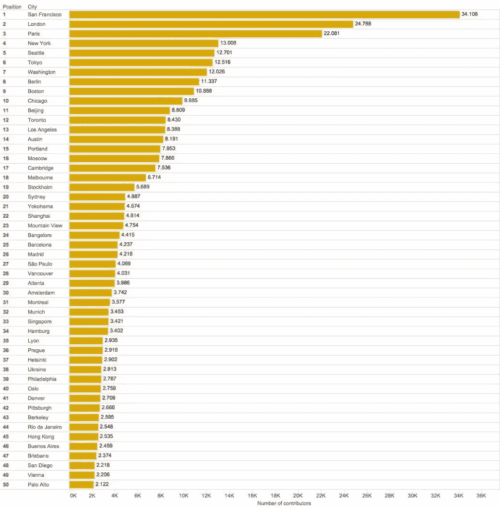

# 为什么东南亚应该拥抱开源运动

> 原文：<https://www.sitepoint.com/why-southeast-asia-should-embrace-the-open-source-movement/>

网络建立在参与、合作和交流的理念之上。托马斯·戈里森解释了为什么东盟共同体应该适应这些价值观。这篇文章最初发表在 [E27](http://e27.co/southeast-asia-embrace-open-source-movement-20151021/) 网站上。

* * *

在过去的五年中，东南亚已经发展成为现代网络技术的一个大消费者，以创造数字产品和服务。越来越多的美国科技公司在这里开设办事处，许多公司的目标是为他们的地区需求建立工程和开发办公室。

最近，GrabTaxi [宣布](http://e27.co/grabtaxi-injects-us100m-in-new-rd-centre-in-singapore-to-focus-on-data-analysis-20150408/)在新加坡投资 1 亿美元建立工程办公室，开发满足其全球增长计划所需的工具和服务。苹果、脸书和 CloudFlare 等公司已经开始组建工程团队。他们加入了数百家现有跨国公司和更多初创公司的行列，在新加坡寻找人才。

这些公司首选的技术平台仍然是开放网络。摩根士丹利和 comScore 证实，即使在手机上，[杀手级应用](http://marketingland.com/morgan-stanley-no-apps-arent-winning-the-mobile-browser-is-144303)仍然是浏览器，其受众规模是美国的两倍，增长速度也快于应用——这一趋势在东南亚也很明显。

消费者对他们的应用和内存使用有高度的选择性，对于大量不需要承诺的用例，或者满足即时或不太频繁的消费者需求，互联网是更轻量级和更合适的解决方案。除此之外，网络还有其他优势:

*   几乎所有智能消费设备都支持它，并且不需要长达一周的应用审查周期
*   它基于 HTML、CSS 和 JavaScript 等开放标准，这使得它成为最具弹性的平台和拥有最多员工的平台
*   据估计，2014 年初全球有 1850 万网络开发者，自那以后[几乎翻了一番](https://adtmag.com/Blogs/WatersWorks/2014/01/Worldwide-Developer-Count.aspx)。

## 将课程改为开源

由于它们的开放性，web 技术很容易掌握，并且是许多学生进入编码领域的第一选择。

拥有最大的社区和开发资源，美国是第一个大规模采用开源思想的国家。今天的东南亚仅仅是开放技术和标准的消费者——尽管世界上很大一部分技术外包工作都在该地区进行。

东南亚城市对开源和全球编码社区的贡献是一个罕见的发现。作为地区代表，新加坡在代码协作平台 GitHub(通过 GitHub/Google BigQuery)上的贡献者数量排名第 33 位:

te masys communication s——一家小型新加坡网络技术初创公司，提供基于新兴网络标准 WebRTC 的网络实时通信平台——是目前 W3C 成员名单中两个来自东南亚的公司中唯一的一个[——另一个是来自菲律宾的 Smart Communications，Inc .这些成员定义了许多使开放网络成为可行平台的标准。](https://www.w3.org/Consortium/Member/List)

网络是建立在参与、合作和交流的理念之上的，东盟社区有必要接受这些理念。我们需要更加开放地开发工具、框架和技术来帮助我们的同伴和我们自己回馈社会，获得更多。开源的结果得到了很好的研究，而且是非常积极的。它强化了自己和他人的发展技能，创造了更多可雇佣的人才，催生了更强大的解决方案。

很明显:开源需要成为该地区技术驱动型产业的下一步。

## 将东盟网络开发者社区聚集在一起

开源的概念是由一个大型的、多样化的社区完成的协作开发的概念。当我组织我的第一次 web 开发者大会 JSCamp 时，我就想建立这样一个社区。三年前在新加坡的亚洲。

现在已经演变成了 [DevFest。亚洲](http://devfest.asia)，一个区域性的、为期十天的节日，为所有围绕网络、技术和开源的人而设立，从 11 月 12 日到 22 日。

一些节日活动包括新加坡最大的 24 小时 SuperHappyDevHouse hackathon，一个概述新加坡景观的 Dev Careers Info Meetup，以及直接加速与技术公司面试的能力，物联网和 UX 研讨会以及 [CSSConf。亚洲](http://cssconf.asia)和 [JSConf。亚洲](http://jsconf.asia)。

让我们在该地区建立开源软件，让‘东南亚制造的网络技术和开源软件’成为现实。

## 附加阅读

*   [开源软件的好处和缺点:二级软件公司的探索性研究](http://link.springer.com/chapter/10.1007%2F978-0-387-72486-7_33)
*   【Twitter 为什么要开源。

## 分享这篇文章