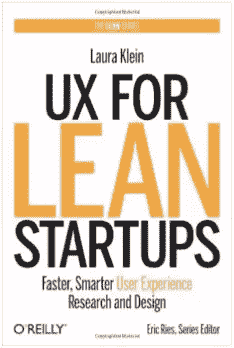

# 黑进你的 UX 研究

> 原文：<https://www.sitepoint.com/hacking-ux-research/>

用户体验通常被认为是一个情感和视觉领域——然而传统的 UX 原则并没有为设计师提供开发人员在快速开发方法中所具有的敏捷性。

不幸的是，这些方法经常把设计放在次要位置，因为有些人认为“不完美的东西总比完美的东西好。”当谈到原型设计时，需要关注设计。幸运的是，你可以通过使用数据来破解你的 UX 研究来提高效率。

在最近的一次斯坦福点火器会议上，劳拉·克莱恩,《精益创业公司的 T2》的作者讨论了当应用于用户体验研究时，更好的数据意味着更好的产品。

虽然有大量的实验可以利用这些信息，但你不需要成为一个铁杆统计学家来理解这些基础知识。您甚至不需要专门为测试创建特殊的场景。仅仅从你现有的原型或成品中，你就能收集到大量的见解。

### 顾客漏斗

无论你是想让用户订阅时事通讯，购买产品，还是浏览你网站的某些部分，从起点到你的用户目标的旅程就像一个漏斗。你将从一个很大的基数开始，但是只有一小部分基数会真正坚持到最后。例如，如果你[提供 SaaS 产品](https://www.sitepoint.com/saas-founder/)，你的结账漏斗将包括:

1.  **创建账户**
2.  **选择一个计划**
3.  **输入付款信息**
4.  **输入计费信息**
5.  **确认信息**
6.  **显示感谢信息并提供追加销售**

### 减少转换损失

漏斗的概念很简单，但就像一个筛子，用户会在每一层离开。为了减少下降，你需要找到摩擦点，并通过使用你的数据提出解决方案。

当然，这有时有点枯燥，但是分析定性数据(引起行动的原因)和定量数据(行动发生的原因)是你从竞争中脱颖而出的方法。这只是一个简单的问题，如果你尝试以某种方式解决一个问题，你认为会发生什么。

当你想出如何开始故障诊断时，你需要[与你的用户交谈，指出他们的挫折](https://www.sitepoint.com/conducting-user-interviews-will-actually-help/)。从那里，你可以直接了解如何改进你的产品。

当然，用户访谈只在小批量中起作用。如果您正在快速构建解决方案，您将不得不迭代、度量、分析并重复该过程，以准确了解正在发生的事情。

使用之前的结账漏斗示例，您会希望将重点放在产品开发过程中的小调整上。像促销代码字段这样简单的事情可能弊大于利。你可能会失去转换，因为客户离开你的网站去寻找优惠券代码，然后不回来了。

使用精益 UX，在有和没有促销字段的页面上运行 A/B 测试是有意义的。从那里你可以看到数据，并坚持与获胜的一页。从那里开始，你对其他你认为需要改进的地方重复这个过程。

### 超越漏斗分析

运行基于数据的 UX 测试并不局限于结账和注册流程。你网站的整个访客旅程可以是一个漏斗。如果您时间紧迫，或者只是不想将精力投入到全面的分析中，您也可以查看单个变量并对其进行测试。

正如戴夫·麦克卢尔在他的关于海盗创业指标的演讲中提到的，UX 的设计师和产品经理需要关注五个关键指标:获取、激活、收入、保留和推荐。

简而言之，80%的时间应该用于优化现有功能，而 20%的时间应该用于开发新功能。这对开发者、用户和你自己来说是一个三赢的局面，因为它让每个人都可以管理事情。

类似地，你会想尽可能减少完成任务的步骤，因为每一步都会增加更多的空间。

### 现在还不要成为数据科学家…

当然，数据并不是 UX 工作的全部。它不会取代你对图形设计的需求，不会让你预测所有用户的需求，也不会告诉你要做什么。

然而，使用数据进行精益 UX 开发将会为您节省资金，提高士气，并使您的团队专注于生产，而不是不断地重新发明轮子。每一轮测试后，测试带来的好处也会减少。

进行用户研究已经变得比以往更便宜，但仍然很昂贵。关于何时停止用户研究，没有一成不变的规则。Klien 简单地总结道，如果某件事不直接影响用户行为，你就不要去衡量它。

## 分享这篇文章