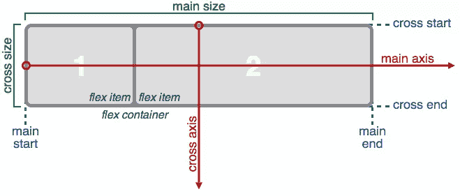

# 使用 Flexbox 和 Compass 的初级读本

> 原文：<https://www.sitepoint.com/a-primer-on-using-flexbox-with-compass/>

毫无疑问，flexbox 是布局网页的有效解决方案。然而，过去与浏览器支持的斗争导致许多开发人员对 flex 的布局和它所拥有的强大功能知之甚少。然而，通过参考 caniuse.com，你可以看到现在几乎所有主流浏览器都支持 flexbox，因此对于那些希望跟上 web 开发潮流的人来说，了解布局是必不可少的。

因此，我创建了这个指南，通过集成 Compass CSS 框架来帮助您更加熟悉 flexbox。我将使用 Compass 引导您通过不同的 flex 容器，向您展示 flexbox 如何跨不同的轴布置子项目或 flex 项目。此外，我将向您展示它使这一过程变得多么容易，因为它消除了包含那些讨厌的供应商前缀的需要，而这些前缀仍然是最深入的浏览器支持所必需的。

然而，在我们开始之前，我将提供一个 flexbox 的简要概述，以便我们完全理解我们将使用的不同 mixins，以及它们对我们代码的影响。

Flexbox 通过 CSS-Tricks 解释了[。](https://css-tricks.com/snippets/css/a-guide-to-flexbox/)

如您所见，flexbox 由两个轴组成，一个主轴和一个横轴。默认情况下，flexbox 将沿着主轴从左到右按行显示项目。另一方面，flex 布局可以在堆叠的列中显示项目。为了这篇文章，我将只讨论 flex 容器，以及如何操作它们。在整个教程中，请随意参考 flexbox 上的 [Compass 文档，它提供了关于我将要介绍的 mixins 的信息。](http://compass-style.org/reference/compass/css3/flexbox/)

## `display-flex()`米欣

首先，让我们看看我最初的例子，它展示了一个基本的 flex 容器，有四个 flex 项。Flexbox 是 CSS 中的一个新特性，所以我们需要导入`compass/css3`库来利用 Compass 的 flexbox mixins。一旦我导入了库，我所要做的就是包含`display-flex()` mixin 来定义一个 flex 容器。因此，我现在将拥有一个 flex 容器，其中的项目从左到右运行，并随着视口的缩小而缩小。

参见 [CodePen](http://codepen.io) 上的 SitePoint ( [@SitePoint](http://codepen.io/SitePoint) )带指南针的笔[Flexbox:display-flex()](http://codepen.io/SitePoint/pen/QjBoxp/)。