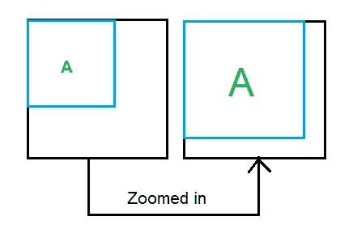
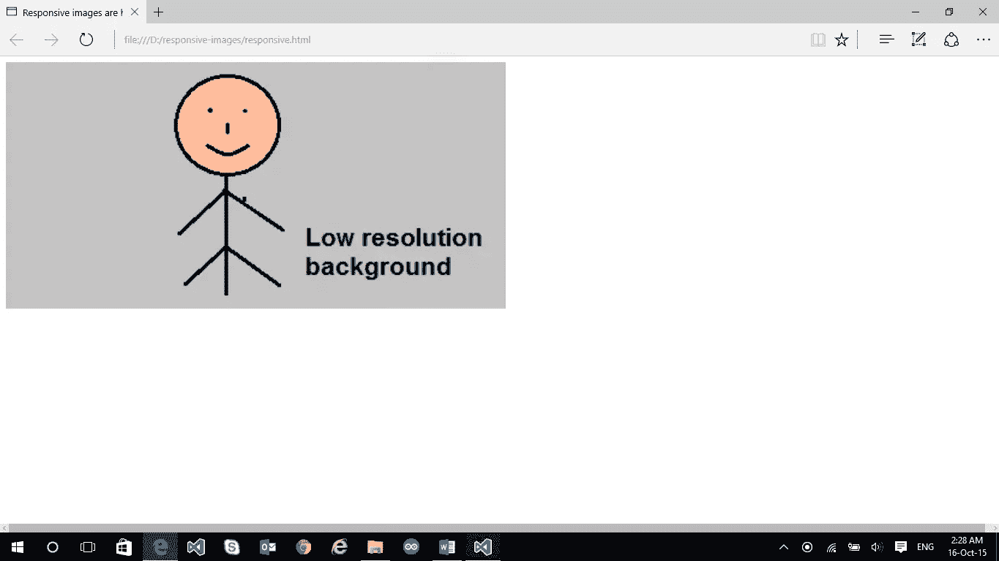
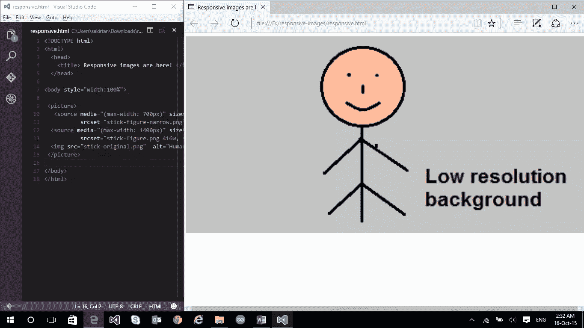
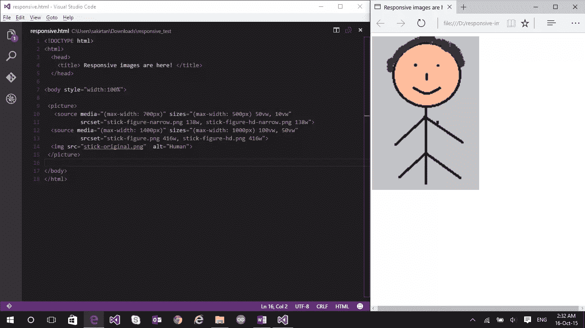

# 如何使用 srcset 构建响应性图像

> 原文：<https://www.sitepoint.com/how-to-build-responsive-images-with-srcset/>

本文是微软网站开发系列的一部分。感谢您对使 SitePoint 成为可能的合作伙伴的支持。

在这个互联的世界里，人们有各种各样的设备，确保你的网站在所有这些设备上无缝运行是一种需要，而不是一种选择。你的网站浏览量不会来自单一的分辨率设备或单一的外形。为了迎合所有这些，你的网站需要有响应性。

如果你熟悉响应式网页设计(RWD)，你可能知道响应式设计的复杂性(以及 Bootstrap 是如何解决这些问题的！).响应式网站的一个重要部分是响应式图像。在这篇文章中，我们将学习更多关于网络上的响应式图像，并看看如何建立它们。

## 什么是响应式图像？

简单来说，响应图像是以最佳形式显示在网页上的图像，这取决于浏览你的网站的设备。术语“*最佳形式*可能有多种含义:

*   您希望根据用户的物理屏幕大小显示单独的图像资产。例如:您想要在 13.5 英寸的笔记本电脑和 5 英寸的移动电话上显示单独的图像资源(在最大化的浏览器上)。
*   您希望根据设备的分辨率(或设备像素比，即设备像素与 CSS 像素的比率)显示单独的图像。
*   如果浏览器支持，您希望以指定的图像格式(例如 JPEG XR)显示图像，这可能是因为该格式支持更高的压缩率。

包括微软 Edge 在内的大多数现代浏览器[(从](http://blogs.windows.com/msedgedev/2015/06/08/introducing-srcset-responsive-images-in-microsoft-edge/?WT.mc_id=16525-DEV-sitepoint-article61) [Windows Insider Build 10547](https://dev.modern.ie/platform/changelog/desktop/10565/?utm_source=SitePoint&utm_medium=article61&utm_campaign=SitePoint/?compareWith=10547) 开始)都包含了响应式的构建模块。您可以在此处查看`srcset` [等功能的 Web 平台状态。](https://dev.modern.ie/platform/status/extendedsrcsetandsizessupport/?utm_source=SitePoint&utm_medium=article61&utm_campaign=SitePoint/?filter=f3f0000bf&search=srcset)

## 如何启用响应式图像

有许多方法可以实现图像的响应行为。一种较老的方法(不推荐)是通过简单的脚本，但是这会导致一些问题。第一，如果一个脚本决定下载哪个图像，但是脚本本身是在 HTML 中指定的图像被下载之后才被加载的，那么你可能会得到两个下载的图像。第二，如果你没有在 HTML 中指定任何图像，而只想加载脚本定义的图像，那么对于禁用脚本的浏览器来说，你最终将看不到任何图像。

因此，我们需要一种更好的方法来处理响应图像。谢天谢地，有！推荐的方法是使用:

1.  `srcset`属性
2.  `sizes`属性
3.  `picture`元素

让我们再深入一点。

## `srcset`属性:

在我们探索`srcset`的实际用法之前，让我们先了解几个术语:

### 设备像素比

Device-pixel ratio 是每个 CSS 像素的设备像素数。影响设备像素比的两个关键条件是:

1.  **设备的像素密度** **(每英寸的物理像素数):**高分辨率设备将具有更高的像素密度，因此，对于相同的缩放级别，与低分辨率设备相比，它将具有更高的设备像素比。例如:高端 Lumia 950 手机的分辨率将高于经济型 Lumia 630 手机，因此在相同的变焦水平下，它将具有更高的设备像素比率。
2.  **浏览器的缩放级别:**对于相同的设备，更高的缩放级别意味着每个 CSS 像素有更多的设备像素，因此设备像素比也更高。例如，考虑这个图:当你在浏览器上放大(Ctrl + Plus)时，你的 div 的 CSS 像素数保持不变，但是它所占用的设备像素数增加了。因此，每个 CSS 像素有更多的设备像素。

当您想要基于设备像素比率显示单独的图像(或者通常是同一图像的单独资产)时，您可以使用基本的`srcset`实现:

```

```

`srcset`属性中的`x`描述符用于定义设备像素比。因此，

1.  对于 1 的设备像素比率，将使用图像 space-needle.jpg。
2.  对于 2 的设备像素比率，将使用图像 space-needle-2x.jpg。
3.  对于 3 的设备像素比率，将使用图像 space-needle-hd.jpg。

`src`属性用作尚不支持`srcset`实现的浏览器的后备。

这个很好用。使用`x`描述符，您将总是在具有相似设备像素比率的设备上获得相同的图像，即使这意味着您在具有相同设备像素比率的 13.5 英寸笔记本电脑和 5 英寸手机上获得相同的图像。

现在假设我们想要在更大或更小的视窗上显示不同尺寸(高度、宽度)的图像。这就是`srcset`中的`w descriptor`和一个新属性——`sizes`发挥作用的地方。

*   w 描述符:描述被引用图像的宽度。考虑这个例子:

    ```
    
    ```

*   This mentions that the width of the first image is 200px, second image is 400px, and third image is 600px. Also, if the user’s screen is 150 CSS pixels wide, this equates to the following in terms of `x descriptors`:

    ```
    
    ```

    (记住，设备像素比就是设备像素/CSS 像素的数量。)

## `sizes`属性:

在不同的屏幕尺寸上你想要不同尺寸的图像(不同的高度，宽度)的实际实现是通过使用`sizes`属性和`srcset`属性的`w descriptor`来完成的。让我们再次通过几个例子来学习:

### 示例 1

假设您希望以视窗宽度的一半来查看图像。您将键入:

```

```

浏览器现在将根据浏览器宽度和设备像素比率决定下载哪个图像。例如:

*   *如果浏览器宽度为 500 CSS 像素，图像将显示为 250px 宽(因为 50vw)。现在，这相当于指定:*

    ```
    srcset="images/space-needle.jpg 0.8x, images/space-needle-2x.jpg 1.6x,
    images/space-needle-hd.jpg 2.4x"
    ```

*   *因此，对于 1.5x 显示器，`images/space-needle-2x.jpg`将由浏览器下载，因为它给出了 1.6x 的设备像素比(最适合 1.5x 显示器)。*

### 示例 2

当视窗宽度大于 40em 时，您希望图像以视窗宽度的一半显示，但是当视窗宽度小于或等于 40em 时，图像应该占据整个宽度。你应该这样做:

```

```

这非常类似于媒体查询。因此，对于`39em`宽的视口，`(max-width: 40em)`计算为真，这意味着`100vw`，也就是说，图像与视口一样宽。如果视窗是浏览器窗口，并且浏览器宽度是 500 个 CSS 像素，图像将显示为 500 像素宽。这相当于指定:

```

```

与上面类似，浏览器将决定从上面选择哪个图像用于特定的显示。

对于`41em`宽的视口，`(max-width: 40em)`评估为假，这意味着`50vw`，即图像是视口的一半宽。

我们将看到的下一个元素是`picture`元素，但在此之前，我需要快速回顾一下:)

| 使用案例 | 解决办法 |
| 我想在所有设备上显示相同的图像，但我想在支持它的设备上以更高的分辨率显示。图像的高度和宽度应该保持固定。 | 制作同一图像的多个资源(space-needle.jpg，space-needle-hd.jpg)。使用带 x 描述符的`srcset`。 |
| 我想和上面一样的场景，但我应该能够根据视口定制图像的高度和宽度。 | 使用带 w 描述符的`sizes`和`srcset`(同样，制作同一图像的多个资源) |
| 我怀疑，如果我在较小的屏幕上使用相同的图像，我的图像的主要对象可能会变得太小。我希望在不同的屏幕尺寸上显示不同的图像(更侧重于主要主题)，但我仍然希望根据设备像素比率显示同一图像的不同资产，并且我希望根据视口自定义图像的高度和宽度。 | ？ |

“？”的解决方案是`picture`元素！

## `picture`元素

正如我们在上面看到的，当您想要根据图像的渲染尺寸显示不同的图像时，可以使用`picture`元素。`picture`元素是一个容器，它包含了控制要下载的图像的其他元素。让我们看一个例子:

```
<picture>

<source media="(max-width: 20em)" srcset="images/small/space-needle.jpg 1x,
images/small/space-needle-2x.jpg 2x, images/small/space-needle-hd.jpg 3x">

<source media="(max-width: 40em)" srcset="images/medium/space-needle.jpg 1x,
images/medium/space-needle-2x.jpg 2x, images/medium/space-needle-hd.jpg 3x">


</picture>
```

选择其`media`属性的媒体查询为真的第一个`source`元素。
因此，如果视窗的最大宽度为`20em`，则根据设备像素比，从`images/small`目录中选择相应的图像源。一个`srcset`中的所有图像通常是同一个图像的多个资产。

`picture`元素本身不显示任何东西。甚至`picture`元素中的`source`元素也不代表它自己的任何东西。`source`元素必须包含`srcset`属性，它可以有`sizes`、`media`和`type`属性。有必要在`picture`中添加`img`元素。如果没有`img`元素，您将看不到任何图像。`picture`元素中的所有`source`元素都是为了给图像提供一个源。

您也可以根据浏览器支持的图像格式选择图像。当仅基于格式就能很好地节省图像尺寸时，这尤其有用。例如，JPEG-XR 是一种有效的图像格式，与 JPG 相比，它通常占用更少的图像大小，受到 Microsoft Edge 和 IE9+的支持。使用`source`元素中的`type`属性，可以测试以下格式:

```
<picture>

<source media="(max-width: 30em)" type="image/vnd.ms-photo"
srcset="images/small/space-needle.jxr 1x, images/small/space-needle-2x.jxr 2x,
images/small/space-needle-hd.jxr 3x">

<source media="(max-width: 30em)" type="image/jpg"
srcset="images/small/space-needle.jpg 1x, images/small/space-needle-2x.jpg 2x,
images/small/space-needle-hd.jpg 3x">


</picture>
```

当使用它时，属性:`media`属性和`type`属性都应该解析为 true，以便选择那个`source`元素。如果浏览器不能理解任何一种格式，就退回到`img`。

## 把所有的放在一起

在理解了响应图像是如何工作的之后，让我们来看一个完整的例子，这个例子将三者结合在一起——`srcset`、`sizes`和`picture`。

```
<!DOCTYPE html>
<html>
<head>
<title> Responsive images are here! </title>
</head>

<body style="width:100%">

<picture>
<source media="(max-width: 700px)" sizes="(max-width: 500px) 50vw, 10vw"
srcset="stick-figure-narrow.png 138w, stick-figure-hd-narrow.png 138w">

<source media="(max-width: 1400px)" sizes="(max-width: 1000px) 100vw, 50vw"
srcset="stick-figure.png 416w, stick-figure-hd.png 416w">


</picture>

</body>
</html>
```

在这个例子中，我们使用了包含多个`source`元素的`picture`。如果最大宽度为 700 像素，则选择第一个。如果选择了这个，那么`sizes`属性会根据我们提到的宽度断点决定要显示的图像的大小。该实现与我们在`sizes`属性中看到的完全相似。因此，如果最大宽度是 500 像素(宽度范围从 0px-500 像素)，图像将占据半个视窗。并且基于设备像素比来选择图像源。然而，如果视窗宽度大于 500 像素(但是`<=700px`，因为我们在第一个`source`元素中)，那么图像将只占据视窗的 1/10。

类似地，如果最大宽度是 1400px(这意味着现在宽度范围从 701px 到 1400px ),则选择第二个`source`元素。`sizes`属性确保如果视窗宽度范围从 701px 到 1000px，图像的宽度与视窗宽度相同，如果视窗宽度范围从 1001px 到 1400px，图像占据视窗宽度的一半。为了验证所有情况，我只需调整浏览器的大小并进行检查。在现实世界中，您的网站将通过不同的设备访问，在那里您将看到响应图像的实际使用。以下是输出:

(请注意，这里设置的所有图像来源和图像宽度只是为了演示，正如你所看到的，我制作了一些有趣的简笔画！)

***视口宽度设置在 1001px 到 1400px 之间:图像宽度是视口宽度的一半(正在使用的图像源是 stick-figure.png)***


***视口宽度设置在 701px 和 1000px 之间:图像宽度与视口宽度相同。(正在使用的图片来源是 stick-figure.png)***


***视口宽度设置在 501px 到 700px 之间:图像宽度为视口宽度的 1/10。(正在使用的图片来源是 stick-figure-narrow.png)***


***视口宽度设置在 0px 到 500px 之间:图像宽度为视口宽度的一半。(正在使用的图片来源是 stick-figure-narrow.png)***


## 我们就快完成了！

响应式图片给你，开发者，一个选项，在你的用户浏览你的网站时，给他们最好的体验。如果你还没有把它整合到你的网站上，现在是时候了。

我希望你读这篇文章的时候觉得有趣！如果您想讨论更多内容，请在 [Twitter](https://twitter.com/saurabhkirtani) 上联系我！

## 更多的 Web 开发实践

这篇文章是微软技术倡导者的 web 开发系列的一部分，内容涉及实用的 JavaScript 学习、开源项目和互操作性最佳实践，包括[微软 Edge](http://blogs.windows.com/msedgedev/2015/05/06/a-break-from-the-past-part-2-saying-goodbye-to-activex-vbscript-attachevent/?WT.mc_id=17917-DEV-sitepoint-footer) 浏览器和新的 [EdgeHTML 渲染引擎](http://blogs.windows.com/msedgedev/2015/02/26/a-break-from-the-past-the-birth-of-microsofts-new-web-rendering-engine/?WT.mc_id=17917-DEV-sitepoint-footer)。

我们鼓励您使用 [dev.modern.IE](http://dev.modern.ie/tools/?utm_source=SitePoint&utm_medium=footer&utm_campaign=SitePoint) 上的免费工具跨浏览器和设备进行测试，包括 Windows 10 的默认浏览器 Microsoft Edge:

*   [扫描你的网站，寻找过时的库、布局问题和可访问性](http://dev.modern.ie/tools/staticscan/?utm_source=SitePoint&utm_medium=footer&utm_campaign=SitePoint)
*   [在 Mac、Linux 和 Windows 上使用虚拟机](http://dev.modern.ie/tools/vms/windows/?utm_source=SitePoint&utm_medium=footer&utm_campaign=SitePoint)
*   [在您自己的设备上远程测试 Microsoft Edge](https://remote.modern.ie/?utm_source=SitePoint&utm_medium=footer&utm_campaign=SitePoint)
*   [GitHub 编码实验室:跨浏览器测试和最佳实践](https://github.com/deltakosh/interoperable-web-development)

来自我们的工程师和布道者的关于 Microsoft Edge 和 Web 平台的深入技术学习:

*   【2015 年微软 Edge 网络峰会(对新浏览器、新支持的网络平台标准以及来自 JavaScript 社区的演讲嘉宾有何期待)
*   哇，我可以在 Mac 电脑上测试 Edge & IE 浏览器& Linux！(来自雷伊·班戈)
*   [在不破坏网络的情况下推进 JavaScript】(来自 Christian Heilmann)](http://channel9.msdn.com/Events/WebPlatformSummit/2015/Advancing-JavaScript-without-breaking-the-web/?WT.mc_id=17917-DEV-sitepoint-footer)
*   使网络正常工作的边缘渲染引擎(Jacob Rossi)
*   [用 WebGL 释放 3D 渲染](https://channel9.msdn.com/Events/WebPlatformSummit/2015/Unleash-3D-rendering-with-WebGL-and-Microsoft-Edge/?WT.mc_id=17917-DEV-sitepoint-footer)(来自大卫·卡图赫，包括[伏龙。JS](http://vorlonjs.com/?WT.mc_id=17917-DEV-sitepoint-footer) 和 [babylonJS](http://babylonjs.com/?WT.mc_id=17917-DEV-sitepoint-footer) 项目)
*   [托管网络应用和网络平台创新](https://channel9.msdn.com/Events/WebPlatformSummit/2015/Hosted-web-apps-and-web-platform-innovations/?WT.mc_id=17917-DEV-sitepoint-footer)(来自律师奶爸和基里尔·赛克谢诺夫，包括[流形。JS](http://manifoldjs.com/?WT.mc_id=17917-DEV-sitepoint-footer) 项目)

更多面向网络平台的免费跨平台工具和资源:

*   [适用于 Linux、MacOS 和 Windows 的 Visual Studio 代码](https://code.visualstudio.com/?WT.mc_id=17917-DEV-sitepoint-footer)
*   [用节点编码。JS](https://www.microsoftvirtualacademy.com/en-US/training-courses/building-apps-with-node-js-jump-start-8422/?WT.mc_id=17917-DEV-sitepoint-footer) 和[在 Azure 上免费试用](https://azure.microsoft.com/en-us/pricing/free-trial/?WT.mc_id=17917-DEV-sitepoint-footer)

## 分享这篇文章