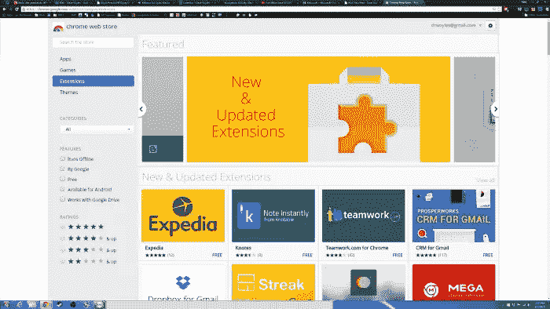
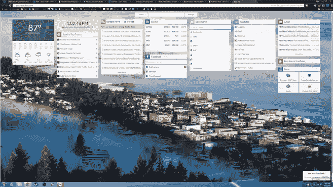
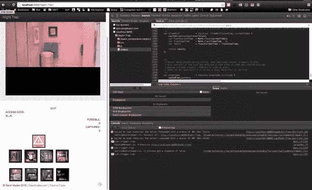
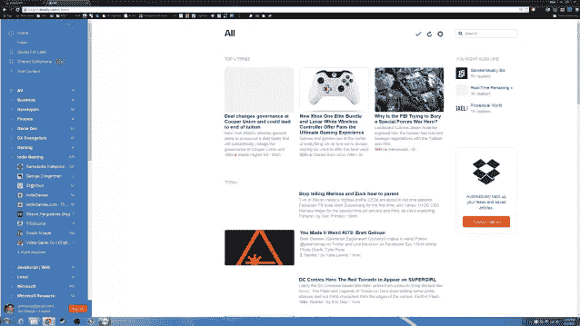
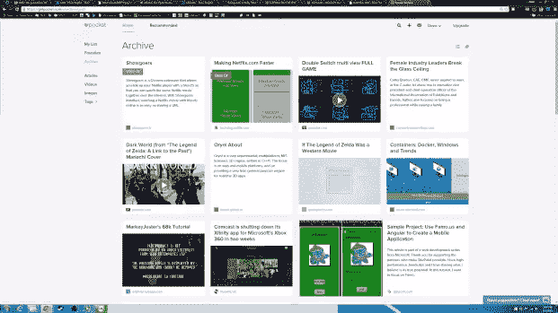

# 微软福音传道者最喜欢的 Chrome 扩展

> 原文：<https://www.sitepoint.com/microsoft-evangelists-list-favorite-chrome-extensions/>

本文是微软网站开发系列的一部分。感谢您对使 SitePoint 成为可能的合作伙伴的支持。

是的，我是微软的传道者，在我的日常浏览中，我使用 Chrome Canary。我想看看最新最棒的新兴标准和实验特性。它偶尔会有显示/图形问题，所以我不得不恢复到标准的 Chrome，但几个星期后，这些问题似乎得到了解决。我的主要开发机器是 2013 年末的 MacBook Pro。我经常在旅途中(也称为飞行中)，我需要一台强大的笔记本电脑，配有独立显卡，并且允许我在每个移动平台上工作，所以这一点很有用。

在我的 Windows 10 机器上，我使用的是微软 Edge。它是轻量级的，速度快得令人难以置信，但仍然缺少一些功能，让我成为一名 web 开发人员的日常浏览器，但在浏览内容方面，我没有遇到很多问题——事实上， [JavaScript 渲染非常快](http://blogs.windows.com/msedgedev/2015/05/20/delivering-fast-javascript-performance-in-microsoft-edge/?WT.mc_id=16524-DEV-sitepoint-article60)。我确实测试了我所有的 Edge 网络应用，因为 Windows 10 在 T2 发展得相当快，有 110 多台设备。我试着在我的 Mac 上安装 Win 10，但 SSD 失败了。奇怪的是，Windows 8 和 10 都检测到了这一点，但 OS X 没有。直到我把它带进苹果商店，他们进行了店内诊断，它才被发现。即使是 OS X 内置的诊断工具也无法检测到它。奇怪。

考虑到我一天中的大部分时间都是在浏览器中度过的，我需要扩展来帮助我充分利用我的工作。为此，我在 Chrome 中使用了一些扩展。微软 Edge】也宣布支持基于 JS 的扩展，同时移除了 Active-X 和条件注释等遗留功能。请记住，扩展不仅会带来安全隐患，而且偶尔还会带来大量开销，无论是在 CPU 方面，还是在 RAM 方面，因为它们都是作为 Chrome 中的每个标签作为自己的进程运行的，并且会带来每个扩展的单独实例。这意味着如果我打开了 10 个标签页和 10 个扩展，那么我会有很大的开销！

**尽管如此，这里有几个我发现非常有用的:**

**[Start——更好的新标签](https://chrome.google.com/webstore/detail/start-a-better-new-tab/kgifkabikplflflabkllnpidlbjjpgbp)**
当我创建一个新的空白标签时，Start 会用有用的信息填充它，比如 RSS、脸书消息、Gmail、优步本地司机有多远、天气等。

**[缓冲](https://chrome.google.com/webstore/detail/buffer/noojglkidnpfjbincgijbaiedldjfbhh)**
我每月支付 10 美元的缓冲服务，这让我可以“缓冲”或创建一个我可以在预定时间发布的推文池。这对于传播那些激起我兴趣的东西，以及我认为对我的观众有用的信息来说是很棒的。每天早上，我会跳上 Feedly 或 buffer，找到 20 个左右的故事，缓冲一天。这样，我可以继续编程，还可以传播我感兴趣的事物的好消息。更好的是，如果我在一篇博客文章或特定项目中投入大量工作，我会经常每天缓冲 4 次，这样当我第一次发出关于这篇文章的通知时不在 Twitter 上的人可以在以后找到它。

**[BigConsole](https://chrome.google.com/webstore/detail/bigconsole/klommbdmeefgobphaflhmnieheipjajm)**
这为 chrome 开发工具增加了一个多行 JavaScript 控制台，类似于 Firefox 的开发工具中出现的内容。听起来可能没什么，但是它让深入 JavaScript 代码变得容易多了。

**[Dev Tools 主题:零暗矩阵](https://chrome.google.com/webstore/detail/devtools-theme-zero-dark/bomhdjeadceaggdgfoefmpeafkjhegbo)**
我花很多时间盯着一个屏幕，要么是为了工作编程，要么是为了休闲玩游戏。《风暴英雄》是我的新专辑。正因为如此，我的眼睛对白天的强光越来越敏感，所以我倾向于在我的 ide 和浏览器上使用暗的设置。这个扩展使 Chrome 的开发工具变暗，以匹配我的浏览器主题。

**[邮差 REST 客户端](https://chrome.google.com/webstore/detail/postman-rest-client/fdmmgilgnpjigdojojpjoooidkmcomcm)**
调试 RESTful 调用再简单不过了。在排除 AJAX 调用故障时非常有用。

**[Ripple Emulator](https://chrome.google.com/webstore/detail/ripple-emulator-beta/geelfhphabnejjhdalkjhgipohgpdnoc)**
一个内置的移动模拟器，它将 UA 字符串伪装成你选择的移动设备的 UA 字符串。同样，除了测试几个其他场景，如触发事件、模拟不同的连接速度以及欺骗 GPS 坐标之外，这对于调试也很有用。所有移动开发者的必备。

**[WebGL 检查员](https://chrome.google.com/webstore/detail/webgl-inspector/ogkcjmbhnfmlnielkjhedpcjomeaghda)**
如果你用 WebGL 做任何工作，那么这是必须有的。更容易深入研究代码。谁说 JavaScript 不是一种强大的语言？

**[伟大的吊杆](https://chrome.google.com/webstore/detail/the-great-suspender/klbibkeccnjlkjkiokjodocebajanakg)**
还记得我上面怎么说 Chrome 是资源猪吗？有了这个扩展，你可以让标签在一段时间后“休眠”,从而禁止它们从你的内存中提取数据。非常有用。更好的是，你可以将网站列入白名单，这样就不会让它们休眠了！

**[Feedly](https://chrome.google.com/webstore/detail/feedly/hipbfijinpcgfogaopmgehiegacbhmob)**
这是自 Google Reader (RIP)以来阅读 RSS 最好的东西。我经常导出我的提要，所以如果你有兴趣下载。xml 文件来查看我关注的博客，在下面贴一张纸条，我很乐意分享。许多旧的视频游戏和程序随之而来。

**[SmoothScroll](https://chrome.google.com/webstore/detail/smoothscroll/nbokbjkabcmbfdlbddjidfmibcpneigj)**
在 Windows 的 Chrome 上滚动很烂。OS X 的触控板带来了如此流畅的体验。使用 SmoothScroll，你可以在 windows 版本的 Chrome 上模拟这种情况，并应用各种设置来获得更好的体验。我唯一的抱怨是，当我在 OS X 上使用 Chrome 时，这不会自动禁用，因此我使用了 SmoothScroll 设置，除了那些在 OS X 中设置为默认的设置。我希望 Chrome 有办法检测你正在运行的操作系统，从而启用/禁用选定的插件。

**[存到口袋里](https://chrome.google.com/webstore/detail/save-to-pocket/niloccemoadcdkdjlinkgdfekeahmflj)**
我每周都会阅读数吨的文章，还会发出一份周报。我发现的保持有序的最好方法是将它们添加到 Pocket 中，然后创建一个标签，这样我就可以轻松地对它们进行组织和分类。你可以创建一个免费的口袋帐户，你可以去。当你在想‘哦，天哪，那篇文章叫什么来着？’的时候，这对于几个月后不得不参考的东西非常有用

**[Reddit 增强套件](https://chrome.google.com/webstore/detail/reddit-enhancement-suite/kbmfpngjjgdllneeigpgjifpgocmfgmb)**
这为 Reddit 增加了一大堆功能，包括让网站变暗的能力(看起来更舒服)。我偶尔会在 Reddit 上发帖，所以我发现这比浏览普通网站的体验要好得多。

如果你有任何建议，请随时发给我！

## 更多的 Web 开发实践

这篇文章是微软技术倡导者的 web 开发系列的一部分，内容涉及实用的 JavaScript 学习、开源项目和互操作性最佳实践，包括[微软 Edge](http://blogs.windows.com/msedgedev/2015/05/06/a-break-from-the-past-part-2-saying-goodbye-to-activex-vbscript-attachevent/?WT.mc_id=17917-DEV-sitepoint-footer) 浏览器和新的 [EdgeHTML 渲染引擎](http://blogs.windows.com/msedgedev/2015/02/26/a-break-from-the-past-the-birth-of-microsofts-new-web-rendering-engine/?WT.mc_id=17917-DEV-sitepoint-footer)。

我们鼓励您使用 [dev.modern.IE](http://dev.modern.ie/tools/?utm_source=SitePoint&utm_medium=footer&utm_campaign=SitePoint) 上的免费工具跨浏览器和设备进行测试，包括 Windows 10 的默认浏览器 Microsoft Edge:

*   [扫描你的网站，寻找过时的库、布局问题和可访问性](http://dev.modern.ie/tools/staticscan/?utm_source=SitePoint&utm_medium=footer&utm_campaign=SitePoint)
*   [在 Mac、Linux 和 Windows 上使用虚拟机](http://dev.modern.ie/tools/vms/windows/?utm_source=SitePoint&utm_medium=footer&utm_campaign=SitePoint)
*   [在您自己的设备上远程测试 Microsoft Edge](https://remote.modern.ie/?utm_source=SitePoint&utm_medium=footer&utm_campaign=SitePoint)
*   [GitHub 编码实验室:跨浏览器测试和最佳实践](https://github.com/deltakosh/interoperable-web-development)

来自我们的工程师和布道者的关于 Microsoft Edge 和 Web 平台的深入技术学习:

*   【2015 年微软 Edge 网络峰会(对新浏览器、新支持的网络平台标准以及来自 JavaScript 社区的演讲嘉宾有何期待)
*   哇，我可以在 Mac 电脑上测试 Edge & IE 浏览器& Linux！(来自雷伊·班戈)
*   [在不破坏网络的情况下推进 JavaScript】(来自 Christian Heilmann)](http://channel9.msdn.com/Events/WebPlatformSummit/2015/Advancing-JavaScript-without-breaking-the-web/?WT.mc_id=17917-DEV-sitepoint-footer)
*   使网络正常工作的边缘渲染引擎(Jacob Rossi)
*   [用 WebGL 释放 3D 渲染](https://channel9.msdn.com/Events/WebPlatformSummit/2015/Unleash-3D-rendering-with-WebGL-and-Microsoft-Edge/?WT.mc_id=17917-DEV-sitepoint-footer)(来自大卫·卡图赫，包括[伏龙。JS](http://vorlonjs.com/?WT.mc_id=17917-DEV-sitepoint-footer) 和 [babylonJS](http://babylonjs.com/?WT.mc_id=17917-DEV-sitepoint-footer) 项目)
*   [托管网络应用和网络平台创新](https://channel9.msdn.com/Events/WebPlatformSummit/2015/Hosted-web-apps-and-web-platform-innovations/?WT.mc_id=17917-DEV-sitepoint-footer)(来自律师奶爸和基里尔·赛克谢诺夫，包括[流形。JS](http://manifoldjs.com/?WT.mc_id=17917-DEV-sitepoint-footer) 项目)

更多面向网络平台的免费跨平台工具和资源:

*   [适用于 Linux、MacOS 和 Windows 的 Visual Studio 代码](https://code.visualstudio.com/?WT.mc_id=17917-DEV-sitepoint-footer)
*   [用节点编码。JS](https://www.microsoftvirtualacademy.com/en-US/training-courses/building-apps-with-node-js-jump-start-8422/?WT.mc_id=17917-DEV-sitepoint-footer) 和[在 Azure 上免费试用](https://azure.microsoft.com/en-us/pricing/free-trial/?WT.mc_id=17917-DEV-sitepoint-footer)

## 分享这篇文章