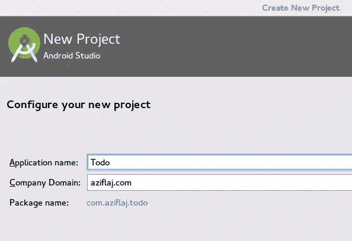
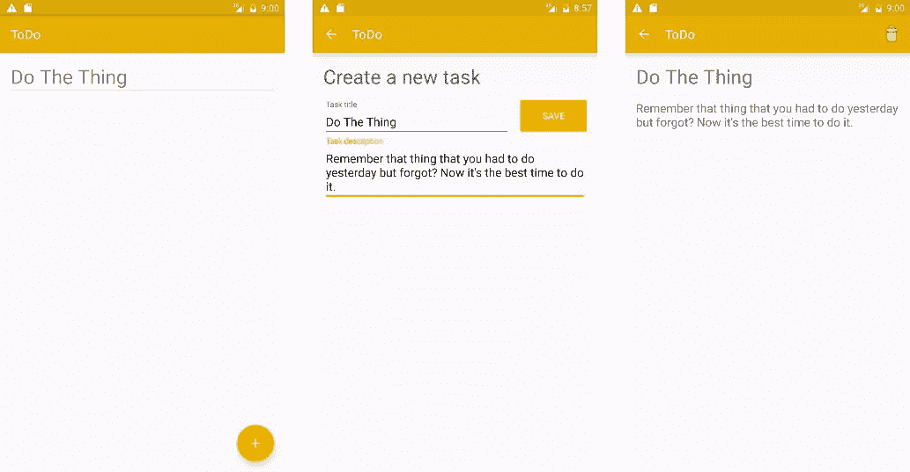
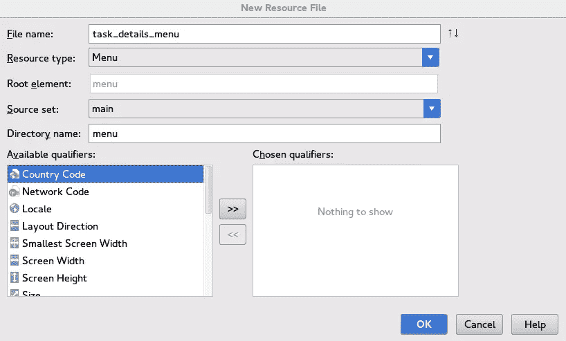
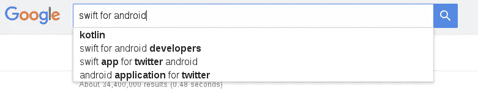

# 用 Kotlin 简化 Android Java 代码

> 原文：<https://www.sitepoint.com/streamline-android-java-code-with-kotlin/>

作为 iOS 的替代品发布，Android 的第一个公开版本是在 2008 年。它基于 Java 并支持 Java 6，这在当时是最新的版本。两年过去了，Java 8 到来了，它带来了很酷的新特性，包括[流 API](https://docs.oracle.com/javase/8/docs/api/java/util/stream/package-summary.html) 、[接口](https://docs.oracle.com/javase/tutorial/java/IandI/createinterface.html)以及使用 [lambdas](http://www.oracle.com/webfolder/technetwork/tutorials/obe/java/Lambda-QuickStart/index.html) 代替 SAM(单一抽象方法)的能力。

Java 9 即将问世，而 Android 开发人员仍在使用旧版本的 Java，这意味着他们将无法使用许多新功能。

对于 Android 开发者来说，现在有了另一种选择，由 JetBrains(IntelliJ 和 Android Studio 背后的公司)开发的 JVM 语言。像其他 JVM 语言包括 [Scala](https://robots.thoughtbot.com/scala-a-better-java-for-android) 或 [Groovy](https://melix.github.io/blog/2014/06/grooid.html) 一样，Kotlin 没有得到 Android 的官方支持，但我们可以将其作为插件使用。用不同的 JVM 语言构建应用程序将允许您使用不同于 Java 6 的新特性。

去年，我写了一篇关于在 Android 中开发一个简单的 ToDo 应用程序的教程，另一篇是关于 T2 在同一个应用程序中添加内容提供者的教程。在本教程中，我们将开发一个类似的应用程序，但我们将使用 Kotlin 而不是 Java。

## 你的第一份科特林文件

首先，安装最新版本的 Android Studio，Android 插件的 *Kotlin* 和 *Kotlin 扩展。*

**注意**:确保你有最新版本的 Android Studio。虽然它对 Kotlin 不重要，但它有一些我们将在这个应用程序中使用的特性，比如使用矢量资产作为 drawables。

你可以在 [GitHub](https://github.com/sitepoint-editors/ToDo-kotlin) 上找到本教程的最终代码。

创建一个名为`ToDo`的新项目:



Kotlin 支持所有 Android 版本，所以选择你喜欢的版本，其他选项保留默认。

现在我们将 Kotlin 添加到我们的项目中。为了能够在您的应用程序中编译 Kotlin 文件，我们需要在`app/build.gradle`文件的开头添加以下内容(在撰写本文时，我将它设置为最新版本，0.14.449):

```
buildscript {
    repositories {
        mavenCentral()
    }

    dependencies {
        classpath 'org.jetbrains.kotlin:kotlin-gradle-plugin:0.14.449'
    }
}

apply plugin: 'kotlin-android'
```

将此依赖项添加到同一文件:

```
compile 'org.jetbrains.kotlin:kotlin-stdlib:0.14.449'
```

现在，我们可以在应用程序中使用 Kotlin 文件来代替 Java 文件。

我们将从把`MainActivity.java`文件转换成 Kotlin 文件开始。打开`MainActivity`文件，选择*代码- >将 Java 文件转换为 Kotlin 文件*菜单项。或者你可以*双击 Shift* 并搜索“Java to Kotlin”得到相同的结果。`MainActivity.java`将被转换成`MainActivity.kt`以及由此产生的语法 Kotlin，类似但比 Java 简单:

```
package com.aziflaj.todo

import android.os.Bundle
import android.support.design.widget.FloatingActionButton
import android.support.design.widget.Snackbar
import android.support.v7.app.AppCompatActivity
import android.support.v7.widget.Toolbar
import android.view.Menu
import android.view.MenuItem
import android.view.View

class MainActivity : AppCompatActivity() {

    override fun onCreate(savedInstanceState: Bundle?) {
        super.onCreate(savedInstanceState)
        setContentView(R.layout.activity_main)
        val toolbar = findViewById(R.id.toolbar) as Toolbar
        setSupportActionBar(toolbar)

        val fab = findViewById(R.id.fab) as FloatingActionButton
        fab.setOnClickListener(object : View.OnClickListener {
            override fun onClick(view: View) {
                Snackbar.make(view, "Replace with your own action", Snackbar.LENGTH_LONG)
                        .setAction("Action", null)
                        .show()
            }
        })
    }

    override fun onCreateOptionsMenu(menu: Menu): Boolean {
        // Inflate the menu; this adds items to the action bar if it is present.
        menuInflater.inflate(R.menu.menu_main, menu)
        return true
    }

    override fun onOptionsItemSelected(item: MenuItem): Boolean {
        val id = item.itemId

        if (id == R.id.action_settings) {
            return true
        }

        return super.onOptionsItemSelected(item)
    }
}
```

如果你现在运行这个应用程序，它看起来和以前没有什么不同。如果您在运行应用程序时遇到任何问题，您可能需要清理和重建。

## 设计用户界面

这个应用程序将有三个视图。第一个将显示用户在`ListView`中添加的所有任务的列表。第二个视图显示了用户单击 FAB 的时间，它将是创建新任务的视图。第三个是详细的任务视图，在这里可以删除它。

您可以在下面看到三个完成的视图:



让我们在 *colors.xml* 文件中放一些默认颜色:

```
<color name="colorPrimary">#E5AE00</color>
<color name="colorPrimaryDark">#DBA600</color>
<color name="colorAccent">#FFC100</color>
```

对于 FAB，我想显示一个白色加号，而不是默认的邮件图标。这将使用户更清楚 FAB 的功能。从 Android Studio 1.4 开始，可以使用矢量资产作为可绘制资产。

要创建加号，打开*文件- >新建- >矢量资产*菜单项。从预制的材料图标中选择加号。另存为 *ic* add *24dp.xml* 然后从 *res/drawable* 文件夹中打开文件。将`path` `android:fillColor`属性设为`#FFFF`。

在*活动* main.xml_ 中，将 FAB 的`android:src`属性设置为`@drawable/ic_add_24dp`，按钮现在有了加号，而不是默认的邮件符号。


## 创建内容提供者

**注**:如果你对内容提供商不熟悉，请在[我的原教程](https://www.sitepoint.com/using-androids-content-providers-manage-app-data/)或[本教程](https://www.sitepoint.com/create-your-own-content-provider-in-android/)后继续阅读本教程，两者都展示了如何在 Android 中创建内容提供商。

添加一个名为`com.aziflaj.todo.data`的包( *File - > New - > Package* )，并创建一个名为 *TaskContract.kt* 的文件。将以下代码放入该文件:

```
package com.aziflaj.todo.data

import android.content.ContentResolver
import android.content.ContentUris
import android.net.Uri
import android.provider.BaseColumns

object TaskContract {
    val CONTENT_AUTHORITY = "com.aziflaj.todo"
    val BASE_CONTENT_URI: Uri = Uri.parse("content://${CONTENT_AUTHORITY}")
    val TASK_PATH = TaskEntry.TABLE_NAME

    object TaskEntry {
        val CONTENT_URI: Uri = BASE_CONTENT_URI.buildUpon().appendPath(TASK_PATH).build()
        val CONTENT_TYPE = "${ContentResolver.CURSOR_DIR_BASE_TYPE}/${CONTENT_AUTHORITY}/${TASK_PATH}"
        val CONTENT_ITEM_TYPE = "${ContentResolver.CURSOR_ITEM_BASE_TYPE}/${CONTENT_AUTHORITY}/${TASK_PATH}"

        val TABLE_NAME = "tasks"

        val _ID = BaseColumns._ID
        val _COUNT = BaseColumns._COUNT
        val COL_TITLE = "title"
        val COL_DESCRIPTION = "description"

        fun buildWithId(id: Long): Uri {
            return ContentUris.withAppendedId(CONTENT_URI, id)
        }

        fun getIdFromUri(uri: Uri): Long {
            return ContentUris.parseId(uri)
        }
    }
}
```

1.  `package`和`import`语句的工作方式与 Java 代码相同
2.  使用`object`是 Kotlin 创建单例的方式。通常，你不需要`TaskContract`的对象，所以我们把它包装成一个 Singleton 并创建一个实例。
3.  `val CONTENT_AUTHORITY = "com.aziflaj.todo"`是常数，就像`final`变量一样。在 Kotlin 中，常量使用关键字`val`创建，变量使用关键字`var`创建。你看不到常数的类型，因为科特林是足够聪明的<q>能算出来。</q>
4.  `val CONTENT_URI: Uri = ...`是一个`final Uri`对象。在 Kotlin 中，在变量名后指定数据类型。
5.  这是科特林连接字符串的方式。`$`符号之后和括号之间的所有内容都是一个表达式，它的值被用来代替。

创建方法的 Kotlin 方法是:

```
fun getIdFromUri(uri: Uri): Long {
    return ContentUris.parseId(uri)
}
```

它以关键字`fun`开始，接着是方法名，变量在括号中，然后是返回类型，在本例中是`Long`。

开始时可能看起来有点奇怪，但是它比 Java 长签名方法写起来更快，读起来更容易。默认情况下，Kotlin 中的所有方法都是公共的。

在同一个包中，创建一个名为`TaskDbHelper`的类:

```
package com.aziflaj.todo.data

import android.content.Context
import android.database.sqlite.SQLiteDatabase
import android.database.sqlite.SQLiteOpenHelper

class TaskDbHelper(context: Context?) : SQLiteOpenHelper(context, TaskDbHelper.DATABASE_NAME, null, TaskDbHelper.DATABASE_VERSION) {

    companion object {
        val DATABASE_NAME = "task.db"
        val DATABASE_VERSION = 1
    }

    override fun onCreate(db: SQLiteDatabase?) {
        val createTaskTable = "CREATE TABLE ${TaskContract.TaskEntry.TABLE_NAME} (" +
                "${TaskContract.TaskEntry._ID} INTEGER PRIMARY KEY, " +
                "${TaskContract.TaskEntry.COL_TITLE} TEXT NOT NULL, " +
                "${TaskContract.TaskEntry.COL_DESCRIPTION} TEXT NOT NULL, " +
                " UNIQUE (${TaskContract.TaskEntry.COL_TITLE}) ON CONFLICT REPLACE" +
                ");"

        db?.execSQL(createTaskTable)
    }

    override fun onUpgrade(db: SQLiteDatabase?, oldVersion: Int, newVersion: Int) {
        db?.execSQL("DROP TABLE IF EXISTS ${TaskContract.TaskEntry.TABLE_NAME}")
        onCreate(db)
    }
}
```

类的第一行可能很奇怪。Kotlin 将默认的类构造函数包含在类签名中。所以当我们写作时

```
class TaskDbHelper(context: Context?) : SQLiteOpenHelper(context, TaskDbHelper.DATABASE_NAME, null, TaskDbHelper.DATABASE_VERSION)
```

我们正在为得到一个`context`参数的`TaskDbHelper`类创建一个默认构造函数，并调用它的父构造函数，在 Java 中应该是:

```
super(context, TaskDbHelper.DATABASE_NAME, null, TaskDbHelper.DATABASE_VERSION);
```

`companion object`类似于`TaskContract`中引入的`object`关键字。它创建了 Java 中所谓的“静态字段”，这些字段属于类本身，而不是所创建的对象。您可以像在 Java 中使用静态字段一样访问这些字段，`TaskDbHelper.DATABASE_NAME`。

代替`@Override`注释，在 Kotlin 中你可以使用`override`作为关键字，就像在`override fun onCreate(db: SQLiteDatabase?)`的例子中一样。那是显而易见的，但是问号是怎么回事？附加在对象类型上的问号意味着添加到方法中的对象可能是`null`。这是为了防止防御性编程，并手动检查该对象是否为空。当你以`db?.execSQL(createTaskTable)`(注意问号)的身份访问那个对象，并且那个对象是`null`，而不是抛出一个`NullPointerException`，Kotlin 绕过这个调用，根本不执行它。

最后是内容提供商本身。创建一个名为 *TaskProvider* 的类。我将通过创建一个`companion object`来开始实现提供者:

```
package com.aziflaj.todo.data

class TaskProvider : ContentProvider() {
    companion object {
        val TASK = 100
        val TASK_WITH_ID = 101

        fun createUriMatcher(): UriMatcher {
            var matcher: UriMatcher = UriMatcher(UriMatcher.NO_MATCH)
            val authority = TaskContract.CONTENT_AUTHORITY

            matcher.addURI(authority, TaskContract.TASK_PATH, TASK)
            matcher.addURI(authority, "${TaskContract.TASK_PATH}/#", TASK_WITH_ID)

            return matcher
        }

        val sUriMatcher: UriMatcher = createUriMatcher()
        var mOpenHelper: SQLiteOpenHelper? = null
    }
}
```

这会创建一个`UriMatcher`来告诉用户给定的`Uri`是指向表中的记录，还是指向表本身。

`onCreate()`方法很简单，所以我们可以开始实现它:

```
override fun onCreate(): Boolean {
    mOpenHelper = TaskDbHelper(context)
    return true
}
```

它使用我们之前创建的`TaskDbHelper`创建一个`SQLiteOpenHelper`。你可以注意到科特林的另一个特点。我们没有使用`getContext()`方法，而是以`context`的形式访问上下文。

我们正在实现的另一种方法是`query()`方法，这可能是内容提供商最复杂的方法:

```
override fun query(uri: Uri?, projection: Array<out String>?,
                   selection: String?, selectionArgs: Array<out String>?,
                   sortOrder: String?): Cursor? {
    val db: SQLiteDatabase = mOpenHelper?.readableDatabase as SQLiteDatabase
    val match: Int = sUriMatcher.match(uri)
    var cursor: Cursor?

    when (match) {
        TASK -> {
            cursor = db.query(TaskContract.TaskEntry.TABLE_NAME, projection,
                    selection, selectionArgs, null, null, sortOrder)
        }
        TASK_WITH_ID -> {
            val id: Long = TaskContract.TaskEntry.getIdFromUri(uri as Uri)
            cursor = db.query(TaskContract.TaskEntry.TABLE_NAME, projection,
                    "${TaskContract.TaskEntry._ID} = ?", arrayOf(id.toString()), null, null, sortOrder)
        }
        else -> throw UnsupportedOperationException("Unknown uri: $uri")
    }

    cursor?.setNotificationUri(context.contentResolver, uri)
    return cursor
}
```

第 4 行代码可能看起来很奇怪，尤其是`as SQLiteDatabase`。这是科特林的选角方式。使用`findViewById`方法时，铸造可能对您来说很熟悉。检查 *MainActivity.kt* ，你会看到通过 id 找到 FAB 时同样的铸造方法。

`when`模块相当于`switch`模块。

`arrayOf(id.toString())`包含了关于科特林的三件有趣的事情。`arrayOf`方法是 Kotlin 的内置方法，它从逗号分隔的参数列表中生成一个数组。`toString`方法被直接调用到一个`Long`变量中。这意味着`toString`是一个扩展方法。您可以为一个类创建新方法(作为扩展方法)，在这种情况下，像`10.toString()`一样调用它们。Kotlin 根据需要负责自动装箱，所以一个整数变量可以是一个`int`或一个`Integer`，这取决于具体情况。

我们将以同样的方式实现内容提供者的其他方法。对于`insert()`方法:

```
override fun insert(uri: Uri?, values: ContentValues?): Uri? {
    val db = mOpenHelper?.writableDatabase
    val match: Int = sUriMatcher.match(uri)
    var insertionUri: Uri?
    var insertedId: Long

    when (match) {
        TASK -> {
            insertedId = db!!.insert(TaskContract.TaskEntry.TABLE_NAME, null, values)

            insertionUri = if (insertedId > 0) {
                TaskContract.TaskEntry.buildWithId(insertedId)
            } else {
                throw SQLException("Failed to insert row into $uri")
            }
        }
        else -> throw UnsupportedOperationException("Unknown uri: $uri")
    }

    context.contentResolver.notifyChange(uri, null)
    return insertionUri
}
```

这里新增了`db!!.insert(...)`方法调用。`!!`意味着你确定实例不会是`null`，所以无论如何都要调用`insert`方法。还有一个新的地方是我们给`insertionUri`变量分配了一个`if`块。在 Kotlin 中，大多数块返回一个值，这意味着您可以将一个块赋给一个变量。以上，`insertedId`大于 0，`insertionUri`将为`TaskContract.TaskEntry.buildWithId(insertedId)`，否则抛出一个`SQLException`。

`delete()`方法:

```
override fun delete(uri: Uri?, selection: String?, selectionArgs: Array<out String>?): Int {
    val db = mOpenHelper?.writableDatabase
    val match = sUriMatcher.match(uri)
    var deleted: Int

    var customSelection = selection ?: "1"

    when (match) {
        TASK -> deleted = db!!.delete(TaskContract.TaskEntry.TABLE_NAME, customSelection, selectionArgs)
        else -> throw UnsupportedOperationException("Unknown uri: $uri")
    }

    if (deleted > 0) {
        context.contentResolver.notifyChange(uri, null)
    }

    return deleted
}
```

这里新增的是`?:`运算符(又名猫王运算符)，它说如果`selection`不是`null`，`customSelection`就会得到它的值，否则就会变成`"1"`。

我不打算展示内容提供者的其他方法，因为它们没有引入任何新的 Kotlin 语法。你可以在 GitHub 上找到内容提供商[的其他方法](https://github.com/sitepoint-editors/ToDo-kotlin/blob/master/app/src/main/java/com/aziflaj/todo/data/TaskProvider.kt)

将内容提供者添加到 *AndroidManifest.xml* 文件中，正好在结束应用程序标记之前。

```
<provider
    android:authorities="com.aziflaj.todo"
    android:name=".data.TaskProvider" />
```

现在内容提供商可以使用了。

## 完成用户界面

我们将为`MainActivity`创建一个`ListView`。在*内容* main.xml_ file 里面还有这段代码:

```
<?xml version="1.0" encoding="utf-8"?>
<FrameLayout xmlns:android="http://schemas.android.com/apk/res/android"
    xmlns:app="http://schemas.android.com/apk/res-auto"
    xmlns:tools="http://schemas.android.com/tools"
    android:layout_width="match_parent"
    android:layout_height="match_parent"
    android:paddingBottom="@dimen/activity_vertical_margin"
    android:paddingLeft="@dimen/activity_horizontal_margin"
    android:paddingRight="@dimen/activity_horizontal_margin"
    android:paddingTop="@dimen/activity_vertical_margin"
    app:layout_behavior="@string/appbar_scrolling_view_behavior"
    tools:context=".MainActivity"
    tools:showIn="@layout/activity_main">

    <ListView
        android:id="@+id/task_listview"
        android:layout_width="match_parent"
        android:layout_height="match_parent" />

</FrameLayout>
```

创建一个名为`CreateTaskActivity`的空活动。这将创建一个*CreateTaskActivity.java*文件(您应该将其转换为 Kotlin)和一个*活动*创建 *task.xml* 文件，我们现在将对其进行编辑。这是用户点击 FAB 时显示的布局文件。我们将为新任务创建一个表单:

```
<?xml version="1.0" encoding="utf-8"?>
<LinearLayout xmlns:android="http://schemas.android.com/apk/res/android"
    xmlns:tools="http://schemas.android.com/tools"
    android:layout_width="match_parent"
    android:layout_height="match_parent"
    android:orientation="vertical"
    android:paddingBottom="@dimen/activity_vertical_margin"
    android:paddingLeft="@dimen/activity_horizontal_margin"
    android:paddingRight="@dimen/activity_horizontal_margin"
    android:paddingTop="@dimen/activity_vertical_margin"
    tools:context="com.aziflaj.todo.CreateTaskActivity">

    <TextView
        android:layout_width="match_parent"
        android:layout_height="wrap_content"
        android:text="@string/task.create.title"
        android:textColor="@color/gray_dark"
        android:paddingBottom="@dimen/activity_horizontal_margin"
        android:textSize="@dimen/text_large" />

    <LinearLayout
        android:layout_width="match_parent"
        android:layout_height="wrap_content"
        android:orientation="horizontal">

        <android.support.design.widget.TextInputLayout
            android:layout_width="0dp"
            android:layout_height="wrap_content"
            android:layout_weight="3"
            android:paddingRight="@dimen/activity_horizontal_margin">

            <EditText
                android:id="@+id/task_title"
                android:layout_width="match_parent"
                android:layout_height="wrap_content"
                android:capitalize="words"
                android:enabled="true"
                android:hint="@string/task.title.placeholder" />
        </android.support.design.widget.TextInputLayout>

        <Button
            android:id="@+id/save_task_btn"
            android:layout_width="0dp"
            android:layout_height="wrap_content"
            android:layout_weight="1"
            android:background="@color/colorAccent"
            android:text="@string/task.button.save"
            android:textColor="@color/white" />
    </LinearLayout>

    <android.support.design.widget.TextInputLayout
        android:layout_width="match_parent"
        android:layout_height="wrap_content">

        <EditText
            android:id="@+id/task_description"
            android:layout_width="match_parent"
            android:layout_height="wrap_content"
            android:capitalize="sentences"
            android:hint="@string/task.description.placeholder"
            android:inputType="textMultiLine" />
    </android.support.design.widget.TextInputLayout>
</LinearLayout>
```

将这些值添加到 *string.xml* :

```
<string name="task.create.title">Create a new task</string>
<string name="task.title.placeholder">Task title</string>
<string name="task.description.placeholder">Task description</string>
<string name="task.button.save">Save</string>
```

以及到 *colors.xml`*

```
<!-- grayscale -->
<color name="white">#FFF</color>
<color name="gray_light">#DBDBDB</color>
<color name="gray">#939393</color>
<color name="gray_dark">#5F5F5F</color>
<color name="black">#323232</color>
```

以及到 *dimens.xml* :

```
<dimen name="text_large">30sp</dimen>
```

创建一个名为 *TaskDetailsActivity* 的新活动，并将其转换为 Kotlin。将此代码添加到*活动*任务 *details.xml* :

```
<?xml version="1.0" encoding="utf-8"?>
<LinearLayout xmlns:android="http://schemas.android.com/apk/res/android"
    xmlns:tools="http://schemas.android.com/tools"
    android:layout_width="match_parent"
    android:layout_height="match_parent"
    android:orientation="vertical"
    android:paddingBottom="@dimen/activity_vertical_margin"
    android:paddingLeft="@dimen/activity_horizontal_margin"
    android:paddingRight="@dimen/activity_horizontal_margin"
    android:paddingTop="@dimen/activity_vertical_margin"
    tools:context="com.aziflaj.todo.TaskDetailsActivity">

    <TextView
        android:id="@+id/detail_task_title"
        android:layout_width="match_parent"
        android:layout_height="wrap_content"
        android:paddingBottom="@dimen/activity_vertical_margin"
        android:textSize="@dimen/text_large" />

    <TextView
        android:id="@+id/detail_task_description"
        android:layout_width="match_parent"
        android:layout_height="wrap_content"
        android:textSize="@dimen/text_medium" />

</LinearLayout>
```

将此添加到 *dimens.xml* 中:

```
<dimen name="text_medium">18sp</dimen>
```

接下来，我们将为此视图创建一个菜单。移除*菜单* main.xml_ file。从 *MainActivity.kt* 中删除`onCreateOptionsMenu`和`onOptionsItemSelected`。创建新的菜单资源文件:



```
<?xml version="1.0" encoding="utf-8"?>
<menu xmlns:android="http://schemas.android.com/apk/res/android"
    xmlns:app="http://schemas.android.com/apk/res-auto">

    <item
        android:id="@+id/action_delete"
        android:icon="@android:drawable/ic_menu_delete"
        android:title="@string/task.details.menu.delete"
        app:showAsAction="always" />
</menu>
```

将此添加到 *strings.xml* :

```
<string name="task.details.menu.delete">Delete</string>
```

在 *TaskDetailsActivity.kt* 中，覆盖必要的方法:

```
override fun onCreateOptionsMenu(menu: Menu?): Boolean {
    menuInflater.inflate(R.menu.task_details_menu, menu)
    return true
}

override fun onOptionsItemSelected(item: MenuItem?): Boolean {
    val id = item?.itemId

    when (id) {
        R.id.action_delete -> {
            //delete task
            return true
        }
    }

    return super.onOptionsItemSelected(item)
}
```

这里我们扩展了菜单，并准备好处理单击菜单上的删除按钮的用户事件。

最后，我们准备好了处理数据的 UI。

## 存储新任务

我们使用`CreateTaskActivity`类来插入新任务，但是用户需要一种切换到该视图的方法。打开 *MainActivity.kt* 文件，并将这个监听器设置为 FAB:

```
val newTaskFab = findViewById(R.id.fab) as FloatingActionButton

newTaskFab.setOnClickListener({ view ->
    val newTaskIntent = Intent(applicationContext, CreateTaskActivity::class.java)
    startActivity(newTaskIntent)
})
```

我们现在准备将新任务存储到嵌入式 SQLite 数据库中。我们有了内容提供者和 UI，现在我们从`EditText`字段读取数据并将数据存储到数据库中。在*createtaskpactivity . kt*文件的`onCreate`方法中，设置视图布局(`setContentView(R.layout.activity_create_task)`)后，添加以下代码:

```
val saveBtn = findViewById(R.id.save_task_btn) as Button

saveBtn.setOnClickListener({ view ->
    val taskTitleEditText = findViewById(R.id.task_title) as EditText
    val taskTitle = taskTitleEditText.text.toString()

    val taskDescriptionEditText = findViewById(R.id.task_description) as EditText
    val taskDescription: String = taskDescriptionEditText.text.toString()

    if (taskTitle.isEmpty() or taskDescription.isEmpty()) {
        val inputEmpty = getString(R.string.error_input_empty)

        Toast.makeText(applicationContext, inputEmpty, Toast.LENGTH_LONG).show()
    } else {
        val values = ContentValues()
        values.put(TaskEntry.COL_TITLE, taskTitle)
        values.put(TaskEntry.COL_DESCRIPTION, taskDescription)

        var inserted = contentResolver.insert(TaskEntry.CONTENT_URI, values)

        startActivity(Intent(this, MainActivity::class.java))

        Log.d("New Task", "inserted: $inserted")
    }
})
```

这里我们使用 lambda 代替 SAM 接口。这是 Kotlin 编写 lambda 方法的方式，其中`view`是参数，`->`之后是 lambda 主体。通过这段代码，我们使用内容提供者的`insert()`方法从字段中读取数据并将数据存储在数据库中。如果任务标题或描述为空，我们将显示一个错误。将错误消息添加到 *strings.xml* 文件中:

```
<string name="error.input.empty">Title or description is empty</string>
```

当您向数据库中添加新记录时，您可以在 LogCat 中查看它是否被添加。

## 列出所有任务

为了列出任务，我们将使用一个查询数据库的`CursorLoader`并创建一个`Cursor`对象。这个`Cursor`对象被`CursorAdapter`用来填充`MainActivity`类中的`ListView`。

看起来要做的事情很多，所以让我们从创建列表的单个项目的视图开始。

创建名为*task*listview*item . XML*的布局文件:

```
<?xml version="1.0" encoding="utf-8"?>
<LinearLayout xmlns:android="http://schemas.android.com/apk/res/android"
    android:layout_width="match_parent"
    android:layout_height="match_parent"
    android:orientation="vertical">

    <TextView
        android:id="@+id/list_item_title"
        android:layout_width="wrap_content"
        android:layout_height="wrap_content"
        android:textColor="@color/gray"
        android:textSize="@dimen/text_large" />

</LinearLayout>
```

我们将在`CursorAdapter`中对此进行扩展。因此，创建一个名为 *TaskAdapter* 的 Kotlin 类，并添加以下代码:

```
package com.aziflaj.todo

import android.content.Context
import android.database.Cursor
import android.view.LayoutInflater
import android.view.View
import android.view.ViewGroup
import android.widget.CursorAdapter
import android.widget.TextView
import com.aziflaj.todo.data.TaskContract

class TaskAdapter(context: Context, cursor: Cursor?, flags: Int) : CursorAdapter(context, cursor, flags) {
    override fun newView(context: Context?, cursor: Cursor?, parent: ViewGroup?): View? {
        return LayoutInflater.from(context).inflate(R.layout.task_listview_item, parent, false)
    }

    override fun bindView(view: View?, context: Context?, cursor: Cursor?) {
        var titleTextView = view?.findViewById(R.id.list_item_title) as TextView

        val TITLE_COL_INDEX = cursor?.getColumnIndex(TaskContract.TaskEntry.COL_TITLE) as Int
        val taskTitle = cursor?.getString(TITLE_COL_INDEX)
        titleTextView.text = taskTitle
    }
}
```

打开 *MainActivity.kt* 并使其执行`android.app.LoaderManager.LoaderCallbacks<Cursor>`:

```
class MainActivity : AppCompatActivity(), android.app.LoaderManager.LoaderCallbacks<Cursor> {

    override fun onCreateLoader(id: Int, args: Bundle?): android.content.Loader<Cursor>? {
        return CursorLoader(applicationContext,
                TaskContract.TaskEntry.CONTENT_URI,
                null, null, null, null)
    }

    override fun onLoadFinished(loader: android.content.Loader<Cursor>?, data: Cursor?) {
        taskAdapter?.swapCursor(data)
    }

    override fun onLoaderReset(loader: android.content.Loader<Cursor>?) {
        taskAdapter?.swapCursor(null)
    }

    companion object {
        val TASK_LOADER = 0 //the loader id
        var taskAdapter: TaskAdapter? = null
        var listView: ListView? = null
    }

    override fun onCreate(savedInstanceState: Bundle?) {
        super.onCreate(savedInstanceState)
        setContentView(R.layout.activity_main)
        val toolbar = findViewById(R.id.toolbar) as Toolbar
        setSupportActionBar(toolbar)

        loaderManager.initLoader(TASK_LOADER, null, this)

        listView = findViewById(R.id.task_listview) as ListView
        taskAdapter = TaskAdapter(applicationContext, null, 0)

        listView?.adapter = taskAdapter

        listView?.setOnItemClickListener({ parent, view, position, id ->
            val currentTask: Cursor? = parent.getItemAtPosition(position) as Cursor

            var detailsIntent = Intent(this, TaskDetailsActivity::class.java)
            val TASK_ID_COL = currentTask?.getColumnIndex(TaskContract.TaskEntry._ID) as Int
            val _id = currentTask?.getLong(TASK_ID_COL) as Long
            val taskUri = TaskContract.TaskEntry.buildWithId(_id)

            detailsIntent.setData(taskUri)
            startActivity(detailsIntent)
        })

        val newTaskFab = findViewById(R.id.fab) as FloatingActionButton

        newTaskFab.setOnClickListener({ view ->
            val newTaskIntent = Intent(applicationContext, CreateTaskActivity::class.java)
            startActivity(newTaskIntent)
        })
    }
}
```

将适配器链接到`ListView`，将这段代码添加到`onCreate`方法中:

```
listView = findViewById(R.id.task_listview) as ListView
taskAdapter = TaskAdapter(applicationContext, null, 0)

listView?.adapter = taskAdapter
```

## 任务的详细视图

如果您单击一个任务，什么也不会发生。我们希望将用户重定向到任务的详细视图。在设置列表视图的适配器后添加以下代码片段:

```
listView?.setOnItemClickListener({ parent, view, position, id ->
    val currentTask: Cursor? = parent.getItemAtPosition(position) as Cursor

    var detailsIntent = Intent(this, TaskDetailsActivity::class.java)
    val TASK_ID_COL = currentTask?.getColumnIndex(TaskContract.TaskEntry._ID) as Int
    val _id = currentTask?.getLong(TASK_ID_COL) as Long
    val taskUri = TaskContract.TaskEntry.buildWithId(_id)

    detailsIntent.setData(taskUri)
    startActivity(detailsIntent)
})
```

打开 *TaskDetailsActivity.kt* ，将代码替换为:

```
package com.aziflaj.todo

import android.content.Intent
import android.net.Uri
import android.support.v7.app.AppCompatActivity
import android.os.Bundle
import android.view.Menu
import android.view.MenuItem
import android.widget.TextView
import com.aziflaj.todo.data.TaskContract

class TaskDetailsActivity : AppCompatActivity() {

    companion object {
        var taskId = 0L
    }

    override fun onCreate(savedInstanceState: Bundle?) {
        super.onCreate(savedInstanceState)
        setContentView(R.layout.activity_task_details)

        val taskUri = intent?.data as Uri
        taskId = TaskContract.TaskEntry.getIdFromUri(taskUri)

        val cursor = contentResolver.query(taskUri, null, null, null,null)
        cursor.moveToFirst()
        val taskTitle = cursor.getString(cursor.getColumnIndex(TaskContract.TaskEntry.COL_TITLE))
        val taskDescr = cursor.getString(cursor.getColumnIndex(TaskContract.TaskEntry.COL_DESCRIPTION))

        var titleTextView = findViewById(R.id.detail_task_title) as TextView
        var descrTextView = findViewById(R.id.detail_task_description) as TextView

        titleTextView.text = taskTitle
        descrTextView.text = taskDescr
    }

    override fun onCreateOptionsMenu(menu: Menu?): Boolean {
        menuInflater.inflate(R.menu.task_details_menu, menu)
        return true
    }

    override fun onOptionsItemSelected(item: MenuItem?): Boolean {
        val id = item?.itemId

        when (id) {
            R.id.action_delete -> {
                val deleted = contentResolver.delete(
                        TaskContract.TaskEntry.CONTENT_URI,
                        "${TaskContract.TaskEntry._ID} = ?",
                        arrayOf(taskId.toString()))

                if (deleted == 1) {
                    startActivity(Intent(this, MainActivity::class.java))
                }

                return true
            }
        }

        return super.onOptionsItemSelected(item)
    }
}
```

在这里我们:

*   获取意图传递的 Uri
*   基于 Uri 查询数据库，并获取任务标题和描述
*   用查询的值更新 UI。
*   向菜单中的删除按钮添加功能

## 包扎



这就是如何在 Kotlin 中构建一个 Android 应用程序。虽然 Kotlin 还不稳定，但我觉得它的一些特性会吸引现有的 Android 开发者。

Kotin 没有无缘无故地被称为 Android 的 <q>Swift，它加速并简化了开发过程，真正使其成为“ [swift](https://www.google.com/search?q=define+swift&ie=utf-8&oe=utf-8) ”。总结一下，优缺点是什么？</q>

### 科特林的优势

*   发展更快
*   更易于维护
*   没有`NullPointerException` s 和防御性编程

### 科特林的缺点

*   大 APK 大小(我们开发的应用程序为 5.2MB)
*   较慢的编译过程

我觉得这些缺点在稳定版发布后可能不会存在太久。有关 Kotlin 的更多信息，请阅读[语言参考指南](https://kotlinlang.org/docs/reference/)。

你对科特林有什么看法？你会用它吗？

## 分享这篇文章