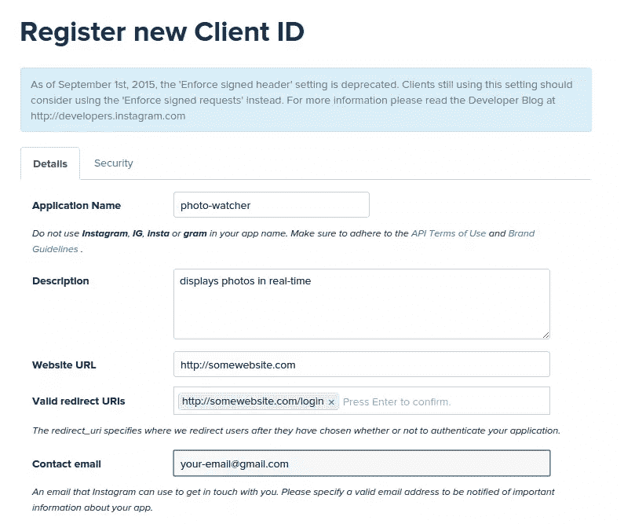
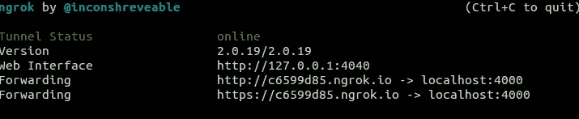
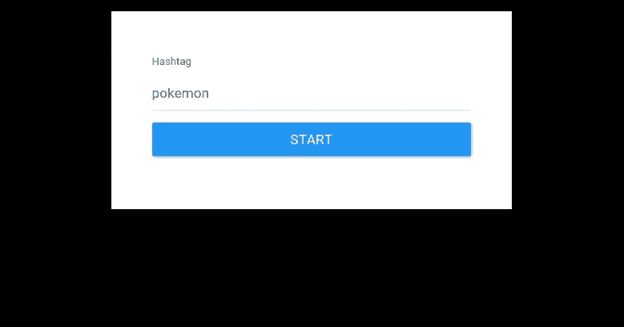

# 使用 Instagram API 构建实时照片更新应用程序

> 原文：<https://www.sitepoint.com/real-time-photo-update-app-instagram-api/>

> 抬起头来！ Instagram [于 2015 年 11 月 17 日取消了对标签](https://www.instagram.com/developer/changelog/)的实时订阅，因此无法继续学习本教程。

*这篇文章由[杰米·希尔兹](https://www.sitepoint.com/author/jshields/)、[埃德温·雷诺索](https://www.sitepoint.com/author/ereynoso/)和[汤姆·格列柯](https://www.sitepoint.com/author/tgreco/)进行了同行评议。感谢 SitePoint 的所有同行评审员使 SitePoint 的内容尽可能做到最好！*

Instagram 是一个在线照片分享网络，用户可以通过它拍摄照片和视频，并在各种社交网络平台上分享。用户可以个性化他们上传的每张照片(例如通过添加各种效果)，并用[标签](https://help.instagram.com/351460621611097)将它们分类。

在本教程中，我们将建立一个实时照片更新应用程序。这将允许用户输入他们想要订阅的标签。然后，每次有标签的新照片被发布到 Instagram 上，它就会被发送到我们的应用程序，应用程序会相应地显示它。

我们将使用 Express 作为框架在 Node.js 中实现我们的应用程序。实时部分将使用 [Instagram 的实时照片更新](https://instagram.com/developer/realtime/)和 Socket.io 来实现，与以往一样，本教程的代码可在[我们的 Github repo](https://github.com/sitepoint-editors/express-instagramrealtime) 上获得。

## 实时照片更新是如何工作的

Instagram 的实时照片更新通过在每次有新照片发布到您选择的订阅时向您的服务器发送通知来实现。这里有一个分解:

1.  首先，你的服务器向 Instagram 发送订阅请求。
2.  Instagram 接收请求，并通过发回服务器必须发回的响应来验证您是否真的想要订阅。
3.  你的服务器接收数据，并将其发送回 Instagram。
4.  如果数据相同，Instagram 将开始向您的服务器发送通知。

您可以通过四种类型的订阅接收实时更新:用户、标签、位置和地理位置。你可以在文档中了解更多关于这些的信息。在本教程中，我们将只使用标签订阅。这使您可以在新照片被您指定的标签标记时收到通知。

## 注册应用程序

我们需要做的第一件事是[创建一个 Instagram 账户](https://help.instagram.com/182492381886913/)，然后[注册成为开发者](https://instagram.com/developer/register/)。

接下来，我们需要[注册一个新的 Instagram 应用](https://instagram.com/developer/clients/register/)。您可以为网站放置任何有效的 URL 和重定向 URL，因为它们对于我们的应用程序正常运行是不需要的。



创建应用程序后，记下`CLIENT ID`和`CLIENT SECRET`，因为稍后向 Instagram API 发出请求时会用到它们。

## 服务器端设置

接下来要做的是克隆[repo](https://github.com/sitepoint-editors/express-instagramrealtime)并使用 npm 安装依赖项。

```
git clone git@github.com:sitepoint-editors/express-instagramrealtime.git
cd express-instagramrealtime
npm install 
```

这将引入以下依赖关系:

*   [Express](http://expressjs.com/) 是 Node.js 事实上的标准 web 应用服务器框架，用于服务应用面向公众的一面，以及接收来自 Instagram 的照片通知。
*   [Express handle](https://github.com/ericf/express-handlebars)用于实现 Express.js 中的视图。
*   [body-parser](https://github.com/expressjs/body-parser) 用于解析用户提交的表单数据。在这种情况下，数据是用户想要订阅的标签。
*   [instagram-node-lib](https://github.com/mckelvey/instagram-node-lib) 是一个 Node.js 库，用于使用 Instagram API。一旦我们有了用户提供的标签，这个库就被用来订阅标签。
*   [socket.io](http://socket.io/) —订阅特定标签后，Instagram 会在每次发布带有我们使用的标签的新照片时向服务器发送通知。这就是 socket.io 的用武之地。它用于在服务器每次收到新通知时将照片数据发送到前端。
*   [moment](http://momentjs.com/) 用于格式化 Instagram API 提供的时间戳。

现在我们已经准备好查看应用程序了。在`app.js`中，我们首先需要我们安装的依赖项。

```
var express = require('express');
var exphbs  = require('express-handlebars');
var moment = require('moment');
var bodyParser = require('body-parser');
var instagram = require('instagram-node-lib');
var app = express();

app.use(bodyParser.json());
app.use(bodyParser.urlencoded({ extended: true }));

// set the file name of the default layout
app.engine('handlebars', exphbs({defaultLayout: 'main'}));

// set the expressJS view engine to handlebars
app.set('view engine', 'handlebars');

// set the path to the front-end assets
app.use(express.static('public')); 
```

现在，我们已经要求了必要的依赖关系，我们需要设置 Instagram `CLIENT ID`和`CLIENT SECRET`。您将使用注册应用程序时生成的值替换这些值。

```
var instagram_client_id = 'YOUR-INSTAGRAM-CLIENT-ID';
var instagram_client_secret = 'YOUR-INSTAGRAM-CLIENT-SECRET';

instagram.set('client_id', instagram_client_id);
instagram.set('client_secret', instagram_client_secret); 
```

配置好 ID 和密码后，接下来我们要做的是创建一个将在端口 4000 上运行的服务器实例。您可以通过使用`console.log`输出主机和端口来检查服务器是否已经开始运行。

```
var server = app.listen(4000, function(){
  var host = server.address().address
  var port = server.address().port

  console.log('Example app listening at http://%s:%s', host, port)
}); 
```

接下来，让 socket.io 监听 Express 服务器。这将 socket.io 绑定到与 Express 服务器相同的端口，以便以后在客户端连接到这个 socket 时可以使用端口 4000。

```
var io = require('socket.io').listen(server); 
```

现在让我们继续为应用程序的主页创建一个新的路径。它所做的只是呈现 home 模板。

```
app.get('/', function(req, res){
  res.render('home');
}); 
```

## 创建视图

根据默认的手柄配置，所有视图文件都应该存储在`views`目录中。文件`home.handlebars`将呈现表单控件，用户将在其中输入用于实时照片更新的标签:

```
<div id="form-wrapper">
  <div class="form-group">
    <label for="tag" class="control-label">Hashtag</label>
    <input type="text" class="form-control input-lg" id="tag" name="tag" autofocus>
  </div>

  <div class="form-group">
    <button id="start" class="btn btn-lg btn-block btn-primary">Start</button>
  </div>
</div>

<div id="results" class="hidden">
  <div class="row"></div>
</div> 
```

每当任何 Instagram 用户发布带有该标签的新照片时，它都会立即被 id 为`results`的 div 内的应用程序显示出来。

在前面的`app.js`文件中，我们用以下代码设置了默认布局的文件名:

```
app.engine('handlebars', exphbs({defaultLayout: 'main'})); 
```

在手柄中，布局文件存储在`views/layouts`中。在该目录中，文件`main.handlebars`作为主布局。主要内容呈现在 id 为`wrapper`的 div 中:

```
<!DOCTYPE html>
<html>
  <head>
    <meta charset="utf-8">
    <title>Real-time Photo Updates</title>

    <link rel="stylesheet" href="/css/bootstrap.min.css">
    <link rel="stylesheet" href="/css/style.css">
  </head>
  <body>
    <div id="wrapper">
    {{{body}}}
    </div>
    <script src="/js/jquery.min.js"></script>
    <script src="/js/jquery.backstretch.min.js"></script>
    <script src="/js/jquery.imagepreload.min.js"></script>
    <script src="/js/vague.min.js"></script>
    <script src="/js/socket.io.min.js"></script>
    <script src="/js/handlebars.min.js"></script>
    <script src="/js/moment.min.js"></script>
    <script src="/js/livestamp.min.js"></script>
    <script src="/js/script.js"></script>
  </body>
</html> 
```

如您所见，需要一些前端依赖项。以下是对每种方法的简要描述:

*   [Bootstrap](http://getbootstrap.com/) 是一个前端框架。这是我对几乎所有我创建的网络事物的个人选择。如果你也想使用 Bootstrap，你可以在 bootswatch.com 找到[的免费主题。](https://bootswatch.com/)
*   [jQuery](http://jquery.com/) 用于操作 HTML 和监听页面上的点击事件。它也是下面 3 个库的依赖项。
*   [jQuery BackStretch](http://srobbin.com/jquery-plugins/backstretch/) 用于将当前照片制作成整页背景图片。
*   jQuery 图像预加载插件用于在显示给用户之前预加载图像。
*   当太长时间没有从服务器端接收到新照片时，Livestamp 有助于保持以前的文本最新。
*   [Vague.js](https://gianlucaguarini.github.io/Vague.js/) 对背景图像应用模糊滤镜。
*   [手柄](http://handlebarsjs.com/)用于生成用于显示照片的 HTML。
*   [时刻](http://momentjs.com/)用于显示基于时间戳的 timeago 文本。

这些依赖关系可以在`public/js`和`public/css`中找到。这是因为我们指定这个文件夹(`public`)应该包含我们的前端资产:

```
app.use(express.static('public')); 
```

你也可以使用 [bower](http://bower.io/) 来下载和管理这些资产。如果你选择了[，请务必更新。bowerrc 文件](http://stackoverflow.com/questions/14079833/how-to-change-bowers-default-components-folder)，以便它使用您指定的静态目录。

这样一来，我们现在就可以创建`script.js`文件了。

## 肉和土豆

文件`script.js`内部是所有前端动作发生的地方。这里，我们需要使用 jQuery 的`$.get`函数从服务器获取 handlebars 模板。一旦它被获取，就必须被编译并存储在一个变量中。这是用于构建显示照片的 HTML 的模板。

```
var template;
$.get('/templates/row.hbs', function(data){
  template = Handlebars.compile(data);
}, 'html'); 
```

这是车把模板的样子(`public/templates/row.hbs`):

```
<div class="row">
  <div class="photo-container">
    
  </div>

  <div class="photo-details">
    <div class="timestamp" data-livestamp="{{created_time}}">{{human_time created_time}}</div>
    
    <a href="http://instagram.com/{{user}}" target="_blank" class="username">{{user}}</a>
    <div class="caption">{{caption}}</div>
  </div>
</div> 
```

这包含了显示我们的应用程序的照片的代码。

回到`script.js`我们需要连接到 socket.io 服务器。

```
var socket = io.connect('http://your-server.com:4000'); 
```

并注册一个助手来将 Unix 时间戳转换成人类友好的形式:

```
Handlebars.registerHelper('human_time', function(timestamp){
  return moment.unix(timestamp).fromNow();
}); 
```

当单击开始按钮时，我们需要将用户输入的 hashtag 发送到服务器。一旦这是成功的，我们要隐藏的形式，并显示照片容器。

```
$('#start').click(function(){
  var tag = $('#tag').val();
  $.post(
    '/tag/subscribe',
    { 'tag': tag },
    function(response){
      if(response.type == 'success'){
        $('#form-wrapper').addClass('hidden');
        $('#results').removeClass('hidden');
      }
    }
  )
}); 
```

回到服务器端(在`app.js`中)，我们的应用需要取消订阅所有当前的实时订阅，然后订阅用户提供的新标签。我们可以通过使用 instagram-node-lib 库提供的`tags`对象中的`subscribe`方法来实现这一点。一旦服务器收到来自 Instagram 的有效响应，我们就会发送订阅已完成的响应。

```
var current_tag;

app.post('/tag/subscribe', function(req, res){
  current_tag = req.body.tag;
  console.log('current tag: ' + current_tag);

  instagram.tags.unsubscribe_all({
    complete: function(unsubscribe_data) {
      if(unsubscribe_data == null){
        console.log('unsubscribed from everything!');
        instagram.tags.subscribe({
          object_id: current_tag,
          callback_url: 'https://xxxxxxxx.ngrok.io/subscribe',
          complete: function(subscribe_data){
            if(subscribe_data){
              res.send({type: 'success'});
            }
          }
        });
      }
    }
  });
}); 
```

当 Instagram 收到您订阅新标签的请求时，它会发送一个`GET`请求您的回调 URL。此请求包含一个查询参数。服务器要做的就是发回 Instagram 让验证通过。

```
app.get('/subscribe', function(req, res){
  res.send(req.query['hub.challenge']);
}); 
```

每当 Instagram 上发布带有该标签的新照片时，它都会自动向您的服务器发送通知。这一次是对您指定的`callback_url`的一个`POST`请求(您必须在部署部分对此进行更改)。请注意，该请求不包含任何关于已发布照片的数据。它只包含有关时间和它所源自的订阅的数据。这就是为什么你必须单独申请获取最近发布的照片。一旦返回一个响应，创建一个名为`photo`的新对象，然后将所有想要返回的数据存储在一个新变量中。在这种情况下，只需要以下内容:用户名、个人资料照片、发布图像的时间戳、照片的 URL 和标题文本。最后，通知客户端有新照片了。

```
app.post('/subscribe', function(req, res){
  instagram.tags.recent({
    name: current_tag,
    count: 1,
    complete: function(data){
      var photo = {
        'user': data[0].user.username,
        'profile_pic': data[0].caption.from.profile_picture,
        'created_time': data[0].created_time,
        'image': data[0].images.standard_resolution.url,
        'caption': data[0].caption.text
      };
      io.sockets.emit('new_photo', photo);
    }
  });
}); 
```

## 显示结果

回到客户端(script.js)，让我们使用 jQuery Image Preloader 插件在新照片进来时预加载图像。这将在向用户显示之前在客户端完全下载图像。一旦图像被预加载，使用`template`和照片数据构建新的 HTML。接下来，我们将使用 jQuery Backstretch 插件将图像设置为整页背景图像，并使用 vague.js 来模糊背景。之后，您可以将 HTML 附加到页面上，然后用`fadeIn`效果显示它。最后，删除最后显示的图像。

```
socket.on('new_photo', function(data){
  $.imgpreload(data.image, function()
  {
    console.log('loaded a new image');

    var first_row = $('#wrapper .row:first');
    var html = template(data);

    $.backstretch(data['image']);

    var vague = $('.backstretch').Vague({
      intensity: 10,
      forceSVGUrl: false
    });

    vague.blur();

    $(html).hide().insertBefore(first_row).fadeIn('slow');
    $('#wrapper .row:last').remove();
  });
}); 
```

在我们开始总结的时候，让我们快速地向我们的应用程序添加一些 CSS。这个你可以在`public/css/style.css`里看到。[在 GitHub](https://github.com/sitepoint-editors/express-instagramrealtime/blob/038b69b4df70d5a710dd305be3a4b353cd2562a0/public/css/style.css) 上查看文件。

## 部署

现在，您可以运行应用程序了:

```
node app.js 
```

但是，当你导航到 [http://localhost:4000/](http://localhost:4000/) ，输入一个标签，点击*开始*，什么都不会发生。如果您查看控制台，您会看到以下错误:

```
APISubscriptionError occurred: Invalid response in _request 
```

嗯！怎么回事？

问题是，应用程序应该可以通过互联网访问，以便接收 Instagram 的响应。由于我们在 localhost 上运行该应用程序，不幸的是这不起作用。幸运的是，我们可以使用 [ngrok](https://www.sitepoint.com/use-ngrok-test-local-site/) 在互联网上展示我们的应用。一旦下载并安装了 ngrok，就可以在终端中执行以下命令来运行它:

```
ngrok http 4000 
```

这将 Express 服务器暴露给互联网。确保更改`app.js`文件中的`callback_url`，以使用 ngrok 返回的 https URL。如果您计划稍后部署应用程序，它也应该是 https URL。

```
instagram.tags.subscribe({
  object_id: tag,
  callback_url: 'https://xxxxxxxx.ngrok.io/subscribe',
  ...
}); 
```

复制转发网址就行了。下面是截图:



现在，如果您重新启动服务器，事情应该会按计划进行:



一旦用户订阅，应用程序将开始通过 socket.io 从服务器接收照片数据，然后显示它。


## 更进一步

如果你想尝试这个应用程序并做出一些自己的改变，你可能想看看 [nodemon](https://github.com/remy/nodemon) 。每当您对节点应用程序进行更改时，这会自动重启服务器，这对于开发来说非常方便。

然后就是坚持的问题。一旦你对事情满意了，并且如果你在基于 Unix 的系统上，你可以在你的服务器上安装 [Supervisor](http://supervisord.org/) 。这允许你持续运行应用程序。简单地用 nodemon 运行应用程序是不够的，因为当您退出服务器时，这个过程就终止了。

在当前终端窗口中，执行以下命令:

```
sudo apt-get install supervisor 
```

为应用程序创建配置文件:

```
sudo nano /etc/supervisor/conf.d/instagram-realtime.conf
```

```
[program:instagram-realtime]
command=nodemon app.js
directory=/home/ubuntu/www
stdout_logfile=/home/ubuntu/logs/instagram-realtime.log
redirect_stderr=true 
```

然后通过执行以下命令将其添加到 Supervisor:

```
sudo supervisorctl
reread
add instagram-realtime
start instagram-realtime 
```

## 最后的想法

就是这样！在本教程中，您已经学会了使用 socket.io 使用 Instagram API 的实时功能。请记住[的限制](https://instagram.com/developer/limits/)，即您可以对 Instagram 进行的 API 调用(这意味着可以订阅不同标签的用户数量是有限的——尤其是在标签受欢迎的情况下)。如果是这种情况，那么服务器将会收到来自 Instagram 的大量通知，并且您可以进行的 API 调用的数量将会很容易用完。除此之外，你可以随意使用 Instagram API。

这个 API 还有很多其他的可能性，你可以[嵌入 Instagram 帖子](https://instagram.com/developer/embedding/)或者[将其与你的移动应用](https://instagram.com/developer/mobile-sharing/)集成。至于我们的应用程序，一个完美的用例是在一个活动中，你要求参与者张贴带有特定标签的照片。活动组织者可以订阅这个标签，并将应用程序投影到屏幕上，这样每个人都可以看到正在共享的照片。

我很想在下面的评论中听到你对这款应用和 Instagram API 的看法。

## 分享这篇文章