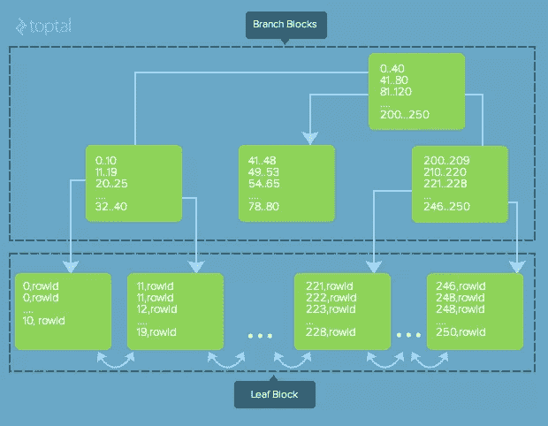
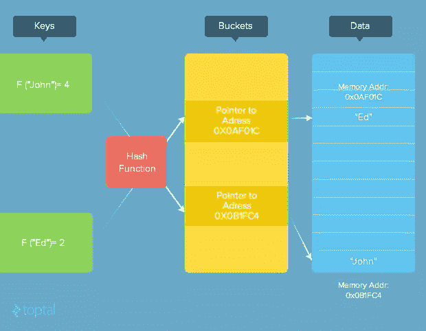

# 面试网站开发人员的重要指南

> 原文：<https://www.sitepoint.com/vital-guide-interviewing-web-developers/>

*本文由 [Toptal](http://www.toptal.com/) 提供。感谢您对使 SitePoint 成为可能的合作伙伴的支持。*

本指南提供了有效问题的样本，以帮助评估候选人掌握 web 开发的广度和深度，包括客户端、服务器端、传输和数据库相关主题。

在我们开始寻找世界级的 web 开发人员之前，我们必须首先准确定义我们所说的“web 开发”是什么意思。我们指的是网站的开发吗？或者一个 web 服务的开发？或者开发一个复杂的基于 web 的应用程序？事实上，web 开发是一个非常宽泛的术语，可以合理地包含上述任何或所有内容。因此，本指南涉及了网络开发的多个方面，其中一些或全部将与你可能要招聘的特定环境相关。

本指南有意将重点放在 web 开发的概念和架构基础上，而不是钻研任何特定 web 技术的细节(例如 [JavaScript](http://www.toptal.com/javascript#hiring-guide) 、 [Ruby on Rails](http://www.toptal.com/ruby-on-rails#hiring-guide) 、 [PHP](http://www.toptal.com/php#hiring-guide) 等等)。因此，本指南提出了与以下内容相关的“技术不可知”的 web 开发人员面试问题:

*   [客户端(基于浏览器的开发)](http://www.toptal.com/web#guide-client-side)
*   [服务器端](http://www.toptal.com/web#guide-server-side)
*   [运输](http://www.toptal.com/web#guide-transport)
*   [数据库](http://www.toptal.com/web#guide-database)


不可否认，公正地对待这里的许多主题将保证他们自己的帖子。尽管如此，本指南努力提供至少一个有意义的关于 web 开发的关键问题和主题的概述，一个经验丰富的 web 开发人员应该对此非常熟悉。


## 客户端(基于浏览器的开发)

基于浏览器的开发向开发人员提出了许多独特的挑战，从跨浏览器异常到沙箱限制，再到跨各种客户端平台和设备的不同性能特征。熟练的客户端 web 开发人员将非常擅长于跨越这些障碍。

### 问:讨论至少三个客户端的重点领域，以帮助减少页面加载时间。

性能是用户体验任何应用的核心。用户已经越来越不能容忍缓慢的页面加载时间，知道这一点，大型搜索引擎实际上量化了他们的机器人抓取的每个页面的时间。

发出初始页面请求、获取页面对客户端的初始响应内容、解析该内容并发出对资源项的后续请求(这本身就是往返于服务器的一个过程)，然后运行任何 JavaScript 都会增加页面加载时间。

事实上，有许多技术可以用来帮助改善页面加载时间。以下是几个例子:

*   避免“渲染阻塞”。当浏览器的解析引擎在 HTML 中遇到一个访问外部资源的标签时(比如一个`<script>, <image>, <iframe>`等)。)引擎暂停以等待该资源完全下载到客户端，然后继续。更糟糕的是，在带有`src`属性的`<script>`标签的情况下，浏览器也会在继续处理页面的其余部分之前执行该脚本。当该脚本可能随后发出另一个请求时，这就变得特别成问题。大多数浏览器都提供了一个异步属性，您可以将它添加到这些标签中，以避免这种类型的阻塞。另一个策略是确定可以延迟加载的资源，直到真正需要它们的时候。
*   优化图像。很可能你将载入页面的最大资源是你的图片。为传输而优化它们可以证明是非常有益的，因为适当的大小可以大大减少页面加载时间。例如，不要将 600 像素乘 400 像素的图像用于 120 像素乘 80 像素的缩略图。选择最佳压缩格式并关闭某些格式功能也很有帮助。
*   尽量减少往返请求。检索资源(图像等)的往返过程。)对于页面加载时间来说可能是个大问题。由于一个页面发出的请求越少，速度就越快，所以一种有助于提高性能的技术是尽可能将资源组合成更少的请求。例如，非用户生成的图像是这里的主要候选对象。例如，仅仅为了检索一个 16×16 的笑脸表情符号而往返服务器是非常低效的。

### 问:提供跨浏览器开发挑战的例子，包括一些避免或解决它们的技巧。

在软件开发中，很少有事情像处理跨浏览器问题和异常那样容易导致过早脱发。即使你只是想支持相当流行的浏览器的当前版本(比如 IE、Firefox 和 Chrome ),你仍然有可能遇到你的代码或布局在其中一个浏览器中不能工作(或者至少不能很好地工作)的地方。

这些问题非常矛盾和棘手，没有一个指南可以提供避免这些问题的万无一失的方法，但你可以做一些事情来帮助最小化这些问题，并保护自己免受这些问题的影响。

这里有一些技术可以帮助最小化跨多个浏览器的 CSS 相关异常:

*   浏览器重置样式表。浏览器重置样式表背后的想法是让您控制所有元素的默认样式。例如，重置脚本的最小起点可能如下:

    ```
    * {
        margin: 0;
        padding: 0;
        border: 0;
    }
    ```

*   让这个 CSS 片段在所有其他样式表之前运行，使您能够覆盖您想要的任何元素属性，知道您没有覆盖的任何内容在所有浏览器上仍然是相当一致的。
*   提供 CSS“后援”。当使用较新的 CSS 属性值时(可能并非所有浏览器都支持)，最好为那些尚不支持您想要使用的属性值的浏览器提供明智的后备。较旧的浏览器将跳过它们不理解的较新的属性值，并将简单地使用它们识别的较旧的(回退)属性，而较新的浏览器将理解回退和较新的属性，并将使用较新的属性来代替较旧的属性。(*注意*:为了在新浏览器中正常工作，回退必须出现在 CSS 中新属性的之前*，这样新浏览器就更喜欢新属性。)*
*   CSS 属性值的用户浏览器特定前缀。尽管前两种技术具有不需要任何特定于浏览器的定义或代码的明显优势，但是前端 web 开发使得特定于浏览器的解决方案至少在某种程度上并不总是可避免的。例如，浏览器有时会支持一些 W3C 标准 CSS 属性值的自己的、正在进行的版本。在这种情况下，使用特定于浏览器的前缀这些值可能是一种有用且合理的方法(常用的前缀包括-webkit-用于 Chrome 和 Safari，-moz-用于 Firefox，以及-ms-用于 Internet Explorer)。例如，下面的 CSS 代码片段使用供应商前缀在尚不支持 W3C 标准渐变属性的浏览器版本中提供渐变支持(这有点难看，但它是可靠且有效的):

    ```
    /* Vendor prefixes */
      background: -webkit-gradient(linear, 50% 100%, 50% 0%, color-stop(0%, #2c99ce),
                  color-stop(76%, #459dcf), color-stop(95%, #74b9e0),
                  color-stop(100%, #abe1fa));
      background: -webkit-linear-gradient(bottom, #2c99ce, #459dcf 76%, #74b9e0 95%, #abe1fa);
      background: -moz-linear-gradient(bottom, #2c99ce, #459dcf 76%, #74b9e0 95%, #abe1fa);
      background: -o-linear-gradient(bottom, #2c99ce, #459dcf 76%, #74b9e0 95%, #abe1fa);

      /* W3C Standard */
      background: linear-gradient(bottom, #2c99ce, #459dcf 76%, #74b9e0 95%, #abe1fa); 
    ```

*   如果在 IE 中所有其他方法都失败了……IE 可能会变得特别暴躁，所以，如果更通用的技术，比如上面的那些，仍然不能在 IE 中达到预期的效果，你可能会被迫使用 *IE 条件注释*。这些黑客是微软自愿添加到其浏览器中的，以帮助解决 IE 的不一致性。由于它们是以 HTML 注释的形式出现的，其他浏览器会简单地忽略它们:

    ```
     <!--[if IE 8]>
    <link href="/ie8hacks.css" rel="stylesheet" type="text/css" />
    <![endif]-->

    <!--Or, for IE5 through IE7-->
    <!--[if (gt IE 5)&(lte IE 8)]>
    <p>Dude, looks like it's time to update your browser!</p>
    <![endif]--> 
    ```

在 JavaScript 方面，也有处理跨浏览器特性的方法。

历史上，最常见的方式是通过浏览器检测(也称为“浏览器嗅探”)来检测客户端运行的浏览器版本。虽然这可以工作，但它有许多缺点。最值得注意的是，它要求开发人员根据检测到的浏览器和版本的已知/假定功能对行为进行硬编码。同样值得注意的是，在许多现代浏览器中，浏览器身份可能会被欺骗。因此，毫不奇怪，甚至 jQuery 也建议不要使用它的 [`$.browser`](http://api.jquery.com/jquery.browser/) 属性。

jQuery 提倡的技术，也是目前普遍推荐的方法，被称为*特征检测*。*特征检测*并不依赖于潜在有缺陷的关于浏览器功能的*先验*知识，而是使用更强大的方法来动态确定客户端浏览器支持和不支持什么。这里有一个例子:

```
 // this function adds an event listener reliably using feature detection
function myAddEventListener(event, listener) {

  if (window.addEventListener) {
    // Browser supports "addEventListener"
    window.addEventListener(event, listener, false);

  } else if(window.attachEvent) {
    // Browser supports "attachEvent"
    window.attachEvent("on" + event, listener);
  }

}

/* ... */

myAddEventListener("load", myListener); 
```

当然，无论您采用什么技术，无论您认为它们有多可靠，都要确保在您打算支持的所有浏览器中进行彻底的测试。

### 问:比较和对比 SASS，LESS 和 CSS，包括各自的优缺点。

首先，定义我们的术语:

*   CSS:级联样式表
*   SASS:语法上很棒的样式表
*   不太精简的级联样式表

CSS 指的是所有符合 W3C 的浏览器(以及其他类似的浏览器)都理解的一组静态指令。这种静态特性使得 CSS 变得简单。对于您想要定制的每个元素，您需要有一些编码的样式规则的组合，它们一起将塑造它的外观。这个事实限制了代码重用的机会(把干货扔出窗外)。

SASS 和 LESS 都是 CSS 的衍生语言，但它们与 CSS 的不同之处在于，它们利用预处理将各自的指令解析为有效的 CSS。这种预处理为两种语言提供了变量、继承、混合、嵌套规则、逻辑操作符甚至循环的机制。这些工具解决了编写 CSS 的一些主要不便，而不必钻研完全不同的语言，如 PHP 或 JavaScript，因为这两种语言的语法都非常类似于 CSS。

用户界面和网站变得越来越复杂，浏览器布局引擎(webkit、gecko 等)也是如此。).在管理应用程序的外观和感觉时，用动态规则处理这种复杂性的能力可以节省大量时间。

使用预处理语言的潜在好处的一个常见例子是在色彩管理中。在普通的 CSS 中改变一个站点的调色板是很困难的。通常需要对几个文件进行梳理，以找到要更改的特定颜色的引用，并且对于找到的每个引用，都要询问“我们要更改这个吗？”必须要问。另一方面，使用 SASS 或更少的颜色变量，可以简单地修改单个颜色变量，然后对该颜色变量的所有引用都会反映这种变化。


## 服务器端

服务器通常是应用程序的主力。它验证请求、处理数据、应用业务逻辑并构建响应。架构和设计良好的服务器和服务可以显著提高系统的性能和可用性。

### 问:描述一些服务器端缓存的方法、技术和注意事项。

由于单个服务器通常服务于数百甚至数千个客户端的需求，因此它们很可能会收到(并需要响应)多个相同的请求。此外，即使请求不相同，它们需要提供的响应也可能重叠。因此，服务器端缓存可以避免浪费服务器端资源来冗余地执行相同的操作，从而有助于提高性能。

以下是建立缓存策略时要考虑的一些常见的关键因素:

*   缓存大小。虽然现在 RAM 通常很便宜，但是在设置缓存大小时，需要考虑容量(即可用的内存量)。将总内存中过高的百分比分配给缓存会对性能产生整体影响，实际上弊大于利。
*   缓存条目过期。在缓存元素上设置适当的过期时间，并在数据更改时使键值存储无效，也有助于提高容量。
*   缓存内容。当然，在设计缓存策略时，决定缓存什么可能是最大的挑战。您可能倾向于缓存生成或计算成本很高的数据，但是根据使用的频率，这可能会浪费宝贵的缓存空间。
*   缓存条目的粒度。数据对象通常由多个“子对象”组成。对象应该存储在包含其所有“子对象”的缓存中，还是应该单独缓存(或者甚至根本不缓存)？这里没有放之四海而皆准的答案；这完全取决于数据库的结构以及客户端对该数据存储进行查询的性质和频率。

### 问:解释什么是会话，并提供在服务器端如何跟踪会话的一般描述。

会话是一种跨多个相关请求持久保存用户数据的机制。该过程将标识键作为传入请求的一部分，在基于浏览器的交互中，标识键通常以客户端 cookie 的形式出现。

应用程序会将一个会话对象实例化到内存中。然后，它可以向该对象添加关于当前用户如何与应用程序交互的数据。当应用程序完成其执行周期时，它将关闭会话，因此，数据被序列化并写入某个层，该层可以存储数据以供该用户的下一个请求使用。该技术只需要能够满足存储需求，因此它可以是数据库、文件或某种缓存技术。


## 运输

很多时候，一个 web 开发人员在某个特定的技术上有扎实的技能，但是在理解“各个部分是如何组合在一起的”上有所欠缺。相比之下，一个顶级的 web 开发人员将会对如何提出请求、构建请求和响应请求有一个很好的理解。

### 问:什么是 REST，什么是 RESTful Web 服务？描述一下它的特点。

REST(表述性状态转移)是一种客户端/服务器架构，其中数据和功能被视为资源，并使用[统一资源标识符(URIs)](http://en.wikipedia.org/wiki/Uniform_resource_identifier) 进行访问。通过使用一组简单的、定义明确的操作对资源进行操作。REST 被设计成使用无状态通信协议，通常是 HTTP。

正如在 [Java EE 教程](http://docs.oracle.com/javaee/6/tutorial/doc/gijqy.html)中所讨论的，以下原则鼓励 RESTful 应用变得简单、轻量和快速:

*   通过 URI 进行资源标识:RESTful web 服务公开了一组资源，这些资源标识了与客户端交互的目标。资源由 URIs 识别，这为资源和服务发现提供了全局寻址空间。
*   统一接口:资源通过一组特定的请求类型进行操作，最常见的请求类型有:
    *   GET:从服务器检索数据(应该只检索数据，应该没有其他影响)。
    *   POST:向服务器发送新实体的数据。它通常在上传文件或提交完整的 web 表单时使用。
    *   PUT:类似于 POST，但是用于更新现有的实体。
    *   删除:从服务器上删除数据。
*   自描述性消息:资源从它们的表示中分离出来，因此它们的内容可以以多种格式被访问。关于资源的元数据是可用的，并且用于例如控制缓存、检测传输错误、协商适当的表示格式以及执行认证或访问控制。
*   通过超链接的有状态交互:每个与资源的交互都是无状态的；也就是说，请求消息是独立的。有状态交互基于显式状态转移的概念。有几种技术可以交换状态，比如 URI 重写、cookies 和隐藏表单字段。状态可以嵌入到响应消息中，以指向交互的有效未来状态。

如果用使用 RESTful Web 服务的数量来衡量，RESTful Web 服务(RWS)在最近几年已经成为明显优于以前支持的 SOAP 协议的热门。RWS 的相对易用性在很大程度上要归功于它。事实上，REST 对 web 的影响如此之大，以至于它几乎取代了基于 SOAP 和基于 WSDL 的界面设计，因为它是一种使用起来相当简单的风格。

### 问:请简要描述以下 HTTP 请求方法:跟踪、选项、连接和补丁。

除了已经讨论过的四种标准 RESTful Web 服务操作，还有四种更高级的 Web 开发人员可能熟悉的方法:

*   TRACE:提供了一种方法来测试当发出请求时，网络路径上的机器收到了什么。因此，它只是返回发送的内容。
*   选项:允许客户端请求有关服务支持的请求方法的信息(或通过在 URI 中使用*通配符来请求服务所在的服务器的信息)。相关的响应头是 Allow，它简单地列出了支持的方法。
*   HEAD:与资源的 GET 方法相同，但只返回响应头(即没有实体体)。
*   CONNECT:主要用于建立到资源的网络连接(通常通过某个代理，可以请求该代理将 HTTP 请求作为 TCP 转发并保持连接)。一旦建立，响应发送 200 状态代码和“连接建立”消息。

HTTP 服务器推送的一些常见技术包括:

*   [WebSocket API](https://developer.mozilla.org/en-US/docs/WebSockets) 。WebSockets 使得在客户端浏览器和服务器之间打开交互式通信会话成为可能。有了这个 API，客户端可以向服务器发送消息并接收事件驱动的响应，而不必轮询服务器的回复。
*   [推杆](http://www.pushlets.com/)。Pushlets 基于开放源码的基于 HTTP 的发布/订阅框架，支持 AJAX。这种方法利用持久的 HTTP 连接，让响应永久打开(即服务器永远不会终止响应)，有效地欺骗浏览器在初始页面加载完成后保持“加载”模式。然后，服务器定期发送 JavaScript 片段来更新页面内容，从而实现推送功能。通过使用这种技术，客户机不需要 Java 小程序或其他插件来保持与服务器的开放连接。由服务器推送的新事件会自动通知客户端。(然而，这种方法的一个严重缺点是服务器对浏览器超时缺乏控制；如果浏览器端发生超时，页面刷新总是必要的。)
*   [长轮询](http://en.wikipedia.org/wiki/Push_technology#Long_polling)。长轮询实际上只是传统轮询技术的一种变体，但它允许在不可能进行真正推送的情况下模拟推送机制，例如安全策略要求拒绝传入 HTTP 请求的站点。使用长轮询时，客户端完全像正常轮询一样向服务器请求信息，只是轮询频率要慢得多。如果服务器在收到轮询时没有任何可供客户端使用的信息，服务器不会发送空响应，而是保持请求打开，等待响应信息可用。一旦打开，服务器立即向客户机发送响应，完成打开请求。从而消除了通常与轮询客户端相关联的响应等待时间(信息第一次变得可用和下一个客户端请求之间的时间)。
*   [闪光 XMLSocket 继电器](http://en.wikipedia.org/wiki/Push_technology#Flash_XMLSocket_relays)。这种技术被各种聊天应用程序使用，它在单像素 Adobe Flash 电影中使用 XMLSocket 对象。在 JavaScript 的控制下，客户端与服务器上的单向中继建立 TCP 连接。中继服务器不从该套接字读取任何内容；相反，它会立即向客户端发送一个唯一的标识符。然后，客户端向 web 服务器发出一个 HTTP 请求，包括这个标识符。然后，web 应用程序可以将寻址到客户端的消息推送到中继服务器的本地接口，中继服务器通过 Flash socket 中继这些消息。


## 数据库ˌ资料库

如前所述，web 开发难题有许多方面，并不是每个合格的 web 开发人员都必须精通所有这些方面。因此，许多 web 开发人员可能主要关注客户端，因此在数据库领域几乎没有专业知识。然而，有效的数据库设计、访问和操作对于大多数基于 web 的系统的性能来说是相当重要的，因此，具有丰富数据库专业知识的 web 开发人员对于您的项目来说是非常有价值的。

### 问:规范化数据库意味着什么？一个人如何着手做这件事？描述数据库规范化的潜在后果。

[数据库规范化](http://en.wikipedia.org/wiki/Database_normalization)是组织关系数据库的字段和表以最小化冗余的过程。规范化通常包括将大表划分成较小的(冗余较少的)表，并定义它们之间的关系。目标是隔离数据，以便只在一个表中添加、删除和修改一个字段，然后使用定义的关系传播到数据库的其余部分。

开始规范化您的数据库的一个好方法是首先根据关系数据库理论的[范式](http://en.wikipedia.org/wiki/Database_normalization#Normal_forms)来评估它。这些范式为确定表对逻辑不一致和异常的免疫程度提供了标准。满足某个级别要求的数据库也必须满足所有先前的级别。前三个级别是最常用的，如下所示:

*   第一范式(1NF)–每个字段应代表每个实体的一个且仅一个值；即，每个字段应该只有一个值(原子性)。例如，一个人可能有两个电话号码。如果应用程序将它们存储在同一个字段中(例如，表的 phone_number 列)，则该表不符合 1NF 的标准。
*   第二范式(2NF)–主键上的列不允许部分依赖。例如，如果一个表有一个多列主键，则任何其他列都不能只依赖于组成主键的列的一个子集。
*   第三范式(3NF)–所有非主键字段必须依赖于主键。如果不属于主索引的字段的值依赖于其他非主字段，则该表不是第三范式。例如，包含汇总列(该列中其他字段的总和)的表不符合 3NF 的条件。

评估数据库与这些范式的一致性有助于识别和消除数据模型中的冗余，从而提高数据模型的效率(顺便提一下，这对于确定缓存中条目的粒度也是有益的)。但是就像生活中的任何事情一样，正常化也是有代价的。将数据分布到几个表中的行为很可能需要在查询中增加表连接的数量，这也会使查询变得复杂，甚至可能使代码变得复杂。它还消除了一些潜在的有益的索引场景，因为来自多个表的数据不能被索引。检索也会变得很昂贵，当试图根据一个表中的值对另一个表中的数据进行筛选或排序时，检索会变得更加复杂。

也就是说，最好的方法通常是这些(和其他架构模式)的混合，以满足应用程序的特定需求。

### 问:描述一个散列索引和一个 BTree 索引。它们的相对优势和劣势是什么？

在任何基于树的索引中，记录都存储在称为树叶的位置。起点叫做根。每个节点的最大子节点数称为树的顺序。到达所需叶(存储在叶上的数据)所需的最大访问操作数称为深度(级别)。一般的树型结构将这些范围“从左到右”排序。一个节点中的一个键可以指向其左侧所有键都小于其值的节点，或者指向其右侧所有键都大于其值的节点。

B 树是二叉查找树的推广，因为 B 树中的节点允许有两个以上的子节点。b 树索引通过评估存储在节点键(索引中的节点包含指向其子节点的键和指针)中的值的范围来连续缩小数据范围，从而帮助快速查找信息。B 树搜索从根节点开始，将每个子节点中的键的范围与所寻找的键值进行比较。当它找到其范围包含所需键值的节点时，选择该节点，然后评估其子节点。这种情况会一直发生，直到进程到达有指向实际数据的指针的叶页面。



在哈希索引中，索引列的值通过哈希函数运行，为哈希表中的每个键生成一个位置标识符。该表被分成“桶”,根据所采用的技术，这些桶或者包含数据值本身，或者包含指向这些值的指针。哈希索引很快，因为桶的确切位置是已知的，并且哈希键是按顺序排序的。一旦找到一个键位置，就将预先散列的值(我们正在搜索的值)与我们刚刚在索引中找到的值进行比较，以确保它是有效的。



散列索引工作得很好，但只是为了相等比较的目的。因此，散列索引不支持形式为`SELECT * FROM table WHERE key LIKE “valu% or SELECT * FROM table WHERE key < value`的查询。相比之下，B 树索引在搜索内容方面具有更大的灵活性。部分值和值的范围很容易处理，在非连接搜索中速度大致相同。在任何一种类型的索引都适合您的目的的情况下，不存在始终如一的“最佳”选择，因为有些情况下散列索引优于 B 树，反之亦然。这在很大程度上取决于数据的性质和结构。

### 问:简要描述和比较关系数据库、文档数据库和图形数据库。

关系数据库将数据组织成二维表，并支持基于已知关系链接其内容的概念。这些关系促进并简化了使用单个查询从多个表中集成和检索数据。

虽然关系数据库在 20 世纪 70 年代首次推出时是一项重大进步，但此后出现了存储数据的新方法，这些方法允许更自然、更有逻辑地将数据分组在一起，并放宽了对数据库模式的限制。存储数据最流行的方式之一是[文档数据库](http://www.mongodb.com/document-databases)模型，其中每条记录及其相关数据被认为是一个“文档”。在文档数据库中，与数据库对象相关的所有内容都封装在一起。以这种方式存储数据有以下优点:

*   文档是独立的单元，这使得性能更好(从磁盘上连续读取相关数据),并且更容易在多个服务器上分发数据，同时保持其局部性。
*   应用程序逻辑更容易编写。您不必在应用程序和 SQL 查询中的对象之间进行转换，您可以直接将对象模型转换成文档。
*   非结构化数据很容易存储，因为文档包含应用程序逻辑需要的任何键和值。此外，由于数据库不需要预先知道它的信息模式，因此避免了成本高昂的迁移。

文档数据库通常具有强大的查询引擎和索引功能，可以轻松快速地执行许多不同的优化查询。文档数据库查询语言的优势是一个重要的区别。

数据库建模的另一个相对较新的进展是随着图形数据库的出现而出现的。基于图论的图形数据库使用带有节点、边和属性的图形结构来表示和存储数据。在图形数据库中，每个元素都包含一个指向其相邻元素的直接指针，不需要索引查找。

与关系数据库相比，对于关联数据集，图数据库通常更快，并且更直接地映射到面向对象应用程序的结构。它们还可以更自然地扩展到大型数据集，因为它们通常不需要昂贵的连接操作。由于它们不太依赖于严格的模式，因此更适合于用不断发展的模式来管理特定的和不断变化的数据。图形数据库对于类似图形的查询(例如，计算图形中两个节点之间的最短路径)是一个特别强大的工具。相反，在对大量数据元素执行相同操作时，关系数据库通常速度更快。

## 总结

重要的是要记住，这里提供的问题只是作为一个指南。不是每一个值得雇佣的“A”级候选人都能够正确地回答所有问题，也不是回答所有问题就一定能成为“A”级候选人。归根结底，招聘既是一门科学，也是一门艺术。

本指南中提出的问题和答案对你寻找优秀的网络开发人员非常有价值，但也是为了增强整体有效的招聘策略，就像这篇文章中所描述的那样，[寻找少数精英](http://www.toptal.com/freelance/in-search-of-the-elite-few-finding-and-hiring-the-best-developers-in-the-industry)。

## 分享这篇文章