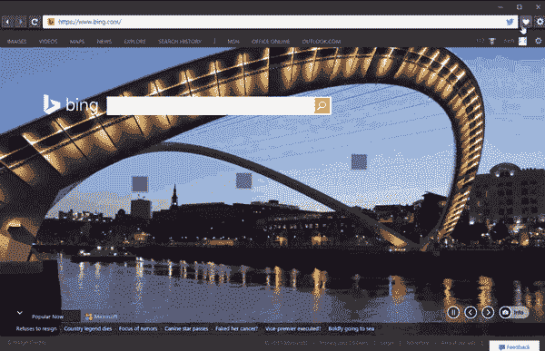
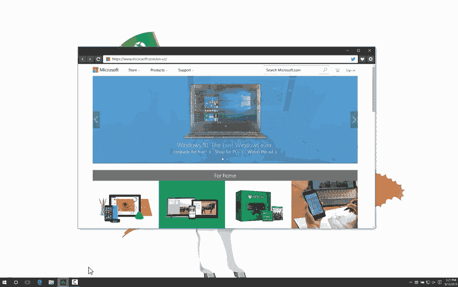

# 如何使用 EdgeHTML 用 JavaScript 创建自己的浏览器

> 原文：<https://www.sitepoint.com/create-browser-javascript-using-edgehtml/>

本文是微软网站开发系列的一部分。感谢您对使 SitePoint 成为可能的合作伙伴的支持。

在过去的几个月里，我们对[微软 Edge 渲染引擎](http://www.smashingmagazine.com/2015/01/inside-microsofts-new-rendering-engine-project-spartan)(微软 EdgeHTML)进行了[多次改进](http://blogs.windows.com/msedgedev/2015/02/26/a-break-from-the-past-the-birth-of-microsofts-new-web-rendering-engine/?WT.mc_id=16522-DEV-sitepoint-article58)，重点关注[与现代浏览器的互操作性](http://blogs.windows.com/msedgedev/2015/06/17/building-a-more-interoperable-web-with-microsoft-edge/?WT.mc_id=16522-DEV-sitepoint-article58)以及与新兴标准的兼容性。除了支持微软 Edge，EdgeHTML 还可以通过 WebView 控件用于所有通用 Windows 平台的应用。在本教程中，我将演示如何使用 [WebView 控件](https://msdn.microsoft.com/en-us/library/windows/apps/dn301831.aspx?WT.mc_id=16522-DEV-sitepoint-article58)在 Windows 10 中创建自己的浏览器。如果你在 Mac 上，你可以尝试我们的虚拟机或[双启动安装一个内部版本](http://insider.windows.com/?WT.mc_id=16522-DEV-sitepoint-article58)。

使用包括 JavaScript、HTML 和 CSS 在内的标准 web 技术，我们创建了一个示例 UWP 应用程序，它托管 WebView 并提供导航和收藏夹等基本功能。这些相同的技术可以在任何 UWP 应用程序中无缝集成 web 内容。

功能的关键在于强大的 WebView 控件。它提供了一套全面的 API，克服了妨碍 iframes 的几个限制，比如框架破坏站点和文档加载事件。此外， [x-ms-webview](https://msdn.microsoft.com/en-us/library/windows/apps/dn301831.aspx?WT.mc_id=16522-DEV-sitepoint-article58) ，即如何用 HTML 声明 webview，提供了 iframe 无法提供的新功能，例如更好地访问本地内容和截屏功能。当您使用 WebView 控件时，您将获得与 Microsoft Edge 相同的 web 平台。

## 获取示例代码

你可以在 GitHub 上查看我们的 repo 中的[全套样本代码](https://github.com/MicrosoftEdge/JSBrowser/tree/v1.0)。你也可以通过[从 Windows 商店安装应用](https://www.microsoft.com/store/apps/9NBLGGH1Z7VX?WT.mc_id=16522-DEV-sitepoint-article58)，或者通过部署 Visual Studio 解决方案来现场演示浏览器。

## 尝试一下

有了 WebView 控件，我们能够在仅仅一个下午的时间里使用标准的 web 技术创建一个简单的 web 浏览器。我们期待看到您用 Windows 10 构建的东西！

## 更多的 Web 开发实践

这篇文章是微软技术倡导者的 web 开发系列的一部分，内容涉及实用的 JavaScript 学习、开源项目和互操作性最佳实践，包括[微软 Edge](http://blogs.windows.com/msedgedev/2015/05/06/a-break-from-the-past-part-2-saying-goodbye-to-activex-vbscript-attachevent/?WT.mc_id=17917-DEV-sitepoint-footer) 浏览器和新的 [EdgeHTML 渲染引擎](http://blogs.windows.com/msedgedev/2015/02/26/a-break-from-the-past-the-birth-of-microsofts-new-web-rendering-engine/?WT.mc_id=17917-DEV-sitepoint-footer)。

我们鼓励您使用 [dev.modern.IE](http://dev.modern.ie/tools/?utm_source=SitePoint&utm_medium=footer&utm_campaign=SitePoint) 上的免费工具跨浏览器和设备进行测试，包括 Windows 10 的默认浏览器 Microsoft Edge:

*   [扫描你的网站，寻找过时的库、布局问题和可访问性](http://dev.modern.ie/tools/staticscan/?utm_source=SitePoint&utm_medium=footer&utm_campaign=SitePoint)
*   [在 Mac、Linux 和 Windows 上使用虚拟机](http://dev.modern.ie/tools/vms/windows/?utm_source=SitePoint&utm_medium=footer&utm_campaign=SitePoint)
*   [在您自己的设备上远程测试 Microsoft Edge](https://remote.modern.ie/?utm_source=SitePoint&utm_medium=footer&utm_campaign=SitePoint)
*   GitHub 上的编码实验室:跨浏览器测试和最佳实践

来自我们的工程师和布道者的关于 Microsoft Edge 和 Web 平台的深入技术学习:

*   【2015 年微软 Edge 网络峰会(对新浏览器、新支持的网络平台标准以及来自 JavaScript 社区的演讲嘉宾有何期待)
*   哇，我可以在 Mac 电脑上测试 Edge & IE 浏览器& Linux！(来自雷伊·班戈)
*   [在不破坏网络的情况下推进 JavaScript】(来自 Christian Heilmann)](http://channel9.msdn.com/Events/WebPlatformSummit/2015/Advancing-JavaScript-without-breaking-the-web/?WT.mc_id=17917-DEV-sitepoint-footer)
*   使网络正常工作的边缘渲染引擎(Jacob Rossi)
*   [用 WebGL 释放 3D 渲染](https://channel9.msdn.com/Events/WebPlatformSummit/2015/Unleash-3D-rendering-with-WebGL-and-Microsoft-Edge/?WT.mc_id=17917-DEV-sitepoint-footer)(来自大卫·卡图赫，包括[伏龙。JS](http://vorlonjs.com/?WT.mc_id=17917-DEV-sitepoint-footer) 和 [babylonJS](http://babylonjs.com/?WT.mc_id=17917-DEV-sitepoint-footer) 项目)
*   [托管网络应用和网络平台创新](https://channel9.msdn.com/Events/WebPlatformSummit/2015/Hosted-web-apps-and-web-platform-innovations/?WT.mc_id=17917-DEV-sitepoint-footer)(来自律师奶爸和基里尔·赛克谢诺夫，包括[流形。JS](http://manifoldjs.com/?WT.mc_id=17917-DEV-sitepoint-footer) 项目)

更多面向网络平台的免费跨平台工具和资源:

*   [适用于 Linux、MacOS 和 Windows 的 Visual Studio 代码](https://code.visualstudio.com/?WT.mc_id=17917-DEV-sitepoint-footer)
*   [用节点编码。JS](https://www.microsoftvirtualacademy.com/en-US/training-courses/building-apps-with-node-js-jump-start-8422/?WT.mc_id=17917-DEV-sitepoint-footer) 和[在 Azure 上免费试用](https://azure.microsoft.com/en-us/pricing/free-trial/?WT.mc_id=17917-DEV-sitepoint-footer)

## 分享这篇文章