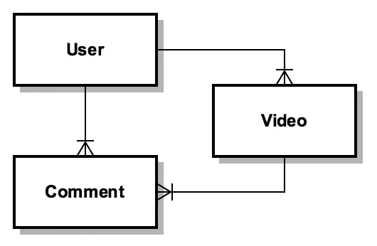

# 主动模型序列化器、Rails 和 JSON！我的天啊。

> 原文：<https://www.sitepoint.com/active-model-serializers-rails-and-json-oh-my/>


*JSON* (JavaScript 对象表示法)是一种可以用来存储或交换数据的格式。它容易被人类阅读，也容易被机器解析，这就是为什么很多 API 使用 JSON 的原因。

在本文中，我们将学习如何用 [ActiveModel::Serializer](https://github.com/rails-api/active_model_serializers/tree/v0.9.3) 创建定制的 JSON 响应。所有的例子都是使用一个 [Ruby on Rails](http://rubyonrails.org) 应用程序创建的。在 Rails 中创建 JSON 响应很容易，但是使用框架的[默认](http://api.rubyonrails.org/classes/ActiveModel/Serialization.html)特性是不够的，并且不容易测试。

考虑以下代码:

```
render json: user 
```

上面的代码将创建一个包含所有`user`属性的 JSON 响应。有许多选项可供您使用，比如`include`、`only`、`except`和`methods`，但是在实际应用中，它需要的不仅仅是默认方法所能提供的。

在本文中，我们将学习如何为具有以下关系的模型创建和管理序列化程序。



我们将在本文中使用一个虚构的应用程序，上面的模型将被呈现为对以下 API 端点的响应:

*   检索最新视频
*   检索用户配置文件
*   检索视频的最新评论

在下面几节中，我们将学习如何使用几个约束来管理序列化程序，以获得良好的可维护性。此外，我将展示如何嵌入数据和提供链接发现以提高应用程序性能的多种策略。

本文将只讨论管理和实现序列化程序。它不会讨论实现工作应用程序所需的其他实现细节。最终的应用程序可以在 Github 上找到，作为本文的附录。

## ActiveModel::Serializer 简介

`ActiveModel::Serializer`通过将每个资源表示为从`ActiveModel::Serializer`继承的类，提供了一种创建定制 JSON 的方法。考虑到这一点，与其他方法相比，它为我们提供了一种更好的测试方法。无论控制器中的数据检索是如何完成的，也可以单独测试。

我用的是【0.9.3 版本。本文中展示的策略并不特定于这个版本，也不特定于这个 gem。它在以前的版本中受支持，在未来的版本中仍将受支持。然而，每个版本的实现细节可能不同，请参考不同版本的[文档](https://github.com/rails-api/active_model_serializers)。

### 装置

将以下宝石添加到您的`Gemfile`中:

```
gem 'active_model_serializers', '0.9.3' 
```

然后使用捆绑包安装它:

```
bundle install 
```

就这样，安装完成了。

### 使用

您可以按如下方式生成序列化程序:

```
rails g serializer user 
```

上面的生成器将在**app/serializer/user _ serializer . Rb**中创建一个序列化器，内容如下:

```
# app/serializers/user_serializer.rb
class UserSerializer < ActiveModel::Serializer
end 
```

为了理解它是如何工作的，让我们把重点放在我们的用例上来实现序列化器。假设我们已经有了所有的模型，我们可以手动或者使用生成器为我们的模型创建序列化器。

## 序列化约束

在深入研究实现呈现定制 JSON 响应的各种策略的细节之前，我们需要牢牢掌握如何管理序列化器。使用`ActiveModel::Serializer`创建复杂的 JSON 响应非常容易，但是强烈建议不要这样做。

以下示例使用了您可以遵循的基本约束。它们应该服务于简单和可维护的序列化器的目标。

### 模型

每个模型都应该有一个附带的序列化程序，该序列化程序具有客户端所需的属性。对于上述用例，我们应该有以下序列化程序:

```
# app/serializers/video_serializer.rb
class VideoSerializer < ActiveModel::Serializer
  attributes :id, :title, :description
end

# app/serializers/user_serializer.rb
class UserSerializer < ActiveModel::Serializer
  attributes :id, :name
end

# app/serializers/comment_serializer.rb
class CommentSerializer < ActiveModel::Serializer
  attributes :id, :text
end 
```

自动包含一个模型的所有属性是可能的，但是它会引入意外发送敏感数据到客户端的风险。它还会向客户端发送大量不必要的数据。强烈建议不要这样做，除非模型的属性集很小，而且很少改变。

在这种情况下，下面的序列化程序(与我们的用例无关，只是用于本例)提供了一个自动包含所有属性的简单序列化程序示例:

```
# app/serializers/tag_serializer.rb
class TagSerializer < ActiveModel::Serializer
  attributes *Tag.column_names
end 
```

### 终点

每个端点都需要一个新的序列化程序。这些序列化程序与上述序列化程序不同。每个终结点都有一个专用的序列化程序，通过在终结点和序列化程序之间引入一对一的关系来减少对给定序列化程序的依赖，并提高可维护性。

以下是我们用例中端点所需的序列化程序。我们可以使用继承来一般化给定模型的其他序列化器的属性:

```
# serializer for API latest videos
# app/serializers/videos/index_serializer.rb
class Videos::IndexSerializer < VideoSerializer
end

# serializer for API user profile
# app/serializers/users/show_serializer.rb
class Users::ShowSerializer < UserSerializer
  root 'user'
end

# serializer for API video's latest comments
# app/serializers/comments/index_serializer.rb
class Comments::IndexSerializer < CommentSerializer
end 
```

API 用户配置文件的序列化程序中有一个有趣的语句。如果不设置该序列化程序的根名称，它将被设置为`show`。如果不需要根，可以将根设置为`false`。

### 嵌入数据

嵌入数据是一种包含与被请求对象相关的引用或数据的方式。`ActiveModel::Serializer`提供两种嵌入数据，嵌入单个对象或嵌入一个集合。该方法类似于向 ActiveRecord 模型添加关系。让我们看看下面的例子:

```
# app/serializers/videos/index_serializer.rb
class Videos::IndexSerializer < VideoSerializer
  has_one :user

  # WARNING:
  # The following is for example purposes only, try to avoid at all costs.
  has_many :comments
end 
```

虽然可以做到以上几点，但强烈建议不要这样做。您可能会意外地使用`has_many`发送一个非常大的响应。不采用上述方法，而是使用两个序列化器将请求分成两个端点。因此，我们将拥有以下序列化程序:

```
# app/serializers/videos/index_serializer.rb
class Videos::IndexSerializer < VideoSerializer
  has_one :user
end

# app/serializers/comments/index_serializer.rb
class Comments::IndexSerializer < CommentSerializer
  has_one :user
end 
```

需要加载大量子元素的序列化程序应该被拆分成多个序列化程序。这样可以很容易地维护它，并避免意外地向客户端发送大量数据的不必要风险。

## 嵌入和链接发现

有多种策略可以用来呈现定制的 JSON 响应。它们涉及嵌入数据和链接发现。以下每种策略都有其优点和缺点。它们适用于不同的目的，应该适当地使用。

嵌入数据的 JSON 响应策略可以使用嵌套数据或侧面加载数据来实现。而提供链接发现的策略可以使用基于 [HATEOAS](https://en.wikipedia.org/wiki/HATEOAS) 的 JSON 响应来完成。

### 带有嵌套数据的 JSON 响应

嵌套数据使客户端能够一次加载所有引用的数据，因此我们可以减少加载所有数据所需的调用次数。这种策略不需要数据处理，并且可以立即用来显示数据。这种策略的缺点是它会引入数据重复。相同的数据可能嵌套在多个对象中。

为此，您需要通过定义其关系来包含需要嵌套的数据。使用以前为每个端点定义的序列化程序，定义序列化程序内部的关系:

```
# app/serializers/videos/index_serializer.rb
class Videos::IndexSerializer < VideoSerializer
  has_one :user
end

# app/serializers/users/show_serializer.rb
class Users::ShowSerializer < UserSerializer
  root 'user'
end

# app/serializers/comments/index_serializer.rb
class Comments::IndexSerializer < CommentSerializer
  has_one :user
end 
```

上述序列化器将生成如下 json 响应。

**检索最新视频**

```
{
  "videos":[
    {
      "id":135801055,
      "title":"Les quatre cents coups",
      "description":"Moving story of a young boy who, left without attention, delves into a life of petty crime.",
      "user":{
        "id":321975000,
        "name":"Sarah Ferguson"
      }
    },
    {
      "id":419895383,
      "title":"La heine",
      "description":"24 hours in the lives of three young men in the French suburbs the day after a violent riot.",
      "user":{
        "id":321672063,
        "name":"Javier Dean"
      }
    }
  ]
} 
```

**检索用户资料**

```
{
  "user":{
    "id":1066742030,
    "name":"Jill Ray"
  }
} 
```

**检索视频的最新评论**

```
{
  "comments":[
    {
      "id":632418569,
      "text":"All these jokes are purely jokes - nothing is meant seriously.",
      "user":{
        "id":623761651,
        "name":"Terry Holland"
      }
    }
  ]
} 
```

### 带有侧加载数据的 JSON 响应

侧加载数据使客户端能够加载所有引用的数据，因此我们可以将加载所有数据所需的多个请求减少到一个请求。使用这种方法的好处是不会在响应中引入数据重复。这种策略的缺点是，它要求客户端在显示数据之前以某种方式处理数据。

为了生成侧面负载数据，我们需要做与上一节相同的事情。然后，我们只需要将它设置为嵌入 id，并将 include 设置为 true。

```
# app/serializers/videos/index_serializer.rb
class Videos::IndexSerializer < VideoSerializer
  embed :ids, include: true
  has_one :user
end

# app/serializers/users/show_serializer.rb
class Users::ShowSerializer < UserSerializer
  root 'user'
end

# app/serializers/comments/index_serializer.rb
class Comments::IndexSerializer < CommentSerializer
  embed :ids, include: true
  has_one :user
end 
```

上述序列化器将生成如下 json 响应。

**检索最新视频**

```
{
  "videos":[
    {
      "id":135801055,
      "title":"Les quatre cents coups",
      "description":"Moving story of a young boy who, left without attention, delves into a life of petty crime.",
      "user_id":321975000
    },
    {
      "id":419895383,
      "title":"La heine",
      "description":"24 hours in the lives of three young men in the French suburbs the day after a violent riot.",
      "user_id":321672063
    }
  ],
  "users":[
    {
      "id":321975000,
      "name":"Sarah Ferguson"
    },
    {
      "id":321672063,
      "name":"Javier Dean"
    }
  ]
} 
```

**检索用户资料**

```
{
  "user":{
    "id":1066742030,
    "name":"Jill Ray"
  }
} 
```

**检索视频的最新评论**

```
{
  "comments":[
    {
      "id":632418569,
      "text":"All these jokes are purely jokes - nothing is meant seriously.",
      "user_id":623761651
    }
  ],
  "users":[
    {
      "id":623761651,
      "name":"Terry Holland"
    }
  ]
} 
```

### 基于 HATEOAS 的 JSON 响应

HATEOAS 表示超文本是应用程序状态的引擎。HATEOAS 使客户机能够完全通过服务器提供的超媒体格式进行交互。这意味着超文本本身可以用来导航一个 API。不幸的是，JSON 不是超媒体格式。

虽然 JSON 没有超媒体支持，但是我们仍然可以在 JSON 中提供一种链接发现的方式。为了提供基于 HATEOAS 的 JSON 响应，在 JSON 中实现链接发现，如下所示:

```
# app/serializers/video_serializer.rb
class VideoSerialzer < ActiveModel::Serializer
  attributes :id, :title, :description, :links

  def links
    { self: video_path(object.id) }
  end
end

# app/serializers/user_serializer.rb
class UserSerializer < ActiveModel::Serializer
  attributes :id, :name, :links

  def links
    { self: user_path(object.id) }
  end
end

# app/serializers/comment_serializer.rb
class CommentSerializer < ActiveModel::Serializer
  attributes :id, :text, :links

  def links
    { self: comment_path(object.id) }
  end
end 
```

上述序列化器将生成如下 json 响应。

**检索最新视频**

```
{
  "videos":[
    {
      "id":135801055,
      "title":"Les quatre cents coups",
      "description":"Moving story of a young boy who, left without attention, delves into a life of petty crime.",
      "links":{
        "self":"/videos/135801055"
      },
      "user_id":321975000
    },
    {
      "id":419895383,
      "title":"La heine",
      "description":"24 hours in the lives of three young men in the French suburbs the day after a violent riot.",
      "links":{
        "self":"/videos/419895383"
      },
      "user_id":321672063
    }
  ],
  "users":[
    {
      "id":321975000,
      "name":"Sarah Ferguson",
      "links":{
        "self":"/users/321975000"
      }
    },
    {
      "id":321672063,
      "name":"Javier Dean",
      "links":{
        "self":"/users/321672063"
      }
    }
  ]
} 
```

**检索用户资料**

```
{
  "user":{
    "id":1066742030,
    "name":"Jill Ray",
    "links":{
      "self":"/users/1066742030"
    }
  }
} 
```

**检索视频的最新评论**

```
{
  "comments":[
    {
      "id":632418569,
      "text":"All these jokes are purely jokes - nothing is meant seriously.",
      "links":{
        "self":"/comments/632418569"
      },
      "user_id":623761651
    }
  ],
  "users":[
    {
      "id":623761651,
      "name":"Terry Holland",
      "links":{
        "self":"/users/623761651"
      }
    }
  ]
} 
```

使用这种方法的好处是，客户端可以使用所提供的响应中的链接轻松地与 API 进行交互。但是这种方法的缺点是，基于 HATEOAS 的 JSON 响应没有标准，因此，客户端实现与响应格式紧密耦合。

基于 HATEOAS 的 JSON 格式也有替代品，比如 [JSON-LD](http://json-ld.org/) 和 [JSON API](http://jsonapi.org/) 。它们提供了像链接发现这样的特性，但是在客户端需要完全不同的实现。

## 结论

使用`ActiveModel::Serializer`呈现定制的 JSON 响应需要纪律和一致性。未能坚持这些目标会降低应用程序的可维护性和客户端性能。本文将为您提供如何使用最适合您的不同策略来呈现定制 JSON 响应的基本理解。

诸如 [Jbuilder](https://github.com/rails/jbuilder) 、 [Grape](https://github.com/ruby-grape/grape) 和 [RABL](https://github.com/nesquena/rabl) 之类的备选方案有不同的方法来呈现响应。为了更好地理解为什么你应该使用`ActiveRecord::Serializer`，你也应该看看这些选择。

## 分享这篇文章