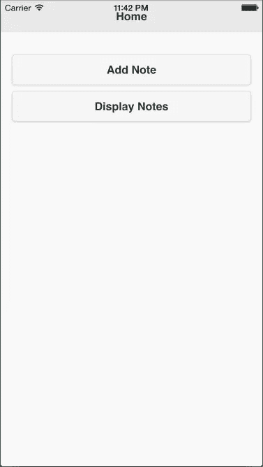
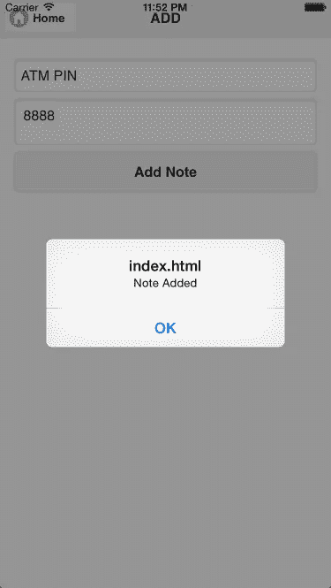
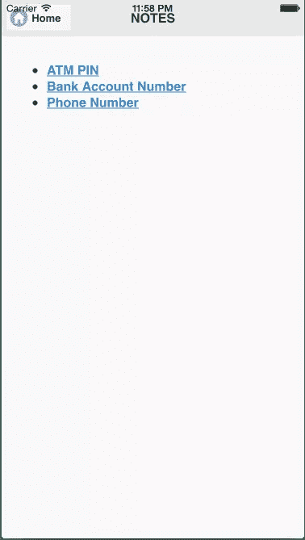
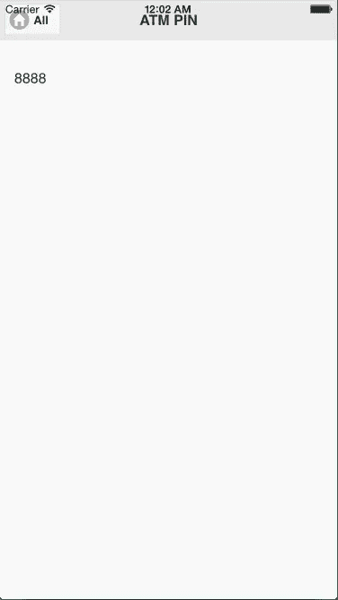

# 在 Cordova 应用程序中存储本地数据

> 原文：<https://www.sitepoint.com/storing-local-data-in-a-cordova-app/>

# 在 Cordova 应用程序中本地存储数据

大多数移动应用需要在本地存储数据，HTML5 引入了新的本地存储数据选项。要在 Cordova 应用程序中本地存储数据，我们可以使用 HTML5 存储并结合插件提供的其他机制。

在本教程中，我将介绍本地存储数据的不同方法，我们将通过创建一个简单的笔记应用程序来了解如何使用带有 Cordova SQLite 插件的 HTML5 Web 存储。

## 本地存储数据的不同方式

让我们直接进入本地存储数据的不同方式:

### 网络存储

Web 存储 API 允许我们将键/值对存储为本地和/或会话存储。本地存储是持久的，而当应用程序退出时，会话存储会被删除。Web 存储可以存储 2-10 MB 的数据，确切的配额限制取决于平台。

您不能在 web 存储器中存储大量数据，但在其中读写数据更容易。

**例如**:如果你的应用由多个 HTML 文件组成，你可以使用网络存储在它们之间传递少量数据。

### Web SQL 数据库

Web SQL API 使用 SQL 存储和查询数据。您可以在 Web SQL 数据库中存储 50-200 MB 的数据，具体的配额限制取决于平台。一旦达到限制，`WebView`要求用户允许使用更多的本地空间。并非所有平台都支持这个 API，但是你可以使用 [WebSQL Cordova 插件](http://plugreg.com/plugin/MSOpenTech/cordova-plugin-websql)来填充它。

### 索引 b

IndexedDB 提供 API 来存储和检索对象形式的数据，同样，确切的配额限制取决于平台。一旦达到限制，`WebView`会要求用户授予使用更多本地空间的权限。并非所有平台都支持这个 API，但是你可以使用 [IndexedDB Cordova 插件](https://www.npmjs.com/package/cordova-plugin-indexeddb)来填充它。

### Cordova 插件文件

这个 Cordova 插件实现了用于读写文件数据的 [HTML5 文件系统 API](http://www.html5rocks.com/en/tutorials/file/filesystem/)，所以如果你想存储二进制对象，就使用这个插件。

### Cordova SQLite 插件

[这个 Cordova 插件](https://www.npmjs.com/package/cordova-plugin-sqlite)通过提供一个与 Web SQL API 相同的 API，让 Cordova 应用程序访问底层的原生 SQLite 数据库。它没有配额限制，可以将数据同步到 iOS 上的 iCloud。

大多数情况下，您只需要 Web 存储 API 和 SQLite 插件。

**注意:**要在本地存储图像，你不必使用文件插件。一些开发人员使用 Base64 编码模式在 SQLite 中存储图像。但是对于视频、音频和其他大型文件，编码和解码会消耗大量的时间和内存，因此建议将它们存储在文件中，并使用文件 URL 来显示它们。

## Web 存储概述

尽管您可能熟悉 web 存储 API，但它们还是值得一游。

如何添加、删除、更新和清除本地存储:

```
if(localStorage != undefined)
{
  console.log("Local Storage is supported");

  //add
  localStorage.setItem("Website", "SitePoint");

  //update or overwrite
  localStorage.setItem("Website", "SitePoint.com");

  //remove
  localStorage.removeItem("Website");

  //remove all
  localStorage.clear();
}
else
{
  console.log("No support");
}
```

如何添加、删除、更新和清除会话存储:

```
if(sessionStorage != undefined)
{
  console.log("session Storage is supported");

  //add
  sessionStorage.setItem("Website", "SitePoint");

  //update or overwrite
  sessionStorage.setItem("Website", "SitePoint.com");

  //remove
  sessionStorage.removeItem("Website");

  //remove all
  sessionStorage.clear();
}
else
{
  console.log("No support");
}
```

## Cordova SQLite 插件

SQLite 是基于 SQL 语言的嵌入式 DBMS。iOS、Android 和 Windows Phone 都提供了一个完整 API 的 SQLite 数据库。

SQLite Cordova 插件提供了一个简单的 API 来创建数据库并在 SQLite 上运行查询。这个插件公开了一个类似于 Web SQL API 的 API。你需要熟悉 SQL(比如 MySQL)来编写查询。

下面是如何创建一个数据库并在数据库上运行 SQL 查询。

```
// Wait for plugin to load
document.addEventListener("deviceready", onDeviceReady, false);

// Cordova is ready
function onDeviceReady()
{
    var db = window.sqlitePlugin.openDatabase({name: "demo.db"});

    db.transaction(function(tx) {

        //create table
        tx.executeSql("CREATE TABLE IF NOT EXISTS demo (id integer primary key, data text, data_num integer)", [], function(tx, res){

            //insert data
            tx.executeSql("INSERT INTO demo (id, data, data_num) VALUES (?,?,?)", [1, "test", 100], function(tx,res){

                //retrieve data
                tx.executeSql("SELECT * FROM demo WHERE id = ?", [1], function(tx, res){
                    for(var iii = 0; iii < res.rows.length; iii++)
                    {
                        alert(res.rows.item(iii).id);
                        alert(res.rows.item(iii).data);
                        alert(res.rows.item(iii).data_num);
                    }
                })

            });

        });

    }, function(err){

        //errors for all transactions are reported here
        alert("Error: " + err.message)

    });
}
```

这里我们首先创建数据库，然后用回调调用数据库对象的`transaction`方法。在回调中，我们运行 SQL 查询。使用异步返回响应的`executeSql`函数执行查询。

如果任何一个查询失败，那么传递给`transaction`方法的第二个回调就会被调用。如果查询失败，将不会触发对`executeSql`的回调。

要删除数据库，请使用以下代码:

```
//delete database
window.sqlitePlugin.deleteDatabase({name: "demo.db"}, function(){
    alert("Successfully deleted database");
}, function(){
    alert("Error while delete database");
});
```

## 创建笔记应用程序

让我们开始构建一个笔记应用程序。这个应用程序将允许用户添加和查看笔记。

你可以在 [GitHub](https://github.com/sitepoint-editors/NoteAPP) 上找到最终的项目。

### 开始

我不会介绍安装和创建 Cordova 应用程序，如果你以前没有这样做过，[请阅读入门指南](http://cordova.apache.org/docs/en/5.1.1/guide/cli/index.html)。运行和构建应用程序的说明位于同一页面上。

给应用程序一个合适的名称，并添加您想要支持的平台。我在本教程中使用的是 Cordova 的设备插件和 SQLite 第三方插件。在 Cordova 项目目录中运行以下命令来安装它们:

```
cordova plugin add cordova-plugin-device
cordova plugin add cordova-plugin-sqlite
```

确保 *www* 目录中的*index.html*文件如下所示，并根据相关情况进行更改:

```
<!DOCTYPE html>
<html>
    <head>
        <meta name="viewport" content="user-scalable=no, initial-scale=1, maximum-scale=1, minimum-scale=1, width=device-width">
        <title>Note</title>

        <link rel="stylesheet" href="https://code.jquery.com/mobile/1.4.5/jquery.mobile-1.4.5.min.css">

    </head>
    <body>

        <!-- put jQuery mobile pages here -->

        <script type="text/javascript" src="cordova.js"></script>
        <script src="https://code.jquery.com/jquery-2.1.4.min.js"></script>
        <script src="https://code.jquery.com/mobile/1.4.5/jquery.mobile-1.4.5.min.js"></script>
        <script type="text/javascript"> //put JS code here </script>
    </body>
</html>
```

我添加了 CDNs 的 jQuery 和 jQuery Mobile。您可以在本地嵌入这些文件，这样应用程序就可以在没有互联网连接的情况下工作。

### 初始化应用程序

当应用程序加载时，我们需要创建数据库对象，并检查存储数据的表是否存在。如果该表不存在，那么我们需要创建它。

下面是初始化应用程序的代码。将此代码放在*index.html*页面的`script`标签中:

```
var db = null;

document.addEventListener("deviceready", function(){
    db = window.sqlitePlugin.openDatabase({name: "note.db"});
    db.transaction(function(tx) {
        tx.executeSql("CREATE TABLE IF NOT EXISTS note (name text primary key, data text)");
    }, function(err){
        alert("An error occurred while initializing the app");
    });
}, false);
```

这里我们创建了一个包含两列的表，name 和 data。每个音符都有一个唯一的名字来识别它。

### 创建主屏幕

让我们创建一个主屏幕，它将在应用程序加载时显示。主屏幕上有两个按钮，用于添加和显示注释。

将此代码放在*index.html*页面的`body`标签中:

```
<div data-role="page" id="home">
    <div data-role="header">
        <h1>Home</h1>
    </div>

    <div data-role="main" class="ui-content">
        <p>
            <a target="_blank" href="#add" style="text-decoration: none"><button>Add Note</button></a>
            <a target="_blank" href="#display" style="text-decoration: none"><button>Display Notes</button></a>
        </p>
    </div>
</div>
```

以下是该页面现在的外观:



### 添加注释

当用户点击*添加注释*按钮时，我们需要显示另一个包含两个字段的页面，一个字段用于输入注释名称，另一个用于输入注释数据。

将此代码放在*index.html*页面的`body`标签中:

```
<div data-role="page" id="add">
    <div data-role="header">
        <a target="_blank" href="#home" class="ui-btn ui-icon-home ui-btn-icon-left">Home</a>
        <h1>ADD</h1>
      </div>

      <div data-role="main" class="ui-content">
        <input type="text" id="name" placeholder="Enter Name" />
        <textarea id="note-text" placeholder="Place text here"></textarea>
        <a target="_blank" href="javascript:add()" style="text-decoration: none"><button>Add Note</button></a>
      </div>
</div>
```

当用户点击*添加注释*按钮时，调用`add()`函数，将数据存储在表格中。

将此代码放在*index.html*页面的`script`标签中:

```
function add()
{
    var name = document.getElementById("name").value;
    var text = document.getElementById("note-text").value;

    if(name == "")
    {
        alert("Please enter name");
        return;
    }

    if(text == "")
    {
        alert("Please enter text");
        return;
    }

    db.transaction(function(tx) {
        tx.executeSql("INSERT INTO note (name, data) VALUES (?,?)", [name, text], function(tx,res){
            alert("Note Added");    
        });
    }, function(err){
        alert("An error occured while saving the note");
    });
}
```

在这里，我们确保输入字段不为空，然后向表中添加一行。

以下是页面现在的样子:



### 显示笔记列表

在主页上，我们有一个名为*的按钮显示注释*。当用户点击按钮时，我们需要切换到显示所有注释的页面。

将此代码放在*index.html*页面的`body`标签中:

```
<div data-role="page" id="display">
    <div data-role="header">
        <a target="_blank" href="#home" class="ui-btn ui-icon-home ui-btn-icon-left">Home</a>
        <h1>NOTES</h1>
      </div>

      <div data-role="main" class="ui-content">
        <ul id="data-list">
        </ul>
      </div>
</div>
```

接下来，我们需要从数据库中检索所有注释，并填充该页面。将此代码放在*index.html*页面的`script`标签中:

```
$(document).on("pagebeforeshow", "#display", function(){
    db.transaction(function(tx) {
        tx.executeSql("SELECT (name) FROM note", [], function(tx,res){
            for(var iii = 0; iii < res.rows.length; iii++)
            {
                document.getElementById("data-list").innerHTML = document.getElementById("data-list").innerHTML + "<li><a href='javascript:displayNote(\"" + res.rows.item(iii).name + "\")'>" + res.rows.item(iii).name + "</a></li>";
            }
        });
    }, function(err){
        alert("An error occured while displaying saved notes");
    });
});
```

我们只返回`name`列，因为这是我们显示的全部内容。然后我们用一个名字列表填充内容区域。

以下是页面现在的样子:



### 显示单个便笺

当用户点击注释列表中的注释时，我们需要显示注释的完整数据。

为此，我们需要另一个页面。将此代码放在*index.html*页面的`body`标签中:

```
<div data-role="page" id="single-note">
    <div data-role="header">
        <a target="_blank" href="#display" class="ui-btn ui-icon-home ui-btn-icon-left">All</a>
        <h1 id="note-title"></h1>
      </div>

      <div data-role="main" class="ui-content">
        <p id="note-data"></p>
      </div>
</div>
```

为了填充名称和数据字段，我们调用一个函数，当用户单击一个注释时，该函数从数据库中检索关于该注释的所有数据。

将此代码放在*index.html*页面的`script`标签中:

```
function displayNote(name)
{
    db.transaction(function(tx) {
        tx.executeSql("SELECT * FROM note WHERE name = ?", [name], function(tx,res){
            var name = res.rows.item(0).name;
            var data = res.rows.item(0).data;

               document.getElementById("note-title").innerHTML = name;
               document.getElementById("note-data").innerHTML = data;

               $.mobile.changePage("#single-note");
        });
    }, function(err){
        alert(err.message);
        alert("An error occured while displaying the note");
    });
}
```

以下是单个音符的外观:



## 结论

这款应用功能齐全，可以部署到 iOS、Android 和 Windows Phone 上，但只是基本的。创建完整应用的下一步是让用户编辑和删除笔记。

本教程演示了 SQLite 插件和 Web 存储，但是为应用程序选择存储机制是一个复杂的决定。你还尝试过其他什么选择，它们对你有什么作用？

## 分享这篇文章