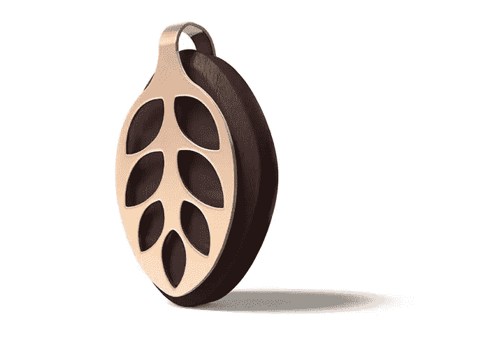
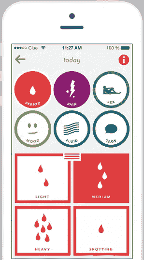
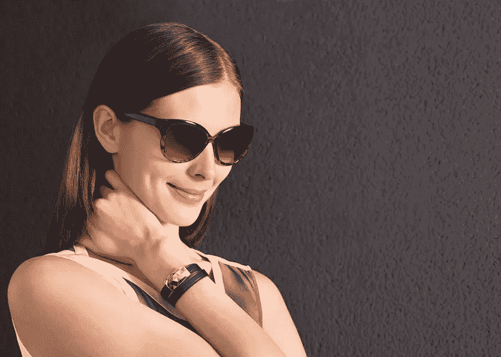
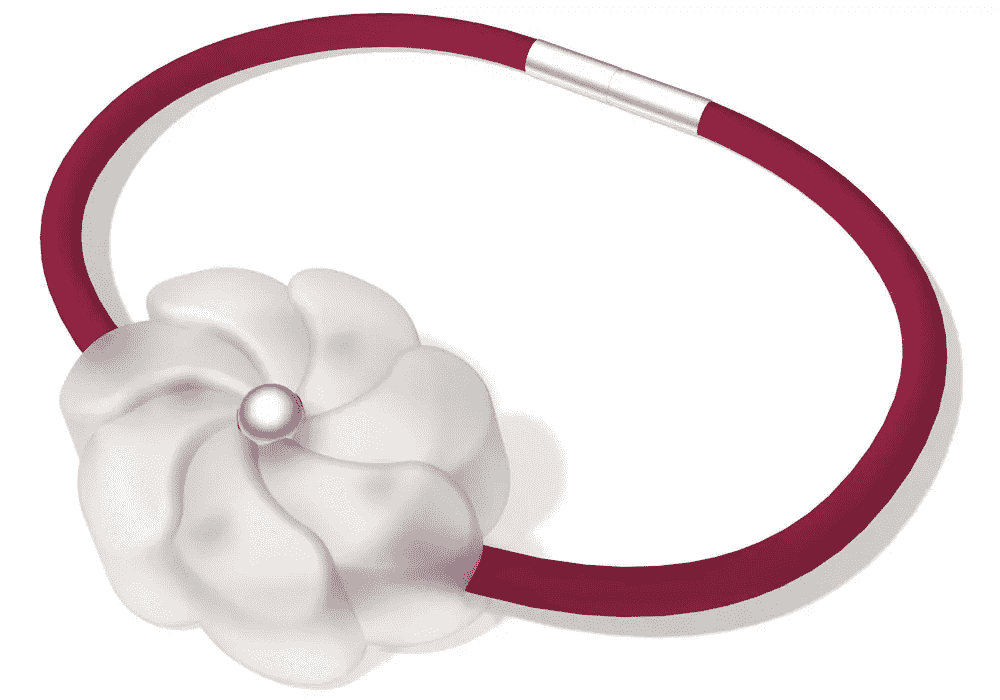
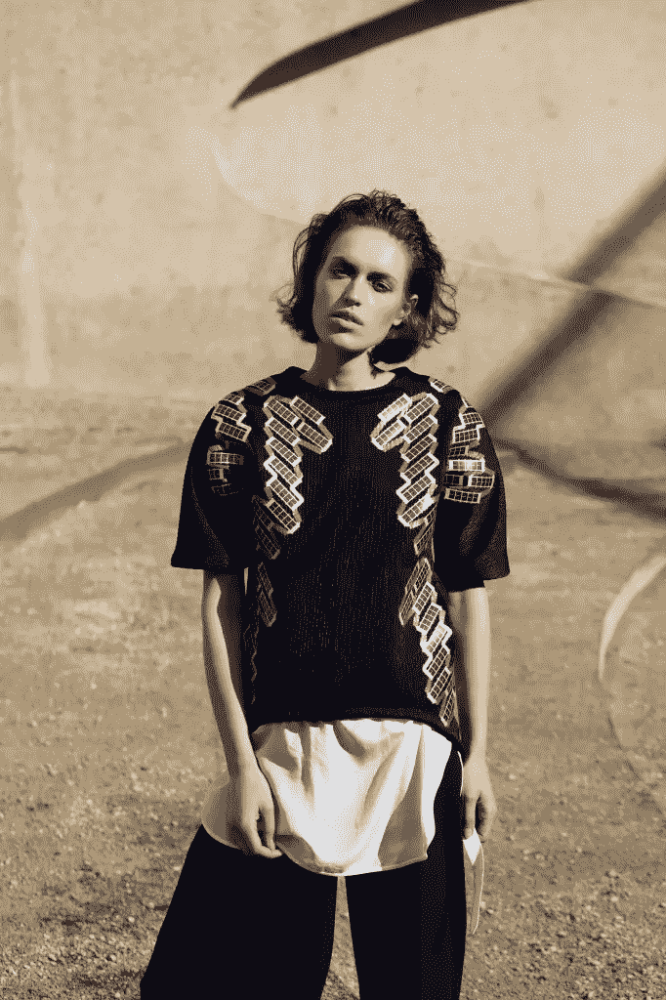

# 女性可穿戴设备能团结创造者和消费者吗？

> 原文：<https://www.sitepoint.com/can-wearables-for-women-unite-creators-and-consumers/>

公平地说，第一波女性可穿戴设备的开始并不稳定，产品显示出了前景，但未能创造一场零售革命。一直不乏光彩夺目的定制礼服和服装，它们引起了媒体的兴趣，却在博物馆和画廊中萎靡不振，因为原型从未在成衣生产线上重现。

我觉得已经出现了一种趋势，从为男性设计的产品把女性作为事后的想法，到以女性为中心的设计和开发，许多是由女性为女性创造的。现在，女性可穿戴设备有可能在不断增长的消费市场引起共鸣，本文着眼于电子纺织品和移动技术的进步所推动的最近一波设备浪潮。

## 女性可穿戴设备并不新鲜

像 Maggie Orth 这样的学生和学者一直在研究机构和大学部门的安静泡泡中创造。像 Leah Buechley([睡莲叶子 Arduino](https://lilypadarduino.org/) 的发明者)这样的女性在将可穿戴设计和技术带入家庭和工作室方面发挥了重要作用。像 Instructables.com[和 Makezine.com](https://www.instructables.com/howto/wearables/)[这样的网站上的作家已经为现代设计师的工具箱提供了新的工具。](https://makezine.com/)

迄今为止，通过主流可穿戴设备市场吸引女性的努力受到了严厉的批评，尤其是在早期智能手表方面。开发者没有理解一些基本的东西，比如改变尺寸以适应女性的身体结构，也没有意识到缺少口袋并不是女性购买可穿戴设备的主要动机。女性普遍抱怨表盘和表带对女性的手腕和手来说太大，很明显女性市场比男性市场次要。

## 女人知道她们想要什么，需要什么

科技网站有时给人的印象是，可穿戴设备仅限于锻炼和监控可穿戴设备，如 [Fitbit](https://www.fitbit.com) 和 [Jawbone](https://jawbone.com/) 。随着 Fitbit 宣布与设计师[托里·伯奇](https://www.toryburch.de/tory-burch-fitbit/)、[施华洛世奇](https://store.misfit.com/collections/swarovski-shine)合作 [Misfit Shine](https://store.misfit.com/collections/swarovski-shine) 以及高端可穿戴设备，如面向特权消费者的[手表](https://www.apple.com/shop/buy-watch/apple-watch-edition),《连线》将 2015 年命名为“[可穿戴设备不再如此丑陋的一年](https://www.wired.com/2015/01/2015-wearables-ces/)”。

除了例外，女性作为健康消费者的需求在医疗和健康可穿戴设备中并不突出。

例如，[苹果的 HealthKit](https://developer.apple.com/healthkit/) 被批评跟踪铜摄入量和硒(小众利益)等指标，而[在推出](https://www.wired.com/2015/06/apple-finally-adds-reproductive-health-healthkit/)时没有提供女性生殖健康监测。这种疏忽(Fitbit 和 MyFitnessPal 也有过失)是危险的，因为消费者抱怨，女性开发者通过创造成功的替代品填补了空白。

一个例子是针对试图怀孕的女性的 Yono。这是一种可佩戴的入耳式温度计，可以捕捉核心体温，并将其记录到手机应用程序中。

Bella Beat 的 [Leaf](https://www.bellabeat.com) 是一款健康追踪器，可以作为一个整体监测活动水平、睡眠质量、压力水平、排卵、月经和避孕追踪。

值得注意的是，美国应用商店排名前 25 的健康应用中有 8 个是[生育和月经跟踪应用](https://www.appannie.com/apps/ios/top/united-states/health-and-fitness/?device=iphone)。

作为进步的标志，iOS 9 和 HealthKit 的更新包括生殖健康跟踪。一家总部位于柏林的初创公司已经在开发利用这些功能的应用程序，该公司由 Ida Tin 创立。

## 并非所有女性都一样，可穿戴设备市场必须了解她们的受众

可穿戴设备的时尚成分不容忽视，因为它是将可穿戴设备带给大众市场消费者的关键。通过吸引不同的细分市场，设计师能够抓住容易接受的观众。

### 适应交流的钉子

[https://www.youtube.com/embed/w5tCVnbhpm4](https://www.youtube.com/embed/w5tCVnbhpm4)

[元宇宙改头换面](https://www.metaversemakeovers.com/)是一家总部位于上海的公司，它通过按压式设计指甲为中国的年轻女性带来了新的交流方式，这些指甲通过相应的智能手机应用程序增强现实并制作动画。虚拟现实美甲可以让美妆爱好者在指甲上创造全息图。当用手机应用程序扫描指尖时，这套按压式指甲创建了 3D 全息设计，然后可以在社交媒体上分享。

导演西娅·鲍曼说，美甲酒吧和美容院是新数字时代年轻女性聚集的地方。顾客们在修指甲的同时，还在使用社交媒体，在手机上玩游戏。

鲍曼想为“酷而强大的小鸡”创造产品。

她指出，年轻女性已经通过社交媒体平台创造了自己的语言，如果没有年轻女性群体，其中许多语言将不复存在。

[美甲的零售价约为 30 美元](https://metaversenails.com/)，他们的作品通过美甲酒吧特许经营店、时装店、夜总会和弹出式活动(例如，与巨型沉浸式屏幕相连的弹出式美甲酒吧)进行营销。鲍曼和她的团队分别位于墨尔本、上海和新加坡，正在开发服装系列、化妆品和配饰，以配合他们的应用程序。他们的下一个计划是让用户创建自己的设计和信息。

### 通过互联方式实现颠覆

ElektroCouture 是一家总部位于柏林的时尚科技公司，为时尚界打造定制成衣技术。创始人兼首席执行官 Lisa Lang 是欧洲硬件初创公司的导师，也是柏林技术生态系统的大力倡导者。她被评为全球可穿戴技术领域最具影响力的 100 名人物之一。

我在 Lisa 位于 [Fab Lab](https://fablab.berlin/en/) 的办公室拜访了她，这是一个开放的数字制造工作室，包括 3D 打印机、激光切割机和 CNC 路由器。丽莎正在从柏林时装周中恢复过来，准备定制一件名为“Lucie in the sky with diamonds”的礼服，这件华丽的礼服配有 led 灯(不用时可以当灯用),准备借给一位歌剧演员。

ElektroCouture 已经开始通过 ASOS 零售他们的设计，这使他们成为全球首家在零售网站上销售产品的时尚科技公司。ElektroCouture 的设计是大胆剪裁的作品，针对的是老年女性观众，这一群体有时被排除在时尚之外。

> 我们的受众是权力女性，那些寻找高端定制产品的女性，比如董事会高管和高级经理。

郎指出，对女性来说，尤其是在男性主导的行业，穿衣服就像穿上盔甲:

> 时尚让你感觉更强大。我是一名从事技术工作的女性。我想表达我的极客，但我是一个领导者，我不想看起来像一个马戏团的小马。

我最喜欢的一件是“阿达的火花”，这是一条献给第一位女程序员阿达·洛芙莱斯的围巾。这条黑白相间的围巾由一条细长的发光带镶边，发出明亮生动的光芒。它由主人通过位于围巾角落的*开*和*关*开关来控制，充电前可持续 6 小时。郎认为，时尚界没有什么新东西，它随时都可能被颠覆。

> 我们是破坏的一部分。

## 女人是务实的。

女性可穿戴设备位于创意和技术交汇的地方。但设计师面临着让艺术表达取代零售市场现实的风险(比如制造、大规模生产、运输、季节周期和定价)。可穿戴设备的服装和戏剧成分很鼓舞人心，但看到以时尚为导向的可穿戴设备局限于这些元素会有问题。这里有一些我认为是正确的创造者。

### 六月

我对美容产品不是很感兴趣，但是符合我澳洲童年，我需要很好的防晒和防晒。六月由 [Netatmo](https://www.junebynetatmo.com/en-US/site) 是一个个性化的太阳曝光量追踪器，它通过 UVA 和 UVB 传感器测量太阳曝光量。它与一个评估你的紫外线暴露的手机应用程序相结合，通知发送到你的手机，告诉你什么时候该涂防晒霜，用什么级别的防晒霜，什么时候你晒得太多。根据这篇综述，它并不完美，尤其是在没有直接接触太阳的情况下，但这个想法有可取之处。

### 珠宝机器人

由国家非营利组织[女孩发展计划的联合创始人萨拉·奇普斯创建！](https://www.girldevelopit.com/)和时尚科技企业家布鲁克·莫兰，[珠宝机器人](https://jewelbots.com/)是可编程的友谊手镯，教女孩们基本的编码。

使用 Jewelbots 应用程序，女孩可以为朋友指定八种不同颜色中的一种。当朋友在附近时，他们的魅力都会点亮指定的颜色。他们可以给其他朋友分配其他颜色，如果他们一起出去玩，他们所有的珠宝手镯会变成脉动的彩虹旗。

这个护身符同时也是一个按钮，可以向特定颜色组的朋友发送触觉信息。女孩们可以插入她们的魅力，并使用它的 Arduino 软件来扩展她们魅力的功能。在他们最近的众筹活动中，Jewelbots 提供了两个 60 美元的魅力手镯，让年轻观众可以接受这个价格。你可以在 [github](https://github.com/Jewelbots/jewelbots-charms) 上找到早期 charm 设计的开源 STL 设计文件。

### 可穿戴太阳能

时装设计师 Pauline von Dongen 发布了一系列服装，包括 t 恤和连衣裙，利用太阳能为手机、MP3 播放器和相机等小设备充电。其他系列包括发光夜行衣和带有集成拉伸传感器的[针织开衫](https://thisisvigour.com/)，该传感器可在老年患者及其健康提供者康复期间监测上半身的运动。

## 结论

女性可穿戴设备是媒体友好型的，处于 R&D 的前沿，有助于将时尚和技术这两个看似不同的领域联系起来。这是一个创新和商业可能爆发的领域。今年，伦敦时装周和 T2 时装周的设计师都展示了可穿戴设备。一些设计师使用原型与其他设计师努力确保消费者能够[现场观看](https://www.rebeccaminkoff.com/virtual-headset)时装秀并在观看时直接购买产品的做法不一致。对第二波可穿戴设备来说，反思过去的错误是有益的。

我可以花上几个小时来讨论由女性设计和为女性设计的可穿戴设备的创新。我鼓励你看看这里的细节。它抓住你的兴趣了吗？我很想听听你的想法，如果你有兴趣成为女性可穿戴设备浪潮的一部分，我的下一篇文章将讨论需要考虑的事情。

## 分享这篇文章