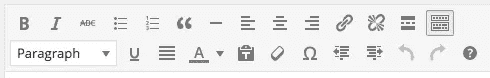
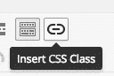
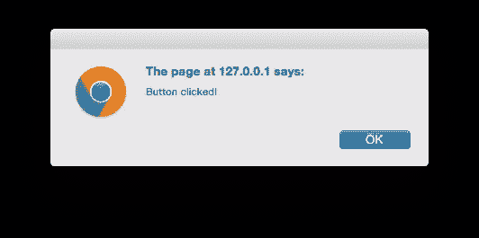
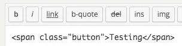

# 给 WordPress 可视化编辑器添加自定义功能

> 原文：<https://www.sitepoint.com/adding-custom-functionality-to-the-wordpress-visual-editor/>

内容编辑器是 WordPress 的关键部分。它允许用户在*可视化*所见即所得(所见即所得)视图中创建和管理他们的内容、图库和视频。

它还带有一个*文本*视图，允许用户在内容中插入或修改 HTML。

WordPress 可视化编辑器由 [TinyMCE](http://www.tinymce.com) 编辑器控件支持，它提供了所见即所得的视图，以及你看到的格式按钮:



多亏了 TinyMCE API 和 WordPress 的过滤器钩子，我们可以在 WordPress 可视化编辑器中添加我们自己的功能。具体来说，我们将看看如何创建和注册一个定制的 TinyMCE 插件，它在一个 CSS 类中包装选定的文本。

## 创建 TinyMCE 插件

在你的 WordPress 网站中，创建`wp-content/plugins/tinymce-custom-class`文件夹。

我们将在这里存储插件的文件，所以接下来使用下面的代码创建一个名为`tinymce-custom-class.php`的文件:

```
/**
 * Plugin Name: TinyMCE Custom Class
 * Plugin URI: https://www.sitepoint.com
 * Version: 1.0
 * Author: Tim Carr
 * Author URI: http://www.n7studios.co.uk
 * Description: TinyMCE Plugin to wrap selected text in a custom CSS class, within the Visual Editor
 * License: GPL2
 */

class TinyMCE_Custom_Class {

    /**
    * Constructor. Called when the plugin is initialised.
    */
    function __construct() {

    }

}

$tinymce_custom_class = new TinyMCE_Custom_Class;
```

这给了 WordPress 一些关于我们插件的信息，并建立了我们的构造，在那里我们将注册我们的 TinyMCE 动作和过滤器。

## WordPress TinyMCE 过滤器

TinyMCE 为在可视化编辑器工具栏上注册元素提供了两个关键过滤器:

*   `mce_external_plugins`:用于加载外部 TinyMCE 插件([https://codex . WordPress . org/Plugin _ API/Filter _ Reference/MCE _ external _ plugins](https://codex.wordpress.org/Plugin_API/Filter_Reference/mce_external_plugins "mce_external_plugins on WordPress Codex"))
*   `mce_buttons`:用于在 TinyMCE 工具栏中添加/删除按钮([https://codex . WordPress . org/Plugin _ API/Filter _ Reference/MCE _ buttons， *mce_buttons_2，* mce_buttons_3，_mce_buttons_4](https://codex.wordpress.org/Plugin_API/Filter_Reference/mce_buttons,_mce_buttons_2,_mce_buttons_3,_mce_buttons_4 "mce_buttons on WordPress Codex") )

在我们调用这些过滤器之前，我们想要检查我们是否在 WordPress 管理界面中。将以下代码添加到`__construct`:

```
if ( is_admin() ) {
	add_action( 'init', array( &$this, 'setup_tinymce_plugin' ) );
}
```

接下来，添加`setup_tinymce_plugin`函数来执行一些进一步的检查:

```
/**
* Check if the current user can edit Posts or Pages, and is using the Visual Editor
* If so, add some filters so we can register our plugin
*/
function setup_tinymce_plugin() {

    // Check if the logged in WordPress User can edit Posts or Pages
    // If not, don't register our TinyMCE plugin
    if ( ! current_user_can( 'edit_posts' ) && ! current_user_can( 'edit_pages' ) ) {
        return;
    }

    // Check if the logged in WordPress User has the Visual Editor enabled
    // If not, don't register our TinyMCE plugin
    if ( get_user_option( 'rich_editing' ) !== 'true' ) {
        return;
    }

    // Setup some filters
    add_filter( 'mce_external_plugins', array( &$this, 'add_tinymce_plugin' ) );
    add_filter( 'mce_buttons', array( &$this, 'add_tinymce_toolbar_button' ) );

}
```

这将检查当前登录的 WordPress 用户是否可以编辑文章或页面。如果他们不能，为那个用户注册我们的 TinyMCE 插件是没有意义的，因为他们永远看不到可视化编辑器。

然后我们检查用户是否在使用可视化编辑器，因为一些 WordPress 用户通过*用户>你的个人资料*关闭了这个功能。同样，如果用户没有使用可视化编辑器，我们返回(退出)该函数，因为我们不需要做任何其他事情。

如果以上检查通过，两个 TinyMCE WordPress 过滤器被注册—`mce_external_plugins`和`mce_buttons`。

第一个过滤器——`mce_external_plugins`——允许我们注册 TinyMCE JavaScript 插件文件，它将与可视化编辑器交互。让我们在我们的类中为这个过滤器添加一个函数调用:

```
/**
 * Adds a TinyMCE plugin compatible JS file to the TinyMCE / Visual Editor instance
 *
 * @param array $plugin_array Array of registered TinyMCE Plugins
 * @return array Modified array of registered TinyMCE Plugins
 */
function add_tinymce_plugin( $plugin_array ) {

    $plugin_array['custom_class'] = plugin_dir_url( __FILE__ ) . 'tinymce-custom-class.js';
    return $plugin_array;

}
```

这里，我们在`$plugin_array`中注册了一个 JavaScript 文件，它包含了所有 TinyMCE JavaScript 插件。

第二个过滤器——`mce_buttons`——告诉 TinyMCE 我们想要在可视化编辑器中注册一个按钮。同样，让我们在我们的类中为这个过滤器添加一个函数调用:

```
/**
 * Adds a button to the TinyMCE / Visual Editor which the user can click
 * to insert a custom CSS class.
 *
 * @param array $buttons Array of registered TinyMCE Buttons
 * @return array Modified array of registered TinyMCE Buttons
 */
function add_tinymce_toolbar_button( $buttons ) {

    array_push( $buttons, 'custom_class' );
    return $buttons;

}
```

这为我们的 TinyMCE 按钮(`custom_class`)注册了编程名称。

### 创建 JavaScript 插件

当我们调用`mce_external_plugins`时，我们引用了一个 JavaScript 文件。我们现在需要创建该文件，并向其中添加一些 JavaScript 代码。这将告诉 TinyMCE 如何输出按钮，以及当它被点击时做什么。

在名为`tinymce-custom-class.js`的插件文件夹中创建一个新文件，插入以下代码:

```
(function() {
    tinymce.PluginManager.add( 'custom_class', function( editor, url ) {
        // Add Button to Visual Editor Toolbar
        editor.addButton('custom_class', {
            title: 'Insert CSS Class',
            cmd: 'custom_class',
            image: url + '/icon.png',
        });

        // Add Command when Button Clicked
        editor.addCommand('custom_class', function() {
            alert('Button clicked!');
        });
    });
})();
```

这个 JavaScript 函数执行一些操作:

*   它调用 TinyMCE 插件管理器类，我们可以用它来执行许多与 TinyMCE 插件相关的操作。具体来说，我们使用`add`函数将插件添加到 TinyMCE 中。
*   在`add`例程中，我们可以通过`editor`实例访问可视化编辑器。我们使用`addButton`函数注册我们的按钮，它由标题、命令和图标图像组成。
*   最后，我们使用`addCommand`函数注册一个命令，当我们的按钮被点击时，会显示一个警告。

我们还需要在插件文件夹中包含`icon.png`图像——这是将用于按钮的图标图像:


保存你的代码，在 WordPress 管理>插件中激活你的插件。

接下来，创建或编辑一个页面或帖子，您可能会看到带有图标的按钮:



点击按钮，你会看到*按钮被点击！*预警:



## 定义要运行的命令

让我们用一个提示来代替警告，要求用户输入他们想要在可视编辑器中环绕所选文本的 CSS 类名:

```
(function() {
    tinymce.PluginManager.add( 'custom_class', function( editor, url ) {
        // Add Button to Visual Editor Toolbar
        editor.addButton('custom_class', {
            title: 'Insert CSS Class',
            cmd: 'custom_class',
            image: url + '/icon.png',
        });

        // Add Command when Button Clicked
        editor.addCommand('custom_class', function() {
            // Check we have selected some text selected
            var text = editor.selection.getContent({
                'format': 'html'
            });
            if ( text.length === 0 ) {
                alert( 'Please select some text.' );
                return;
            }

            // Ask the user to enter a CSS class
            var result = prompt('Enter the CSS class');
            if ( !result ) {
                // User cancelled - exit
                return;
            }
            if (result.length === 0) {
                // User didn't enter anything - exit
                return;
            }

            // Insert selected text back into editor, wrapping it in an anchor tag
            editor.execCommand('mceReplaceContent', false, '' + text + '');
        });
    });
})();
```

该命令执行一些完整性检查，以确保用户选择了一些文本，输入了 CSS 类名，并且没有取消该过程。

如果这些检查通过，我们就运行编辑器的`execCommand`函数，用包含输入 CSS 类的 span 标签中的文本替换选中的文本。

如果一切正常，切换到“文本”视图，您将看到您选择的文本现在包含在一个 span 标签中:



## 结论

我们已经创建了一个 WordPress 插件来为 TinyMCE 可视化编辑器添加一个按钮。在这个过程中，我们探索了 WordPress 用于与 TinyMCE 集成的过滤器，以及添加按钮和执行点击动作所需的 JavaScript 代码。

要下载完整的源代码，请访问 [GitHub 库](https://github.com/n7studios/tinymce-custom-class "TinyMCE Custom Class Plugin Git Repo")或[直接 ZIP 文件下载链接](https://github.com/n7studios/tinymce-custom-class/archive/master.zip "TinyMCE Custom Class Plugin ZIP")。

在下一篇文章中，我们将介绍一些更高级的步骤，我们可以采取这些步骤来进一步定制我们的 TinyMCE 插件。

## 分享这篇文章