# 在 Unity 中构建 Google Cardboard VR 应用程序

> 原文：<https://www.sitepoint.com/building-a-google-cardboard-vr-app-in-unity/>

Unity 是目前构建虚拟现实应用时最受欢迎的选择之一。Google Cardboard 是该领域入门的绝佳首选——花 20 美元买一个虚拟现实耳机比花几百美元买一个要安全得多(而且有很多拥有智能手机的人可以用同样少的前期成本享受你的应用！).

我之前已经通过 JS 报道过如何[为今天的网络构建虚拟现实，以及在](https://www.sitepoint.com/how-to-build-vr-on-the-web-today)[上用虚拟现实和 JS](https://www.sitepoint.com/visualizing-a-twitter-stream-in-vr-with-three-js-and-node) 可视化 Twitter 流的演示和许多其他演示。对于那些喜欢 Unity 开发的人来说，现在是我平衡这些数字并在 Unity 中写一些关于 VR 开发的文章的时候了。出于一些奇怪的原因，我无法从头开始找到许多深入的或各种各样的使用 Google Cardboard Unity SDK 的指南，所以我做了任何 SitePoint 作者都会做的事情。我做了一个！

***3 月 21 日更新:**自从写这篇文章以来，谷歌已经更新了他们的 SDK，并改变了十字准线功能的工作方式。我们这里有[一篇报道这些变化的新文章](https://www.sitepoint.com/what-in-the-world-is-a-reticle-cardboard-unity-sdk/)。本教程的大部分仍然是准确的，只是十字准线的功能发生了变化。因此，跟随这个指南，然后阅读新的文章，让你的十字准线工作！*

## 你需要什么

要跟进，您需要以下软件和硬件:

*   [Unity](http://unity3d.com/get-unity)–建议至少 4.5 版。我使用 Unity v5 专业版作为本指南。Unity v5 个人版显然也不错。
*   Windows 或 Mac——我将在本教程中使用 Windows 进行改变(主要是因为大多数 Unity 开发人员似乎都在 Windows 上，所以我在这篇文章中也这样做才公平！)
*   [Cardboard SDK for Unity](https://github.com/googlesamples/cardboard-unity)–该链接将为您提供 GitHub repo。我将在本文中解释这一点并设置 Java 和 Android。
*   [Java SE SDK](http://www.oracle.com/technetwork/java/javase/downloads/index.html)–这是安装 Android SDK 所必需的。
*   [Android SDK](http://developer.android.com/sdk/index.html#Other)–如果你是第一次下载，你只需要 SDK 的“仅 SDK 工具”部分。我很快会解释这一点。
*   谷歌纸板风格的耳机
*   一个 Android 设备放在耳机里——这是可能的，可以导出到 iOS 上，但我不会报道这个过程，因为我没有 iPhone！
*   Unity 的相对基础知识——我将为所有新手介绍很多绝对基础的知识，但掌握少量知识会有所帮助！

## 代码

想要直接进入代码吗？我的示例项目在 [GitHub](https://github.com/sitepoint-editors/GoogleCardboardUnitySDKDemo) 上，你可以做任何你想做的事情！

## 准备 Android SDK

为了创建一个 Android 移动应用程序，我们需要在我们的系统上运行 Android SDK。对于经验丰富的 Android 开发人员来说，如果他们已经运行了这个程序，可以随意跳到下一部分！

要开始 Android SDK 过程，您首先需要检查您的系统上是否安装了 Java SE SDK。如果你不确定，尝试先跳到 Android SDK 安装步骤。没有 Java 安装会投诉！

### 哪个 Java？

如果您的系统是无 Java 的，那么知道您需要各种 Java 选项中的哪一个可能会有点混乱。前往 [Java SE 下载页面](http://www.oracle.com/technetwork/java/javase/downloads/index.html)并选择 JDK 下载选项:

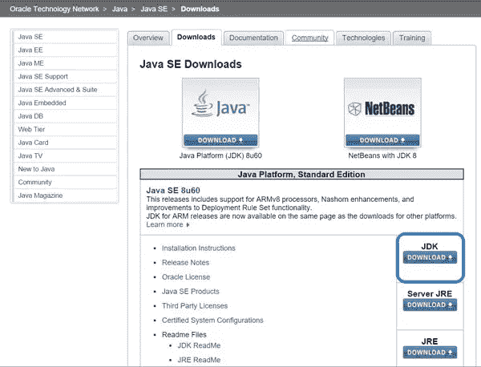

下载完成后，运行非常典型的安装过程，看起来有点像这样:

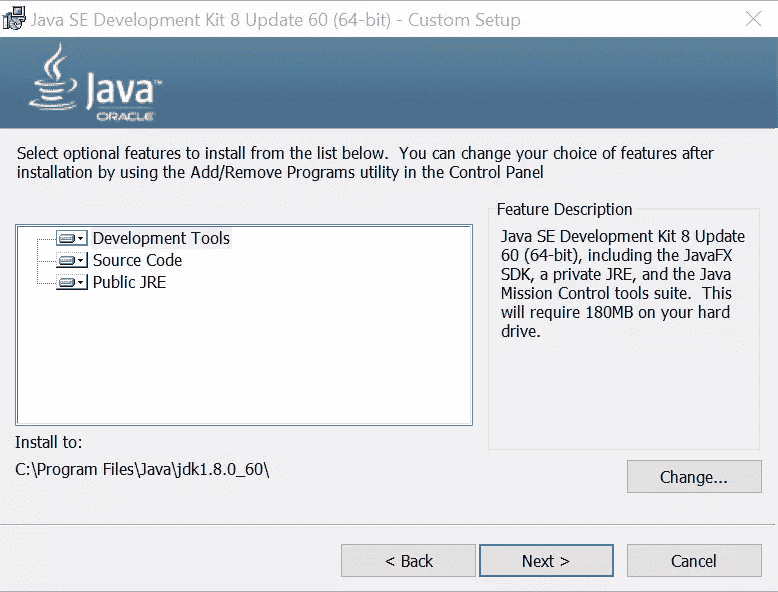

### Android SDK 下载和安装

如果你是 Android 开发新手，你需要下载并安装 Android SDK。你只需要 SDK 的“仅 SDK 工具”部分，可以在他们的[其他下载选项](http://developer.android.com/sdk/index.html#Other)页面获得。这提供了最低限度。如果你想在未来做大量的 Android 应用程序开发，你可以下载整个 Android Studio 包。如果您坚持使用“仅 SDK 工具”选项，请转到该页面并选择您的操作系统版本:


运行你下载安装文件。如果您不确定是否安装了 Java，安装程序会为您确认这一点:

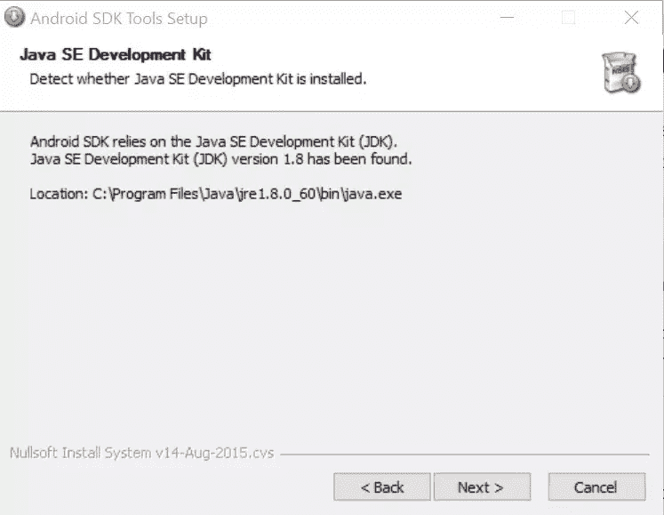

按照剩下的提示(它们是非常标准的安装提示)将 SDK 安装到您的系统中。完成后，在单击 Finish 之前选中复选框，这样您就可以加载 SDK 管理器:

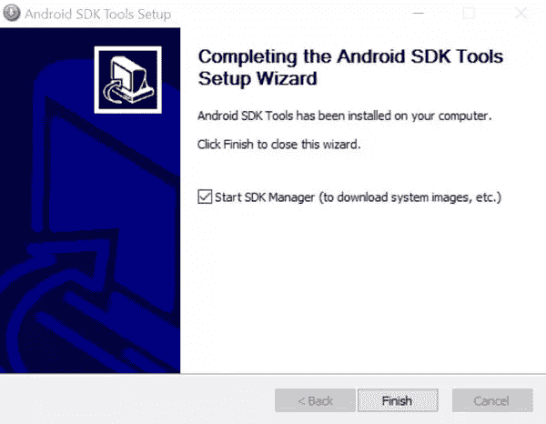

SDK 管理器应该如下所示:

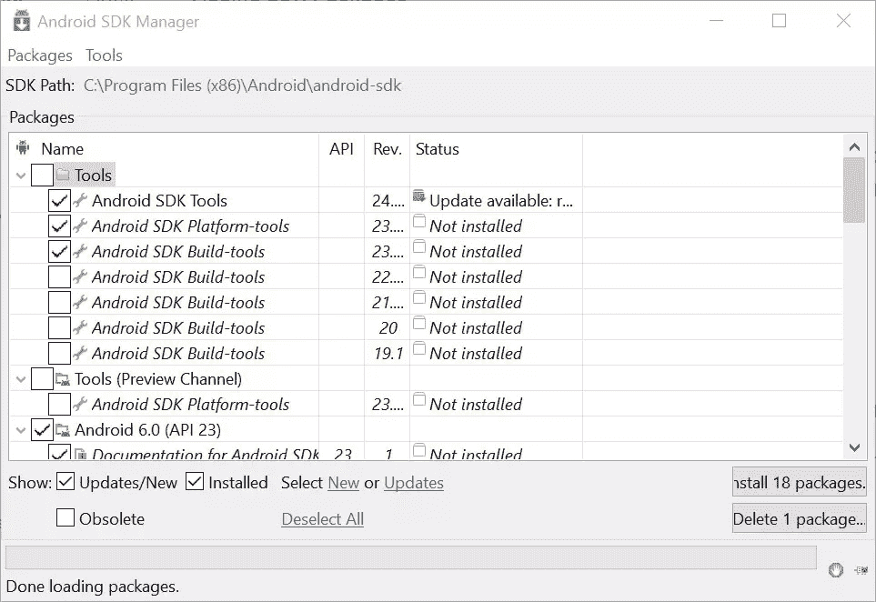

很可能已经为您选择了一堆复选框。让我们把它减少到我们现在需要的数量。在“工具”文件夹下，您需要选择以下内容:

*   **Android SDK 工具**——这应该是最重要的。
*   **Android SDK 平台-工具**-这将紧随 SDK 工具之后。
*   **Android SDK 构建工具**–您应该只需要最新版本(您可以在“版本”栏下看到版本)

应该是这样的:

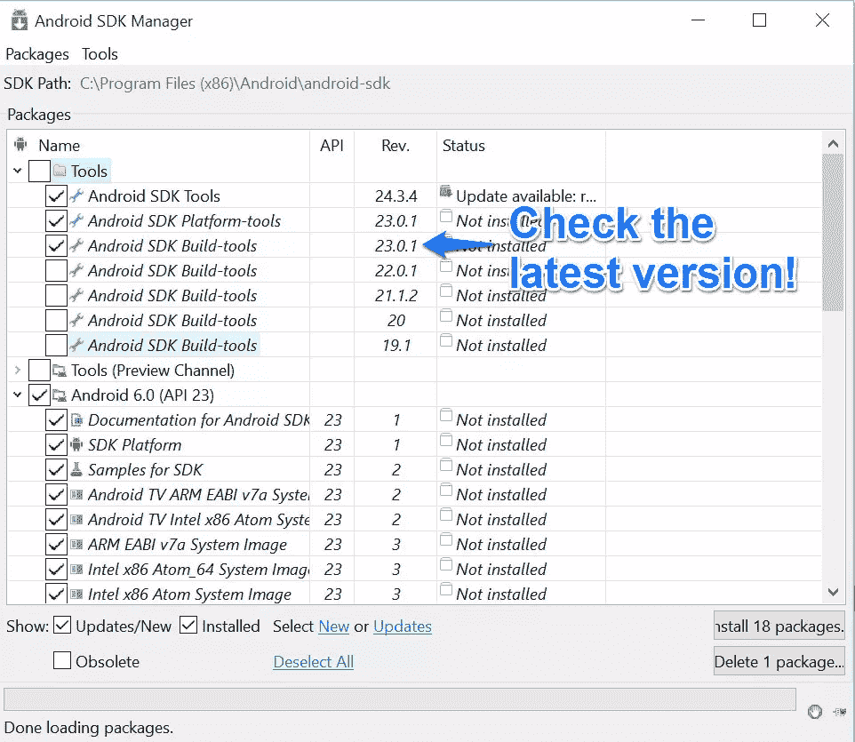

然后，在最新的 Android API 文件夹*(以最高的为准，在撰写本文时是“Android 6.0(API 23)”)*中，选择以下内容:

*   **SDK 平台**–你会需要它的！
*   **系统映像**–您可以选择 ARM 或 Intel 系统映像，以便在您的计算机上模拟 Android 系统。如果你想在你的 Android 物理设备上做所有的测试，你可以跳过这一步。
*   Google API-这将允许我们在应用程序中使用任何 Google API。这不包括 Google Cardboard——我只是为了方便起见才包括它，你也可以跳过这一项。

看起来应该如下所示:

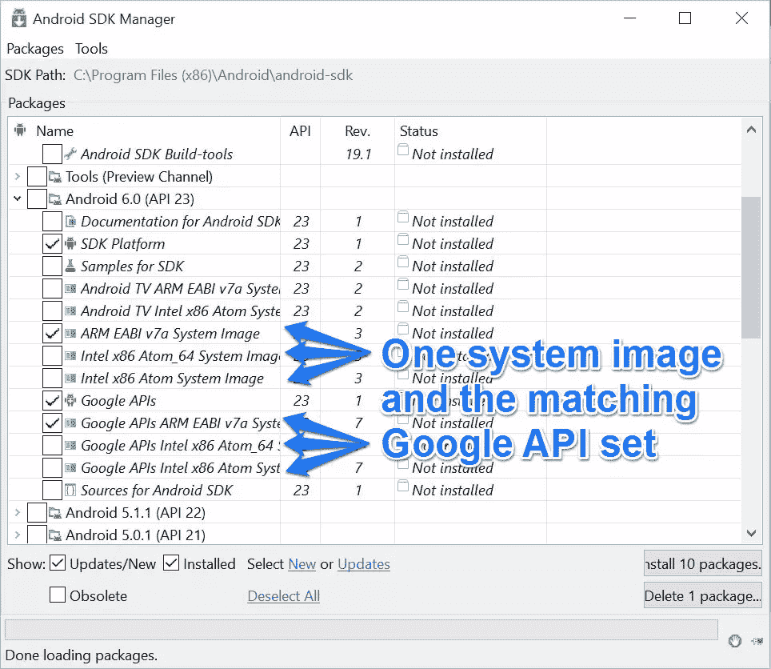

点击右下角的“安装 X 包”开始安装过程。你需要接受许可，它才会让你安装。

一旦安装完毕，你就应该在 Android 端拥有你需要的一切了！

## 创建纸板授权的 Unity 项目

从上面链接的 Cardboard SDK Github repo，你真正需要下载的是用于 Unity 的 [Cardboard SDK。这里的 unitypackage 文件](https://github.com/googlesamples/cardboard-unity/blob/master/CardboardSDKForUnity.unitypackage?raw=true)。

一旦下载完成，我们就可以开始实际的 Unity 项目了。打开 Unity，做显而易见的第一步——创建一个新项目。

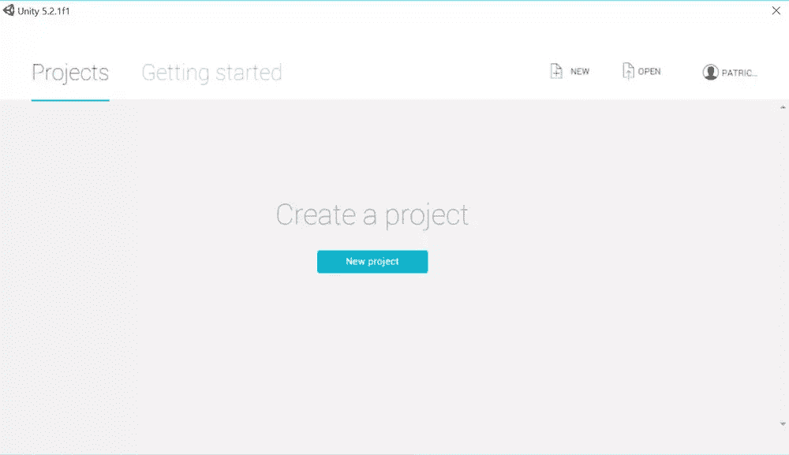

选择 3D 并为您的项目命名。不要担心在此屏幕上添加资产包，我们将在下一步添加我们的自定义资产包。准备好开始后，选择“创建项目”:

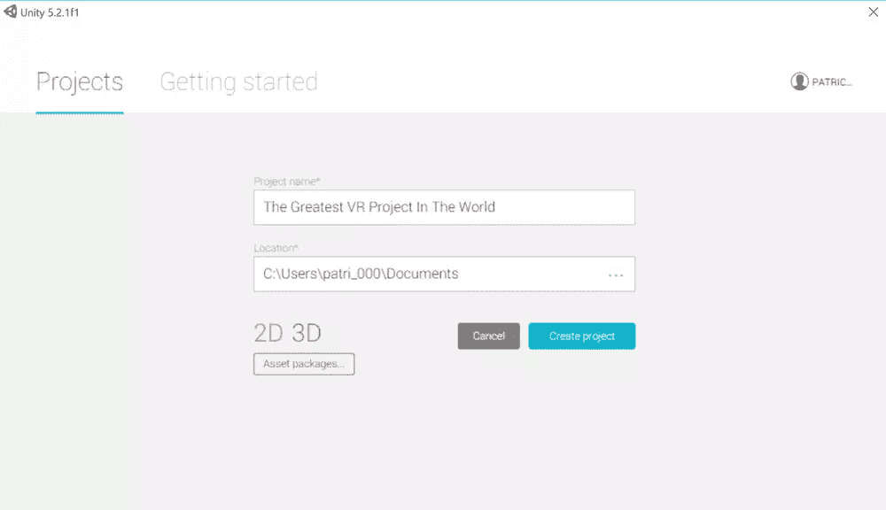

接下来，进入*资产>导入包>自定义包…* 找到你的 Cardboard SDK。您之前下载的 unitypackage 文件。

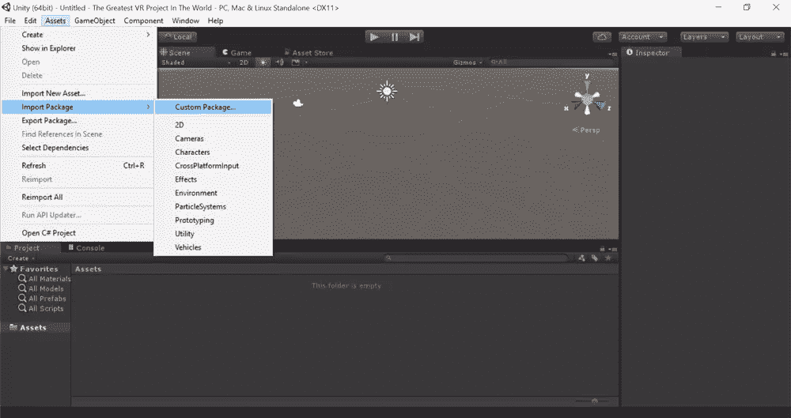

如果您使用的是 Unity 5，您将不需要旧文件夹，并且可以取消选中这些文件夹:

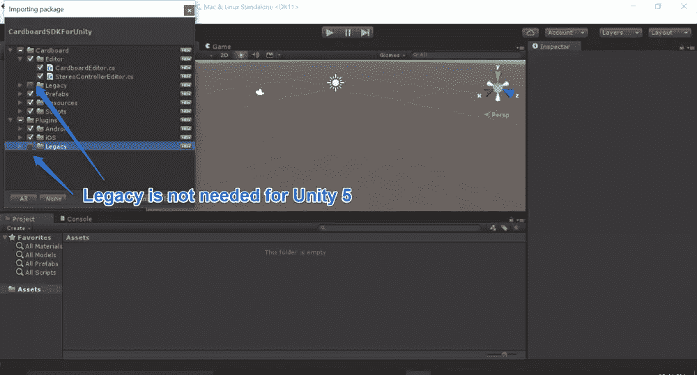

成功后，您的新 Cardboard SDK 资产应该出现在您的项目中的“Cardboard”文件夹中:

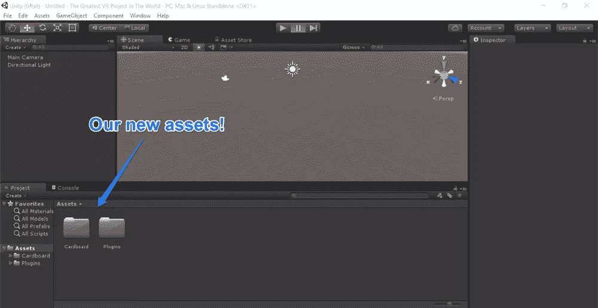

在 Cardboard SDK 文件夹中，您会发现四个子文件夹——“编辑器”、“预设”、“资源”和“脚本”:

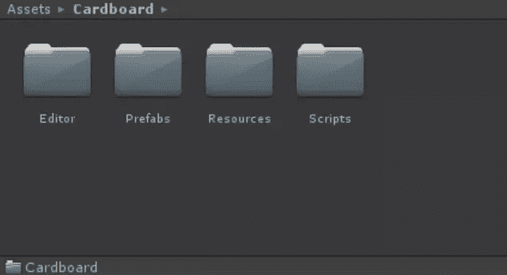

在“预置”文件夹中，你会发现一个名为“CardboardMain.prefab”的预置。把它拖到你的场景中，并在 Y 轴上提高 2 度(否则用户会觉得他们要么很小，要么非常矮！):

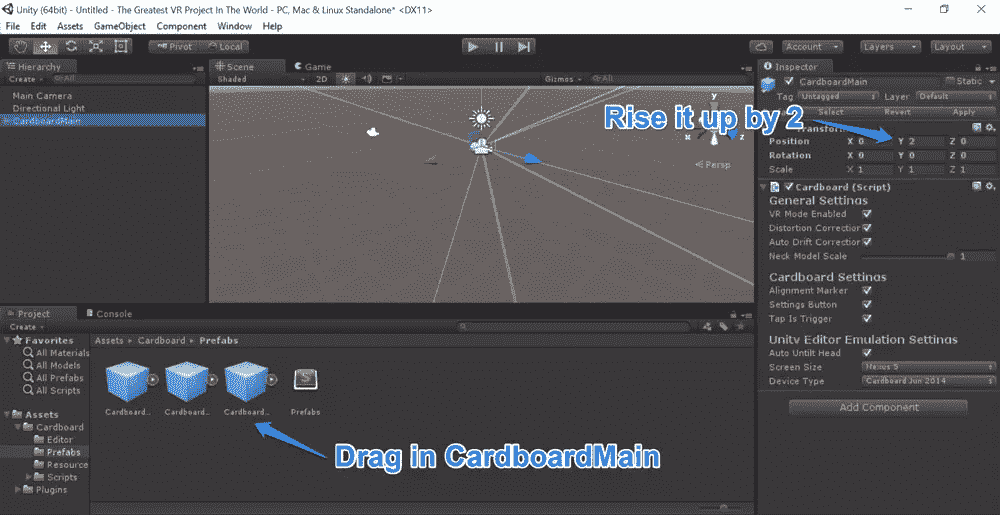

打开“CardboardMain”预设，你会在里面找到“主摄像头”。这是我们的两个立体风格的相机协同工作，通过谷歌 Cardboard 耳机观看时，在奇妙的 VR 中显示场景。在我们的“主相机”对象中，我们想要添加一个“物理光线投射器”组件。为此，在打开“主摄像头”的同时，点击“添加组件”。我通常通过在弹出的窗口中键入“raycaster”来找到它。我们需要一个物理射线投射器，通过观察元素来与它们互动。


接下来，您可以添加一个图标来显示用户何时在查看一个对象。我在 Unity 商店使用了 Office57 的 [64 平板游戏图标包中的一个免费图标。如果你愿意，你也可以为此创建你自己的精灵。从某处获取一个精灵，并将其导入到您的项目中。](http://u3d.as/fYE)

在“CardboardMain”中的“Head”对象内创建一个空的游戏对象。我已经把我的重新命名为“目标”。然后拖动你的精灵进入这个物体:

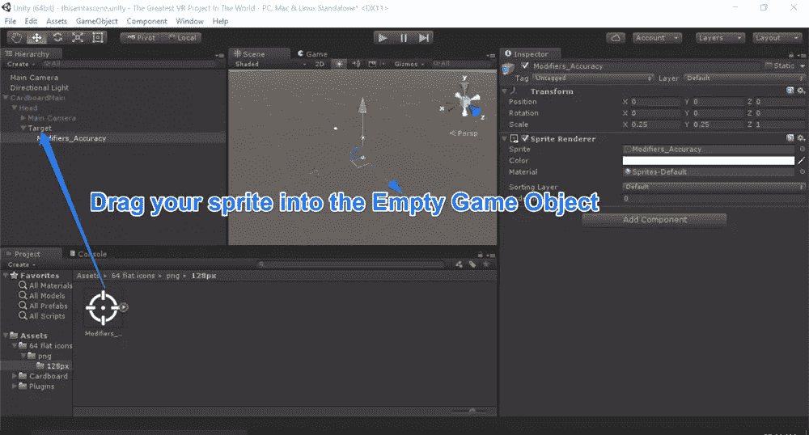

这应该是您启用大量非常有用的 Cardboard 视图跟踪和控件所需的全部内容。

## 响应纸板事件

现在我们已经创建了 CardboardMain 视图，我们需要场景中的一些东西进行交互。对于我的演示，我使用了 3dFoin 的[神灯和 Unity 商店刺猬团队](http://u3d.as/4P3)的 [SkySphere Volume 1。您可以使用任何您喜欢的对象，将灯拖动到您的场景中:](http://u3d.as/3cV)

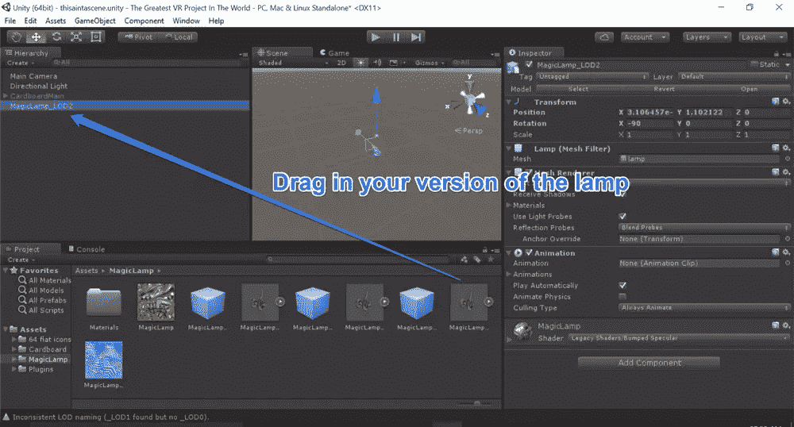

导入 SkySphere 时，请随意打开“Examples”文件夹，以保持我们项目的整洁:

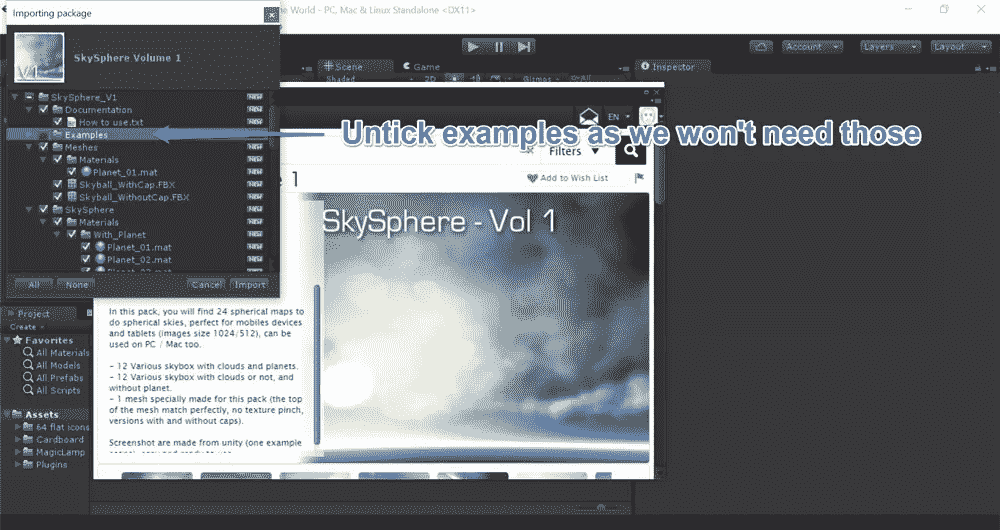

将灯放置在位置{x: 0，y: 1.5，z: 2}，旋转{x: -90，y: 90，z: 0}，并在所有轴上将它缩放 0.5，这样它与我们的场景相比不会太大:

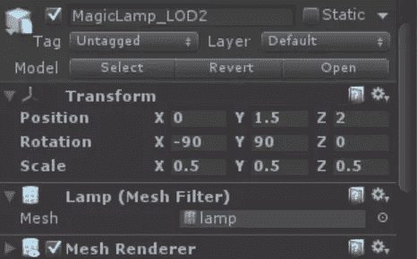

然后从 *SkySphere_V1 >网格*文件夹中拖入“Skyball_WithoutCap”。它应该放置在{0，0，0}处，X 旋转-90:

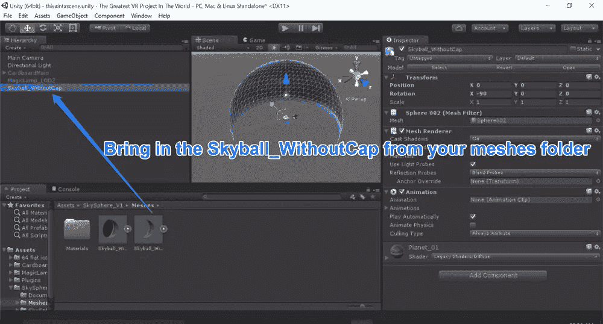

为了在这个对象上与 Cardboard SDK 进行交互，您需要在这个对象上编写一些代码。当我们看着灯，然后移开视线时，我们最初的一点功能将集中在引起事件发生上。每次用户将目光从灯上移开，天空都会改变纹理:

```
using UnityEngine;
using UnityEngine.EventSystems;
using System.Collections;

public class Lamp : MonoBehaviour {
  public Renderer skybox;
  public Material sky1;
  public Material sky2;
  public Material sky3;
  public Material sky4;
  private int currentSky = 0;

  void Start () {

  }

  public void stareAtLamp() {
    switch (currentSky) {
      case 0:
        skybox.material = sky2;
        currentSky++;
        break;
      case 1:
        skybox.material = sky3;
        currentSky++;
        break;
      case 2:
        skybox.material = sky4;
        currentSky++;
        break;
      case 3:
        skybox.material = sky1;
        currentSky = 0;
        break;
    }
  }
}
```

上面的代码非常简单，我们设置了一个 skybox 变量，该 skybox 的四个材质和一个整数来存储当前 skybox 的编号。然后，我们有一个名为`stareAtLamp()`的公共方法，该方法将我们的天空盒的材质更改为一系列材质中的下一个，或者如果我们在最后一个材质，则返回到第一个材质。

要将此代码添加到我们的项目中，请选择您的灯并单击“添加组件”。输入“脚本”，您应该会找到“新脚本…”。点击它，称之为“灯”。从上面输入我们的代码。

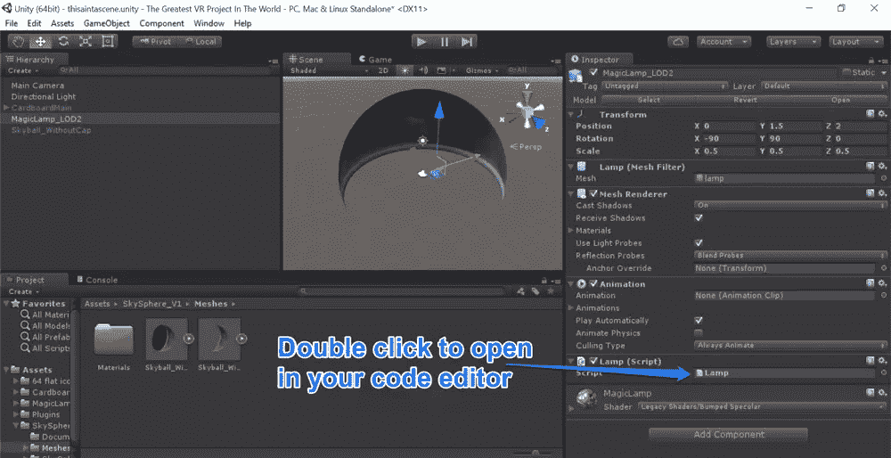

当保存代码时，这些公共变量将作为脚本的选项。将项目层次结构中的 skybox 对象拖到 skybox 变量中。从*Assets>SkySphere _ V1>sky sphere>Materials>With _ Planet*文件夹中找到你的 sky sphere 的材质(或者你喜欢的任何其他材质),然后将其中几个拖到四个 sky materials 中。

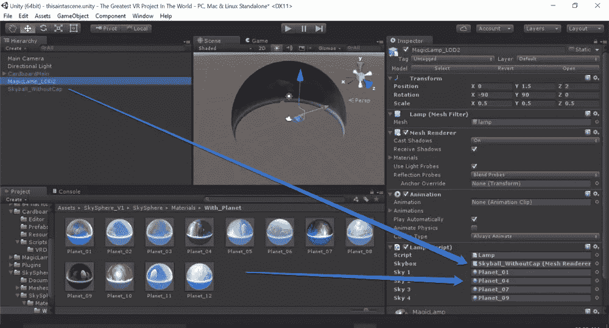

我们的 lamp 对象中还需要一个组件——一个“事件触发器”。这实际上将调用我们之前编写的`stareAtLamp()`函数。选择灯对象，点击“添加组件”，找到“事件触发器”组件。然后，一旦它在您的灯对象中，单击“添加新事件类型”并选择“指针退出”:

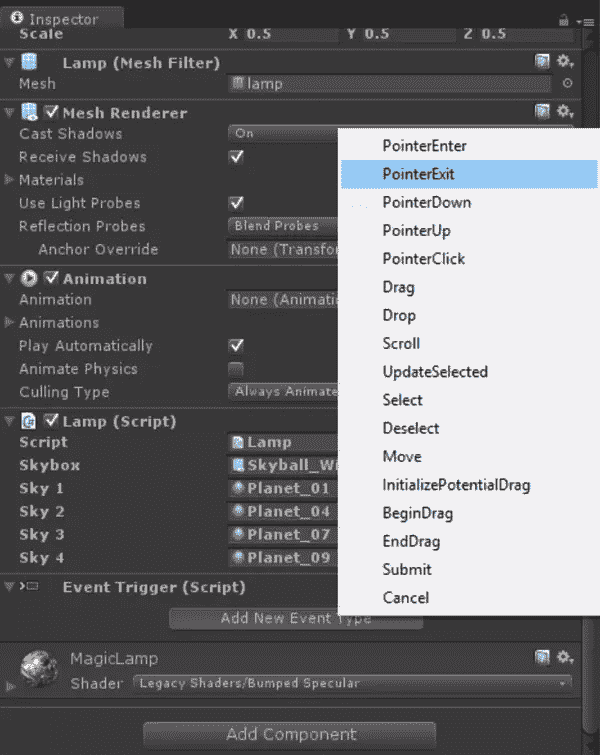

从这里开始，您将有一个区域添加到对“PointerExit”事件的响应中。单击左下方的“+”图标，然后将灯对象拖动到“仅运行时”下方的框中:

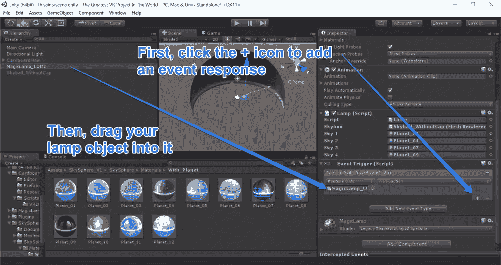

这允许我们访问灯的功能作为可能的响应。点击显示“无功能”的下拉菜单，找到“灯”，然后选择`stareAtLamp()`功能。


为了让事件触发器工作，我们的场景需要一个“事件系统”。回到你的场景，从 *UI >事件系统*创建一个。

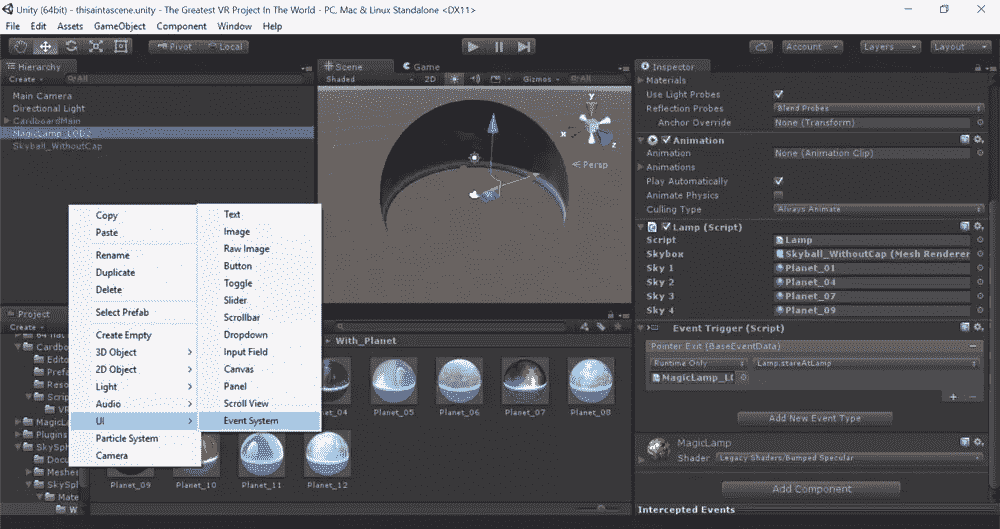

如果愿意，您可以从事件系统中删除“独立输入模块”。我们需要的主要组件是 Cardboard SDK 中的“凝视输入模块”。您可以通过点击“添加组件”并转到*脚本> GazeInputModule* 来添加这个组件:

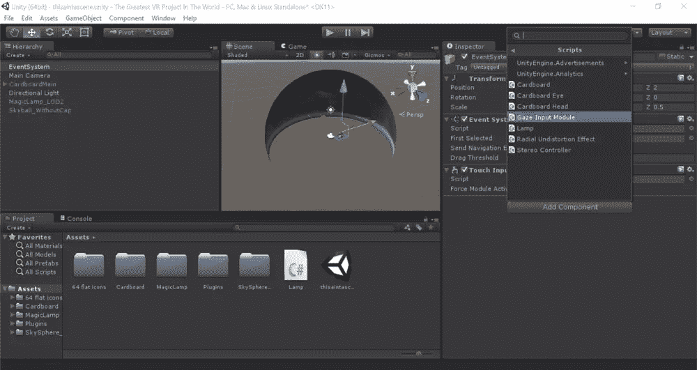

现在我们将目标 sprite 定义为当我们使用 GazeInputModule 并查看一个对象时出现的 sprite。将“目标”对象(或您在 CardboardMain 对象中选择的任何名称)拖动到组件的光标设置中:

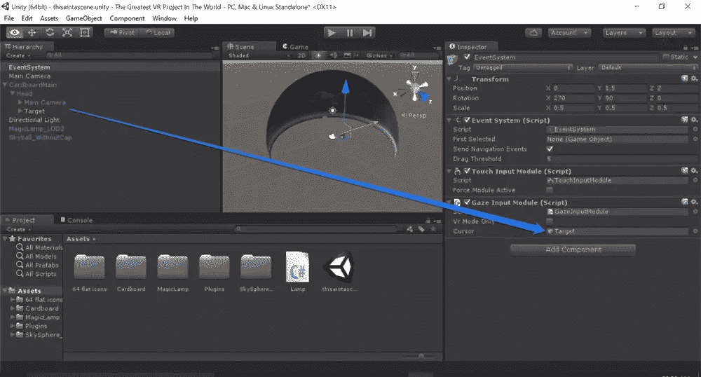

为了在我们看着这盏灯的时候进行拾取，我们需要给它加一个碰撞器。为此，请单击“添加组件”并键入“碰撞器”以找到“球体碰撞器”。添加到:

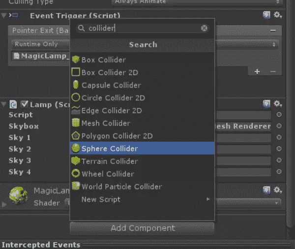

然后，如有必要，调整球体碰撞器的位置和半径，使灯周围的绿色球体覆盖其形状:

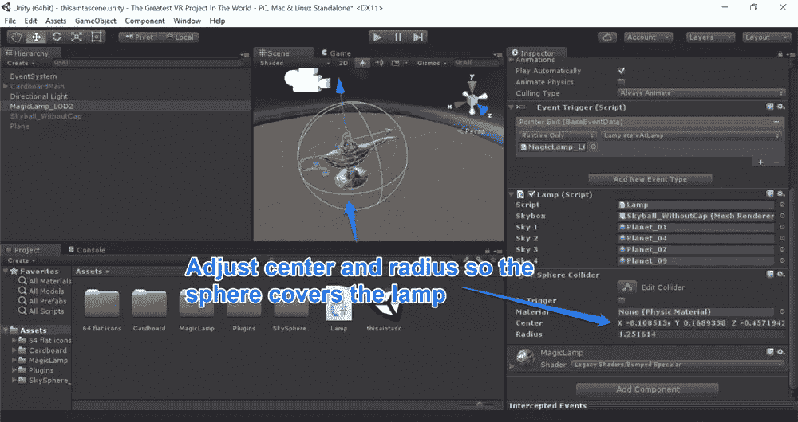

我们几乎准备好测试我们的虚拟现实应用了！

删除场景中的“主相机”对象，如果你还没有本能地删除它——“cardboard main”对象是我们的新相机。

在我们测试之前，也给场景添加一个简单的地板。从 *3D 对象>平面*创建一个“平面”对象，并确保它位于{x: 0，y: 0，z: 0}。将该平面缩放到{x: 2，y: 1，z: 2}，使其延伸到整个天空盒:

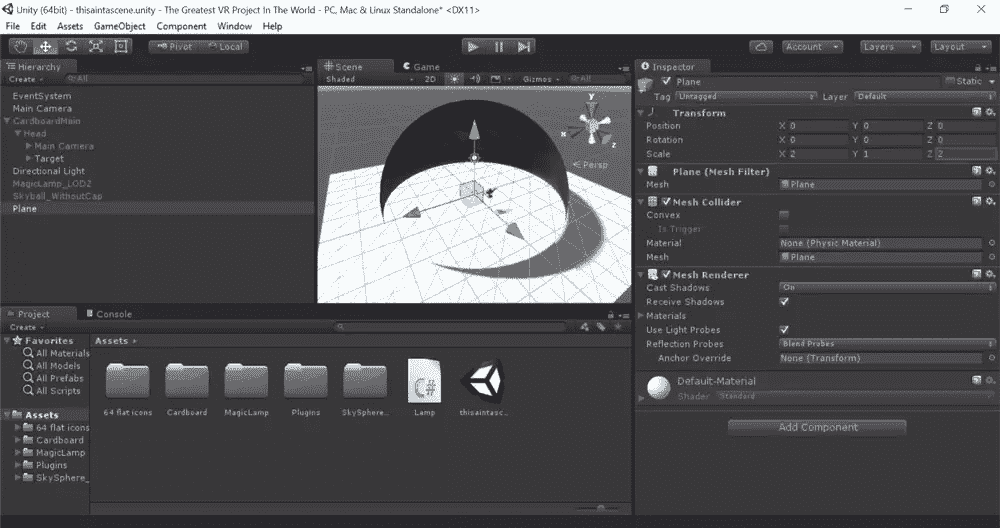

## 测试我们的应用

我们应该准备好一切，以便能够试用我们的 VR 应用程序，看看它的效果如何。为此，点击 Unity 顶部的 Play 按钮，应用程序就会自动运行。需要记住的两个重要控件是:

*   要模拟环视场景，请在移动鼠标的同时按住 *Alt* 键。
*   要模拟倾斜头部，请在移动鼠标的同时按住 *Shift* 键。

你应该看到你的场景运行良好，显示你的灯。要放大一点看，右上角有一个小图标。点击并选择“最大化”。你也可以点击“播放时最大化”来要求它在你测试时自动这样做:

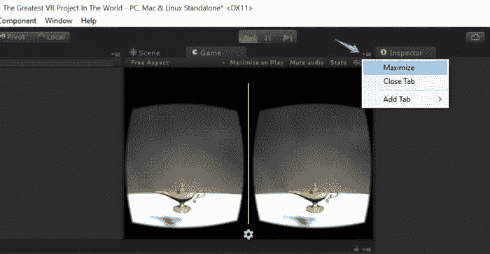

你现在应该让你的场景运行到最大化:

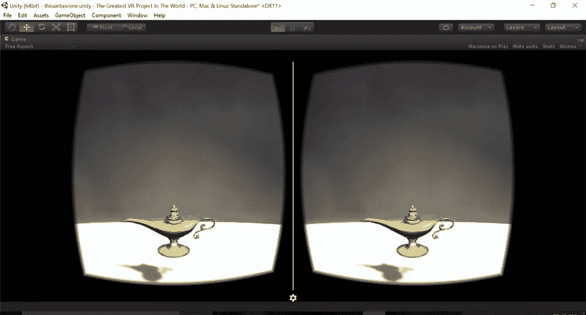

如果您看着灯，您的图标应该会出现，表明您确实在看着灯:

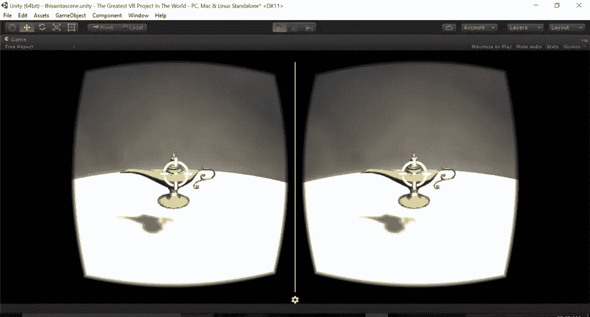

如果你看向别处，天空会像魔法一样改变！

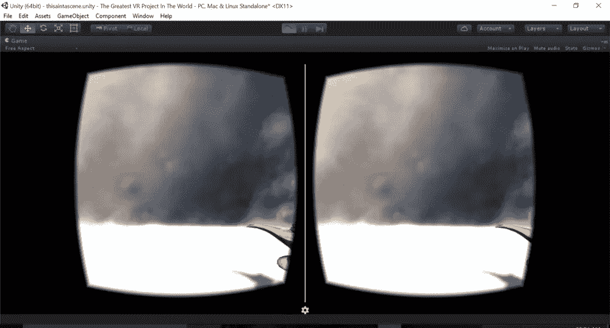

太好了，这是我们第一次使用 Cardboard SDK。然而，Cardboard 耳机还有一个我们没有利用的功能——我们在侧面的遥控器。以下是如何参与其中。

## 使用点击器

要从 Cardboard 耳机添加点击事件，我们需要添加一个新的事件处理程序。首先，我们将设置事件实际应该做什么。对我来说，这盏灯不够神奇。我将加入一个粒子系统，它会在观众点击灯的任何时候启动。为此，再次打开灯，点击“添加组件”，然后输入“粒子”。你应该找“粒子系统”。把这个加到你的灯上。你现在应该可以看到白色颗粒从里面浮出来:

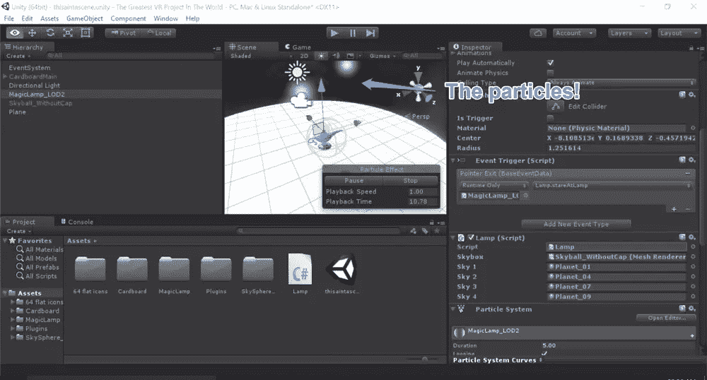

你可以根据自己的喜好调整粒子系统的设置，看看你认为最酷的是什么！我将颜色设置为黄色，将持续时间设置为 10，并通过“形状”部分将它们设置为随机方向。您需要更改的一个设置是将“发射”中的“速率”更改为 0:

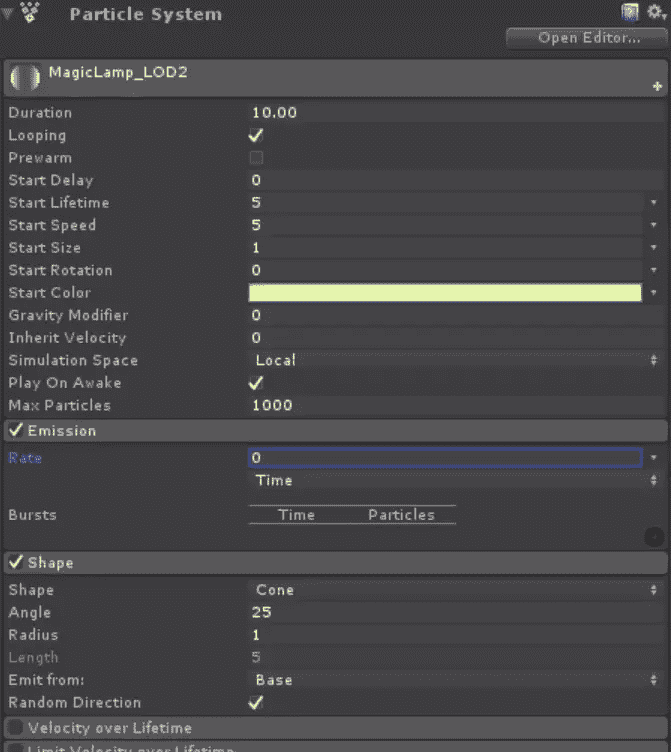

我最后还使用了一个 1 的“重力修改器”,这使得粒子在灯上落下时看起来有点凉。试试看！

在代码中，我们将添加一个名为`rubLamp()`的新函数，它从我们的粒子系统中发出一系列粒子:

```
public void rubLamp() {
  GetComponent<ParticleSystem>().Emit(10); 
}
```

然后，我们回到灯对象的“事件触发器”组件，并为“指针点击”添加一个组件:

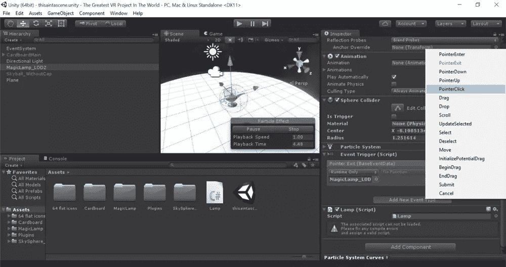

然后，我们单击并添加我们的`rubLamp()`函数作为响应:

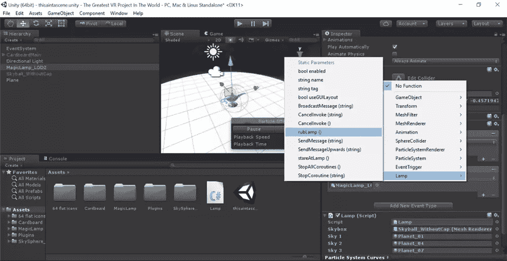

现在，如果我们播放我们的场景并点击那盏灯，我们将有粒子从它那里爆发出来。相当整洁！

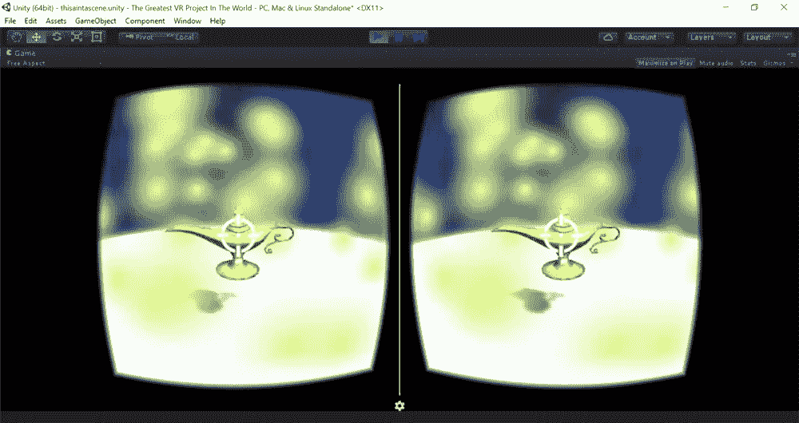

## 将应用程序安装到 Android 设备上

现在，我们肯定想把它放到我们的手机上，这样我们就可以在谷歌 Cardboard 耳机中尝试它。在 Unity 中，进入*文件>构建设置*。在出现的屏幕中，从列表中选择“Android”，然后选择“播放器设置”:

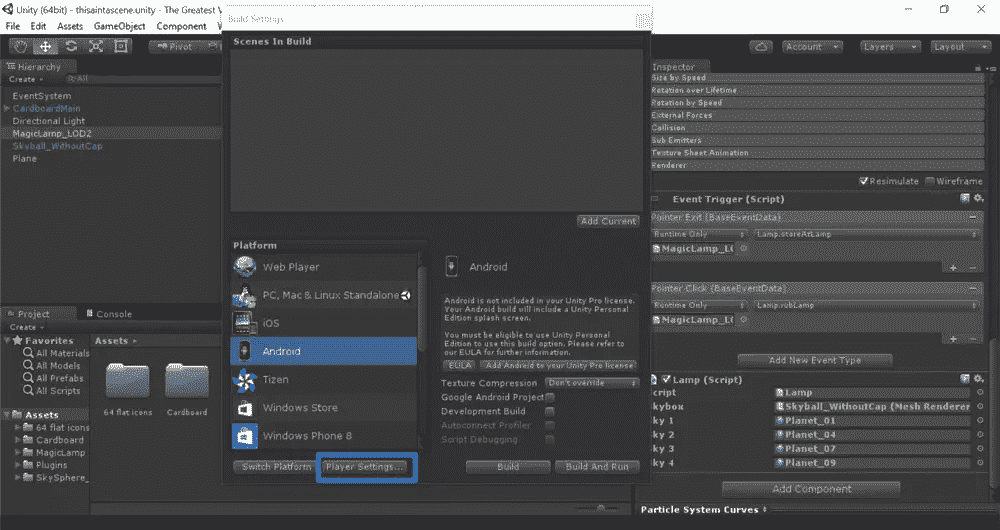

设置将出现在右边(你可能需要将“构建设置”窗口向左移动一点来查看全部)。在*分辨率和显示方式*下，将“默认方向”更改为“横向向左”:

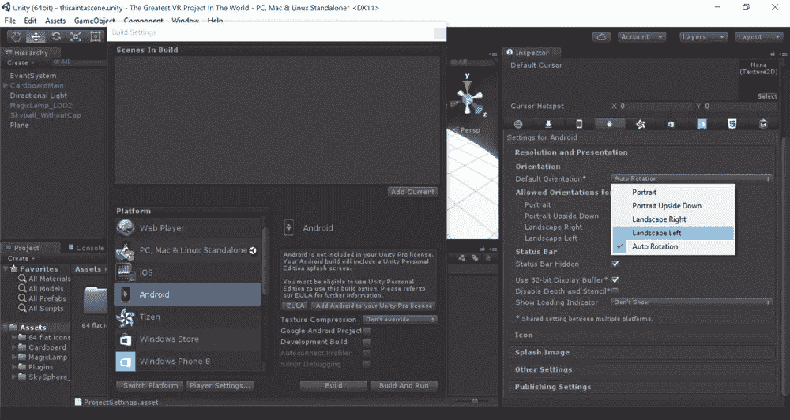

然后在下面，打开“其他设置”部分，更新捆绑包标识符，以包括您的公司名称和应用程序名称–*com . company name . appname*。我用的是*网。site point . GreatestVRProjectInTheWorld*:

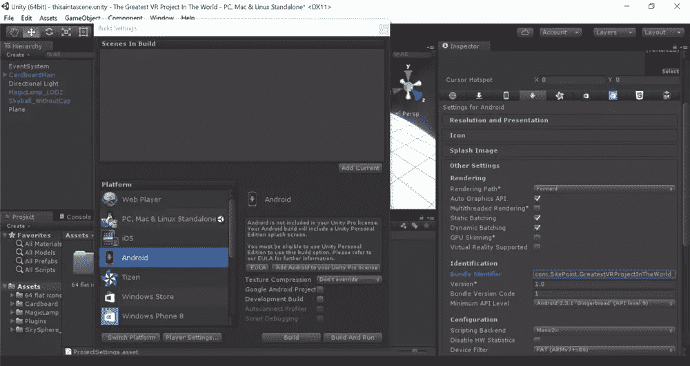

您现在应该准备好出发了！通过 USB 将您的 Android 手机连接到您的计算机，然后在“构建设置”窗口中单击“构建并运行”:

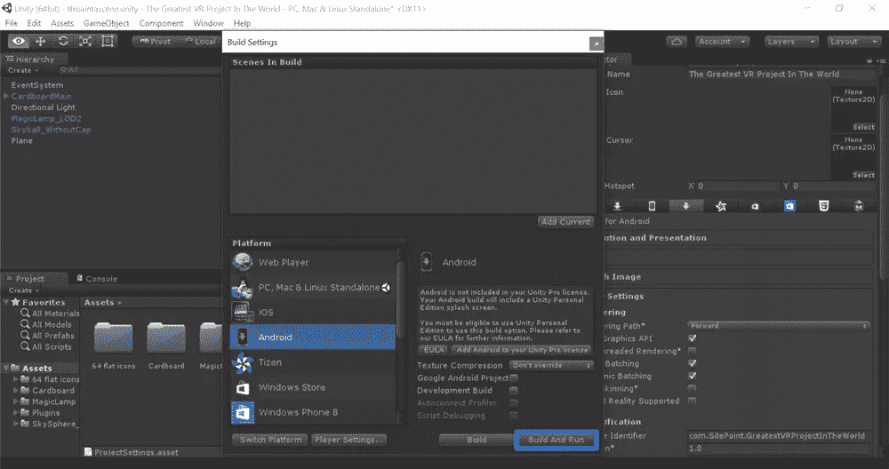

选择保存 apk 文件的位置，并为其命名:

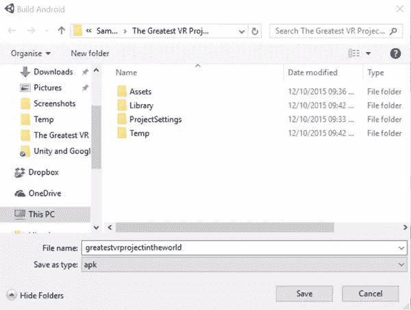

统一会贯穿其中，为你做其他一切事情。它会把应用程序放在你的手机上并运行它。一旦应用程序在你的手机上，从你的电脑上断开连接，把它放入你的谷歌纸板，享受你的虚拟现实创作！

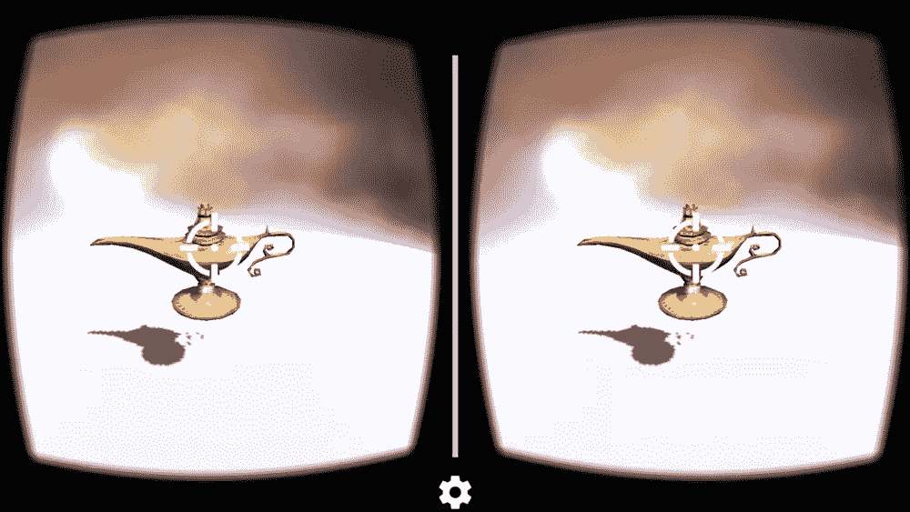

## 结论

使用 Google Cardboard 和 Unity 的工作非常简单！从这个最初的演示开始，你现在拥有了 Unity 的所有功能，结合了整个便携式 VR 平台的功能！不久前，我讨论了在 Unity 中调用 Web APIs 的问题 Cardboard SDK 很好地集成到了整个过程中，所以如果你将这两种技术结合起来，你就可以拥有一个支持物联网的 VR Unity 应用程序！

请随意使用这个代码教程作为你将来构建任何 Cardboard VR 项目的基础！如果你用它做出了什么，请在评论里分享或者在 Twitter 上联系我( [@thatpatrickguy](http://www.twitter.com/thatpatrickguy) )。我很想去看看！

如果你正在寻找其他链接和示例项目来指导你进行 VR 和 Unity 开发，我有一套可能非常适合你的精选链接！去 Dev Diner 看看我的 [VR 和 Unity 开发者指南](http://devdiner.com/guides/vr-with-unity/)，里面全是网络资源的链接。如果你有我没有列出的其他好资源，也请告诉我！

## 分享这篇文章