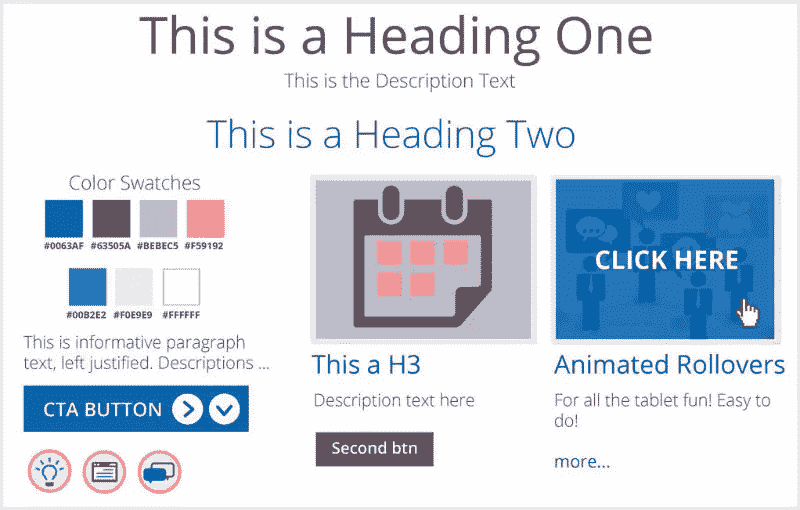
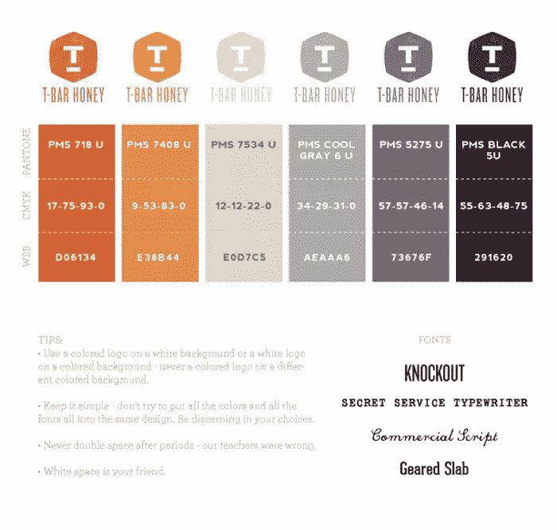
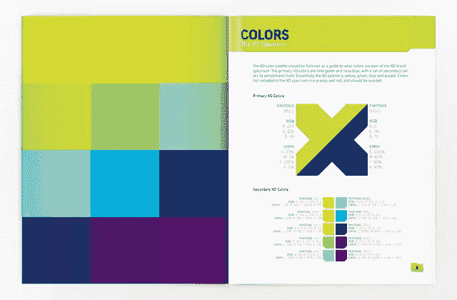
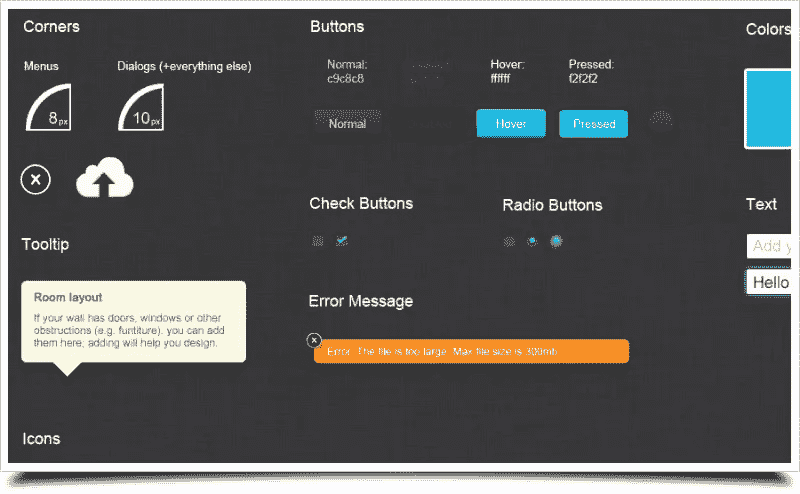
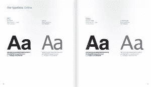
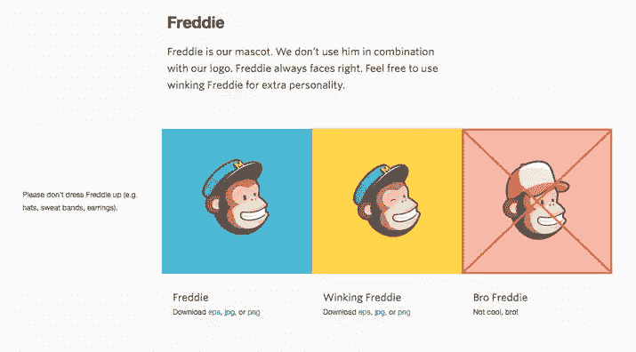
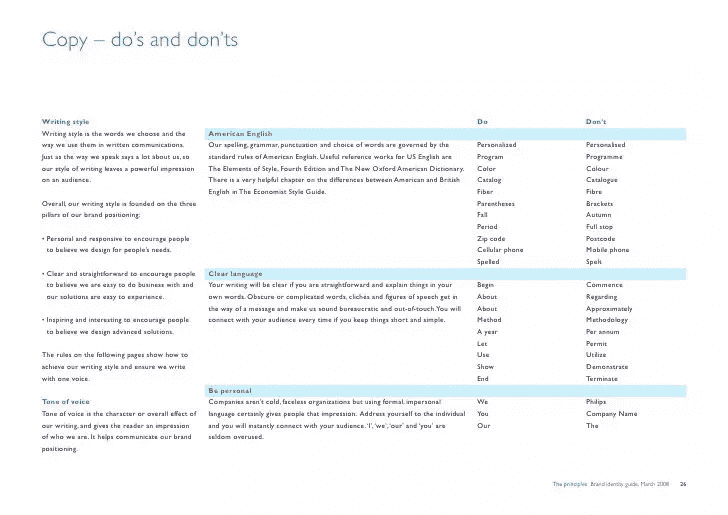

# 如何创建一个让你引以为豪的网页风格指南

> 原文：<https://www.sitepoint.com/creating-web-style-guide/>

> “在设计一件东西时，总是把它放在更大的背景中考虑——房间里的一把椅子，房子里的一个房间，环境中的一座房子，城市规划中的一个环境”——埃利尔·沙里宁

上面的引语来自一位出色的 20 世纪芬兰建筑师，名叫[埃利尔·沙里宁](https://en.wikipedia.org/wiki/Eliel_Saarinen)——这是他在赫尔辛基市中心设计的火车站。虽然埃利专门谈论建筑，但他的概念适用于所有类型的设计——从雕塑到烹饪艺术到景观美化再到网页设计。

然而，网页设计在这方面面临着独特的挑战。如何获得一个网站及其组件的单一、统一的视图？这就像试图从底层了解一个星球——没有简单的方法后退一步，把你的网站作为一个整体来看。很难有语境感。

### 你是做什么的？

这就是为什么样式指南在 web 项目中特别重要。它们通常是在一个地方获得站点所有组件的综合概述的唯一方法。这就是为什么这篇文章被设计成网页设计风格指南的速成班。希望到最后，您能够创建自己的指南，可以编辑以供将来使用和扩展。

### 什么是风格指南？

风格指南仅仅是一个项目的权威视觉文档，概述了你为你的品牌设定的规则。这是一套设计指南，可以像一个小网站的一页纸一样简单，直到[可口可乐的 150 页风格圣经(PDF)](http://www.kathrin-pyplatz.com/wp-content/uploads/2015/03/styleguide-coca-cola.pdf) 涵盖了伞板的设计和卡车油漆要求。

你的风格指南应该是你项目的“所有参考之母”,是帮助你从头到尾保持一致性的活蓝图。无论你在设计的哪个部分工作，风格指南将会并且应该有一个指导方针或者规则来使你的工作更容易。如果没有，那么它就不是一个完整的风格指南。

### 研究你的品牌

理解你的“宝贝”是制定风格指南的第一步。如果你什么都不知道，那么很有可能你会跑到设计者那里，告诉专家你“*刚刚做了一些事情，并祈祷它会起作用*”。因此，如果你必须花一天、一周或一个月的时间来真正了解你的品牌，那就去做吧。

当然，这看起来像是一项无聊的任务，但绝对值得。你必须了解任务目标，声明和网站背后的面孔。这些理解会告诉你，淡蓝色背景上的芒果桃子色的约克白字母或 T2 白字母会不会起作用。想了解更多关于品牌研究的信息，你可以去看看 Richa Jain 关于[创造品牌形象](https://www.sitepoint.com/creating-a-brand-identity-20-questions/)的精彩文章。

### 配置调色板

颜色是开始你的风格指南的好地方。当决定你的颜色时，最好不要超过三种主色，但是你可以根据自己的需要随意选择不同的颜色。

你的风格指南应该总是反映十六进制代码，而不是使用名称。你认为是淡黄色的东西，合作者可能不这么看。大多数人会引用颜色名称或十六进制代码，而不是图像。

除了用于屏幕工作的十六进制代码之外，提供 CMYK 值和 Pantone 颜色代码总是有用的——即使它们不是立即需要的。列出您的颜色偏好后，您肯定需要指定何时何地可以使用某种颜色，以及任何例外情况。对于小型网站来说，这可能并不重要，但是您仍然应该这样做。

规则和例外包括以下情况:

*   在黑白背景下会发生什么？
*   在小版式中，彩色还是单调更好？
*   在相反的环境下会发生什么？

### 定义按钮和图标

不管你使用的是什么风格的按钮，也不管它们遵循什么趋势，你都需要设定一个设计规则。大多数网站都有自己的定制按钮，所以这一点很重要，尤其是当你的做法与竞争对手大相径庭的时候。

和字体一样，你的按钮和图标也需要使用指南。在你的指南上，主按钮和次按钮之间应该有清晰的图形区分。图标应该遵守它们自己的特定规则，包括它们的最大和最小像素准则，列在示例图像的旁边或里面。

应用于图标的颜色和任何进一步的样式将基于你的调色板和网站的总体声音，所以一定要仔细检查，以确保一切都符合。

### 字体选择

不一致的类型使用是 web 上最常见的设计失误之一，因此类型使用的一致性应该是您设置的首要规则之一。

字体不一致不仅很俗气，还会降低可读性，尤其是对于有视觉障碍的人。

在你的设计中，尽量坚持不超过三种字体。当你选择字体时，先决定你的主要字体，其次是第三字体。

换句话说，选择主要内容的字体，标题的字体，以及没有覆盖的小区域的字体。不要忘记具体列出每种字体可以放大到什么尺寸，以及允许的最小尺寸。

### 图像和视频细节

Mailchimp 为使用 Freddie 设置了规则。

你的风格指南应该包括尽可能多的图片。图像指南通常是在协作过程中创建的，您可能会与向您的网站发布和添加内容的作者和设计师一起工作。这将有助于保持你的网站看起来一致。

图像是主观的，但通常对于您的风格指南，您需要设置大小和数据约束。如果你的网站遵循更复古的风格，你可能需要注意所有的图片都应该使用柔和的调色板。另一个网站可能要求所有图像必须是 500px，300dpi，并且高度饱和。

视频也可能被同样对待，但规则略有不同。一种类型的风格指南可能要求所有视频必须来自 Vimeo 而不是 YouTube，但 YouTube 上 720p 及以上且不到 5 分钟的视频除外。从本质上来说，图像和视频的规格，从大小到内容，都归结于品牌，就像大多数其他元素一样。

### 给文案一个声音

既然品牌身份很重要，你就要确保有一个风格指南来指导你的内容的“声音”应该是怎样的。这对于大型网站来说更为重要，因为他们单独运营的小型网站的创建者通常已经知道他们网站的特点。

你的品牌研究将发挥作用，当涉及到构建一个大纲，该如何写文案在任何时候。文案的声音会让用户知道网站背后的人有多正式或不正式，以及这个网站是否真的适合他们。

请注意，你的风格指南不应该是写什么的独裁者——只是如何写。

例如，一个针对无家可归者的网站可能会努力保持一种周到、积极和热情的声音。要获得更多帮助和阅读如何将文案融入指南，请查看 [MailChimp 的声音和语气](http://voiceandtone.com/)。

### 临时演员

最近，有一种趋势是在你编写网站代码时自动生成一个风格指南。虽然您可能会认为这是一种有点落后的指导生产的方法，但它确实保证了总是维护最新的文档。

向导生成器适用于一系列技术:

*   **node . js**StyleDocco
*   **一饮而尽** [KSS](https://github.com/PhilJ/gulp-kss)
*   **红宝石** [生活方式指南](http://livingstyleguide.org/)
*   **PHP**准系统

### 最后一句话

了解如何创建和应用样式指南不仅可以提升您的工作流程，还可以增强您的设计信心。

设计你自己的个人指南真的不需要那么长时间，而且会是一个有趣和有创造性的过程。你不仅学会了更好地编辑你的作品，而且你对你的品牌的理解比任何简单的使命宣言都要深刻。

试一试，看看你能想出什么。

## 分享这篇文章