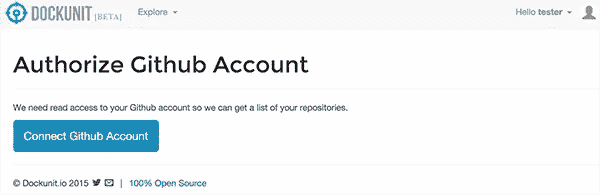
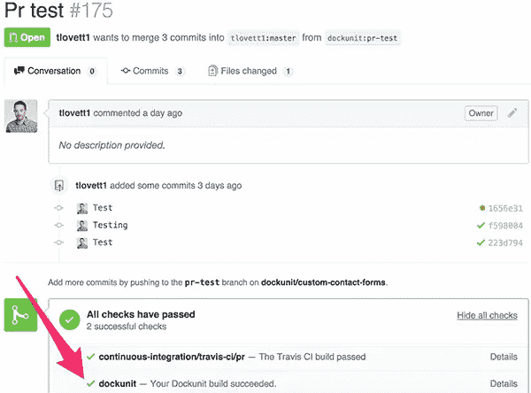
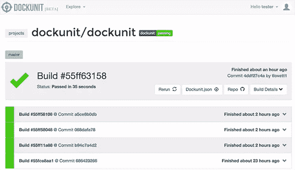
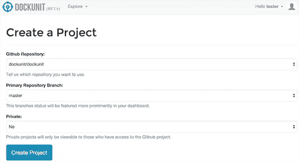
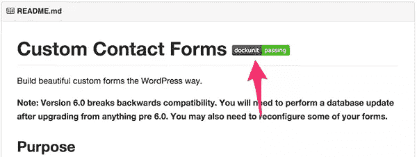
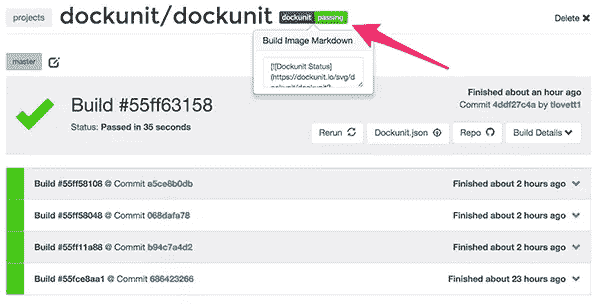

# 用 Dockunit.io 开发容器化的 WordPress

> 原文：<https://www.sitepoint.com/wordpress-development-with-dockunit-io/>

编写公开发布的 WordPress 主题和插件需要满足最低系统要求，特别是 PHP 5.2.4。因为 WordPress 支持 PHP 5.2.4，所以你的公共插件和主题也必须支持。从 PHP 5.2 到现在的 PHP 7 RC，PHP 发生了巨大的变化。

为了确保你的软件与所有的 WordPress 社区兼容，在几个主要的 PHP 版本中测试你的软件是很重要的，例如 5.2.4，5.6 和 7.0 RC。我们当然可以测试更多的版本，但选择三个主要版本是一个安全的赌注。

我们如何在 PHP 的三个主要版本中测试我们的插件或主题？通常，我们的系统一次只能运行一个版本的 PHP。我们可以用不同的 PHP 版本启动不同的虚拟机，但是这相当困难。答案是带有 Docker 的容器。

Dockunit 是一个运行容器化软件测试的工具。让我们将 Dockunit 设置为与插件或主题一起使用(本指南假设您正在使用某种 Unix 系统，如 OS X 或 Ubuntu):

## 坞站设置

### 1.下载并安装 Dockunit 及其依赖项。

首先，通过[他们简单的安装说明](https://docs.docker.com/installation/)安装 Docker。接下来，我们需要 [Node.js](https://nodejs.org/en/download/) 和 [npm](https://docs.npmjs.com/getting-started/installing-node) (它们应该包含在您的 Node.js 安装中)。

最后，安装 Dockunit:

```
npm install -g dockunit
```

### 2.为 Dockunit 设置项目。

Dockunit 读取项目中的`Dockunit.json`文件。`Dockunit.json`描述您想要使用的容器以及您想要如何运行测试命令。我们的`Dockunit.json`文件将为 PHP 5.2、5.6 和 7.0 RC 1 定义容器，因为我们最关心那些 PHP 版本。Dockunit 没有限制；我们可以为不同的 MySQL 版本、不同的 WordPress 版本、Apache vs. nginx 定义容器，这是我们与 WordPress 无关的完全不同的编程语言。与 Travis CI 相比，Dockunit 的一大优势是我们可以创建自己使用的容器，并且可以在本地容器中运行测试。

在插件或主题的根目录下创建一个名为`Dockunit.json`的文件。

如果你正在测试一个插件，将它粘贴到`Dockunit.json`(确保将`PLUGIN-NAME.php`改为你的插件中的主插件文件):

```
{
"containers": [
{
"prettyName": "PHP-FPM 5.2",
"image": "dockunit/prebuilt-images:php-mysql-phpunit-wordpress-5.2-fpm",
"beforeScripts": [
"service mysql start",
"wp-install latest"
],
"testCommand": "wp-activate-plugin PLUGIN-NAME.php"
},
{
"prettyName": "PHP-FPM 5.6",
"image": "dockunit/prebuilt-images:php-mysql-phpunit-wordpress-5.6-fpm",
"beforeScripts": [
"service mysql start",
"wp core download --path=/temp/wp --allow-root",
"wp core config --path=/temp/wp --dbname=test --dbuser=root --allow-root",
"wp core install --url=http://localhost --title=Test --admin_user=admin --admin_password=12345 --admin_email=test@test.com --path=/temp/wp --allow-root",
"mkdir /temp/wp/wp-content/plugins/test",
"cp -r . /temp/wp/wp-content/plugins/test"
],
"testCommand": "wp plugin activate test --allow-root --path=/temp/wp"
},
{
"prettyName": "PHP-FPM 7.0",
"image": "dockunit/prebuilt-images:php-mysql-phpunit-wordpress-7.0-rc-1-fpm",
"beforeScripts": [
"service mysql start",
"wp core download --path=/temp/wp --allow-root",
"wp core config --path=/temp/wp --dbname=test --dbuser=root --allow-root",
"wp core install --url=http://localhost --title=Test --admin_user=admin --admin_password=12345 --admin_email=test@test.com --path=/temp/wp --allow-root",
"mkdir /temp/wp/wp-content/plugins/test",
"cp -r . /temp/wp/wp-content/plugins/test"
],
"testCommand": "wp plugin activate test --allow-root --path=/temp/wp"
}
]
}
```

如果您正在测试一个主题，请将其粘贴到`Dockunit.json`:

```
{
"containers": [
{
"prettyName": "PHP-FPM 5.2 WordPress Latest",
"image": "dockunit/prebuilt-images:php-mysql-phpunit-wordpress-5.2-fpm",
"beforeScripts": [
"service mysql start",
"wp-install latest"
],
"testCommand": "wp-activate-theme test"
},
{
"prettyName": "PHP-FPM 5.6 WordPress Latest",
"image": "dockunit/prebuilt-images:php-mysql-phpunit-wordpress-5.6-fpm",
"beforeScripts": [
"service mysql start",
"wp core download --path=/temp/wp --allow-root",
"wp core config --path=/temp/wp --dbname=test --dbuser=root --allow-root",
"wp core install --url=http://localhost --title=Test --admin_user=admin --admin_password=12345 --admin_email=test@test.com --path=/temp/wp --allow-root",
"mkdir /temp/wp/wp-content/themes/test",
"cp -r . /temp/wp/wp-content/themes/test"
],
"testCommand": "wp theme activate test --allow-root --path=/temp/wp"
},
{
"prettyName": "PHP-FPM 7.0 WordPress Latest",
"image": "dockunit/prebuilt-images:php-mysql-phpunit-wordpress-7.0-rc-1-fpm",
"beforeScripts": [
"service mysql start",
"wp core download --path=/temp/wp --allow-root",
"wp core config --path=/temp/wp --dbname=test --dbuser=root --allow-root",
"wp core install --url=http://localhost --title=Test --admin_user=admin --admin_password=12345 --admin_email=test@test.com --path=/temp/wp --allow-root",
"mkdir /temp/wp/wp-content/themes/test",
"cp -r . /temp/wp/wp-content/themes/test"
],
"testCommand": "wp theme activate test --allow-root --path=/temp/wp"
}
]
}
```

(可选:如果你已经为你的 WordPress 插件或主题编写了实际的单元/集成测试，你应该运行它们。[这里有一些](https://www.npmjs.com/package/dockunit#php-and-wordpress-unit-tests) [例子`Dockunit.json`文件](https://www.npmjs.com/package/dockunit#php-and-wordpress-unit-tests)用于运行单元/集成测试)

让我们浏览一下`Dockunit.json`中的一些东西的含义。这些文件是用 JSON 编写的，JSON 是 JavaScript 对象符号。所有的`Dockunit.json`文件都包含一个带有属性“containers”的根级对象，该属性包含一个对象数组，每个对象描述一个要在 Docker 容器中运行的测试。这个想法是让容器成为你的软件的不同真实模拟，这样你就可以看到它在不同场景中的表现。以下是一个容器对象示例:

```
{
"prettyName": "My container pretty name",
"image": "docker-image-ref",
"beforeScripts": [
"before-command-1",
"before-command-2"
],
"testCommand": "my-command"
}
```

`prettyName`只是一种描述容器的简单方法，这将对构建输出有用。`image`指的是一个 [Docker Hub](https://hub.docker.com/) 的图像。Dockunit 附带了一组您可以使用的预定义图像，不过您也可以创建自己的图像。`beforeScripts`允许你在测试命令运行之前在 Docker 容器中运行命令。`testCommand`是其退出代码将被评估以确定您的软件是否“通过”的命令。

现在我们已经设置了我们的`Dockunit.json`文件，让我们运行我们的测试。从项目的根目录中，在终端中运行命令:

```
dockunit
```

对于您定义的每个容器，它将运行测试命令并评估退出代码。如果您的所有容器都正确退出，那么您的构建就通过了！如果不是，那么你的代码或者你设置 Dockunit 的方式就有问题。输出应该告诉您哪个容器失败了。您可以向`dockunit`提供`--du-verbose`选项来获得更多信息。

现在我们已经设置了我们的`Dockunit.json`文件并完成了测试运行，将我们的带有`Dockunit.json`的存储库推送到我们的远程设备(出于本教程的目的，是 GitHub)。

## 与 Dockunit.io 持续集成

一旦我们在 GitHub 存储库中设置了 Dockunit，我们就可以设置持续集成，以便在每个 pull 请求和 push 到 repo 时运行 Dockunit 测试。如果 Pull 请求或 Push 失败，GitHub 上会显示一个失败状态，这样我们就可以修复我们的软件。

### 1.[在 Dockunit.io](https://dockunit.io/register) 上创建账户。

### 2.进入[项目](https://dockunit.io/projects)，将您的账户与 GitHub 整合:



### 3.在 Dockunit.io 中，[为您的 GitHub 存储库创建一个项目](https://dockunit.io/projects/add):



### 4.就是这样！您现在可以看到项目的构建状态。推送 GitHub 时会自动更新:



### 5.在 GitHub 中，您可以看到每个 Pull 请求中的 Dockunit 构建状态:



### 6.不要忘记在你的`README.md`上添加 Dockunit.io 徽章，向人们展示你正在彻底测试你的软件:





## 结论

Dockunit 测试结合 Dockunit.io 持续集成是一个非常强大的工具，可以确保您的软件跨平台良好运行。

Dockunit 的多功能性是无限的，因为它依赖于 Docker——字面上你可以在任何平台上测试任何编程语言；不仅仅是 WordPress。使用 Dockunit 还使分布式团队的测试变得容易，因为您不是依赖每个开发人员来正确地设置他们的本地环境，而是依赖固定的 Docker 容器。

## 分享这篇文章