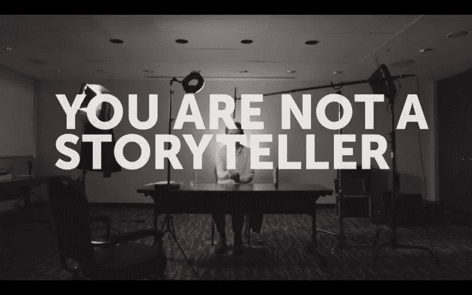
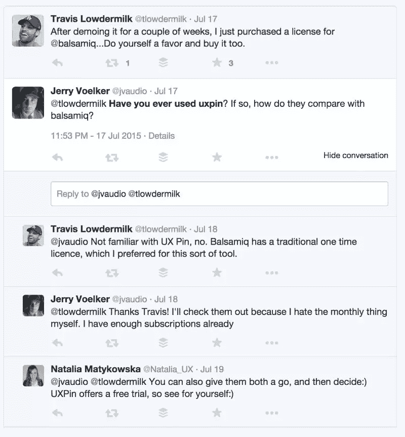
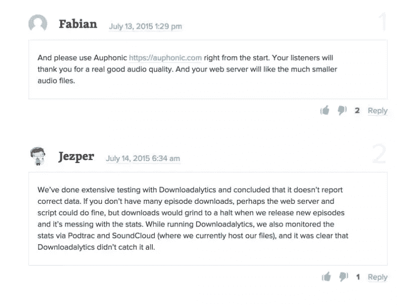
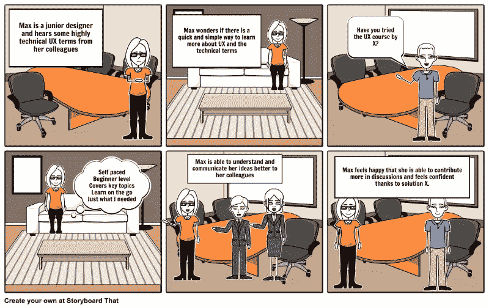

# 设计师是讲故事的人吗？

> 原文：<https://www.sitepoint.com/is-a-designer-a-storyteller/>

去年，奥地利著名平面设计师斯特凡·萨格梅斯特(Stefan Sagmeister)引起了轰动，他批评了他所看到的创意人士将自己称为“故事讲述者”的日益增长的趋势。毫不留情。

在视频中，他断言说故事是创意产业的一种时尚。像小说家和电影制作人这样的大师级故事讲述者很少称自己为故事讲述者，然而过山车设计师和景观设计师却称自己为故事讲述者。现在，在设计和 UX 领域，人们赞美讲故事者的好处也变得很常见。

***警告**:请注意[在他的视频中，Stefan 使用了一些相当丰富多彩的语言](http://www.adweek.com/agencyspy/stefan-sagmeister-to-creatives-no-fckhead-you-are-not-a-storyteller/70383)，可能不是每个人都喜欢。*

## 微妙的区别

虽然不是每个设计师都一定会讲故事，但我也不认为 Stefan 的观点是完全正确的。斯特凡当然不反对讲故事本身。他对人们自称为故事讲述者的想法更为恼火——这是一种微妙的区别。

他的评论可以解释为对滥用“讲故事”这个时髦词的一种反应。很多关于讲故事的教育侧重于向顾客讲述一个品牌的故事。

然而，应用讲故事的技巧来增强用户体验已经成为开发产品的有效工具。关键区别在于——讲故事是设计团队和合作者内部使用的技术。

这根本不是要应用**英雄的旅程**、T2 的三幕结构或试图将一些神秘的电影制作技术与我们如何设计网站相提并论。它更像是另一种工具，用来谈论我们正在构建的体验。

在她 2011 年的文章《[为什么我们需要在产品开发听证会上讲故事的人](https://uxmag.com/articles/why-we-need-storytellers-at-the-heart-of-product-development)》，[莎拉·杜迪](http://www.sarahdoody.com)颠覆了讲故事的想法。她说:

> 产品故事讲述者的首要目标是促进协作和共同创造。

将讲故事视为一种合作技巧，而不是一种销售噱头，这赋予了它更多的深度和意义。在那篇文章中，Sarah 解释了讲故事如何帮助统一产品的信息，并在拥挤的市场中使其与众不同。

自然，下一个问题是如何在日常工作中应用这种技术？围绕一个故事构建数字产品的具体步骤是什么？

## 从问题开始

经常听到人们开始谈论他们正在开发的应用程序。一般来说，应用程序、浏览器扩展、插件和产品都是达到目的的手段。更大计划中的一部分。讲故事有助于围绕客户体验和正在解决的问题而不是解决方案来设定焦点。

## 确定行动者

任何故事都有两个主要组成部分——情节和演员。确定演员需要一些研究。演员越真实，故事就越精彩。构建故事的第一步是了解谁是关键角色。勾勒出可能成为用户的一大类人。以此为起点，我们将能够进行一些用户研究。

### 低成本用户研究

用户研究立刻让人想起高质量的可用性实验室，它们有双向反射镜和眼球追踪仪。虽然这种详细的研究有其存在的空间，但也有替代技术来以低成本、按计划和预算进行快速用户研究。

昆士兰大学可用性实验室

基于研究而不是假设来充实人物角色或演员总是更好。联系朋友或熟人，他们可能符合我们所描绘的演员的特征。那些可能面临着我们正在努力解决的同样问题的人。试图了解他们目前是如何解决这些问题的，给了我们很多构建更好体验的洞察力。

记住这个阶段很快，你不需要做得很详细。只要足够的用户研究，所以我们不会完全基于假设来构建演员。只要足够的竞争对手分析，所以我们了解什么解决方案已经存在。

Twitter 是做一些快速用户研究的另一个极好的资源。不管你试图解决什么样的问题，围绕它肯定会有一些对话。在 twitter 上快速搜索有助于确定这个领域的总体感觉。这也有助于观察围绕一个话题发生的自然对话，而不是直接问别人一个问题。您可以执行的一些搜索包括:

*   我如何 _ _ _ _ _ _ _ _ _ _
*   有人能推荐一个 _ _ _ _ _ _ _ _ _ _
*   您曾经使用过 _ _ _ _ _ _ _ _(竞争对手的产品)吗

在这个例子中，在 twitter 上搜索“**你曾经使用过 uxpin** 吗”会显示一些人对这个产品的感觉以及有哪些替代产品。这也表明 [UXPin](http://www.uxpin.com/) 的团队在回应这些评论时相当积极。所有的好信息都是我们的故事和演员的基础。

论坛是发现用户机会和挫折的好地方。如果你找到一篇相关主题的文章，请查看评论部分。通常，人们会在评论区提供额外的信息、有趣的链接或者倾诉他们的沮丧。无论讨论发生在哪里，你都可以通过跟踪讨论来深入了解客户。

在这篇关于 Smashing magazine 的文章中，评论部分提供了关于推荐工具和替代工具的更多细节。这是对实际文章的一大补充。评论通常揭示了人们对正在讨论的产品和工具的感受。这反过来揭示了用户的实际问题是什么，现有的解决方案满足不了什么需求。

基于以上研究，你现在应该对目标受众有一个基本的概念，他们的动机、目标和挫折是什么。您还可以发现现有产品的不足或出色之处。

## 构建故事

有了具体的关键人物，我们可以开始形成一个假设的场景——故事。有很多关于建筑故事的文献，这个主题值得一篇自己的文章。然而，这里有一个非常简单的故事作为例子:

在这个故事中，我们从用户的背景和他们的感受开始。这是围绕用户最关心的问题开发产品的好信息。在被引入解决方案后，行动者克服了他们的问题，并实现了他们想要的**结果**。

理解解决方案(网站、应用程序、数字产品)只是客户故事的一部分非常重要。消费者想要一个结果——从 A 点移动到 b 点。这是我们生产的产品适合的地方。

在这一点上，我们更关心用户的整体体验和旅程，而不是界面的细节。事实上，我们甚至还没有画出解决方案的草图。

### 搭建舞台

这个故事有助于搭建舞台或者向我们展示用户的背景。理解使用环境是设计良好体验的关键。用户是在深夜黑暗的地方使用产品，还是在白天户外阳光下使用产品？我们可以根据这些信息做出明智的调色板选择。

理解用户环境也有助于推动开发决策。用户将获得良好的网络覆盖，还是我们应该建立离线能力？他们是否可以使用充电站，或者我们是否应该降低电池使用量。在这个阶段可以发现大量的技术和 UX 目标。

### 识别关键屏幕

基于我们设置的阶段，我们应该能够识别用户需要采取的关键屏幕或交互。这是我们开始绘制线框解决方案的地方。同样，不需要太多的细节，我们可以为用户勾画出关键的屏幕或交互。这本身可以是一个单独的故事板。

根据上面的故事板示例，我们可以理解 Max(我们的角色)最需要以下屏幕:

*   按主题搜索课程
*   查看是否涵盖了关键主题、课程水平(初学者)
*   以分阶段的方式学习课程

这种基于用户需求的优先级排序让我们更好地理解他们的世界，他们的心智模型和需求。通过根据他们的需求进行设计，解决方案最终将与最终用户更加相关。

### 展示解决方案

用故事展示解决方案是帮助人们理解设计中的选择的好方法。它有助于向高层管理人员、法律人员、营销人员、设计人员和开发人员等关键利益相关者展示设计解决方案。

在向客户展示设计模拟解决方案之前，从参与者、他们的背景、他们的情况和提供的解决方案开始会有所帮助。通过电子邮件发送一个 PSD 模型供客户批准是一回事。这是一种完全不同的体验，向他们展示一个客户的旅程，以及该应用程序如何在这一旅程中帮助人们。

## 这有什么不同？

总的来说，讲故事之所以成功，是因为科技世界之外的人比精益 UX 或敏捷 UX 更理解故事和讲故事。有时候，UX 人倾向于沉迷于人工制品——比如人物角色或用户研究。这种技术将焦点放在用户身上。虽然所有这些概念仍在使用，但它们是从“*我如何解决用户的问题*”的角度使用的。它会自动让我们继续前进，而不会过多关注不相关的问题，比如:

*   这项研究有多准确？
*   这在统计上有意义吗？
*   用户在什么地方购物？

在产品开发中使用讲故事的最大区别还在于它在团队内部使用。这是一个协作工具，可以在编写一行代码或绘制草图之前帮助理顺整个故事。

这也有助于为开发定下基调——这与团队中的任何人或应用程序本身无关。这不是关于某人在洗澡时想到的一个很酷的新功能。没有个人偏见或情感依恋的余地。它真正关注的是我们试图为之解决问题的人。

它为设计讨论和修改带来焦点。设计反馈是设计师最害怕的对话之一，因为它非常主观。通过讲故事，我们可以专注于终端用户对某个功能或设计变更的需求，而不是客户觉得*什么是对的*。我们可以用问题来反驳空洞的设计反馈:“*这将如何解决用户的问题？*

### 构建解决方案，而不是屏幕

当然，这也让我们设计师更加负责任。现在，我们没有理由沉迷于最新的行业时尚。我们没有借口以“这将是一个视差网站”开始讨论。设计围绕用户、他们的背景和他们的故事。我们现在的处境是解决问题，而不是设计屏幕。

## 进一步阅读

我在这篇文章中提到了 Stefan 的视频，因为在写他所谴责的同样的技术时，很难忽视这种固执己见的评论。我相信书中的每一种技术都有一个合适的时间和地点。作为设计师，我们的工作也是使用正确的技术来解决正确的问题。俗话说:

> 如果你只有一把锤子，所有的东西看起来都像钉子

这里有几个链接可以推进这个对话。

*   这篇文章中的许多见解来自我在 IncrementalUX 播客上对 Sarah Doody 的采访。她深入探讨了如何使用和不使用这种技术。
*   她很有风度地将[也制作成了故事板](http://www.sarahdoody.com/storyboarding/#.VgnvyhNViko)的模板。
*   莎拉·杜迪最初于 2011 年在《UX》杂志上发表了这篇文章，在那里她介绍了在产品开发的核心讲故事的想法
*   莎拉积极地撰写博客，并经营一份关于产品开发和相关主题的 UX 时事通讯。
*   有一集关于 UIE 的精彩播客，金·古德温(Kim Goodwin)讲述了一些故事。在这一集里，她谈到了故事是如何帮助把用户的问题放在中心的。她还继续谈到敏捷故事与用户故事或工作故事是完全不同的。
*   Zurb 有一个[很棒的案例研究](http://zurb.com/wired/922/reaching-people-with-a-clear-message)(带草图)是关于他们用讲故事的技巧构建的解决方案。

## 分享这篇文章