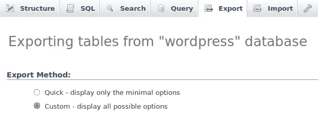
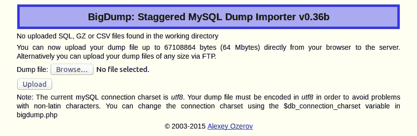
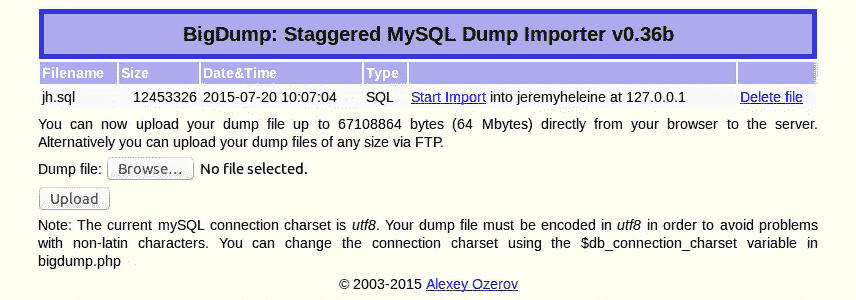
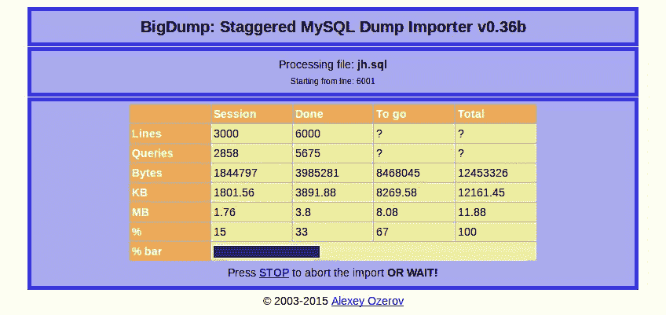
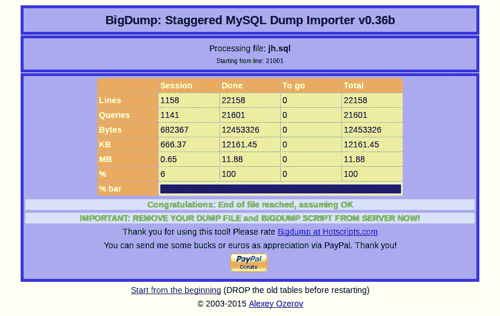
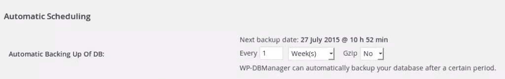

# 备份和恢复大型 WordPress 数据库

> 原文：<https://www.sitepoint.com/backing-up-and-restoring-large-wordpress-databases/>

在之前的一篇文章中，我们看到了[如何手动备份 WordPress 网站](https://www.sitepoint.com/backup-wordpress-site/ "How to Manually Backup Your WordPress Website")。特别是，我们看到了如何备份数据库，以及如何恢复它。

但是，当我们尝试恢复数据库时，可能会出现一个问题，这个问题在上一篇文章中没有讨论。大数据库呢？使用命令行，大小通常不是问题，因为我们可以使用 MySQL 导出或输入任何大小的文件。但是，如果您没有对特定托管环境的 SSH 访问权限，那么使用 phpMyAdmin 之类的工具进行大型数据库导出和导入会是一个真正的问题。通常对允许的文件上传有限制。但是有一种方法可以轻松地备份和恢复大型 WordPress 数据库。

在本文中，我将介绍如何使用一个名为 BigDump 的有用工具来恢复大型数据库转储。本质上，BigDump 是一个 PHP 脚本，允许您导入任意大的数据库转储，即使您的上传限制很低。本文假设您没有对服务器的 SSH/命令行访问权限，或者更适合使用 web 应用程序。注意 BigDump 是在 GNU GPL 2 许可下发布的。

在使用 BigDump 恢复了一个大的数据库转储之后，我将向您展示如何通过一个名为 WP-DBManager 的 WordPress 插件自动生成这些转储，因为您没有时间每天手动备份您的数据库！

## 生成大转储就绪的数据库转储

我已经在上一篇文章中介绍了[如何备份 WordPress 数据库，所以我们不再描述如何备份。但是，如果您想使用 BigDump，有一些事情您应该知道。](https://www.sitepoint.com/backup-wordpress-site/)

在实践中，BigDump 将您的文件分割成您的服务器允许导入所需的尽可能多的文件，有时这种分割会带来麻烦——如果您使用扩展插入，允许您通过将几个`INSERT`查询合并成一个来优化您的 SQL 查询。

让我们用一个简单的例子来说明情况。假设我们有一个表`tbl`，它有三列`a`、`b`和`c`。在这个表中，我们有两行:`(1, 2, 3)`和`(4, 5, 6)`。如果我们不使用扩展插入，则需要两个查询来插入两行:

```
INSERT INTO tbl (a, b, c) VALUES (1, 2, 3);
INSERT INTO tbl (a, b, c) VALUES (4, 5, 6);
```

但是，我们可以使用扩展插入来优化此插入:

```
INSERT INTO tbl (a, b, c) VALUES (1, 2, 3), (4, 5, 6);
```

这里我们用一个查询插入了两行。当然，在这个例子中，获得的时间可以忽略不计，但是对于包含大量行的大表，这种优势是显著的。

问题是，如果您的表非常大，BigDump 无法拆分这些类型的查询。这就是为什么当我们想要使用 BigDump 时，我们必须避免扩展插入:我们必须要求 phpMyAdmin(或您喜欢的工具/方法)以上面第一段 SQL 代码的形式导出我们的数据，在每个插入中使用`INSERT INTO`。

文件会变得更大。然而，由于我们将使用一个支持我们需要的任何大小的脚本，大小将不是一个问题。

好消息是我们可以要求 phpMyAdmin 避免扩展插入。为此，当我们导出数据库时，我们可以选择“ *Custom* ”选项来定制生成转储的方式。



然后，在“*数据创建选项*”部分，我们将找到选项“*插入数据*时使用的语法”。默认值是 extended inserts:将其更改为第一个值("*在每个`INSERT`语句*)中包含列名)。这样，phpMyAdmin 将生成我们上面看到的插入。


我们现在可以使用 BigDump 了！

## 使用 BigDump 恢复大型数据库

### 下载并安装 BigDump

你可以从官方 BigDump 网站下载 BigDump。您将下载一个包含名为`bigdump.php`的 PHP 文件的归档文件。

您可以将 BigDump 放在您计算机上的任何地方，放在可以从 web 服务器访问的目录中(例如，我创建了一个名为“ *Tools* 的特殊文件夹，其中包含一些有用的工具，如 BigDump)。

然后，您可以通过使用它的 URL(在我的例子中，它是`http://127.0.0.1/Tools/bigdump.php`)来访问 BigDump。

### 正在初始化 BigDump

在导入我们的大文件之前，我们需要初始化 BigDump，让它知道如何访问我们的数据库。这可以通过编辑`bigdump.php`文件来实现。

前四个定义的变量，就在通知我们许可证的大注释之后，是您需要编辑的变量。

它们的名字非常清楚:你必须在`$db_server`中指明存储你的数据库的服务器，在`$db_name`中指明你的数据库的名称，在`$db_username`和`$db_password`中指明你的登录信息。这些细节与你在 wp-config.php 或任何其他使用 MySQL 的网络应用程序中发现的一样。

默认情况下，BigDump 使用`utf8`字符集，但是您可以通过编辑变量`$db_connection_charset`的值来修改它，变量`$db_connection_charset`是在我们刚刚编辑的变量之后定义的。

我们现在准备导入我们的大文件。如上所述，只需通过访问它的 URL 来访问 BigDump。

### 导入大型数据库转储

有两种方法可以导入一个大文件。第一种是使用创建的表单 BigDump:您像往常一样使用“*浏览…* ”按钮选择您的文件，并点击“*上传*按钮提交您的文件。这种方法的问题是你仍然受到服务器上传限制的限制。此外，包含 BigDump 的目录对于 PHP 必须是可写的。



第二种方法是直接上传你的文件到你的服务器上，例如使用 FTP/SFTP/SCP。您的文件必须放在与`bigdump.php`文件相同的目录中。

一旦你的文件被上传(通过表单或 FTP/SFTP/SCP)，就可以从 BigDump 接口访问它。



如果文件夹是可写的，那么一旦使用了 SQL 文件，您就可以直接从这个界面中删除它。要将文件导入到我们在上面编辑的变量中指示的数据库中，点击与您刚刚上传的文件对应的行上的“*开始导入*”链接。

然后，BigDump 将显示一个新页面，指示导入的进度。您在这里所要做的就是等待到达文件的末尾。您也可以点击表格下方的“*停止*”链接来中止导入。



一旦导入完毕，就这样了！您的数据被导入到您的数据库中，您可以删除您的 SQL 文件。恭喜你，当你想导入一个 SQL 文件时，你刚好绕过了大小限制！



## 一个 WordPress 插件，可以自动备份你的数据库

我们知道如何手动备份我们的 WordPress 数据库。以及如何恢复它，即使它很大，也要感谢 BigDump。然而，手动备份数据库并不是一件有趣的任务，尤其是如果我们每周或每天都这样做的话。这就是为什么有各种各样的工具可以自动为我们做到这一点。

在[之前一篇关于 WordPress 维护](https://www.sitepoint.com/definitive-guide-to-wordpress-maintenance/)的文章中也提到，WP-DBManager 可以从[WordPress.org](https://wordpress.org/plugins/wp-dbmanager/)免费获得。WP-DBManager 将其备份存储在`/wp-content/backup-db`目录中，在某些情况下，它不能自己创建这个文件夹。要解决此问题，请创建此文件夹并使其对 PHP 可写。

要创建数据库的第一个初始备份，您可以进入'*数据库*'菜单的'*备份数据库*'条目(插件激活时出现)。在页面底部，您可以点击一个“*备份*”按钮来启动备份。

您可以通过“*管理备份数据库*”来管理您的备份。在这里，您可以删除旧的备份，下载您想要检索的备份，甚至通过电子邮件发送它们。

我们真正感兴趣的部分是“ *DB Options* ”，特别是标记为“*自动调度*的部分。第一个选项，“自动备份数据库”允许您设置备份的时间间隔。例如，如果您设置“2 周”，WP-DBManager 将每两周自动备份您的数据库。您将能够从我们上面描述的部分访问这些备份，但您也可以选择通过电子邮件接收它们，这对一些人来说可能会很方便。



## 最后

备份你的 WordPress 数据库是很重要的。它包含了你网站的数据，如果没有备份，如果你的 WordPress 网站崩溃了，你可能会丢失有价值的数据。

有几种方法来备份您的数据库:手动方式和使用 WP-DBManager 的自动方式。你甚至可以开发自己的工具。如果是这样的话，那么请不要犹豫，在下面的评论中分享它们吧！

此外，使用 BigDump，无论数据大小如何，您都可以轻松地恢复数据。只需单击一下，您就可以恢复，而无需手动拆分文件。

## 分享这篇文章