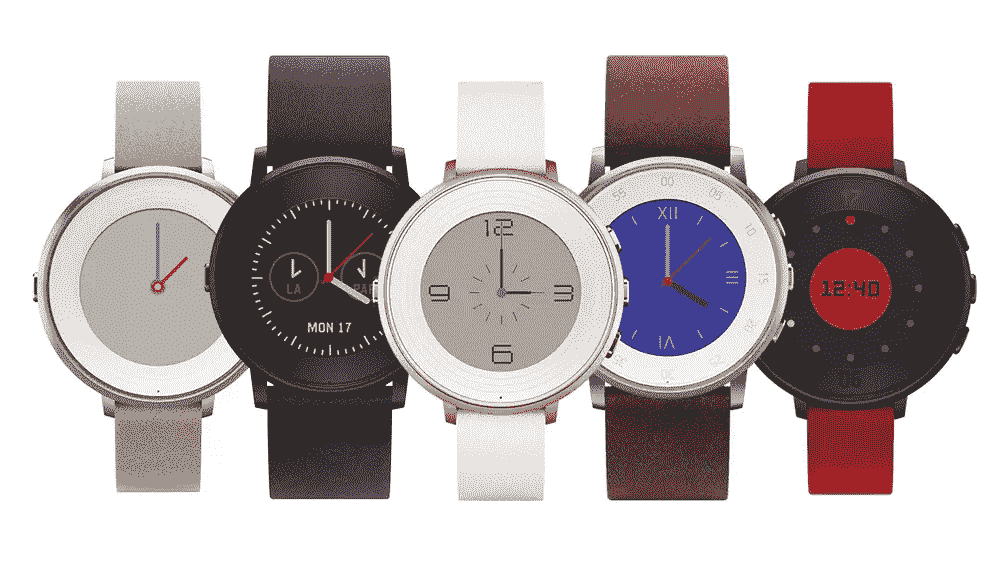
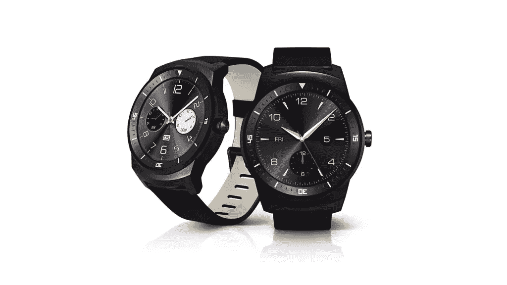
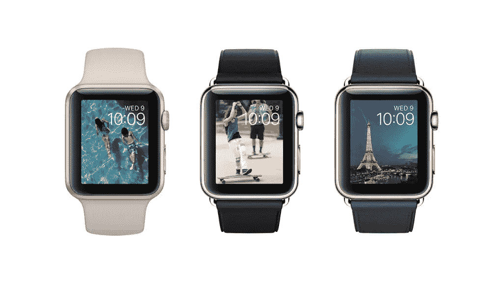
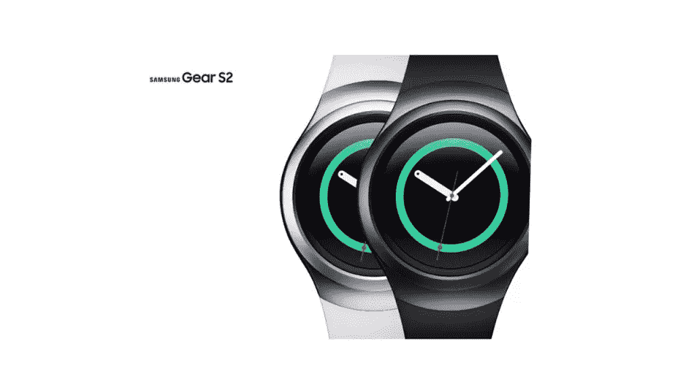
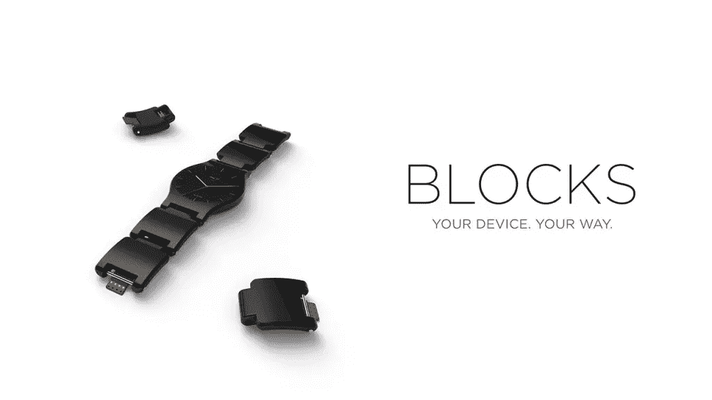

# 2015 年考虑开发的智能手表平台

> 原文：<https://www.sitepoint.com/smartwatch-platforms-to-consider-developing-for-in-2015/>

智能手表生态系统继续以令人难以置信的速度增长。今年，智能手表领域涌现了大量新平台。不知何故，对于试图选择开发哪个平台的开发人员的困惑，还没有足够的讨论。在这篇文章中，我将概述今年我发现的一些有趣的智能手表平台，包括目前已经上市的和即将上市的。

## 水晶透镜

来源:卵石

SitePoint 的普通读者应该很清楚我对 Pebble 智能手表的喜爱。我发现这是一个非常有趣的开发平台，它背后有一个非常可爱的社区。上个月，Pebble 发布了他们的最新版本 Pebble Time Round。它既圆又极薄，为那些对佩戴早期矩形 Pebble 手表有些犹豫的人提供了一种新的外形。对于那些想了解更多信息的人来说，我上周讨论了开发者需要了解的关于 Pebble Time Round 的内容。

Pebble 智能手表的编码使用了 C 编程语言、用于将应用程序连接到 web APIs 的 JavaScript 和一个[记录良好的 SDK](http://developer.getpebble.com/docs/) 。卵石有三个平台——“Aplite”(最初的黑白卵石)、“玄武岩”(矩形卵石时间)和“白垩”(圆形卵石时间)。有可能构建跨平台的应用程序来支持这三者。

Pebble Time 智能手表还可以使用“智能表带”,为手表增加新的功能和特性，例如延长电池寿命、GPS 等。Pebble 开发人员不仅限于软件，smartstraps 的潜力是巨大的。

没有但想尝试该平台？Pebble 也有一个基于浏览器的模拟器，你可以在 [CloudPebble](https://cloudpebble.net) 上开发。

**官方网站:**[Pebble](http://getpebble.com)
开发者文档: [Pebble 开发者](https://developer.getpebble.com)
**设备:** Pebble Classic、Pebble Steel、Pebble Time、Pebble Time Round
**兼容:** Android 和 iOS

## Android Wear

LG G Watch R，来源:LG

谷歌有一系列智能手表，现在可以运行各种形状和大小的 Android Wear 操作系统。有类似华硕 ZenWatch 2 的长方形选项，也有类似 LG G Watch R 的圆形选项(如上图)。这些手表配有触摸屏，有机发光二极管显示器色彩丰富，电池寿命略低。有些还配有 Wi-Fi，这样你的手机和手表就可以离得更远，但仍能保持连接。

Android Wear 生态系统的编码是用 Java 完成的，就像 Android 开发一样。你需要一个同名的配套 Android 应用程序才能在手机上运行，所以 Android Wear watchapps 更像是 Android 应用程序的扩展。Android Wear 最近宣布支持 iOS，但不支持第三方 iOS 应用。

如果你没有 Android Wear 手表，你仍然可以在 AVD 管理器中使用仿真器进行开发(你可以在同一区域找到 Android 手持设备的仿真器)。

**官方网站:** [Android Wear](https://www.android.com/intl/en_au/wear/)
**开发者文档:** [Android 开发者资源](https://developer.android.com/index.html)
**设备:** [华硕 ZenWatch](https://www.asus.com/au/Phone-Accessory/ASUS_ZenWatch_WI500Q/) ，[华硕 ZenWatch 2](https://www.asus.com/ZenWatch/ASUS_ZenWatch_2_WI501Q/) ， [LG G Watch](http://www.lg.com/au/fitness-and-wearables/lg-G-WATCH-W100-Black-Titan) ， [LG G Watch R](http://www.lg.com/us/smart-watches/lg-W110-g-watch-r) ， [LG Watch Urbane](http://www.lg.com/us/smartwatch/urbane) ，[华为 Watch](http://consumer.huawei.com/minisite/worldwide/huawei-watch/) ，

## 苹果手表

来源:苹果

苹果今年进入了智能手表领域，并向世界各地的 iPhone 用户销售了大量智能手表。它是使用 iPhone 功能(如 Siri)最多的智能手表，像 Android Wear 一样有全彩色显示屏，除了蓝牙外还可以接入 Wi-Fi。迄今为止，他们尚未发布圆形版本，但他们确实带有“数字皇冠”控件，为应用程序开发人员提供了一些有趣的潜力。

对于已经在开发 iOS 应用的开发者来说，Apple Watch 是一个强有力的选择。苹果最近发布了 watchOS 2，提供了对麦克风、加速度计、“数字表冠”等的访问。新版本的 watchOS 完全在手表上运行应用程序，而不是部分在手机上，部分在手表上。

开发 Apple Watch 应用程序可以通过 Swift 或 Objective-C 来完成。如果你还没有急着去买 Apple Watch，Xcode 会为你提供一个模拟器来测试应用程序。

**官方网站:** [Apple Watch](http://www.apple.com/au/watch/)
**开发者文档:**[Apple Watch kit](https://developer.apple.com/watchkit/)
**设备:** Apple Watch
**兼容:** iPhone 5 或以上

## 三星的 Tizen

来源:三星

三星已经决定不使用谷歌 Wear 平台，而是在其最新系列的智能手表 Gear S2 中专注于自己的 Tizen 平台。到目前为止，我读过的很多关于 Gear S2 的评论都相当正面。如果 Gear S2 卖得好，Tizen 平台有可能成为智能手表领域的一个重要角色。

从开发的角度来看，Tizen 应用程序可以是手表上的独立应用程序，也可以是与 Android 应用程序配合使用的配套应用程序。齿轮 S2 有一个独特的旋转挡板，你可以用它作为输入，这是非常整洁的！

Gear S2 还兼容非三星 Android 手机——运行 Android 4.4 及更高版本、内存超过 1.5GB 的手机。这里有一份 Android 设备列表。

**官方网站:** [三星 Gear S2](http://www.samsung.com/global/galaxy/gear-s2/)
**开发者文档:** [三星 Gear 开发者](http://developer.samsung.com/gear/)
**设备:**三星 Gear S2
**兼容:** Android 4.4 及以上 1.5GB RAM 的手机

## 阻碍

来源:街区

BLOCKS 是智能手表领域的新成员，专注于组装模块化智能手表，您可以根据自己的使用习惯进行定制。表带上的每个模块都提供不同的功能，如动态充电、SIM 卡模块、摄像头等。正如 Pebble smartstraps 一样，专注于硬件和电子产品的开发人员有潜力利用这一概念做很多事情。

BLOCKS 平台将在 Android Lollipop 的修改版本上运行，所以我的假设是你将使用 Java 编写 BLOCKS 应用程序。

他们计划很快开始众筹，所以如果你对这个概念感兴趣——注册他们的邮件列表，密切关注。

**官方网站:**[BLOCKS](http://www.chooseblocks.com)
开发者文档: [还没有文档，但这里有一个注册表单，发布时可以访问](http://www.chooseblocks.com/developers.html)
**设备:** BLOCKS 智能手表
**兼容:** Android 和 iOS (Windows Phone 即将推出)

## OXY(精灵操作系统和 IWOP)

来源:OXY

OXY 智能手表尚未发布，将于 11 月 15 日在 IndieGoGo 上开放预购。尽管不可用，我想包括这一个，因为它看起来将有一个完全独立的开源应用生态系统。OXY 将运行开源操作系统和平台——ELF OS 和 IWOP (Ingenic 可穿戴开放平台)。据我所知，IWOP 平台可能已经有了一个中国的代言人。

**官方网站:** [OXY 智能手表](http://www.oxytechs.com)
**开发者文档:**暂时没有但是你可以在这个网站上找到 IWOP 的下载来试验[(全是中文)](http://iwop.ingenic.com/zh-cn/)
**设备:** OXY
**兼容:** Android 4.3 和 iOS 8

## 结论

以上总结了目前主要的智能手表平台，以及一些需要关注的平台。有大量的智能手表平台可供选择，我敢肯定，更多的智能手表即将问世！对于智能手表开发者来说，这可能是一个非常混乱的时期，也是一个宝贵的时期，因为随着用户手中设备数量的增加，智能手表的用户也在增加。

有没有我漏掉的智能手表平台？或者有什么我没有提到的平台的特别之处？你考虑为哪个发展？请在评论中留下你的想法，或者发推文给我，地址是 [@thatpatrickguy](https://www.twitter.com/thatpatrickguy) ，我很想听听你的想法。

## 分享这篇文章