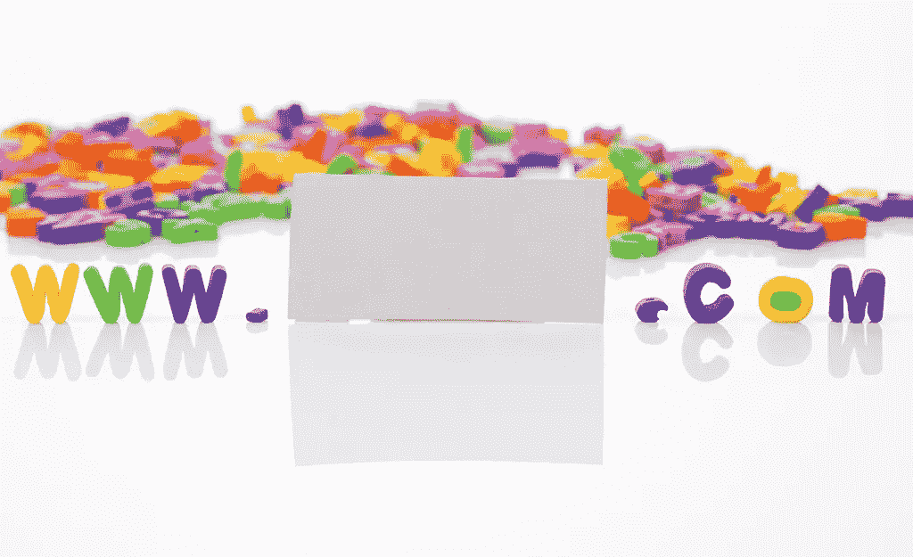
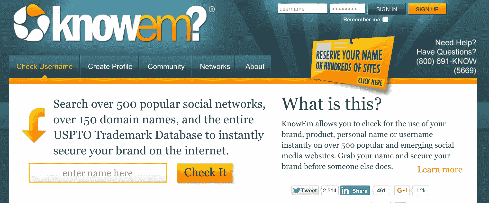

# 如何为你的企业选择域名

> 原文：<https://www.sitepoint.com/how-to-choose-a-domain-name-for-your-business/>

为你的域名选择一个名字很像为你的孩子选择一个名字。有些名字来得很容易，感觉几乎不可避免(InternetMovieDatabase.com，John Jr)。其他的肯定是妈妈和爸爸之间激烈斗争的产物。还有一些名字无视所有的逻辑和理由(Algorelovesyou.com，Inspektor Pilot)。

虽然域名可能无处不在，但选择一个域名是一项不容忽视的任务。不管接下来是什么？将是客户的第一印象，也是搜索引擎爬虫的第一餐。不管你喜不喜欢，你的域名是你在线业务的门户，所以在你决定第一个想到的名字之前，考虑以下最佳实践。

## 让它独一无二

InternetMovieDatabase.com 可能听起来很普通，但重要的是要注意到该网站是在 1990 年推出的，当时甚至存在不到 3000 个网站。今天，有超过 10 亿。

要在如此拥挤的市场中脱颖而出，独一无二的名字的价值怎么强调都不为过。二十年前，像[mental loss](http://mentalfloss.com)、[coffivity](https://coffitivity.com/)和 [TechCrunch](https://www.techcrunch.com/) 这样的网站可能会被称为有趣的活动、咖啡馆之声或科技新闻。今天，无论你网站的主题实际上有多简单，给你的名字起一个创造性的旋转都是值得的。

## 瞄准 A .COM

虽然拥有一个独一无二的域名很重要，但你不一定会因为违背了。玉米籽粒。

。COM 占所有网站的 52 %,这意味着我们大多数人认为任何给定的网站都以. COM 扩展名结尾。事实上，有些浏览器地址栏会自动添加。COM 进行查询。

然而，过多的其他扩展是有原因的。例如，如果你的业务面向特定的国家，考虑使用特定国家的域名。如果你经营一个非营利组织，一个. ORG 可以进一步提高你的组织的可信度。

非。选择 COM 扩展也是为了聪明。因为我姓克劳斯，所以我不能错过将我的网站命名为 [Joshkra.us](http://Joshkra.us) 的机会。最近几年也出现了一波。LYs，比如 Content.ly、Ow.ly、Easel.ly。顺便说一下，LY 是利比亚的互联网国家代码。

但这些都是例外。。COMs 仍然是首选的扩展，所以尽可能使用它。

## 手指友好

不要低估人类懒惰的能力。如果我想订购吉他弦，并且我可以在输入 www.guitarstrings.com 和 www.supergroovyguitarstringsandotherstufftoo.com 之间进行选择，我会选择对我的手指和眼睛来说更容易的那种。

选择一个易于输入、易于记忆和易于表达的域名。

时髦的名字更有市场。朗朗上口的名字会留在你的脑海里。避免两个以上连续字母的名字是个好主意(我爱你[booooooom.com](http://www.booooooom.com/)但是我讨厌把你打出来)，以及其他容易拼错的名字(【ichihuahua.com】T2 有人知道吗？)

当然，搜索引擎可能会纠正用户手动输入域名的错误尝试，但它也可能会把用户引向各种错误的方向。我敢肯定，我们大多数人都曾经拼错了一个域名，然后来到了一个我们真的不想去的地方。

## 字母更好

只要有可能，尽量坚持使用盎格鲁撒克逊人慷慨赠予我们的 26 个字母。包含数字或连字符(或者，上帝禁止，两者都有)的域名更难口头交流。它们散发着不专业的味道，经常给人以垃圾邮件、欺诈或更糟的印象，而且它们更难记住。

那个小小的吊扇推销员有没有告诉我去 www.TinyCielingFans.com 或 www.Tiny-Cieling-Fans.com？

那个粉丝制作的超人视频是关于 www.FortressOfSolitude.com 还是 www.4tressOfSoli2de.com 的？哦，等等，也许是 www.4tressOfSoli-2-de.com。

明白我的意思吗？

## 让它成为品牌

二十年前，如果有人在街上拦住我，叫我“雅虎”，我可能会生气，因为雅虎的意思是“畜生”。但如果今天有人这么叫我，我会认为他们是想用“用户”来结束他们的句子，比如“你是雅虎用户”，在这种情况下，我会摇摇头，自豪地宣布我是一个彻头彻尾的谷歌人，然后为我的身份与我的搜索引擎偏好如此彻底地联系在一起而深感羞愧。

雅虎是一个生动的例子，说明了一个域名如何变得与它的产品如此不可分割，以至于它掩盖了这个名字的原意。虽然你的网站可能达不到雅虎那样的受欢迎程度，但教训依然存在:你的域名就是你的品牌。

这就是为什么它是至关重要的，你的域名是符合你想要的品牌形象。例如，一家专门设计现代简约家具的斯堪的纳维亚设计公司的网站叫做 [Menu.as](http://menu.as/) 。这个名字简短而甜美，反映了该品牌的简单和优雅。

网站搜索和个性化平台 Unbxd.com 的名字反映了它“打破常规”的品牌形象。“unboxed”这个词不仅直接支持这一点，而且创造性的拼写也是该公司创造性精神的两倍。

## 社交网络可用性

如果你计划推出一个网站，很有可能你也计划通过社交媒体来推广它。Unbxd 通过 facebook.com/unbxd,在手柄@ Booooooom 的 boooooom 推文和 Instagram 上通过@mental_floss 的 Mental Floss 帖子进行交叉推广。

所以，如果你买了 TinyCeilingFans.com，后来才发现已经有了一个小小的吊扇脸书页面，或者一个小小的吊扇 Twitter 手柄，那将是一个遗憾。

在选择域名之前，确保它在你打算垄断的社交网络上也是可用的。我推荐使用 [knowem](http://knowem.com/) 来帮助你。

## 谨防商标侵权

仅仅因为一个域名可用并不意味着它没有被注册商标。

举个最近的例子，犹太交友网站 JDate.com 正在起诉犹太交友应用 JSwipe 侵犯版权。JDate 声称，在犹太约会社区，字母“J”是他们的知识产权。

这听起来可能很可笑，但这是商标侵权的现实，所以在你命名你的域名之前，做好你的尽职调查。检查 uspto.gov/trademarks，以确保该名称没有被占用。然后考虑商标所有人可以对你采取法律行动，如果他们能够证明:

*   您的域名与商标名称相同，或令人混淆的相似

*   您对该域名没有合法的权利或利益

*和*

*   你注册并恶意使用该域名

## 结论

单单一个域名，成就不了你的网站，但肯定能破。曾几何时，Choosespain.co、Effoff.com 和 Teacherstalking.org 的网站还在运行，虽然我不能肯定地说它们为什么会关闭，但它们不幸的名字也帮不上什么忙。

当选择域名时，记得让用户容易输入、记忆和表达。即使你卖的是普通产品，也要争取一个独特的名字，并使用。有空就来。不要在数字和连字符上耍小聪明，避免踩到任何人的商标脚趾，永远。是。品牌化。

不要 TinyCeilingFans.info，试试 TinyCeilingFans.info(懂吗？).不要选择 Teacherstalking.org，选择 Talkingteachers.org。不要给人们逃避、忘记或取笑网站的借口，给他们访问网站的借口。

## 分享这篇文章