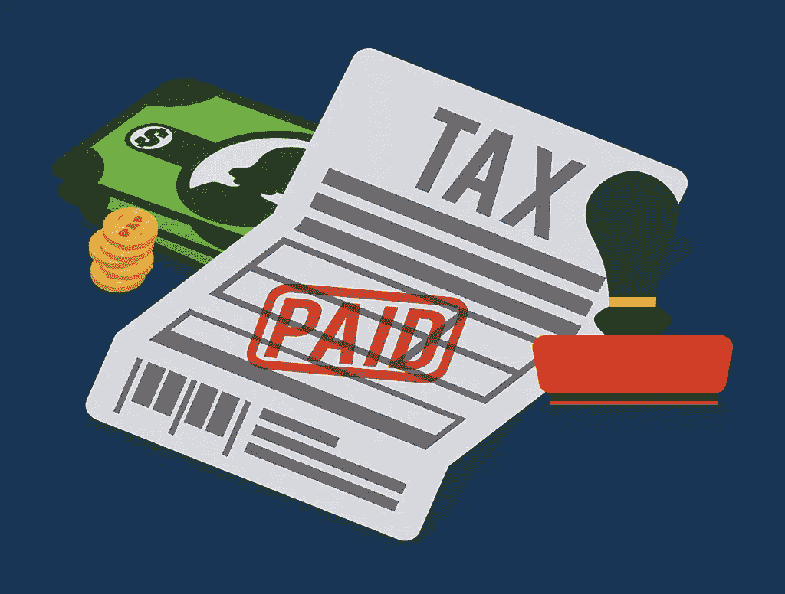

# 自由职业者常见税务问题的 9 个答案

> 原文：<https://www.sitepoint.com/freelancer-faq-taxes/>

啊税。他们导致了艾尔·卡朋的被捕。他们和独立战争有点关系。他们让瑞士银行继续营业。

他们也是每个自由职业者的眼中钉。

与全职员工不同，我们自由职业者必须自己纳税——这个过程很容易变得不堪重负。1099 和 1040 萦绕在我们的梦里。费用和扣除项目的复杂性让我们觉得很可笑。虽然我们可能已经进入了争取自主权的自由职业者游戏，但我怀疑如果其他人插手处理事情，我们大多数人会抗议。

但不是每个人都雇得起会计师，所以为了帮助你在 DIY 报税的波涛汹涌的水域中航行，这里有自由职业者经常问的九个税务问题。

## **1。独资企业和有限责任公司有什么区别？**

作为独资经营者，你作为个人和你作为一个商业实体之间没有法律上的区别。要成为一个独资经营者，你不需要在国家注册成为一个实体，你不需要提交年度报告来保持法律地位，也没有会计要求要满足。你真正需要做的是检查你的 W-9 上的方框。

作为一个单一成员的有限责任公司，你作为个人和你作为一个商业实体是有区别的。要成为一人有限责任公司，你需要在州政府注册你的企业实体。你还需要提交公司章程，并支付申请费，费用因州而异。

虽然一人有限责任公司比独资经营者需要更多的文书工作和启动费用，但作为有限责任公司，企业所有者不对企业债务负责。

## **2。我每年还是每季度交税？**

这取决于你，但是…

为了每年纳税，你必须预付高达 90%的税款。否则，你必须按季度纳税。季度税到期日:

4 月 15 日(1 月 1 日至 3 月 31 日期间获得的收入)
6 月 15 日(4 月 1 日至 5 月 31 日期间获得的收入)
9 月 15 日(6 月 1 日至 8 月 31 日期间获得的收入)
1 月 15 日(9 月 1 日至 12 月 31 日期间获得的收入)

## **3。公司什么时候需要给我发 1099 表格？**

当被一家公司雇佣从事自由职业时，你被认为是一名独立承包人，只有当承包人的收入超过 600 美元时，公司才被要求向独立承包人发放 1099。如果你的收入低于 600 英镑，公司可能不会考虑 1099 英镑。

然而，你仍然需要自己申报这些收入。我们稍后会详细讨论这个问题。

## **4。我需要缴纳什么税？**

像全职员工一样，自由职业者也必须缴纳收入税、社会保障税和医疗保险税。不幸的是，如果你从事自由职业的年收入超过 400 美元，你还需要缴纳个税，个税适用于你净收入的 92.35%。Booo！

## **5。我可以要求哪些扣除？**

很多。作为一名自由职业者，一般的经验法则是，你可以扣除任何用于业务服务的费用。这包括但不限于:

*   办公用品
*   互联网账单
*   租金或抵押贷款
*   差旅费(机票、酒店、出租车服务、停车、公共交通)
*   营销材料(名片、手册、在线广告)
*   计算机软件(微软办公软件、Adobe 套件)
*   专业费用(律师、会计师、簿记)
*   健康保险费
*   早(或午、晚)餐
*   网站托管费

这是令人兴奋的消息，但重要的是要明白，为了要求这些扣除，你必须相应地分摊费用。例如，如果您将家庭互联网用于商业和个人用途，您需要确定百分之多少互联网用于商业，百分之多少用于个人。如果是 50/50，那么你可以扣除一半的网费。

## **6。我什么时候报告在不同年份获得的收入？**

你总是在支付收入的那一年报告收入，不管它是哪一年挣得的。

例如，假设你在 2015 年 12 月为客户完成了一个项目，但直到 2016 年 1 月才收到该项目的付款。你应该将收入申报为 2016 年收入。

## **7。我需要什么材料来报税？**

自由职业者需要提供当年所有收入的记录。1099 将涵盖大部分内容，但通常不会涵盖所有内容。代替 1099，你可以附上发票、支票清单或现金和信用卡金额记录。

为了支持你的扣除，你应该包括收据，账单或信用卡对账单。

## **8。我如何扣除里程？**

截至 2015 年，您有资格为商务旅行扣除每英里高达 57.5 美分的费用。扣除里程数最有效的方法是记录你的总里程数，标注每次旅行的日期、目的地和旅行目的。

你也可以扣除油费。这种扣除方法被称为“实际费用”

## **9。我必须为“地下”收入纳税吗？**

没错。IRS 要求您自行申报附表 C 中的所有收入，无论付款方式如何。

这包括:

*   在你帮你的朋友建了网站后，他通过 PayPal 给了你 100 美元。

*   你在 Craigslist 上卖啤酒瓶收藏得到的支票。

*   在你帮忙建造树屋后，住在树屋的一个人给了你一叠 20 元的钞票。

我知道你在想什么:国税局审计我的可能性有多大？虽然可能很低，但如果你碰巧被审计了，国税局就会来要那笔树上小屋的钱。

## 分享这篇文章