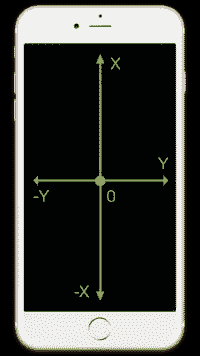
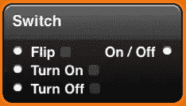
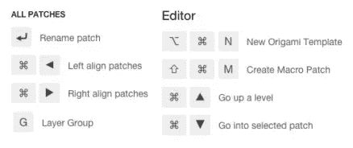
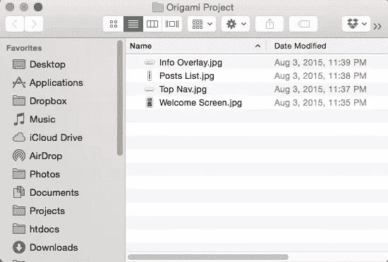
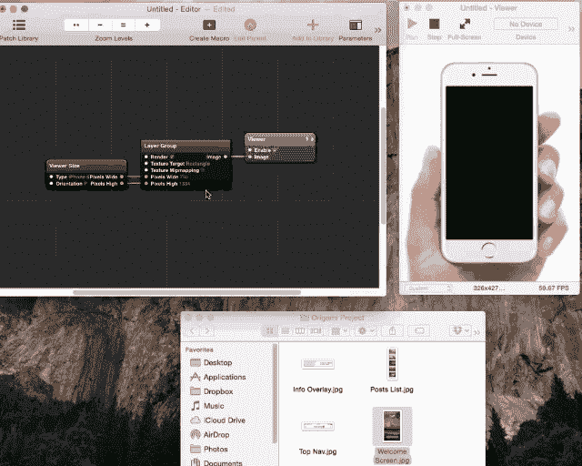
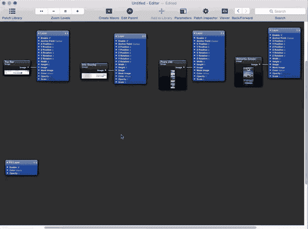
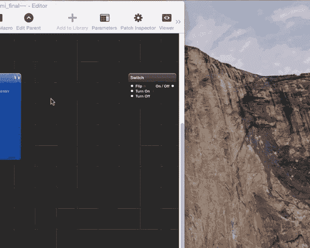
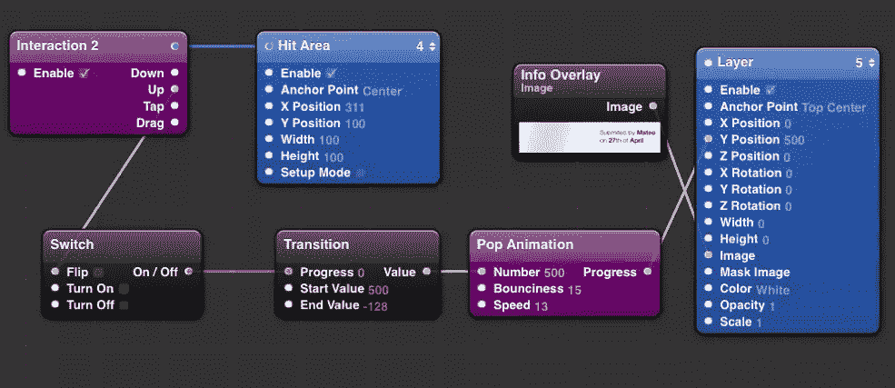
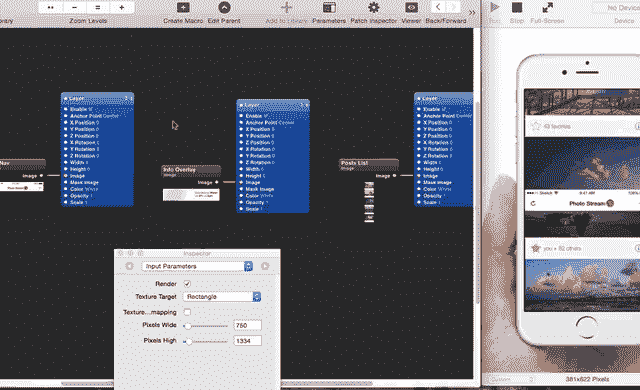
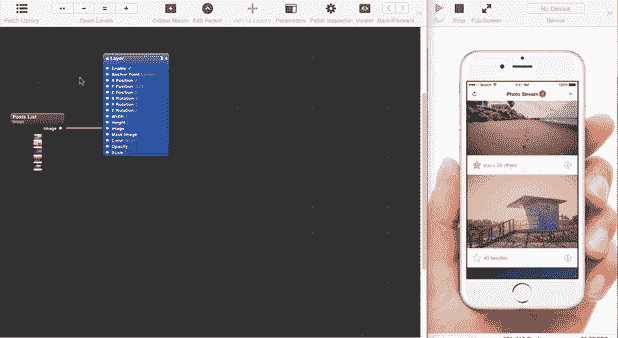

# 折纸:如何在几分钟内构建出完美的原型

> 原文：<https://www.sitepoint.com/build-a-terrific-prototypes-with-origami/>

大家好。如果你刚刚加入折纸派对，我建议你首先阅读本系列的第一部分“[应用程序原型:脸书折纸入门](https://www.sitepoint.com/app-prototyping-getting-started-facebook-origami/)”，这将向你介绍折纸和 Quartz Composer 哲学，GUI，并教你如何启动和运行你的第一个折纸项目。

## 我们在做什么？

在本文中，我将向您展示如何通过几个简单的步骤构建一个具有动画和交互功能的吸引人的原型。

让我们做这个吧！

没有比实践更好的学习方法了，所以在本教程中，我们将制作一个度假照片分享应用的原型。

为了您的方便，如果您不想为了遵循本教程而设计一个外观相似的应用程序，您可以通过遵循此[链接](https://www.dropbox.com/s/heatxjkhj7iorvb/Origami%20Project.zip?dl=0)找到我们下面的示例中使用的所有资源。

## 开始之前

在我们开始之前，有几个要点可以帮助你理解折纸的工作方式。

### 坐标系统

<small>平面的原点(x = 0；y=0)位于设备屏幕的中央。</small>

你应该记住的第一件事是坐标系统。与使用 quartz composer 修补程序构建相比，折纸修补程序(如层/层组或文本层)使用像素坐标。

### 进度值

0 到 1 范围内的值是 Origami 原型制作中的一个常见概念。当组合一个动画时，你需要连接一个“切换补丁”来触发 0 或 1，并连接到一个可以配置不同动画属性的过渡。

像普通的电灯开关一样，开关只能处于两个位置中的一个——值为 0 或 1，或开和关，或开始和结束。开关通常用作其他修补程序的触发器。

<small>开关补丁是二进制
值 0 和 1 被描绘为开和关状态的最常见用例。</small>

### 快捷键

幸运的是，Origami 配备了许多键盘快捷键，可以加速原型制作过程。

当鼠标悬停在工作画布上时，可以使用快捷方式。

通过点击[链接](https://origami.design/documentation/workflow/KeyboardShortcuts.html)，你可以在 Origami 的官方文档页面找到这些快捷方式的完整列表。

### 文件夹结构

虽然资源的位置不会直接影响原型的开发，但是将所有资源保存在 Origami 项目的一个文件夹中会很方便。因此，万一你弄乱了一个补丁的布线，你可以完全删除层，并轻松地重新添加到项目中。

<small>一个演示项目结构。</small>

## 让我们开始原型制作

首先，我们需要开始一个新的折纸项目。如果你不知道怎么做，按照我们之前提到的本系列的第一篇文章中的说明去做。

当开始一个新项目时，我喜欢导入我打算使用的所有图像层，并安排它们在原型中的逻辑显示。

当你处理一个只有几个组件的小项目时，就像我们在例子中使用的一样，这会节省很多时间。

您可以通过将图片直接拖放到画布中来添加图像层。或者，您可以从修补程序资源管理器窗口手动添加图像层。

<small>导入我们原型中使用的所有媒体。</small>

因为我们正在构建一个 2 页的原型，所以使用“图层组补丁”是一个很好的实践，这样我们就不会迷失在每页将要进行的所有布线中。通过按下键盘上的*‘G’*来创建层群组 patch(或通过从 patch 检查器中拖放 patch)。

在图层组补丁中成功添加图像后，您会注意到图层组内容没有在查看器中渲染。不要慌！

问题是我们还没有告诉 Origami 在设备屏幕上渲染来自图层组补丁的输出。为此，我们必须添加一个新的图层补丁，并将图层组补丁的 Image *output* 连接到图层补丁的 input image 属性中，如下图 GIF 所示。

分割第二页的组件并将其添加到图层组后，您会注意到第二页上的项目与第一页上的项目重叠。

有很多方法可以解决这个问题，这取决于你想要达到的目标。由于我们希望第二页水平滑入，我们可以通过将补丁的 X-position 属性更改为-800 来将其移开。简单。

要配置和更改 patch 属性，只需点按画布窗口中的 patch 检查器图标。

<small>打开补丁检查器</small>

太好了！现在，我们想在点击应用程序欢迎屏幕上的“立即探索”按钮时进入第二页。我们还希望应用程序的第二个屏幕优雅地滑入——甚至可能在滑入时有一点奇妙的弹跳。

为此，我们将在工作画布中放置 5 个补丁。如果这听起来有点复杂或令人不知所措，请不要担心——一旦您理解了逻辑，您会发现将它们连接在一起是相当容易的。

## 我们将使用什么

在修补程序浏览器窗口中，您将搜索以下五个修补程序:

1.  **点击区域补丁**:这是屏幕上你想要捕捉事件的地方
2.  **Interaction 2 patch** :这个 patch 从层 patch(或者整个屏幕，如果没有连接到任何 patch 的话)捕捉交互事件。
3.  **开关贴片**:开关贴片的用途和电灯开关完全一样。它开始是关闭的，当你翻转它时，它就会打开。
4.  **过渡补丁**:该补丁取 0 到 1 范围内的一个数，并将其转换为起始值到结束值范围内的一个数。
5.  **Pop Animation patch** :这个补丁用一个弹簧来动画化一个变化的值。

## 将这些点连接起来

我们已经有了自己的补丁——是时候把它们连在一起了。

首先，我们在“立即探索”按钮上设置点击区域补丁，通过交互补丁捕捉点击事件。

在交互补丁捕获点击区域上的点击事件后，它将触发我们的开关补丁中的 on 状态，然后将值 1 发送到过渡补丁。这告诉过渡面片从-800 到 0 开始递增。

这些递增的数字将通过一个 pop 动画，其进度将连接到它所连接的层的 X 位置。

为了让这个效果像示例一样工作，您应该首先将图层组(包含我们第二个页面的输出)的 patch 属性更改为-800 X-position，并给它一个值为 Center 的锚点。

为了获得完全相同的结果，复制以下补丁的相同属性。

由于我们已经将过渡的起始值设置为-800，图层补丁将从-800 像素水平放大到屏幕之外，然后由于我们的 Pop 动画补丁而在屏幕中央停止。要实现与示例原型相同的效果，只需将 Pop 动画补丁的反弹度更改为 20，速度更改为 6(但可以随意调整)。

## 创建第二页

现在是时候配置我们的第二页了。第二页的元素是——一个顶栏——一个帖子列表——一个小的信息覆盖，当你点击信息图标时会向下滑动

在我们开始玩动画和交互之前，我们应该把每个元素放在正确的位置。

首先，我们将定位顶部的酒吧，这将高于一切。通过将 Anchor Point 属性更改为 Top Center，可以很容易地将顶部栏居中到屏幕的顶部。

然后我们需要对齐文章列表。正如你可能注意到的，帖子列表似乎被缩短了。为了能够浏览整个图像长度的所有帖子，我们需要添加一个滚动补丁。

要使这个滚动补丁工作，您应该将滚动补丁的图像输入连接到帖子列表图像补丁。然后将滚动面片的 Y 位置与图层面片的 Y 位置关联。

滚动补丁将提取图像高度，并根据我们在视窗中看到的内容提供一个 Y 位置。

我们需要添加的第三个也是最后一个元素是滑动信息覆盖，当我们触摸帖子上的信息图标时，它会下降。这背后的逻辑与我们在页面之间切换的方法基本相同。

我们将拖动另一个击中区域补丁，并将其与一个交互补丁连接，该交互补丁将翻转我们的开关补丁。这反过来会触发我们的过渡补丁从 500 计数到-128。

像以前一样，这些数字将被传递到一个 Pop 动画补丁，当它滑动到位时，将使我们的信息面板反弹。为了使模型在给定的过渡面片值下正确运行，您应该给信息模型一个顶部中心的锚点。

为了正确工作，我们应该相对于 Y 轴定位我们的信息覆盖 500 像素，并给它一个顶部中心定位点。这两个值都可以通过所选 patch 的 Patch 检查器窗口添加。

还和我们在一起吗？

结果应该是这样的。

为了获得完全相同的结果，复制以下补丁的相同属性。

## 折纸适合你吗？

折纸充满了积木和工具。一般来说，在折纸和 Quartz Composer 中没有单一的方法可以实现任何事情。

将这些模块连接在一起的可能性是无限的，这是最有趣的部分。希望你现在对折纸的不同机制有了更好的理解。现在你只需要修补并想出新的方法将所有这些补丁连接在一起。它就像是一套用于原型的麦卡诺装置！

如果你有任何问题或者想知道更多关于折纸的功能，请查看他们的文档。请不要犹豫，在下面留下你的评论，我会直接回复你。

## 分享这篇文章