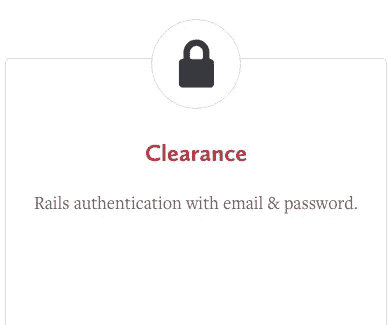

# 带有许可的简单 Rails 认证

> 原文：<https://www.sitepoint.com/simple-rails-authentication-with-clearance/>



在过去的一个月里，我介绍了 Rails 的各种[认证解决方案。这篇文章是这个系列的第五篇，我们今天的嘉宾是清仓。](https://www.sitepoint.com/series/authentication-in-rails/)

[Clearance](https://github.com/thoughtbot/clearance) 是由 [Thoughtbot Inc](https://github.com/thoughtbot) (创建 FactoryGirl、回形针和其他酷库的家伙)为 Rails 创建的一个自以为是的基于电子邮件/密码的认证和授权解决方案。间隙被设计成一个[轨道发动机](http://guides.rubyonrails.org/engines.html)。它应该是小的、简单的、经过充分测试的。在某种意义上，它类似于[设计](https://www.sitepoint.com/devise-authentication-in-depth/)，因为 Clearance 有许多默认设置来帮助您在近五分钟内开始，并且所有这些默认设置都可以很容易地被覆盖。然而，与 design 相比，Clearance 只提供了最基本的功能，您可以根据需要对其进行进一步定制。

这种解决方案是积极维护的，所以我真的推荐尝试一下。在本文中，我将演示如何集成许可、限制访问、定制许可，以及在登录过程中使用额外的检查。

源代码可以在 [GitHub](https://github.com/bodrovis/Sitepoint-source/tree/master/Authentication_with_Clearance) 上找到。

工作演示可在[sitepoint-clearance.herokuapp.com](https://sitepoint-clearance.herokuapp.com/)获得。

## 准备

首先，创建一个新的 Rails 应用程序，代码名为“Clear Sky”:

```
$ rails new ClearSky -T 
```

对于此演示，将使用 Rails 4.2，但间隙也与 Rails 3.2 兼容。

如果你想跟随我如何设计应用程序，把下面的 gem 添加到你的*gem 文件*中来利用 Bootstrap 的风格:

*Gemfile*

```
[...]
gem 'bootstrap-sass'
[...] 
```

同时修改 *application.scss* 文件:

*样式表/应用程序. scss*

```
@import 'bootstrap-sprockets';
@import 'bootstrap'; 
```

现在更新布局。您不必添加那些特定于引导程序的块，但是要确保 flash 消息在某个地方被呈现，因为 Clearance 依赖于它们来向用户显示重要的信息。

*layouts/application . html . erb*

```
[...
<nav class="navbar navbar-inverse">
  <div class="container">
    <div class="navbar-header">
      <%= link_to 'Clear Sky', root_path, class: 'navbar-brand' %>
    </div>
    <div id="navbar">

    </div>
  </div>
</nav>

<div class="container">
  <% flash.each do |key, value| %>
    <div class="alert alert-<%= key %>">
      <%= value %>
    </div>
  <% end %>

  <%= yield %>
</div>
[...] 
```

我们还需要一个基本的根页面，因此创建一个页面控制器和相应的路径:

*pages_controller.rb*

```
class PagesController < ApplicationController
  def index
  end
end 
```

*config/routes.rb*

```
[...]
root to: 'pages#index'
[...] 
```

*views/pages/index . html . erb*

```
<div class="page-header"><h1>Welcome!</h1></div> 
```

现在一切准备就绪，可以为我们的项目增加权限了。进行下一步！

## 积分间隙

通关入门非常简单。首先将宝石放入你的宝石档案:

*Gemfile*

```
[...]
gem 'clearance', '~> 1.11'
[...] 
```

现在，运行一个特殊的生成器并应用迁移:

```
$ rails generate clearance:install
$ rake db:migrate 
```

该生成器执行以下操作:

*   在*初始化器*目录下创建一个新的 *clearance.rb* 文件。
*   创建一个新的`User`模型、迁移文件，并向其中添加行`include Clearance::User`。该模型将具有以下属性:
    *   `email` ( `string`)
    *   `encrypted_password` ( `string`)
    *   `confirmation_token` ( `string`)
    *   `remember_token` ( `string`)
    *   基本属性(`id`、`created_at`、`updated_at`)
*   将`include Clearance::Controller`添加到`ApplicationController`中。这样，控制器将有特殊的清除方法。

如果您已经有一个`User`模型，它将被相应地修改。如果你不想调用你的模型`User`，修改 *clearance.rb* 初始化文件中的`config.user_model`设置。总而言之，这个文件是调整通关设置的第一个地方——关于它们的完整列表，请参考文档中的[这一节](https://github.com/thoughtbot/clearance#configure)。

注意，即使`confirmation_token`存在，它也没有被使用。[创建一个用户](https://github.com/thoughtbot/clearance/blob/master/app/controllers/clearance/users_controller.rb#L11)仅仅意味着向`users`表中添加一条新记录，并让该用户登录应用程序。因此，如果您想确保在使用帐户之前确认电子邮件，需要采取额外的步骤。在接下来的部分中，我们将更详细地讨论如何定制许可和执行额外的登录检查。

运行 Clearance 的生成器后，控制台会打印出一个小的待办事项列表，所以请确保您已经完成了所有必需的步骤。如果您正在跟进，只需做一个额外的动作:

*config/environments/development . Rb*

```
[...]
config.action_mailer.default_url_options = { host: 'localhost:3000' }
[...] 
```

对于生产环境，添加适合您的设置。

请注意，您可能还想修改[发件人的电子邮件地址](https://github.com/thoughtbot/clearance#password-resets):

*config/initializer/clearance . Rb*

```
[...]
config.mailer_sender = 'reply@example.com'
[...] 
```

Clearance 现已启动并运行，因此我们可以添加“登录”和“注销”菜单项:

*layouts/application . html . erb*

```
[...]
<div id="navbar">
  <% if signed_in? %>
    <ul class="nav navbar-nav">
      <li><%= link_to 'Add Page', new_page_path %></li>
    </ul>
  <% end %>

  <ul class="nav navbar-nav pull-right">
    <% if signed_in? %>
      <li><span><%= current_user.email %></span></li>
      <li><%= link_to 'Sign out', sign_out_path, method: :delete %></li>
    <% else %>
      <li><%= link_to 'Sign in', sign_in_path %></li>
    <% end %>
  </ul>
</div>
[...] 
```

`signed_in?`和`current_user`是 Clearance 提供的[辅助方法](https://github.com/thoughtbot/clearance#helper-methods)，它们非常简单明了。你也可以使用`signed_out?`的方法。

`sign_out_path`和`sign_in_path`路线也是由间隙创建的——我们将在下一节中对此进行更多讨论。

## 限制访问

现在，我们添加了基本身份验证系统，您可能希望限制对网站某些页面的访问。这很容易做到。假设我们在`PagesController`中有一个`new`动作:

*pages_controller.rb*

```
[...]
def new
end
[...] 
```

*config/routes.rb*

```
[...]
resources :pages, only: [:new]
[...] 
```

*views/pages/new.html.erb*

```
<div class="page-header"><h1>Add Page</h1></div> 
```

要仅允许经过身份验证的用户访问该页面，只需添加一个`before_action`:

*pages_controller.rb*

```
before_action :require_login, only: [:new] 
```

现在，如果一个未经验证的用户试图访问这个路由，他们将被重定向到“登录”页面。要改变这种行为，在您的`ApplicationController`中覆盖`url_after_denied_access_when_signed_out`方法并返回您选择的路线。在这里阅读更多。

间隙还提供了可以派上用场的[布线约束](https://github.com/thoughtbot/clearance#access-control)。例如，如果我想为所有经过身份验证的用户定义一个特殊的根路由，我将使用以下约束:

*config/routes.rb*

```
[...]
constraints Clearance::Constraints::SignedIn.new do
  root to: 'pages#new', as: :signed_in_root
end

constraints Clearance::Constraints::SignedOut.new do
  root to: 'pages#index'
end
[...] 
```

在这里，所有经过身份验证的用户都将`pages#new`作为根页面。对于客人来说，`pages#index`将是根。请注意，如果您定义了两条根路由，其中一条必须命名，否则将会出现错误。

## 定制间隙

您可能想知道如何进一步定制间隙，例如如何修改视图、控制器的动作或路线。嗯，这也很简单。

先说[路线](https://github.com/thoughtbot/clearance#routes)。运行以下命令将默认路由复制到您的 *routes.rb* 文件中:

```
$ rails generate clearance:routes 
```

该命令还会将`config.routes`设置为`false`，这意味着将使用自定义路线。

在 *routes.rb* 文件中，您会看到一些新的代码行:

*config/routes.rb*

```
[...]
resources :passwords, controller: "clearance/passwords", only: [:create, :new]
resource :session, controller: "clearance/sessions", only: [:create]

resources :users, controller: "clearance/users", only: [:create] do
  resource :password,
           controller: "clearance/passwords",
           only: [:create, :edit, :update]
end

get "/sign_in" => "clearance/sessions#new", as: "sign_in"
delete "/sign_out" => "clearance/sessions#destroy", as: "sign_out"
get "/sign_up" => "clearance/users#new", as: "sign_up"
[...] 
```

如果需要的话，可以随意修改。

要覆盖[控制器的方法](https://github.com/thoughtbot/clearance#controllers)，创建一个新的控制器，并从现有的控制器中选择子类:`Clearance::PasswordsController`、`Clearance::SessionsController`或`Clearance::UsersController`。现在你可以重新定义你认为合适的方法。只是不要忘记更新路由以指向您的新控制器。

修改[视图](https://github.com/thoughtbot/clearance#views)也很简单。运行:

```
$ rails generate clearance:views 
```

复制*视图*文件夹中的所有默认视图，并根据需要进行更改。

默认情况下，Clearance 将使用您的应用程序的[布局](https://github.com/thoughtbot/clearance#layouts)，但这也可以更改。如果您需要为其中一个控制器呈现自定义布局，请将以下代码添加到初始值设定项文件中:

*config/initializer/clearance . Rb*

```
[...]
Clearance::PasswordsController.layout 'my_passwords_layout'
Clearance::SessionsController.layout 'my_sessions_layout'
Clearance::UsersController.layout 'my_admin_layout'
[...] 
```

当您使用上面显示的命令复制默认视图时， [I18n 文件](https://github.com/thoughtbot/clearance#translations)也将被复制。如有必要，使用它来更改翻译。

默认的[用户](https://github.com/thoughtbot/clearance#user-model)模型也有许多可以重新定义的方法。

## 附加签到检查

默认情况下，认证时 Clearance 只检查用户的电子邮件和密码。然而，假设该帐户被挂起，我们不想允许这些用户登录。这可以通过所谓的[“签到守卫”](https://github.com/thoughtbot/clearance#extending-sign-in)来实现。

首先，向您的`users`表添加一个新字段:

```
$ rails g migration add_suspended_to_users suspended:boolean 
```

修改迁移:

*XXX _ add _ suspended _ to _ users . Rb*

```
class AddSuspendedToUsers < ActiveRecord::Migration
  def change
    add_column :users, :suspended, :boolean, default: false, index: true
  end
end 
```

并应用它:

```
$ rake db:migrate 
```

现在，打开初始化文件并修改它，就像这样:

*config/initializer/clearance . Rb*

```
class SuspendedCheckGuard < Clearance::SignInGuard
  def call
    if suspended?
      failure("Your account is suspended.")
    else
      next_guard
    end
  end

  def suspended?
    current_user.suspended?
  end
end

Clearance.configure do |config|
  config.sign_in_guards = [SuspendedCheckGuard]
  [...]
end 
```

随意将`SuspendedCheckGuard`解压到另一个文件。

`SignInGuard`背后的想法非常简单:它在用户登录之前检查一堆条件。
每个防护按顺序运行，并将会话移交给堆栈中的下一个防护。

`SignInGuard`响应一个`call`方法。它是用会话和当前堆栈初始化的。成功后，
守卫应该呼叫下一个守卫或者返回`SuccessStatus.new`，如果你不想让任何后续守卫跑的话。出现故障时，警卫应呼叫`FailureStatus.new(failure_message)`。

Clearance 提供了可以被继承的[签名向导](https://github.com/thoughtbot/clearance/blob/master/lib/clearance/sign_in_guard.rb)基类。这个类已经实现了像`signed_in?`和`current_user`这样的方法。

在我们的例子中，我们定义了检查用户帐户是否被挂起的`call`方法。如果是–设置失败信息并禁止登录。该信息将显示在闪光灯中。如果没有，运行下一个检查，如果它存在于堆栈中。所有检查成功运行后，用户即可登录。

现在你可以启动你的服务器，并检查应用程序是如何工作的！

## 结论

在本文中，我们讨论了 Clearance——一种固执己见的认证和授权系统。我鼓励你浏览[项目的 wiki](https://github.com/thoughtbot/clearance/wiki) ，因为它有解释如何进一步定制间隙的条目。我认为这个库是一个很好的选择，如果你需要快速开始，并且不需要所有的特性。

你用过通关吗？你会考虑在将来使用它吗？分享一下你的看法！

一如既往，我感谢你和我呆在一起，并很快看到你！

## 分享这篇文章