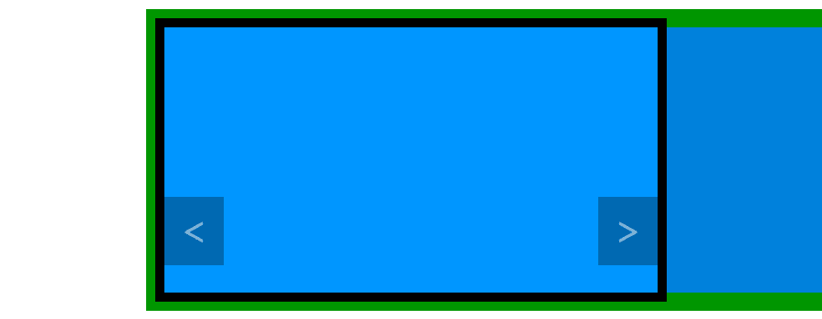

# 构建一个 WordPress Carousel 插件:第 3 部分

> 原文：<https://www.sitepoint.com/building-a-wordpress-carousel-plugin-part-3/>

没有样式，我们在本教程的第一部分中构建的 WordPress carousel 只是一个条目列表，但是它至少是有用的，因为它们都是可见的。我们在本教程的[第二部分](https://www.sitepoint.com/building-a-wordpress-carousel-plugin-part-2/)中添加的 CSS 增强了转盘的显示，但现在的问题是只有第一个项目显示给用户，没有办法显示其余的项目。

我们在旋转木马中添加了箭头，允许用户在不同的项目之间导航，现在是时候用一点 JavaScript 让它们变得可用了。

在本教程的后续部分，我们将学习如何正确地包含我们的脚本，然后我们将编写一个脚本，当用户点击一个箭头时，该脚本将启动一个使项目动画化的函数。

## 链接 JavaScript 文件

这里我们将使用 JavaScript 来使我们的箭头变得有用。至于 CSS 部分，创建一个新文件。我将其命名为`carousel.js`，并将其放在插件文件夹的根目录下。

我们需要向 WordPress 表明我们正在使用 JavaScript 文件。为此，我们将使用`wp_enqueue_script()`函数。

```
wp_enqueue_script('carousel', plugin_dir_url(__FILE__) . 'carousel.js', array('jquery'), '1.0', true);
```

前两个参数与`wp_enqueue_style()`相同。然后我们找到一个数组。这个数组列出了依赖项，我们的脚本工作所需的脚本。我选择使用 jQuery 来绕过浏览器兼容性问题，所以我向 WordPress 表明我想使用它:正如我们在关于[在 WordPress](https://www.sitepoint.com/including-javascript-in-plugins-or-themes/ "Including JavaScript in Plugins or Themes, the Right Way") 中正确包含脚本的文章中看到的那样，`'jquery'`是 WordPress 中公认的值。

第四个参数是脚本的版本号。这在这里不是很重要(更多信息请参见之前链接的文章)，但是我们需要使用最后一个参数，并将其设置为`true`，这样我们的脚本将包含在页脚中。

选择页脚而不是页眉的好处是我们可以在任何我们想要的地方使用`wp_enqueue_script()`。我们没有像使用`wp_enqueue_style()`一样在`wp_head()`之前使用它的限制。只有在必要的时候，我们才能包含我们的脚本:只有在我们显示 carousel 的时候。

因此，放置`wp_enqueue_script()`的最佳位置是在我们的`display_carousel()`函数的条件下。只有在有项目要显示的情况下，我们才会显示 carousel，所以我们将包含具有相同条件的脚本。

```
function display_carousel() {
	// …
	// Here we retrieve the links
	// …

	if (!empty($links)) {
		wp_enqueue_script(/* parameters listed above */);

		// …
		// Display
		// …
	}
}
```

现在我们已经准备好编辑 JavaScript 文件了。

## 我们想做什么？

首先，我们将所有代码封装在一个函数中。为了防止与其他库冲突，WordPress 禁止在 jQuery 中使用`$`。我们可以使用此功能再次启用它。

```
jQuery(function($) {
	// The code we will write must be placed here
});
```

有许多不同的方法来制作一个旋转木马，甚至不需要修改我们的 HTML 代码。这里建议你移动`ul`块。它在一行中包含了我们所有的项目，所以我们可以通过设置它的位置来水平移动它以显示一个或另一个项目。请看下面的模式，在本教程的前一部分已经看到了，看看我们想要做什么。



为了移动它，我们将使用它的`margin-left` CSS 属性。默认情况下，它被设置为`0`，因此“显示”第一个项目。第一个项目足够大，可以填满旋转木马块，第二个项目就在它旁边，由于`overflow`属性而看不到。

要显示第二个项目，我们必须向左移动`ul`块，以便将第二个项目的左侧与转盘块的左侧对齐。这可以通过负的左边距来实现。为了测试我们需要使用什么值，我们可以用一些 CSS 代码进行实验(因为我们不需要它，所以我们马上删除它)。

```
#carousel ul {
	margin-left: -100%;
}
```

这条简单的线值得一个解释。如果您测试它，您应该看到第一个项目没有显示，我们看到的是第二个项目。您可以测试另一个值来更好地理解发生了什么。例如，使用`-50px`，我们将`ul`块向左移动 50 个像素。使用我在上面的 CSS 中显示的值，由于传送带的宽度为 900 像素，我可以显示值为`-900px`的第二个项目。

然而，我们可以用百分比来代替。优点是这个百分比是相对于容器的。这里“100%”等于“900 像素”，因此，如果我们给定一个值`-100%`，我们隐藏第一项并显示第二项。使用百分比允许您修改容器的宽度，而无需修改`margin-left`属性的值。

## 显示另一个项目的功能

首先，我们将编写显示另一项的函数。这个将接受一个参数，方向。如果我们想显示前一项，这个方向必须设置为`-1`，如果我们想显示下一项，它必须设置为`1`。

```
function carousel_show_another_link(direction) {
}
```

### 我们去哪里？

为了确定分配给`margin-left`的值，我们需要知道我们在哪里。有许多可能的方法可以实现这一点，我选择了一种只使用当前的`margin-left`属性值的方法。

```
var ul = $('#carousel ul');
var current = -parseInt(ul[0].style.marginLeft) / 100;
```

第一行检索`ul`块。因为我们稍后将重用它，所以将它存储在一个变量中是一个好主意。第二行看起来有点奇怪。目的是存储一个表示当前显示项目的整数。第一项将由`0`表示，第二项由`1`表示，以此类推。

为了实现这一点，我们获取了`margin-left`属性的当前值。问题是这个值类似于`-200%`，我们想要一个数字:为了去掉“%”，我们使用了`parseInt()`函数，它将这个值转换成一个整数(例如`'-200%'`变成了`-200`)。当我们想要一个正整数时，我们添加一个“减号”(例如从`-200`得到`200`，然后除以 100 得到我们想要的值(例如`2`，而不是`200`)。

您可能想知道为什么我们不使用`ul.css('margin-left')`来获取`margin-left`属性的值。事实上，`.css()`是一个 jQuery 方法，在我们的上下文中，似乎是一个更好的主意。问题是这个方法不会给我们一个百分比。使用与上面相同的值，如果当前项目是第三个项目，则`margin-left`属性被设置为`-200%`，而`.css()`方法将返回`-1800px`。为了使用这个像素值计算当前项目，我们需要使用大容器的宽度，我更喜欢只使用`ul`块。

现在我们可以计算要显示的项目的索引，这要感谢函数的参数中给出的方向。

```
var new_link = current + direction;
```

### 新项目是否存在？

在显示新项目之前，我们需要测试它是否存在。如果`new_link`小于或等于`-1`，或者大于或等于项目总数，那么它就不存在，我们也无法显示它，所以移动`ul`块并不是一个好主意。请注意，这个测试可能看起来是多余的，因为当我们无法继续前进时，箭头不会显示出来，但是确保实际上可以做一些事情总是一个好主意。

```
var links_number = ul.children('li').length;

if (new_link >= 0 && new_link First we get the total number of items, which is the number of `li` tags in our list. This number is useful for the condition we described above as we want a positive integer that mustn't be greater than or equal to the number of items (don't forget that we begin with `0` and not `1`).

### 显示新项目

最后，块移动可以用一行代码实现。我们必须计算`margin-left`的新值。要做到这一点，让我们考虑一下。对于每个“通过”的项目，我们有一个宽度为`100%`的行程。这样，`margin-left`的新值是我们刚刚计算的新项目位置的 100 倍，带一个减号到左边。

[js]ul.animate({'margin-left': -(new_link * 100) + '%'});
```

我在这里选择使用 jQuery 动画，但是您可以自由地创建自己的动画，甚至修改这个动画的设置。

### 一些更实用的别名

我们现在将创建每当用户点击箭头时将被调用的函数。这些函数不需要大量的代码，因为它们唯一要做的就是用正确的参数调用`carousel_show_another_link()`函数。下面是当我们点击“上一个”箭头时调用的函数的代码。

```
function carousel_previous_link() {
	carousel_show_another_link(-1);
	return false;
}
```

注意`return false;`来防止我们的箭头的默认行为(不要忘记它们是链接)。这样，当用户点击箭头时，URL 不会改变。

显示“下一个”项目的功能完全相同，但使用`1`作为`carousel_show_another_link()`的参数。我选择称它为`carousel_next_link()`。

## 附加事件

最后，我们必须通过将正确的事件附加到正确的元素上，使这些函数变得有用。我们将在一个新的函数中这样做，当我们可以确定我们的元素被创建时调用这个函数:当文档被加载时。

```
$(document).ready(function() {
		// Here we attach the events
	});
```

我们希望将`carousel_previous_link()`函数附加到每个“前一个”箭头上。有了 carousel 的 DOM 树，我们可以很容易地检索它们，就像我们想在 CSS 中样式化它们时检索它们一样。

```
$('#carousel ul li a.carousel-prev').click(carousel_previous_link);
```

然后我们可以用同样的方法将`carousel_next_link()`函数附加到右箭头(`#carousel ul li a.carousel-next`)上。

您可以测试这段代码，但是应该会出现一个错误:第一次调用`carousel_show_another_link()`函数时，我们的`ul`块的 CSS 属性`margin-left`并不存在，所以当我们试图检索它的值时会出现错误。

为了防止这个错误，我们可以初始化这个属性的值。仍然在文档准备就绪时(例如，在附加事件之前)调用的函数中，添加下面一行。

```
$('#carousel ul').css('margin-left', 0);
```

默认情况下，这会将我们的`ul`块的`margin-left`属性设置为`0`。该属性现在将存在，无需移动块。

现在你可以点击箭头了，旋转木马完成了，它工作了！

## 最后

在本教程中，我们使用 WordPress 链接管理器 API 构建了一个 carousel 插件。这是使用这个 API 的一个很好的例子，同时也是了解如何在 WordPress 插件中结合 PHP、HTML、CSS 和 JavaScript 的一个好方法。

最后，我要说的是，有许多不同的方法来构建一个 carousel，即使我们保留我们生成的 HTML 代码:我们可以选择不同的风格，或者不同的方式来编写脚本。事实上，我们在这里写的脚本只是一个例子，我们可以写一个完全不同的脚本，但结果是一样的。

你可以自己决定是否喜欢我们这里使用的代码。如果没有，不要犹豫，赶紧编辑吧！

即使你喜欢我们在这里做的，你仍然可以提高结果。例如，访问者必须点击箭头才能看到其他项目:您可以尝试使用功能`setTimeout()`自动制作旋转木马的动画。

如果你想看看完成的代码，或者自己试试这个插件，可以在这里下载[。](http://jeremyheleine.me/downloads/sitepoint-carousel.zip)

## 分享这篇文章